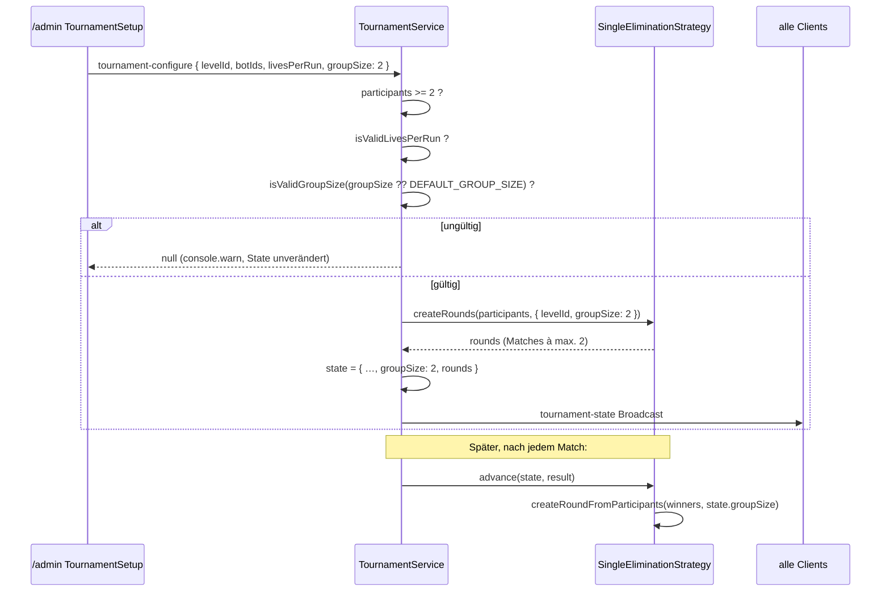

# Design: admin-match-group-size

## Architektur-Überblick

Bezug: `docs/03-architektur.md` (Hub-Server als Single Source of Truth für den
Turnierzustand), `docs/09-bot-artefakt-und-turnier.md` (Single-Elimination).

Die Gruppengröße ist heute eine Server-Konstante
(`SingleEliminationStrategy.MAX_GROUP_SIZE = 4`). Sie wird zu einem
**konfigurierbaren Teil des Turnierzustands**:

```
/admin (TournamentSetup)
   │  tournament-configure { …, groupSize }
   ▼
Server: TournamentService.configure()   ← validiert groupSize
   │  legt TournamentState { …, groupSize } an
   ▼
SingleEliminationStrategy.createRounds(participants, levelId, groupSize)
   │  … und später advance(state, result) → liest state.groupSize
   ▼
tournament-state Broadcast → /admin + /present
```

Kernentscheidung (freigegeben): `groupSize` wird **Feld im `TournamentState`**,
analog zu `livesPerRun`. Das ist nicht nur Dokumentation des gewählten Wertes,
sondern technisch nötig: `TournamentStrategy.advance()` bildet die Folgerunden
und bekommt nur den `TournamentState` übergeben – ohne das Feld wüsste sie in
Runde 2+ nicht mehr, mit welcher Gruppengröße gechunkt werden soll (US-2).

Validierung liegt in `@arena/shared` (freigegeben), damit `/admin` und Server
dieselbe Regel nutzen – exakt das Muster von `isValidLivesPerRun`.

## Schnittstellen & Datenmodelle

### `packages/shared/src/tournament.ts` (neu)

```ts
/** Bots, die gleichzeitig in einem Match gegeneinander antreten. */
export const DEFAULT_GROUP_SIZE = 4;

/** Bewusst nur diese beiden Werte – siehe requirements.md, Nicht-Ziele:
 *  Für andere Größen existiert weder ein Grid-Layout in
 *  `computeGridViewports` noch eine Performance-Aussage
 *  (docs/07-offene-punkte.md). */
export const ALLOWED_GROUP_SIZES = [2, 4] as const;

export function isValidGroupSize(value: unknown): value is number {
  return typeof value === "number" && (ALLOWED_GROUP_SIZES as readonly number[]).includes(value);
}
```

Bewusst **kein** `GroupSize`-Literal-Union-Typ: Er würde an jeder Verwendungs-
stelle sofort wieder zu `number` verbreitert (`TournamentState.groupSize` ist
`number`, damit ein von außen kommender State nicht am Typsystem scheitert) und
wäre damit reines Beiwerk ohne Nutzen (YAGNI).

`TournamentState` wird erweitert:

```ts
export interface TournamentState {
  mode: TournamentMode;
  levelId: string;
  livesPerRun: number;
  /** Bots pro Match in allen Runden dieses Turniers. */
  groupSize: number;   // ← neu
  rounds: MatchDef[][];
  status: "idle" | "running" | "finished";
  championBotId: string | null;
}
```

### `packages/shared/src/messages.ts`

```ts
export interface TournamentConfigureMessage {
  type: "tournament-configure";
  mode: TournamentMode;
  levelId: string;
  botIds: string[];
  livesPerRun?: number;
  /** Fehlt der Wert, nutzt der Server `DEFAULT_GROUP_SIZE`
   *  (Rückwärtskompatibilität, US-2). Die Bereichsprüfung macht bewusst der
   *  `TournamentService`, nicht der Typguard – analog zu `livesPerRun`. */
  groupSize?: number;   // ← neu
}
```

Typguard-Anpassungen (bewusst minimal, konsistent zum bestehenden Stil):

- `isTournamentConfigureMessage`: zusätzlich
  `(value.groupSize === undefined || typeof value.groupSize === "number")`.
  **Nur Typprüfung, keine Wertebereichsprüfung** – die Ablehnung ungültiger
  Werte (US-3) passiert im Service, damit sie dort geloggt werden kann.
- `isTournamentState`: zusätzlich `typeof value.groupSize === "number"`.

### `server/src/tournament/TournamentStrategy.ts`

`createRounds` bekommt statt eines dritten Positions-Parameters ein
Options-Objekt. Grund: Das ist die bereits etablierte Konvention in diesem
Projekt – vgl. den Kommentar an `MatchStartOptions` in `MatchRunner.ts`
(*"Options-Objekt statt vieler Positions-Parameter, damit weitere
Turnier-Einstellungen ergänzt werden können, ohne jede Signatur anzufassen"*).
Zusätzlich fällt damit auf, dass `levelId` von `SingleEliminationStrategy`
heute gar nicht genutzt wird (`_levelId`) – im Objekt stört das nicht mehr.

```ts
export interface CreateRoundsOptions {
  levelId: string;
  /** Bots pro Match (siehe `@arena/shared#ALLOWED_GROUP_SIZES`). */
  groupSize: number;
}

export interface TournamentStrategy {
  readonly mode: TournamentMode;
  createRounds(participants: MatchParticipant[], options: CreateRoundsOptions): MatchDef[][];
  advance(state: TournamentState, result: MatchResult): TournamentState;
}
```

`advance` bleibt signaturgleich – es liest `state.groupSize`.

### `server/src/tournament/SingleEliminationStrategy.ts`

- `export const MAX_GROUP_SIZE = 4` entfällt; wo ein Fallback nötig ist, wird
  `DEFAULT_GROUP_SIZE` aus `@arena/shared` genutzt.
- `createRounds(participants, { groupSize })` → `chunk(shuffled, groupSize)`.
- `advance()` → `this.createRoundFromParticipants(winners, state.groupSize)`.
- `createRoundFromParticipants(participants, groupSize)` → `chunk(participants, groupSize)`.

### `client/src/components/TournamentSetup.tsx`

Props-Erweiterung (Callback statt neuem State-Objekt, um den bestehenden Stil
beizubehalten):

```ts
onStart: (levelId: string, botIds: string[], livesPerRun: number, groupSize: number) => void;
```

Neuer lokaler State `const [groupSize, setGroupSize] = useState<number>(DEFAULT_GROUP_SIZE)`
und eine Button-Gruppe über `ALLOWED_GROUP_SIZES`.

## Ablauf / Sequenz



## Fehlerbehandlung & Edge Cases

| Fall | Verhalten | Bezug |
|---|---|---|
| `groupSize` fehlt in der Nachricht | `DEFAULT_GROUP_SIZE` (4) wird genutzt, Konfiguration erfolgreich | US-2 |
| `groupSize` ist z. B. 3, 0, -1, 8 | Konfiguration abgelehnt, `console.warn`, bestehender State unverändert | US-3 |
| `groupSize` ist `"4"` (String) | Vom Typguard abgelehnt → Nachricht wird gar nicht erst dispatched | US-3 |
| `groupSize` ist 2.5 | `isValidGroupSize` → false (nicht in `ALLOWED_GROUP_SIZES`) → abgelehnt | US-3 |
| Teilnehmerzahl nicht durch `groupSize` teilbar | Unverändertes `chunk`-Verhalten: letztes Match kleiner; Einzelner bekommt Freilos (`createByeResult`) | US-2 |
| 3 Teilnehmer bei `groupSize` 2 | Match 1: 2 Bots, Match 2: 1 Bot → Freilos. Unverändertes Bestandsverhalten | US-2 |
| Laufendes Turnier | Keine Änderung möglich – `groupSize` wird nur in `configure()` gesetzt | Nicht-Ziele |

Reihenfolge der Validierungen in `configure()`: Teilnehmerzahl → `livesPerRun`
→ `groupSize`. Die neue Prüfung kommt zuletzt, damit bestehende Tests zu den
ersten beiden Ablehnungsgründen unverändert gültig bleiben.

## Test-Strategie

TDD, Vitest. Jeder Punkt zuerst als fehlschlagender Test.

**`packages/shared` (Unit):**
- `isValidGroupSize`: akzeptiert 2 und 4; lehnt 1, 3, 5, 8, 0, -2, 2.5, `"4"`, `null`, `undefined` ab.
- `isTournamentConfigureMessage`: akzeptiert Nachricht ohne `groupSize`, mit `groupSize: 2`; lehnt `groupSize: "2"` ab.
- `isTournamentState`: lehnt State ohne `groupSize` ab (analog zum bestehenden `livesPerRun`-Test).

**`server` (Unit):**
- `SingleEliminationStrategy.createRounds` mit `groupSize: 2` und 4 Teilnehmern → 2 Matches à 2 Teilnehmer (deterministisch über injizierte `shuffle`/`createId`).
- `createRounds` mit `groupSize: 4` und 8 Teilnehmern → 2 Matches à 4 (Regressions-Schutz für bisheriges Verhalten).
- `createRounds` mit `groupSize: 2` und 3 Teilnehmern → Match à 2 + Freilos.
- `advance`: Turnier mit `groupSize: 2`, erste Runde vollständig beendet → Folgerunde ist ebenfalls in 2er-Gruppen gechunkt (deckt den Kern von US-2 ab und ist genau der Fall, den ein `state.groupSize`-loser Entwurf brechen würde).
- `TournamentService.configure`: ohne `groupSize` → `state.groupSize === 4`; mit `groupSize: 2` → `state.groupSize === 2` und Matches à 2; mit `groupSize: 3` → `null`, State bleibt `null` bzw. unverändert.

**`client` (Unit, Testing Library):**
- `TournamentSetup` rendert zwei Buttons "2" und "4"; "4" ist initial aktiv markiert.
- Klick auf "2" markiert "2" als aktiv und "4" als inaktiv.
- `onStart` wird mit der ausgewählten Gruppengröße als viertem Argument aufgerufen.
- Default-Fall: ohne Klick wird `onStart` mit 4 aufgerufen (Regressions-Schutz).

**Manuell am Stand:**
- Turnier mit 4 Bots und Gruppengröße 2 aufstellen → Bracket zeigt 2 Matches à 2; nach beiden Matches entsteht ein Finale à 2; `/present` zeigt das 2-Kachel-Layout nebeneinander (US-4, ohne Codeänderung durch bestehendes `computeGridViewports`).

## Auswirkungen auf bestehenden Code

| Datei | Änderung |
|---|---|
| `packages/shared/src/tournament.ts` | `DEFAULT_GROUP_SIZE`, `ALLOWED_GROUP_SIZES`, `GroupSize`, `isValidGroupSize`; `TournamentState.groupSize` |
| `packages/shared/src/messages.ts` | `TournamentConfigureMessage.groupSize?`; Typguards `isTournamentConfigureMessage` + `isTournamentState` |
| `server/src/tournament/TournamentStrategy.ts` | `createRounds` bekommt `CreateRoundsOptions` statt `levelId`-Positionsparameter |
| `server/src/tournament/SingleEliminationStrategy.ts` | `MAX_GROUP_SIZE` entfällt; `groupSize` durchreichen in `createRounds`, `advance`, `createRoundFromParticipants` |
| `server/src/tournament/TournamentService.ts` | `groupSize` validieren, in State schreiben, an `createRounds` übergeben |
| `client/src/components/TournamentSetup.tsx` | Button-Gruppe + State + erweiterter `onStart`-Callback |
| `client/src/pages/AdminPage.tsx` | `groupSize` an die `tournament-configure`-Nachricht durchreichen |
| `client/src/theme.css` | Ggf. kleine Stilklasse für die aktive/inaktive Button-Auswahl (bestehende `pixel-btn`-Klassen wiederverwenden) |

Nicht betroffen: `computeGridViewports`, `MatchRunner`, `rankMatchResults`,
`selectMatchStage`, Scoring, Bot-Registry.

**Bekannte Brüche (bewusst, im Zuge der Umsetzung mitzuziehen):**
- Der Export `MAX_GROUP_SIZE` entfällt → Importstellen auf
  `DEFAULT_GROUP_SIZE` bzw. den expliziten Parameter umstellen.
- `createRounds` wechselt auf ein Options-Objekt → bestehende
  Strategy-Tests und der Aufruf im `TournamentService` werden angepasst.
- Jede Stelle, die einen `TournamentState` literal konstruiert (Tests,
  Fixtures), braucht nun `groupSize`.

## Review: SOLID / YAGNI / KISS

- **SRP:** Unverändert sauber getrennt – `TournamentService` validiert und hält
  den Zustand, `SingleEliminationStrategy` bildet Gruppen, `@arena/shared`
  definiert die Regel. Die Validierung liegt bewusst **nicht** im Typguard
  (der prüft nur Struktur), damit die Ablehnung samt Log an einer Stelle
  passiert – konsistent mit `livesPerRun`.
- **OCP:** `groupSize` wird über `CreateRoundsOptions` durchgereicht statt als
  weiterer Positions-Parameter. Eine künftige dritte Turnier-Einstellung
  erweitert das Objekt, ohne die Signatur aller Strategien zu brechen.
- **DRY:** `ALLOWED_GROUP_SIZES` ist die einzige Quelle der Wahrheit; die
  Admin-Buttons werden daraus gerendert, statt 2 und 4 im UI erneut
  hinzuschreiben. Ein späteres Hinzufügen eines Wertes wäre damit eine
  Ein-Zeilen-Änderung (plus Grid-Layout).
- **YAGNI:** Verworfen wurden: der `GroupSize`-Literaltyp (wird überall sofort
  zu `number` verbreitert), ein Performance-Warnhinweis im UI, ein frei
  eingebbares Zahlenfeld und neue Grid-Layouts für 3/5/6/8 Bots.
- **KISS:** Kein neues Konfigurations-Objekt, kein Migrationspfad für
  persistierte Turniere (Turniere leben nur im Speicher und werden pro Event
  neu aufgestellt) – `groupSize` ist schlicht ein weiteres Feld neben
  `livesPerRun` und folgt exakt dessen bereits erprobtem Muster.
- **Bewusst akzeptiert:** `createRounds` erhält weiterhin `levelId`, obwohl die
  einzige Implementierung es nicht nutzt. Das Entfernen wäre eine
  Schnittstellen­änderung ohne Bezug zu diesem Feature – gehört nicht hierher.

## Offene Frage aus requirements.md

Alle offenen Fragen sind entschieden (siehe `requirements.md`, Abschnitt
"Entschiedene Fragen"). Insbesondere: **kein** Performance-Warnhinweis bei
Auswahl von 4 (YAGNI/KISS).
