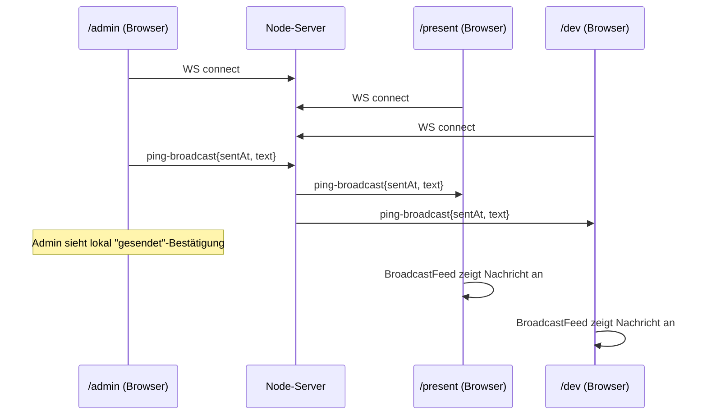

# Design: Arena Hub Server (Basisinfrastruktur)

Bezug: `.features/arena-hub-server/requirements.md` (US-1 bis US-6)

## Architektur-Überblick

Erweiterung von `docs/03-architektur.md`: Für den Mehr-Stationen-Betrieb kommt ein
zentraler Node.js-Prozess hinzu, der **ausschließlich** als WebSocket-Router und
Static-File-Host fungiert. Er enthält **keine** Spiellogik, keine Bot-Sandbox, kein
Scoring – das bleibt vollständig clientseitig (unverändert zu `docs/03`).

```
┌───────────────────────────────────────────────────────────────────────┐
│                         Node-Server-Prozess                            │
│                                                                          │
│  ┌───────────────┐        ┌────────────────┐       ┌─────────────────┐ │
│  │ HTTP/Static    │        │  WebSocket      │       │  Broadcast       │ │
│  │ (client/dist   │        │  Gateway        │──────▶│  Router          │ │
│  │  + SPA-Fallback)│       │ (Connection-Mgmt)│       │ (Routing-Regeln) │ │
│  └───────────────┘        └───────┬────────┘       └─────────┬───────┘ │
│                                     │                            │        │
│                                     ▼                            ▼        │
│                             ┌───────────────┐            ┌──────────────┐│
│                             │ ClientRegistry │◀───────────│  (liest/     ││
│                             │ (verbundene    │            │   schreibt)  ││
│                             │  Clients)      │            └──────────────┘│
│                             └───────────────┘                            │
└───────────────────────────────────────────────────────────────────────┘
             ▲                          ▲                         ▲
             │ WS                       │ WS                      │ WS
     ┌───────┴──────┐          ┌────────┴───────┐         ┌──────┴───────┐
     │  Browser      │          │  Browser        │         │  Browser      │
     │  /admin        │          │  /present        │         │  /dev          │
     └───────────────┘          └────────────────┘         └───────────────┘
```

Jede Verantwortlichkeit ist ein eigenes Modul (SRP):
- **HTTP/Static** weiß nichts von WebSockets.
- **WebSocket Gateway** kümmert sich nur um Verbindungsaufbau/-abbau, Parsing und
  das Weiterreichen einer geparsten Nachricht an den `MessageDispatcher` –
  **nicht** um die Frage, was mit welchem Message-Typ passieren soll.
- **MessageDispatcher** bildet `type → Handler` ab; neue Message-Typen werden durch
  Registrieren eines neuen Handlers ergänzt, ohne Gateway oder bestehende Handler
  anzufassen (Open/Closed).
- **Broadcast Router** (ein Handler) entscheidet nur, *wer* eine Nachricht bekommt –
  kennt keine WebSocket-Implementierungsdetails und hängt nur an einer schmalen
  `ClientSource`-Abstraktion, nicht an der konkreten Registry-Implementierung
  (Dependency Inversion).
- **ClientRegistry** verwaltet nur den Zustand "wer ist verbunden", sonst nichts.

> **Bewusst weggelassen (YAGNI):** Ein `hello`/Rollen-Handshake war in einer
> früheren Entwurfsversion vorgesehen ("Client meldet Rolle admin/present/dev"),
> wird aber von keiner Anforderung (US-1–US-6) tatsächlich gebraucht – der
> Broadcast geht an alle anderen Clients, unabhängig von einer Rolle. Deshalb gibt
> es aktuell **keine** Rollen-Übertragung/-Speicherung im Server. Falls ein
> späteres Feature rollenspezifisches Routing braucht, wird das dann eingeführt
> (Message-Contract ist dafür offen erweiterbar, siehe unten).

## Repo-/Modulstruktur

npm-Workspaces-Monorepo, drei Packages:

```
/package.json                 (Workspace-Root, Scripts: build, dev, test)
/tsconfig.base.json
/vitest.workspace.ts           # Vitest-Workspace-Config: bündelt server+client Projekte

/packages/shared              (@arena/shared)
  src/
    messages.ts                # Alle WS-Message-Contracts (Discriminated Unions)
  package.json

/server                        (@arena/server)
  src/
    index.ts                   # Composition Root: verdrahtet alles, startet Server
    http/
      createStaticServer.ts    # Express/http: liefert client/dist + SPA-Fallback
    ws/
      WebSocketGateway.ts       # Connection-Lifecycle (connect/close), delegiert
      ConnectedClient.ts        # Wrapper um rohes WS + id + send()
      ClientRegistry.ts         # Verwaltung verbundener ConnectedClient-Instanzen
      ClientRegistry.test.ts
      ClientSource.ts           # Schmale Abstraktion (nur getOthers), für DIP
      MessageDispatcher.ts      # type → Handler-Zuordnung, ruft passenden Handler
      MessageDispatcher.test.ts
      handlers/
        handlePingBroadcast.ts  # Handler-Funktion für "ping-broadcast"
        handlePingBroadcast.test.ts
      parseMessage.ts           # Validierung/Parsing eingehender Rohdaten
      parseMessage.test.ts
      BroadcastRouter.ts        # Routing-Regel: an alle außer Sender
      BroadcastRouter.test.ts
    config.ts                   # Port, Pfade etc. aus ENV mit Defaults
  package.json
  tsconfig.json
  vitest.config.ts

/client                        (@arena/client)
  src/
    main.tsx
    App.tsx                     # Router-Setup: /dev /present /admin
    ws/
      WebSocketClient.ts         # Framework-unabhängiger WS-Wrapper (Reconnect etc.)
      WebSocketClient.test.ts
      useWebSocketConnection.ts  # React-Hook-Adapter um WebSocketClient
    components/
      ConnectionStatusBadge.tsx  # Rein präsentational
      BroadcastFeed.tsx          # Rein präsentational, von Present+Dev genutzt
    pages/
      AdminPage.tsx
      PresentPage.tsx
      DevPage.tsx
  package.json
  vite.config.ts
  vitest.config.ts
```

Build-/Startreihenfolge: `shared` wird von `server` und `client` als
Workspace-Dependency referenziert → `shared` zuerst bauen, dann `client` (Vite
Build nach `client/dist`), dann `server` startet und liefert `client/dist` aus.

### Test-Tooling-Setup (Voraussetzung, TDD-Pflicht)

Gemäß `AGENTS.md` ("Test-Driven Development (Pflicht)") muss das Test-Framework
**vor** dem ersten Produktivcode eingerichtet sein. Für dieses Feature:

- **Vitest** als einziges Test-Framework für `server`, `client` und `packages/shared`
  (TypeScript-nativ, schnell, ein Framework für Unit-Tests in allen Packages –
  vermeidet Tool-Wildwuchs, KISS).
- Root-`package.json`-Script `"test": "vitest run"` (bzw. `"test:watch": "vitest"`),
  nutzt `vitest.workspace.ts`, um alle Package-Tests gebündelt auszuführen.
- Jedes Package (`server`, `client`) hat eine eigene minimale `vitest.config.ts`
  (z.B. `client` mit `jsdom`-Environment für React-Hook-Tests, `server` mit
  `node`-Environment).
- Erster Task in `tasks.md` ist entsprechend: Workspace + Vitest-Grundgerüst
  aufsetzen und mit einem trivialen Beispieltest (rot → grün) verifizieren, dass
  `npm test` funktioniert – **bevor** irgendein fachliches Modul (Registry, Router,
  Dispatcher, …) begonnen wird.

## Schnittstellen & Datenmodelle

### `packages/shared/src/messages.ts`

Alle Nachrichten sind schmale, benannte Contracts – neue Message-Typen werden hier
ergänzt, ohne bestehende Typen anzufassen (Open/Closed).

```ts
export interface PingBroadcastMessage {
  type: "ping-broadcast";
  sentAt: string;   // ISO-8601, vom Sender gesetzt
  text: string;      // fester Text, z.B. "Ping von Admin"
}

// Eingehend vom Client an den Server (aktuell genau ein Typ – bewusst minimal,
// siehe YAGNI-Hinweis oben):
export type InboundMessage = PingBroadcastMessage;

// Vom Server an andere Clients weitergeleitet:
export type OutboundMessage = PingBroadcastMessage;
```

Jeder verbundene Client bekommt serverseitig lediglich eine generierte `id`
(z.B. UUID) zur Unterscheidung "Sender vs. andere" – keine Rolle, kein Handshake
nötig, um US-1 bis US-4 zu erfüllen.

### Server: zentrale Abstraktionen

```ts
// ws/ConnectedClient.ts
export interface ConnectedClient {
  readonly id: string;
  send(message: OutboundMessage): void;
}

// ws/ClientSource.ts – schmale Abstraktion für Konsumenten wie BroadcastRouter
// (Interface Segregation: Konsument sieht nur, was er braucht)
export interface ClientSource {
  getOthers(senderId: string): ConnectedClient[];
}

// ws/ClientRegistry.ts – konkrete Implementierung von ClientSource
export class ClientRegistry implements ClientSource {
  add(client: ConnectedClient): void;
  remove(clientId: string): void;
  getOthers(senderId: string): ConnectedClient[];
}

// ws/BroadcastRouter.ts – hängt nur an der Abstraktion, nicht an ClientRegistry
// (Dependency Inversion Principle)
export class BroadcastRouter {
  constructor(private clients: ClientSource) {}
  route(senderId: string, message: OutboundMessage): void {
    for (const client of this.clients.getOthers(senderId)) {
      client.send(message);
    }
  }
}

// ws/parseMessage.ts
export function parseInboundMessage(raw: string): InboundMessage | null;

// ws/MessageDispatcher.ts – bildet type → Handler ab (Open/Closed:
// neue Message-Typen = neuer Handler + eine Zeile Registrierung, kein Eingriff
// in Gateway oder bestehende Handler)
//
// Hinweis zur Abgrenzung von YAGNI: Für aktuell nur EINEN Message-Typ wirkt ein
// generischer Dispatcher zunächst wie Übertechnisierung. Er wird trotzdem
// eingeführt, weil er ein konkretes, geschriebenes Akzeptanzkriterium erfüllt
// (US-5: Open/Closed – Gateway darf sich bei neuen Message-Typen nicht ändern
// müssen). Das unterscheidet ihn vom gestrichenen Rollen-Handshake, der von
// keiner Anforderung gedeckt war.
export type MessageHandler<M extends InboundMessage = InboundMessage> = (
  senderId: string,
  message: M
) => void;

export class MessageDispatcher {
  register<T extends InboundMessage["type"]>(
    type: T,
    handler: MessageHandler<Extract<InboundMessage, { type: T }>>
  ): void;
  dispatch(senderId: string, message: InboundMessage): void;
}

// ws/handlers/handlePingBroadcast.ts
export function createPingBroadcastHandler(
  router: BroadcastRouter
): MessageHandler<PingBroadcastMessage> {
  return (senderId, message) => router.route(senderId, message);
}
```

`WebSocketGateway` kennt nur noch Verbindungs-Lifecycle:
- `connection` → `ConnectedClient` erzeugen, in `ClientRegistry.add(...)`
- `message` → `parseInboundMessage(raw)`; bei `null` Warnung loggen und verwerfen,
  sonst `messageDispatcher.dispatch(clientId, message)`
- `close`/`error` → `ClientRegistry.remove(clientId)`

Die Zuordnung `type → Verhalten` liegt **ausschließlich** im
`MessageDispatcher`/den Handlern, nicht im Gateway. So bleibt das Gateway stabil
(SRP), wenn später neue Message-Typen (z.B. für den noch offenen
Bot-Artefakt-Transfer) hinzukommen.

### Client: zentrale Abstraktionen

```ts
// ws/WebSocketClient.ts – kein React, pure Klasse, testbar
export type ConnectionStatus = "connecting" | "connected" | "disconnected";

export class WebSocketClient {
  constructor(url: string);
  onStatusChange(cb: (status: ConnectionStatus) => void): void;
  onMessage(cb: (msg: OutboundMessage) => void): void;
  send(message: InboundMessage): void;
  connect(): void;
  disconnect(): void;
}

// ws/useWebSocketConnection.ts – React-Adapter
export function useWebSocketConnection(): {
  status: ConnectionStatus;
  lastMessage: OutboundMessage | null;
  send: (message: InboundMessage) => void;
};
```

Reconnect-Strategie (bewusst einfach, YAGNI/KISS): fester Retry-Intervall (z.B.
2000ms) nach Verbindungsabbruch, kein Exponential-Backoff, keine
Retry-Limit-Konfiguration – ausreichend für ein LAN-Setup am Stand.

## Ablauf / Sequenz



## Fehlerbehandlung & Edge Cases

- **Ungültige/kaputte Nachricht** (kein valides JSON, unbekannter `type`):
  `parseInboundMessage` gibt `null` zurück → Gateway loggt eine Warnung und
  ignoriert die Nachricht, kein Crash, keine Weiterleitung.
- **Client-Disconnect** (Tab geschlossen, Netzwerkfehler): `close`/`error`-Event
  entfernt den Client sofort aus der `ClientRegistry`; nachfolgende Broadcasts
  laufen ohne ihn weiter.
- **Server-Neustart**: alle Clients verlieren die Verbindung, laufender
  Reconnect-Timer im `WebSocketClient` baut automatisch neu auf; In-Memory-State
  (Registry, letzte Broadcasts) geht verloren – laut Requirements akzeptiert
  (keine Persistenz im Scope).
- **Mehrere Tabs derselben Route** (z.B. zwei `/present`-Tabs): wird nicht
  verhindert; jede WS-Verbindung ist unabhängig und bekommt eine eigene `id`,
  beide erhalten Broadcasts. Keine Eindeutigkeits-Prüfung nötig für diesen Scope
  (YAGNI).
- **Sender erhält eigene Nachricht nicht zurück**: `BroadcastRouter.route` schließt
  den Sender explizit aus (`getOthers(senderId)`), Admin bekommt stattdessen eine
  lokale UI-Bestätigung (kein Server-Echo nötig).
- **Direkter Aufruf/Reload einer Route** (`/present`, `/admin`, `/dev`): SPA-Fallback
  im `createStaticServer`-Modul liefert immer `index.html` aus, React-Router
  übernimmt das Client-Side-Routing (erfüllt US-6).

## Test-Strategie

Es wird strikt nach dem Rot-Grün-Refactor-Zyklus aus `AGENTS.md` gearbeitet: Jedes
Modul unten entsteht, indem zuerst der jeweilige Test geschrieben wird (rot), dann
die minimale Implementierung (grün), danach ggf. Refactoring. `tasks.md` schneidet
die Arbeit entsprechend in Test-zuerst-Schritte.

- **Unit-Tests (Vitest), Server:**
  - `BroadcastRouter`: Nachricht von Client A wird an B und C zugestellt, nicht an A
    (getestet gegen ein Fake, das nur `ClientSource` implementiert – kein
    Abhängigkeit von der echten `ClientRegistry`-Implementierung nötig).
  - `ClientRegistry`: add/remove/getOthers-Verhalten.
  - `MessageDispatcher`: registrierter Handler wird für passenden Typ aufgerufen,
    nicht für andere Typen; unbekannter Typ löst keinen Fehler aus (no-op oder
    Log, kein Crash).
  - `parseInboundMessage`: gültige `ping-broadcast`-Payload wird korrekt typisiert;
    ungültiges JSON/unbekannter Type ergibt `null`.
- **Unit-Tests, Client:**
  - `WebSocketClient`: Statusübergänge (`connecting` → `connected` →
    `disconnected` → Reconnect) gegen ein Mock-WebSocket.
- **Manueller Integrationstest (Dry-Run am Stand-Setup):**
  1. Server lokal starten (`npm run dev` bzw. Build+Start).
  2. Drei Browser-Tabs öffnen: `/admin`, `/present`, `/dev`.
  3. Auf `/admin` "Ping" klicken.
  4. Verifizieren: `/present` und `/dev` zeigen die Ping-Nachricht mit Zeitstempel
     innerhalb von <1s an; `/admin` zeigt "gesendet"-Bestätigung.
  5. Einen Tab schließen und erneut öffnen → Verbindungsstatus muss sich korrekt
     aktualisieren, erneuter Ping muss weiterhin bei den verbleibenden Tabs ankommen.
- Kein E2E-Framework (Playwright o.ä.) in diesem Scope – manueller Dry-Run reicht
  für den PoC-Nachweis (YAGNI); kann in einem Folge-Feature ergänzt werden, sobald
  echte Spiellogik getestet werden muss.

**Bewusst ohne eigene Unit-Tests** (stattdessen über den manuellen Dry-Run
abgedeckt, da reine Wiring- bzw. reine Präsentationsschicht ohne eigene fachliche
Logik):
- `WebSocketGateway.ts` (verdrahtet nur `ws`-Events mit bereits getesteten
  Bausteinen wie `ClientRegistry`/`MessageDispatcher`)
- `ConnectedClient.ts` (dünner Wrapper ohne Verzweigungslogik)
- `config.ts` (triviales Env-Parsing mit Defaults)
- `useWebSocketConnection.ts` (dünner React-Adapter um das bereits getestete
  `WebSocketClient`)
- `ConnectionStatusBadge.tsx`, `BroadcastFeed.tsx`, `AdminPage.tsx`,
  `PresentPage.tsx`, `DevPage.tsx` (Presentational Components ohne eigene Logik)

Sollte in einem dieser Module doch Verzweigungslogik entstehen (z.B. Formatierung,
Fehlerfälle), wird für genau diesen Teil nachträglich ein Test ergänzt – im
Rot-Grün-Sinne, bevor die Logik geschrieben wird.

## Auswirkungen auf bestehenden Code

Das Repo enthält aktuell nur `docs/` – dieses Feature ist der erste Code-Beitrag.
Betroffen/neu:

- Neue Workspace-Root (`package.json`, `tsconfig.base.json`).
- Neue Packages `packages/shared`, `server`, `client` (siehe Struktur oben).
- Doku-Updates (additive Ergänzungen, keine Löschungen):
  - `docs/03-architektur.md`: neuer Abschnitt "Zentraler Server für Multi-Stationen-
    Betrieb (/present, /admin, Broadcast an /dev)", der klarstellt, dass die
    Simulation weiterhin clientseitig bleibt und der Server nur Routing übernimmt.
  - `docs/09-bot-artefakt-und-turnier.md`: Hinweis-Absatz, dass der
    Artefakt-Transfer von `/dev` zum Präsentationsrechner weiterhin offen/t.b.d.
    ist und **nicht** über diesen Broadcast-Server läuft.
  - `docs/07-offene-punkte.md`: Punkt "Zentrales Leaderboard über mehrere
    Stationen/Rechner hinweg" als entschieden markieren, Verweis auf
    `.features/arena-hub-server/`.
