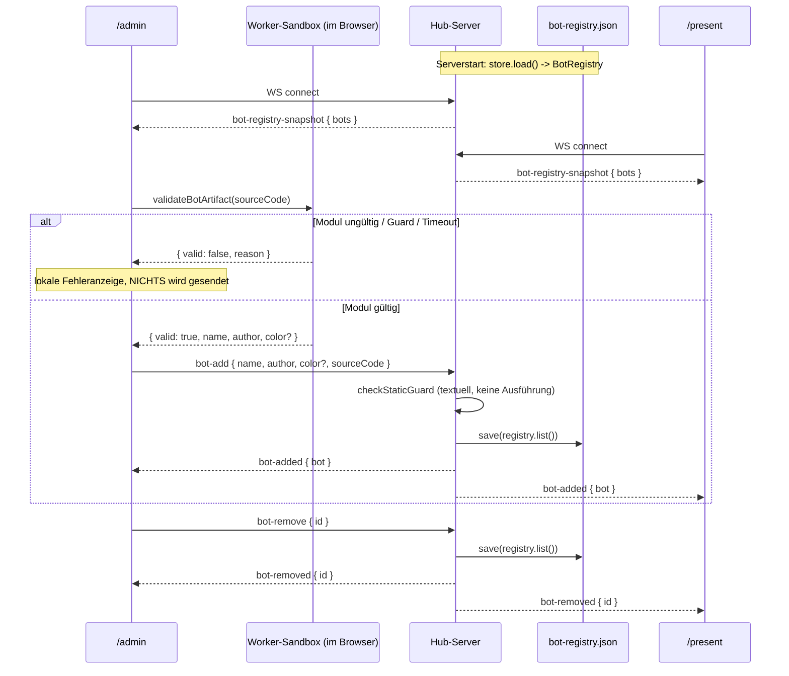

# Design: Bot-Sammelstelle (`bot-collection-point`)

Bezug: `.features/bot-collection-point/requirements.md` (US-1 bis US-6).

> **Hinweis zur Entstehung:** Ein erster Entwurf dieses Designs sah eine
> **server-seitige Sandbox** (`node:worker_threads`, `data:`-URL-`import()`,
> eigene Timeout-/Kill-Logik) zur Validierung vor. Das wurde im Review
> verworfen – nicht, weil `docs/03` etwas anderes sagt (die Docs sind Draft
> und werden angepasst, wenn eine Lösung besser ist), sondern weil es eine
> **zweite, parallele Sandbox-Implementierung** neben der bereits vorhandenen,
> getesteten Browser-Sandbox gewesen wäre – inklusive eines nur zu deren
> Testbarkeit erfundenen Abstraktions-Interfaces. Die hier beschriebene
> Aufteilung erreicht dasselbe Schutzniveau ohne diese Duplikation (siehe
> Abschnitt "Validierung").

## Architektur-Überblick

Erweiterung von `.features/arena-hub-server/`. Das bestehende Muster
(`WebSocketGateway` → `MessageDispatcher` → Handler → `BroadcastRouter`) bleibt
unverändert; ergänzt werden die Bot-Registry samt Persistenz, zwei Handler und
die Client-UIs.

```
┌──────────────────────── Node-Server-Prozess ────────────────────────┐
│                                                                        │
│  WebSocketGateway ──▶ MessageDispatcher ──▶ handlers/                 │
│         │                                    createBotAddHandler       │
│         │ onClientConnected                  createBotRemoveHandler    │
│         │                                          │                   │
│         │                                          ▼                   │
│         │                                  checkStaticGuard()          │
│         │                                  (rein textuell, KEINE       │
│         │                                   Code-Ausführung)           │
│         │                                          │                   │
│         ▼                                          ▼                   │
│   bot-registry-snapshot              BotRegistry ──▶ BotRegistryStore  │
│   (nur an neuen Client)              (In-Memory)     (JSON-Datei)      │
│                                              │                         │
│                              BroadcastRouter.routeToAll(...)           │
└────────────────────────────────────────────────────────────────────────┘
        ▲                                   ▲                        ▲
        │ WS                                │ WS                     │ WS
  /admin                               /present                  /dev
  Upload + Liste + Löschen             Liste (read-only)         unbetroffen
  └─ validateBotArtifact()
     (vorhandene Worker-Sandbox:
      Guard + import() + Contract)
```

## Validierung: drei Schritte, zwei Orte

"Einen Bot validieren" zerfällt in drei Teile mit unterschiedlichen
Anforderungen:

| Schritt | Braucht Sandbox? | Wo bereits vorhanden |
|---|---|---|
| 1. `checkStaticGuard(source)` | nein – reine Regex-Prüfung | `@arena/bot-contract` |
| 2. Quelltext → Modul-Objekt | **ja** | `client/src/sandbox/botWorker.ts` |
| 3. `validateBotModule(obj)` | nein – reine Funktion | `@arena/bot-contract` |

Daraus folgt die Aufteilung:

- **`/admin` (Client)** führt **1 + 2 + 3** in der bereits existierenden
  Worker-Sandbox aus. Zweck: sofortiges Feedback pro Datei ohne Server-Roundtrip
  **und** Auslesen von `name`/`author`/`color` aus dem geladenen Modul (US-2).
- **Server** führt **Schritt 1** aus, bevor er etwas in die Registry aufnimmt.
  Kostet keinerlei neue Infrastruktur (die Funktion liegt bereits in einem
  Shared Package) und führt **keinen** Bot-Code aus, ist aber echtes
  Gatekeeping: Quelltext mit `fetch(`/`eval(`/`import`/… kommt nicht in die
  Registry, unabhängig davon, welcher Client ihn einliefert.
- **`/present`** validiert später beim tatsächlichen Laden erneut vollständig –
  es muss das Modul ohnehin in seinen eigenen Worker laden, um es laufen zu
  lassen. Das ist die faktisch letzte Verteidigungslinie und existiert
  unabhängig von diesem Feature.

Der Server verlässt sich also nicht blind auf den Client, baut aber auch keine
zweite Sandbox. Schritt 2+3 serverseitig zu wiederholen brächte kein zusätzliches
Schutzniveau (denn `/present` prüft ohnehin erneut), kostet aber einen kompletten
zweiten Worker-Stack – daher bewusst weggelassen (YAGNI/DRY).

## Schnittstellen & Datenmodelle

### `packages/shared/src/messages.ts` (additiv)

```ts
/** Vollständiges Registry-Artefakt inkl. Quelltext (nicht nur Metadaten -
 *  `/present` braucht den Quelltext später zum Ausführen). */
export interface BotArtifact {
  id: string;
  name: string;
  author: string;
  color: string;
  sourceCode: string;
  uploadedAt: string; // ISO-8601, vom Server gesetzt
}

/** Was der Uploader liefert: Quelltext + die von ihm ausgelesenen Metadaten.
 *  id/color/uploadedAt vergibt der Server (Autorität über Eintrags-Identität). */
export interface BotAddMessage {
  type: "bot-add";
  name: string;
  author: string;
  /** Vom Bot-Modul gesetzte Farbe; fehlt sie, vergibt der Server eine. */
  color?: string;
  sourceCode: string;
}

export interface BotRemoveMessage {
  type: "bot-remove";
  id: string;
}

/** Server -> ALLE Clients (inkl. Sender, siehe `routeToAll`). */
export interface BotAddedMessage {
  type: "bot-added";
  bot: BotArtifact;
}

/** Server -> ALLE Clients (inkl. Sender). */
export interface BotRemovedMessage {
  type: "bot-removed";
  id: string;
}

/** Server -> NUR den gerade neu verbundenen Client. */
export interface BotRegistrySnapshotMessage {
  type: "bot-registry-snapshot";
  bots: BotArtifact[];
}

export const MAX_BOT_SOURCE_BYTES = 200_000;

export type InboundMessage =
  | PingBroadcastMessage
  | AudioSettingsMessage
  | BotAddMessage
  | BotRemoveMessage;

export type OutboundMessage =
  | PingBroadcastMessage
  | AudioSettingsMessage
  | BotAddedMessage
  | BotRemovedMessage
  | BotRegistrySnapshotMessage;
```

Dazu je eine `isXMessage`-Typguard-Funktion (Muster wie
`isPingBroadcastMessage`), genutzt von `parseInboundMessage`.

**Bewusst NICHT enthalten:** eine `bot-add-rejected`-Nachricht. Ungültige
Dateien werden bereits in `/admin` lokal erkannt (Schritt 1–3) und dort
angezeigt – sie werden gar nicht erst gesendet. Die Server-Guard-Prüfung ist
reines Gatekeeping gegen Clients, die die UI umgehen; ein solcher Client braucht
keine hübsche Fehlermeldung, ein Server-Log genügt. Das spart einen
Message-Typ, einen Typguard und den gesamten "gezielt an den Sender
antworten"-Pfad im Server (inkl. eines sonst nötigen `ClientDirectory`).

### Server: `server/src/botRegistry/`

```
server/src/botRegistry/
  BotRegistry.ts               # In-Memory-Zustand, SRP: nur Speichern/Abfragen
  BotRegistry.test.ts
  BotRegistryStore.ts          # Persistenz-Port (Interface) + JSON-Datei-Impl.
  JsonFileBotRegistryStore.ts
  JsonFileBotRegistryStore.test.ts
  colorForId.ts                # deterministische Fallback-Farbe
  colorForId.test.ts
  handlers/
    createBotAddHandler.ts
    createBotAddHandler.test.ts
    createBotRemoveHandler.ts
    createBotRemoveHandler.test.ts
```

```ts
// BotRegistry.ts – kennt weder WebSockets noch das Dateisystem.
export class BotRegistry {
  private readonly bots = new Map<string, BotArtifact>();

  constructor(initial: readonly BotArtifact[] = []) {
    for (const bot of initial) this.bots.set(bot.id, bot);
  }

  add(bot: BotArtifact): void {
    this.bots.set(bot.id, bot);
  }

  /** `false` bei unbekannter ID – erlaubt dem Handler, den Broadcast zu
   *  unterlassen (US-4: no-op statt Fehler). */
  remove(id: string): boolean {
    return this.bots.delete(id);
  }

  list(): BotArtifact[] {
    return [...this.bots.values()];
  }
}
```

**Persistenz als Port/Adapter (Dependency Inversion, US-5):**

```ts
// BotRegistryStore.ts
export interface BotRegistryStore {
  load(): BotArtifact[];
  save(bots: readonly BotArtifact[]): void;
}
```

`JsonFileBotRegistryStore` implementiert das gegen eine JSON-Datei
(Pfad aus `config.ts`, Default z.B. `./data/bot-registry.json`):
- `load()`: Datei fehlt/kaputt → `[]` + `console.warn`, **kein** Throw (US-5).
- `save()`: Schreibfehler → `console.warn`, **kein** Throw (US-5 – ein
  Schreibfehler darf die laufende Veranstaltung nicht stoppen).
- Bewusst **synchrones** `writeFileSync` und **vollständiges** Neuschreiben der
  Datei statt inkrementellem Append/async-Queue: Die Datenmenge ist winzig
  (max. ~100 Bots à wenige KB), damit ist das die einfachste korrekte Lösung
  ohne Race Conditions zwischen überlappenden Schreibvorgängen (KISS).

Die Verdrahtung "nach jeder Mutation speichern" liegt **nicht** in
`BotRegistry` (die soll nichts vom Dateisystem wissen, SRP), sondern in den
Handlern – dort, wo die Mutation ausgelöst wird:

```ts
// handlers/createBotAddHandler.ts
export function createBotAddHandler(
  registry: BotRegistry,
  store: BotRegistryStore,
  broadcastAll: (message: OutboundMessage) => void,
  createId: () => string = randomUUID,
  now: () => Date = () => new Date()
): MessageHandler<BotAddMessage> {
  return (_senderId, message) => {
    if (Buffer.byteLength(message.sourceCode, "utf-8") > MAX_BOT_SOURCE_BYTES) {
      console.warn("Bot-Upload abgelehnt: Quelltext zu groß");
      return;
    }

    const guard = checkStaticGuard(message.sourceCode);
    if (!guard.allowed) {
      console.warn(`Bot-Upload abgelehnt: verbotenes Muster ${guard.matchedPattern}`);
      return;
    }

    const id = createId();
    const bot: BotArtifact = {
      id,
      name: message.name,
      author: message.author,
      color: message.color ?? colorForId(id),
      sourceCode: message.sourceCode,
      uploadedAt: now().toISOString(),
    };

    registry.add(bot);
    store.save(registry.list());
    broadcastAll({ type: "bot-added", bot });
  };
}
```

`createId`/`now` sind injizierbar (Default-Parameter) – macht die Handler-Tests
deterministisch, ohne Mocking-Framework.

```ts
// handlers/createBotRemoveHandler.ts
export function createBotRemoveHandler(
  registry: BotRegistry,
  store: BotRegistryStore,
  broadcastAll: (message: OutboundMessage) => void
): MessageHandler<BotRemoveMessage> {
  return (_senderId, message) => {
    if (!registry.remove(message.id)) return; // unbekannte ID: no-op (US-4)
    store.save(registry.list());
    broadcastAll({ type: "bot-removed", id: message.id });
  };
}
```

### Server: minimale Erweiterungen an bestehenden Modulen

| Modul | Erweiterung | Begründung |
|---|---|---|
| `ws/ClientSource.ts` | `getAll(): ConnectedClient[]` | Broadcast **inkl.** Sender wird gebraucht (s.u.) |
| `ws/ClientRegistry.ts` | implementiert `getAll()` | trivial, gleiche Datenquelle, keine neue Verantwortung |
| `ws/BroadcastRouter.ts` | `routeToAll(message)` | bestehendes `route(senderId, …)` bleibt unverändert |
| `ws/WebSocketGateway.ts` | optionaler `onClientConnected?(client)`-Callback | Gateway behält Lifecycle-SRP, kennt Registry-Inhalt nicht |
| `ws/parseMessage.ts` | zwei weitere Typguard-Zweige | additiv |
| `config.ts` | `botRegistryFile`-Pfad | Env mit Default |

**Warum `routeToAll` (Sender eingeschlossen) und nicht das bestehende `route`?**
Der hochladende `/admin`-Client muss seinen eigenen Bot über **denselben** Pfad
erhalten wie alle anderen. Sonst gäbe es zwei Code-Pfade für dieselbe
Zustandsänderung (lokales Einfügen vs. Broadcast-Verarbeitung) – doppelte Logik
mit Drift-Risiko, und der Client müsste die vom Server vergebene `id`/`color`/
`uploadedAt` raten. Mit Echo ist der Server eindeutige Quelle der Wahrheit und
der Client hat genau eine Zustandsübergangs-Regel.

**Snapshot für neue Clients (US-3):** `WebSocketGateway` ruft direkt nach
`registry.add(client)` den optionalen Callback auf; die Composition Root
(`server/src/index.ts`) verdrahtet ihn mit
`client.send({ type: "bot-registry-snapshot", bots: botRegistry.list() })`.
Das Gateway bleibt damit inhaltsagnostisch (es kennt nur "ein Client ist da"),
und es braucht keine zusätzliche Request/Response-Runde.

### Client

```
client/src/
  sandbox/
    validateBotArtifact.ts       # NEU: Quelltext -> {valid, name, author, color}
    validateBotArtifact.test.ts
    botWorker.ts                 # GEÄNDERT: meldet Metadaten bei gültigem Modul
    workerLike.ts                # GEÄNDERT: neuer Message-Typ "module-ready"
    BotRunner.ts                 # GEÄNDERT: ignoriert "module-ready" explizit
  botRegistry/
    useBotRegistry.ts            # NEU: Registry-State aus WS-Nachrichten
    useBotRegistry.test.ts
  components/
    BotUploadForm.tsx            # NEU: Dateiauswahl/Drag&Drop + lokale Fehlerliste
    BotRegistryList.tsx          # NEU: Anzeige, optionaler onRemove-Callback
  pages/
    AdminPage.tsx                # + Upload-Formular + Liste mit Löschen
    PresentPage.tsx              # + Liste ohne Löschen
```

**Protokoll-Erweiterung (`workerLike.ts`):**

```ts
export type WorkerToHostMessage =
  | { type: "action"; tick: number; actions: Action[] }
  | { type: "error"; tick: number; message: string }
  | { type: "module-invalid"; reason: string }
  | { type: "module-ready"; name?: string; author?: string; color?: string }; // NEU
```

> **Zur bestehenden YAGNI-Notiz in `workerLike.ts`:** Dort steht bewusst
> "keine `ready`-Message – kein Akzeptanzkriterium verlangt, dass der Host auf
> `init` wartet". Das galt, solange niemand die Modul-Metadaten brauchte. US-2
> verlangt jetzt genau das (`name`/`author`/`color` aus dem Modul lesen), und
> `botWorker.ts` verwirft sie heute (`decide = validation.module.decide`). Die
> Notiz wird deshalb im Code aktualisiert, nicht umgangen – dieselbe
> Argumentationsfigur wie beim `MessageDispatcher` in
> `.features/arena-hub-server/design.md` (etwas wird eingeführt, **weil** ein
> geschriebenes Akzeptanzkriterium es fordert, nicht auf Verdacht).

`botWorker.ts` sendet im Erfolgsfall zusätzlich eine Zeile:
```ts
decide = validation.module.decide;
self.postMessage({
  type: "module-ready",
  name: validation.module.name,
  author: validation.module.author,
  color: validation.module.color,
});
```

`BotRunner.handleWorkerMessage` bekommt einen expliziten Frühausstieg für
`"module-ready"` (der Runner interessiert sich nicht für Metadaten – er tickt
nur). Ohne diese Zeile würde die neue Variante in die `pendingTick`-
Korrelationsprüfung laufen und TypeScript würde den Zugriff auf `message.tick`
zu Recht bemängeln. Verhalten des Runners ändert sich dadurch **nicht**.

**`validateBotArtifact.ts`** – die eigentliche Upload-Validierung, nutzt
denselben Worker wie der Spielbetrieb, aber ohne jeden Tick:

```ts
export type BotArtifactValidation =
  | { valid: true; name: string; author: string; color?: string }
  | { valid: false; reason: string };

export function validateBotArtifact(
  sourceCode: string,
  fallbackName: string,
  createWorker: () => WorkerLike = createBrowserWorker,
  timeoutMs = 2000
): Promise<BotArtifactValidation>;
```

Ablauf: `checkStaticGuard` (Schritt 1, synchron) → Worker starten, `init`
senden → auf `module-ready` (gültig) bzw. `module-invalid` (ungültig) warten →
in **beiden** Fällen sowie bei Timeout `worker.terminate()`. Der Timeout deckt
Endlosschleifen im Modul-Top-Level ab (dort greift der Tick-Timeout des
`BotRunner` naturgemäß nicht). `createWorker` ist injizierbar → Tests laufen
gegen den vorhandenen `testUtils/FakeWorker.ts`, ohne echte Worker.

Fallbacks (US-2) liegen hier, nicht im Server: `name || fallbackName`
(Dateiname ohne `.js`), `author || "unbekannt"`. `color` bleibt `undefined`,
wenn das Modul keine gesetzt hat – die Fallback-Farbe vergibt der Server, weil
sie aus der server-vergebenen `id` abgeleitet wird.

**`useBotRegistry.ts`** – hält **ausschließlich** den Registry-Zustand:

```ts
export function useBotRegistry(lastMessage: OutboundMessage | null): BotArtifact[];
```

Reducer: `bot-registry-snapshot` → ersetzt komplett; `bot-added` → anhängen;
`bot-removed` → nach `id` filtern; alles andere → unverändert. Kein Dedupe
(eine WS-Verbindung, garantierte Reihenfolge, Server ist Single Source of
Truth – eine Verteidigung gegen ein Problem, das es nicht gibt, wäre YAGNI).

Upload-**Fehler** landen bewusst **nicht** hier, sondern im lokalen State von
`BotUploadForm`: Sie sind client-lokal und flüchtig, der Registry-Zustand ist
geteilt und server-autoritativ – zwei verschiedene Lebenszyklen gehören nicht
in denselben Zustandscontainer (SRP).

**`BotUploadForm.tsx`** pro ausgewählter Datei: Größe gegen
`MAX_BOT_SOURCE_BYTES` prüfen → `file.text()` → `validateBotArtifact(...)` →
bei `valid` `send({ type: "bot-add", ... })`, sonst Fehlereintrag in die lokale
Liste. Dateien werden unabhängig voneinander verarbeitet (kein
Alles-oder-Nichts, US-1).

**`BotRegistryList.tsx`** ist rein präsentational und wird von beiden Seiten
genutzt; `/admin` übergibt `onRemove`, `/present` nicht (ISP: `/present` sieht
die Löschfunktion gar nicht erst).

## Ablauf / Sequenz



## Fehlerbehandlung & Edge Cases

- **Ungültiges Modul / Guard-Verstoß / Syntaxfehler**: in `/admin` lokal
  erkannt und angezeigt, kein Upload, kein Server-Kontakt.
- **Endlosschleife im Modul-Top-Level**: `validateBotArtifact`-Timeout +
  `terminate()`; `/admin` bleibt bedienbar.
- **Mehrere Dateien, teils ungültig**: unabhängige Verarbeitung pro Datei.
- **Doppelter Dateiname**: neuer eigenständiger Eintrag (US-1, kein Dedupe).
- **Löschen unbekannter ID**: `registry.remove` → `false`, kein Broadcast,
  kein Speichern, kein Fehler.
- **Client umgeht die UI** (direkter WS-Client mit bösartigem Quelltext):
  Server-Guard lehnt ab und loggt; zusätzlich validiert `/present` beim Laden
  erneut vollständig in seiner eigenen Sandbox.
- **Registry-Datei fehlt/kaputt beim Start**: leere Registry + Warnung, Server
  startet normal (US-5).
- **Schreibfehler beim Speichern**: Upload bleibt im Speicher wirksam, Warnung
  im Log (US-5).
- **Server-Neustart**: Registry wird aus der Datei rekonstruiert; verbundene
  Clients reconnecten (vorhandene Logik) und erhalten den Snapshot.

## Test-Strategie

Strikt Rot-Grün-Refactor (`AGENTS.md`).

- **Server (Vitest, node):**
  - `BotRegistry`: add/remove/list, Konstruktor mit Initialbestand,
    `remove` unbekannte ID → `false`.
  - `JsonFileBotRegistryStore`: Roundtrip save→load (Temp-Verzeichnis);
    fehlende Datei → `[]`; kaputtes JSON → `[]` + kein Throw; Schreibfehler
    (z.B. nicht existierendes Verzeichnis) → kein Throw.
  - `colorForId`: deterministisch (gleiche ID → gleiche Farbe), gültiges
    CSS-Farbformat.
  - `createBotAddHandler`: gültige Nachricht → Registry ergänzt, `store.save`
    aufgerufen, `bot-added` gebroadcastet, `id`/`uploadedAt` aus injizierten
    Fakes; Guard-Verstoß → nichts davon; Übergröße → nichts davon;
    `color` aus Nachricht gewinnt, sonst `colorForId`.
  - `createBotRemoveHandler`: bekannte ID → entfernt + gespeichert +
    gebroadcastet; unbekannte ID → keine dieser drei Wirkungen.
  - `parseInboundMessage`/neue Typguards: gültige und ungültige Payloads.
  - `BroadcastRouter.routeToAll`: erreicht **alle** inkl. Sender (bestehender
    `route`-Test bleibt unverändert grün → Regressionsschutz).
- **Client (Vitest, jsdom):**
  - `validateBotArtifact` gegen `FakeWorker`: gültiges Modul (Metadaten +
    Fallbacks), `module-invalid`, Guard-Verstoß (ohne dass überhaupt ein Worker
    startet), Timeout, `terminate()` in allen Pfaden aufgerufen.
  - `useBotRegistry`: snapshot ersetzt, added hängt an, removed filtert,
    fremde Message-Typen ändern nichts.
- **Bewusst ohne Unit-Test** (bestehende Projektkonvention: reine
  Präsentation/Wiring): `BotUploadForm.tsx`, `BotRegistryList.tsx`,
  `AdminPage.tsx`, `PresentPage.tsx`, `botWorker.ts` (Worker-Runtime, in jsdom
  nicht sinnvoll isolierbar – siehe bestehender Kommentar dort),
  `server/src/index.ts` (Composition Root).
- **Manueller Integrationstest:**
  1. `/admin` + `/present` öffnen, `current-bot.template.js`-basierten Bot
     hochladen → erscheint in beiden Listen mit Name/Autor/Farbe.
  2. Datei mit `fetch(...)` hochladen → sofortige lokale Ablehnung in `/admin`,
     `/present` unverändert.
  3. Zwei Dateien gleichzeitig, eine ungültig → gültige kommt trotzdem an.
  4. Bot in `/admin` löschen → verschwindet in beiden Ansichten.
  5. `/present` neu laden → identischer Stand (Snapshot).
  6. **Server neu starten** → beide Ansichten zeigen nach Reconnect denselben
     Bot-Stand wie vorher (US-5).
  7. Datei mit `while(true){}` im Top-Level → Ablehnung nach Timeout, `/admin`
     bleibt bedienbar.

## Auswirkungen auf bestehenden Code

| Datei | Änderung |
|---|---|
| `packages/shared/src/messages.ts` | neue Typen, Typguards, `MAX_BOT_SOURCE_BYTES` |
| `server/src/botRegistry/**` | neu |
| `server/src/ws/ClientSource.ts` | `getAll()` ergänzt |
| `server/src/ws/ClientRegistry.ts` | `getAll()` implementiert |
| `server/src/ws/BroadcastRouter.ts` | `routeToAll()` ergänzt |
| `server/src/ws/WebSocketGateway.ts` | optionaler `onClientConnected`-Callback |
| `server/src/ws/parseMessage.ts` | zwei Typguard-Zweige |
| `server/src/config.ts` | `botRegistryFile` |
| `server/src/index.ts` | Composition Root: Store laden, Registry, Handler, Snapshot |
| `client/src/sandbox/workerLike.ts` | `module-ready`-Typ, YAGNI-Notiz aktualisiert |
| `client/src/sandbox/botWorker.ts` | sendet `module-ready` mit Metadaten |
| `client/src/sandbox/BotRunner.ts` | ignoriert `module-ready` explizit (kein Verhaltensänderung) |
| `client/src/sandbox/validateBotArtifact.ts` | neu |
| `client/src/botRegistry/useBotRegistry.ts` | neu |
| `client/src/components/BotUploadForm.tsx`, `BotRegistryList.tsx` | neu |
| `client/src/pages/AdminPage.tsx`, `PresentPage.tsx` | Liste/Upload ergänzt |
| `.gitignore` | `data/` bzw. Registry-Dateipfad |
| `docs/03-architektur.md` | Abschnitt "Bot-Sammelstelle": Validierungs-Aufteilung + Persistenz beschreiben (ersetzt die Draft-Aussagen "kein Ausführen" pauschal / "keine Persistenz") |
| `docs/07-offene-punkte.md` | Umsetzungsstand ergänzen |
