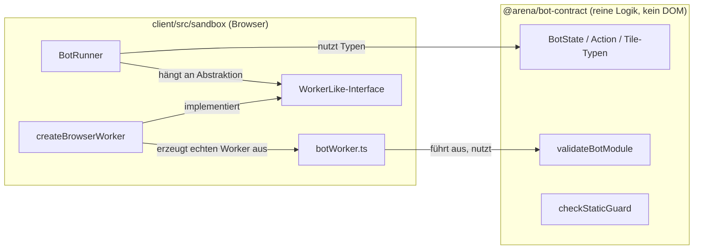
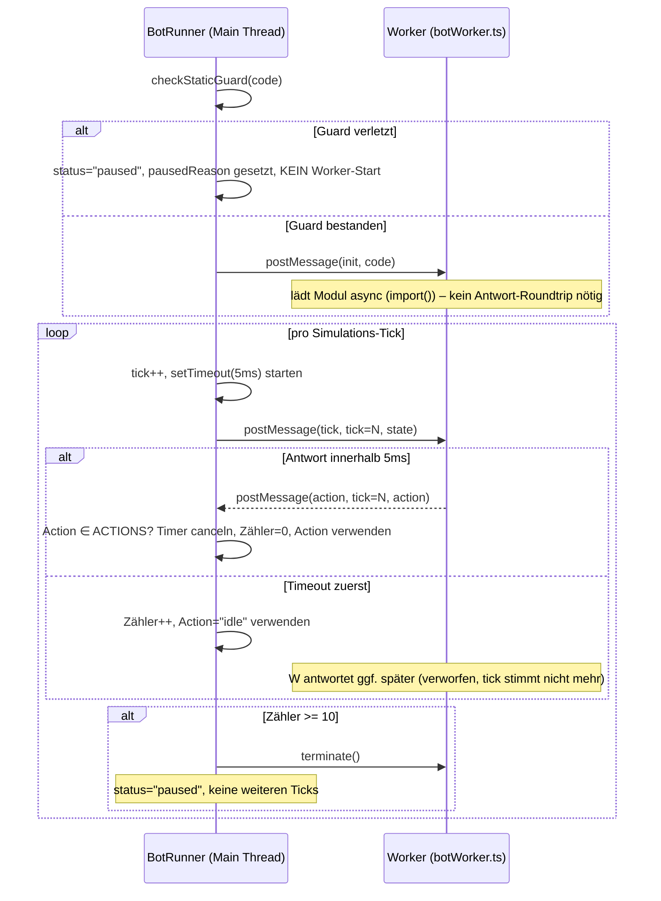

# Design: Bot-Decide-API (Contract + Sandbox)

Bezug: `.features/bot-decide-api/requirements.md` (US-1 bis US-6)

## Architektur-Überblick

Neues Package `@arena/bot-contract` (Contract-Typen + Validierung, laufzeit-schlank,
ohne Phaser-/DOM-Abhängigkeit) plus ein neues Modul `client/src/sandbox/` (Worker-
Ausführung). Bewusste Trennung:

```
packages/bot-contract          (@arena/bot-contract – reine Typen + Validierung)
  src/
    state.ts                    # BotState, Action, TileType, Nearest*-Typen
    hazards.ts                  # HazardKind, UtilityKind
    botModule.ts                # BotModule-Typ + validateBotModule()
    staticGuard.ts               # checkStaticGuard() – Regex-Vorfilter
    index.ts                    # Public API (Re-Exports)

client/src/sandbox/              (nutzt @arena/bot-contract, browser-spezifisch)
  workerLike.ts                  # WorkerLike-Interface (DIP-Abstraktion)
  botWorker.ts                   # Tatsächlicher Worker-Einstiegspunkt (Modul-Worker)
  BotRunner.ts                   # Timeout/Zähler/Kill-Logik, nutzt WorkerLike
  createBrowserWorker.ts         # Fabrik: erzeugt echten Browser-Worker als WorkerLike
```

Warum zwei Packages/Ebenen statt einem?
- `@arena/bot-contract` ist **reine Logik** (Typen + zwei kleine Prüf-Funktionen),
  ohne jede Browser-Abhängigkeit → eigenständig testbar, potenziell später auch vom
  Server nutzbar (siehe offene Frage zu `bot-collection-point`), ohne dass der
  Server dafür Browser-APIs bräuchte (Single Responsibility, Interface Segregation).
- Die Worker-/Sandbox-Ausführung selbst ist zwingend **browserspezifisch** (`Worker`,
  Blob-URL, `import()`) und gehört daher in den `client` – sie importiert nur die
  Typen/Validierung aus `@arena/bot-contract` (Dependency Inversion: `BotRunner`
  hängt an der schmalen `WorkerLike`-Abstraktion, nicht an der konkreten
  `window.Worker`-Klasse).



## Schnittstellen & Datenmodelle

### `packages/bot-contract/src/state.ts`

```ts
export type TileType = "empty" | "solid" | "hazard" | "coinBlock" | "goal" | "unknown";
export type Action = "left" | "right" | "jump" | "idle";
export const ACTIONS: readonly Action[] = ["left", "right", "jump", "idle"];

export interface NearestCoin { dx: number; dy: number; value: number }
export interface NearestHazard { dx: number; dy: number; kind: HazardKind; active: boolean }
export interface NearestUtility { dx: number; dy: number; kind: UtilityKind }

export interface BotState {
  tick: number;
  position: { x: number; y: number };
  facing: "left" | "right";
  onGround: boolean;
  isAlive: boolean;
  nearbyTiles: TileType[][];
  nearestCoin: NearestCoin | null;
  nearestHazard: NearestHazard | null;
  nearestUtility: NearestUtility | null;
  goalDirection: { dx: number; dy: number };
  coinsCollected: number;
  livesRemaining: number;
  timeElapsedMs: number;
}
```

`HazardKind`/`UtilityKind` in `hazards.ts` – bewusst **nur die Kind-Strings**, keine
Level-/Rendering-Daten (die gehören zu `level-one-arena`):

```ts
export type HazardKind = "schnetzler" | "stachlinger" | "loderix" | "kugelblitz";
export type UtilityKind = "boingo";
```

### `packages/bot-contract/src/botModule.ts`

```ts
export const SUPPORTED_API_VERSION = 1 as const;

export interface BotModule {
  apiVersion: typeof SUPPORTED_API_VERSION;
  name?: string;
  author?: string;
  color?: string;
  decide: (state: BotState) => Action;
}

export type BotModuleValidation =
  | { valid: true; module: BotModule }
  | { valid: false; reason: string };

export function validateBotModule(candidate: unknown): BotModuleValidation;
```

Implementierung als **Kette kleiner, benannter Prüfungen** (keine verschachtelten
`if`s), damit jede Regel isoliert testbar ist und neue Regeln sich anfügen lassen,
ohne bestehende zu ändern (Open/Closed). Aktuell existiert genau **eine**
`apiVersion` (siehe `SUPPORTED_API_VERSION`) – bewusst kein Versions-Dispatch-
Mechanismus für mehrere Versionen (YAGNI, dafür gibt es noch keine Anforderung).
Sollte später `apiVersion: 2` hinzukommen, wird `hasSupportedApiVersion` durch
einen Vergleich gegen eine kleine `Set`/Liste erweitert – das ist dann eine lokale,
in sich geschlossene Änderung an dieser einen Funktion, kein Strukturumbau.

```ts
type Check = (c: Record<string, unknown>) => string | null; // Grund oder null=ok

const isPlainObject: Check = (c) => (typeof c === "object" && c !== null ? null : "kein Objekt");
const hasSupportedApiVersion: Check = (c) =>
  c.apiVersion === SUPPORTED_API_VERSION ? null : `apiVersion ${String(c.apiVersion)} nicht unterstützt`;
const hasDecideFunction: Check = (c) =>
  typeof c.decide === "function" ? null : "decide ist keine Funktion";
```

`validateBotModule` führt diese Checks nacheinander aus und gibt beim ersten
Fehlschlag `{ valid: false, reason }` zurück (Fail-Fast, klare Fehlermeldung pro
Regel – testbar pro Check).

### `packages/bot-contract/src/staticGuard.ts`

```ts
export interface StaticGuardResult {
  allowed: boolean;
  matchedPattern?: string;
}

export function checkStaticGuard(sourceCode: string): StaticGuardResult;
```

Implementierung: Liste von `{ label: string; pattern: RegExp }` (z.B. `import `,
`require(`, `fetch(`, `window.`, `document.`, `eval(`, `XMLHttpRequest`), iteriert
und gibt beim ersten Treffer `{ allowed: false, matchedPattern: label }` zurück.
Neue verbotene Muster = neuer Listen-Eintrag (Open/Closed, keine Funktionsänderung
nötig).

### `client/src/sandbox/workerLike.ts` – Testbarkeits-Abstraktion

```ts
export interface WorkerLike {
  postMessage(message: HostToWorkerMessage): void;
  /** Plain, überschreibbare Property – wie bei der echten `Worker`-Klasse
   *  (`worker.onmessage = handler`), bewusst KEINE Getter/Setter-Accessor-
   *  Deklaration (in TS-Interfaces syntaktisch ohnehin nicht zulässig). */
  onmessage: (event: { data: WorkerToHostMessage }) => void;
  terminate(): void;
}

export type HostToWorkerMessage =
  | { type: "init"; code: string }
  | { type: "tick"; tick: number; state: BotState };

/**
 * Bewusst OHNE "ready"-Message (YAGNI): Kein Akzeptanzkriterium verlangt, dass
 * der Host auf den Abschluss von `init` wartet – solange das Bot-Modul noch
 * lädt, liefert der Worker für jeden `tick` schlicht "idle" (siehe
 * Fehlerbehandlung & Edge Cases). Falls ein späteres Feature (z.B. eine
 * "Bot lädt…"-Anzeige in der UI) das braucht, wird die Message dann ergänzt.
 */
export type WorkerToHostMessage =
  | { type: "action"; tick: number; action: Action }
  | { type: "error"; tick: number; message: string };
```

### `client/src/sandbox/BotRunner.ts` – Kernlogik (das eigentliche Herzstück)

```ts
export interface BotRunnerOptions {
  timeoutMs?: number;        // Default 5 (docs/02)
  maxConsecutiveFailures?: number; // Default 10 (docs/09)
}

export type BotRunnerStatus = "running" | "paused";

export class BotRunner {
  constructor(
    private readonly worker: WorkerLike,
    private readonly options: BotRunnerOptions = {}
  ) {}

  get status(): BotRunnerStatus;
  /** Grund für "paused" (Guard-Verstoß ODER zu viele Fehlversuche); sonst null. */
  get pausedReason(): string | null;

  /**
   * Prüft den Quellcode zuerst gegen `checkStaticGuard` (US-3) – das ist die
   * EINZIGE Stelle, die diesen Guard aufruft (zentrale Verantwortung, kein
   * Verlass auf disziplinierte Aufrufer). Bei Verstoß wird `status="paused"`
   * gesetzt, `pausedReason` befüllt, und es wird KEIN `postMessage`/Worker-Start
   * ausgelöst. Nur bei bestandenem Guard wird `init` an den Worker gesendet.
   */
  init(sourceCode: string): void;

  /**
   * Sendet einen Tick, wartet bis `timeoutMs` auf eine passende Antwort.
   * Liefert IMMER eine gültige Action (nie ein rejected Promise) –
   * Timeout/Fehler/ungültige Antwort werden intern zu "idle" degradiert.
   *
   * Vertrag (bewusst einfach gehalten, YAGNI): `tick()` wird vom aufrufenden
   * Simulationsloop IMMER sequenziell aufgerufen – erst wenn das zurückgegebene
   * Promise aufgelöst ist, folgt der nächste Aufruf (siehe `docs/03`, fixer
   * Tick-Loop). `BotRunner` unterstützt keine überlappenden `tick()`-Aufrufe;
   * das ist kein Bug, sondern eine bewusste Vereinfachung, da kein
   * Akzeptanzkriterium parallele Ticks für denselben Bot verlangt.
   */
  tick(state: BotState): Promise<Action>;

  /**
   * Terminiert den Worker und setzt `status="paused"` (`pausedReason`
   * = "disposed") – bewusst KEIN eigener dritter Status-Wert (KISS): aus
   * Sicht von `tick()` ist "vom Aufrufer beendet" und "wegen zu vieler
   * Fehlversuche pausiert" identisches Verhalten (immer sofort "idle",
   * nie wieder Worker-Interaktion). Nach `dispose()` ist die Instanz
   * endgültig verbraucht (kein Re-Init vorgesehen).
   */
  dispose(): void;
}
```

Interne Mechanik von `tick()` (siehe Ablauf/Sequenz unten für die Timing-Details):
1. Wenn `status === "paused"` → sofort `"idle"` zurückgeben, **kein** `postMessage`.
2. Tick-Nummer hochzählen, `postMessage({ type: "tick", tick, state })`.
3. `setTimeout(timeoutMs)` starten.
4. Race zwischen (a) passender `action`/`error`-Message für **exakt diese**
   `tick`-Nummer und (b) Timeout.
5. Bei (a) mit einer Action aus `ACTIONS` → Zähler auf 0, Promise resolved mit
   dieser Action. **Diese Prüfung (Action ∈ `ACTIONS`?) findet ausschließlich
   hier statt** – der Worker selbst normalisiert/validiert nichts (DRY: genau
   eine Stelle entscheidet, was eine gültige Action ist).
6. Bei (a) mit `error` ODER einer Action außerhalb von `ACTIONS` → Zähler +1,
   Promise resolved mit `"idle"`.
7. Bei (b) Timeout zuerst → Zähler +1, Promise resolved mit `"idle"`. Eine später
   doch eintreffende Antwort zu dieser `tick`-Nummer wird beim Empfang verworfen
   (Tick-Nummer stimmt nicht mehr mit der "aktuell erwarteten" überein).
8. Nach jedem Zähler-Increment: wenn `counter >= maxConsecutiveFailures` →
   `worker.terminate()`, `status = "paused"`, `pausedReason` = z.B. `"zu viele
   Fehlversuche in Folge"`.
```

## Ablauf / Sequenz



`botWorker.ts` (läuft im Worker-Scope) ist bewusst minimal – er validiert/
normalisiert **keine** Actions (das ist alleinige Aufgabe des `BotRunner`, siehe
oben, DRY) und kennt `checkStaticGuard` nicht (der läuft bereits vorher im
`BotRunner`, bevor überhaupt ein `init` gesendet wird):
```ts
let decide: ((state: BotState) => Action) | null = null;

self.onmessage = async (event: MessageEvent<HostToWorkerMessage>) => {
  const msg = event.data;
  if (msg.type === "init") {
    const blobUrl = URL.createObjectURL(new Blob([msg.code], { type: "text/javascript" }));
    const mod = await import(/* @vite-ignore */ blobUrl);
    const validation = validateBotModule(mod.default);
    decide = validation.valid ? validation.module.decide : null;
    return;
  }
  if (msg.type === "tick") {
    try {
      // decide() kann irgendetwas zurückgeben (auch Unsinn) – die Prüfung
      // "ist das eine gültige Action?" liegt bewusst NICHT hier, sondern
      // ausschließlich im BotRunner (Single Source of Truth, siehe oben).
      const action = decide ? decide(msg.state) : "idle";
      self.postMessage({ type: "action", tick: msg.tick, action });
    } catch (err) {
      self.postMessage({ type: "error", tick: msg.tick, message: String(err) });
    }
  }
};
```

## Fehlerbehandlung & Edge Cases

- **`checkStaticGuard` schlägt fehl:** `BotRunner.init()` bricht sofort ab, setzt
  `status="paused"` + `pausedReason`, sendet **nichts** an den Worker (kein
  unnötiger Worker-Start für bereits abgelehnten Code).
- **`tick()` wird aufgerufen, während `init` (dynamischer Import im Worker) noch
  läuft:** Der Worker verarbeitet die `tick`-Message trotzdem (JS-Event-Loop im
  Worker gibt während des `await import()` die Kontrolle frei), `decide` ist zu
  diesem Zeitpunkt noch `null` → Worker antwortet mit `"idle"`. Kein Deadlock,
  kein Sonderfall/Handshake nötig (bewusst kein Warten auf eine "ready"-Message,
  siehe oben).
- **Ungültiges Modul beim `init`** (z.B. `apiVersion` falsch): Worker setzt intern
  `decide = null`; jeder folgende `tick` liefert `"idle"` über den regulären
  `try`-Pfad (kein Sonderfall nötig – der Worker "lebt", tut aber nichts).
- **`decide` wirft synchron** → `catch`-Block im Worker → `error`-Message → Main-
  Thread wertet wie in US-4 beschrieben.
- **`decide` liefert `undefined`/falschen String** → wird unverändert an den Host
  weitergereicht; **der `BotRunner` allein** entscheidet anhand von `ACTIONS`,
  ob das gültig ist, und degradiert sonst zu `"idle"` (keine doppelte Prüfung,
  DRY).
- **Echte Endlosschleife** → siehe Sequenzdiagramm; Worker antwortet nie wieder,
  jeder Tick zählt als Fehlversuch, bis `terminate()` bei Schwelle 10 greift.
- **`tick()` wird aufgerufen, obwohl `status === "paused"`** (egal ob durch Guard-
  Ablehnung, zu viele Fehlversuche oder expliziten `dispose()`-Aufruf ausgelöst):
  sofortiger `"idle"`-Return ohne Worker-Interaktion (verhindert, dass nach
  `terminate()` versehentlich noch `postMessage` auf einen toten Worker
  aufgerufen wird).
- **Doppeltes `dispose()`**: `terminate()` ist idempotent (Browser-API-Garantie),
  `status` ist bereits `"paused"` → zweiter Aufruf ändert nichts, kein
  zusätzlicher Schutz nötig (KISS).

## Test-Strategie

Rot-Grün-Refactor pro Modul, siehe `tasks.md` für die Schnitt-Reihenfolge.

- **`packages/bot-contract` (Vitest, `node`-Environment, keine Browser-Mocks nötig):**
  - `validateBotModule`: gültiges Modul → `valid: true`; fehlende/falsche
    `apiVersion` → `valid: false` mit erwartetem `reason`; fehlendes/falsches
    `decide` → `valid: false`; fehlende optionale Felder (`name`/`author`/`color`)
    → weiterhin `valid: true`.
  - `checkStaticGuard`: je ein Test pro verbotenem Muster (`import`, `require(`,
    `fetch(`, `window.`, `document.`, `eval(`, `XMLHttpRequest`) → `allowed: false`;
    unverdächtiger Beispiel-Bot-Code (aus `docs/09`-Beispielformat) → `allowed: true`.
  - `ACTIONS`/Typen: kein expliziter Test nötig (reine Typ-Deklaration ohne Laufzeit-
    Verzweigung) – lediglich `ACTIONS`-Array-Inhalt wird implizit von den
    `BotRunner`-Tests mitgeprüft.
- **`client/src/sandbox/BotRunner` (Vitest, `WorkerLike`-Test-Double):**
  - Fake-Worker, der auf `postMessage({type:"tick"})` synchron/asynchron
    kontrolliert antwortet (per Testcode gesteuert, kein echter Timer/Thread).
  - Test: `init()` mit von `checkStaticGuard` verbotenem Code (z.B. enthält
    `"fetch("`) → `status` wird sofort `"paused"`, `pausedReason` gesetzt,
    Fake-Worker erhält **keinen** `postMessage`-Aufruf.
  - Test: `init()` mit zulässigem Code → `postMessage({type:"init", code})` wird
    genau einmal an den Fake-Worker gesendet, `status` bleibt `"running"`.
  - Test: gültige, rechtzeitige Antwort → `tick()` resolved mit dieser Action,
    Zähler bleibt 0.
  - Test: Fake-Worker antwortet nie (kein `postMessage`-Call) → nach
    `timeoutMs` (via Vitest Fake Timers) resolved `tick()` mit `"idle"`.
  - Test: Fake-Worker liefert `error` → `tick()` resolved mit `"idle"`.
  - Test: Fake-Worker liefert eine nicht in `ACTIONS` enthaltene Action → `"idle"`.
  - Test: nach `maxConsecutiveFailures` aufeinanderfolgenden Fehlversuchen wird
    `worker.terminate()` genau einmal aufgerufen und `status` wird `"paused"`.
  - Test: ein erfolgreicher Tick zwischen zwei Fehlversuchen setzt den Zähler
    zurück (kein Kill bei "9 Fehler, 1 Erfolg, 9 Fehler").
  - Test: `tick()` nach `dispose()`/im `"paused"`-Zustand liefert sofort `"idle"`
    **ohne** `postMessage`-Aufruf auf den (ggf. bereits terminierten) Worker.
  - Test: `dispose()` ruft `worker.terminate()` auf und setzt `status` auf
    `"paused"` mit `pausedReason` `"disposed"`.
  - Test: eine verspätet eintreffende Antwort zu einer bereits per Timeout
    abgeschlossenen `tick`-Nummer wird ignoriert (beeinflusst keinen späteren,
    noch offenen Tick).
- **Bewusst nicht unit-getestet** (jsdom bietet keine echte Worker-Isolation):
  - `botWorker.ts` (echter Worker-Einstiegspunkt) und `createBrowserWorker.ts`
    (Fabrik für den echten `window.Worker`). Stattdessen: **manueller
    Browser-Test** (siehe unten), da hier keine sinnvolle Simulation ohne echten
    Browser-Worker möglich ist (YAGNI: kein Aufwand für ein Test-Harness, das nur
    einen dünnen Adapter ohne eigene Verzweigungslogik doppelt).
- **Manueller Verifikationsschritt (Browser, kein automatisiertes E2E in diesem
  Scope):**
  1. Kleines Testskript/Testseite lädt einen Beispiel-Bot (`examples/bots/*.js`,
     siehe `docs/09`) über `createBrowserWorker` + `BotRunner`.
  2. Mehrere `tick()`-Aufrufe mit Beispiel-`BotState`-Objekten durchführen,
     verifizieren, dass plausible Actions zurückkommen.
  3. Testbot mit `while(true){}` in `decide` einschleusen, verifizieren, dass nach
     10 Fehlversuchen `status` auf `"paused"` wechselt und der Browser-Tab dabei
     nicht einfriert.

## Auswirkungen auf bestehenden Code

- Neues Package `packages/bot-contract` (Workspace-Eintrag in Root-`package.json`
  ergänzen, analog zu `packages/shared`).
- `client/package.json`: neue Dependency `@arena/bot-contract` (Workspace-Link).
- Kein Eingriff in bestehende Module von `arena-hub-server` (`server`, `@arena/shared`,
  bestehende Client-Seiten) – rein additiv.
- `client/src/sandbox/**` ist neu; wird von `level-one-arena` (Folge-Feature)
  konsumiert, dort aber noch nicht angebunden (bewusst außerhalb des Scopes hier).
