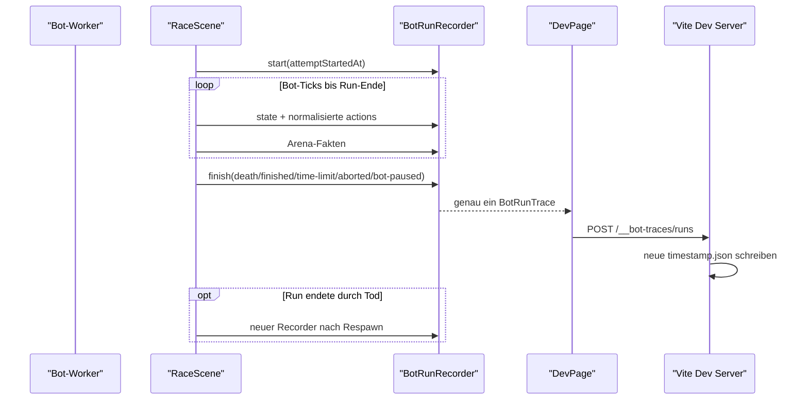

# Design: Bot-Run-Feedback

Bezug: `requirements.md` (US-1 bis US-7).

## Architektur-Überblick

Ein Run ist ein einzelner Versuch zwischen Start/Respawn und Tod, Ziel,
Zeitlimit oder Abbruch. `RaceScene` erzeugt nur im explizit aktivierten
`/dev`-Bot-Pfad einen `BotRunRecorder`. Beim Run-Ende liefert der Recorder genau
ein kompaktes JSON an `DevPage`; diese sendet genau einen POST an den lokalen
Vite-Server. Der Server legt eine neue Timestamp-Datei an. Nach einem Tod beginnt
beim Respawn ein frischer Recorder.



Fehlt `RaceSceneInitData.telemetry`, ist der gesamte Pfad ein echter No-op:
kein Recorder, keine Samples, kein `BotRunner`-Observer und kein Request.
`/present` übergibt das Flag nicht.

## Datenmodell

Neue Typen liegen in `client/src/game/trace/types.ts`:

```ts
type RunResult = "death" | "finished" | "time-limit" | "aborted" | "bot-paused";

interface BotRunTrace {
  schemaVersion: 1;
  run: {
    levelId: string;
    startedAt: string;
    endedAt: string;
    result: RunResult;
    endReason: string;
    durationMs: number;
  };
  summary: BotRunSummary;
  events: TraceEvent[];
  findings: TraceFinding[];
  windows: TraceWindow[];
}
```

Eine separate Run-ID und ein Source-Hash sind nicht nötig. Der Timestamp des
Run-Starts identifiziert den Run ausreichend; `npm run reset-bot` trennt
Besucher-Sessions, indem es alle alten Trace-Dateien löscht.

`summary` enthält Start-/Endposition, maximalen horizontalen Fortschritt,
Früchte und Fruchtpunkte dieses Versuchs, technische Fehler sowie das Ergebnis.
Bei `death` enthält es die eindeutige Ursache (`pit-fall` oder Hazard-Typ).

`events` sind beobachtete Arena-Fakten. `findings` sind heuristische Diagnosen
und referenzieren ihre Fakten/Ticks. Der Agent darf Fakten bestimmt, Findings
nur als Hinweis formulieren.

## Kompakte Tick-Samples

`compactBotTick.ts` reduziert den vollständigen `BotState` auf:

- Tick und relative Run-Zeit,
- Position, Velocity, `onGround`, Blickrichtung und Sprintstatus,
- `gapAhead`, `goalDirection`, `justRespawned`, `tookDamage`,
- `nearbyTiles`,
- sichtbare Hazards,
- höchstens drei Coins und vier Plattformen,
- normalisierte Actions und Entscheidungsstatus.

Tuning wird einmal pro Run gespeichert. Zahlen werden sinnvoll gerundet;
Phaser-Objekte, Sets, Maps, `Infinity` und `NaN` gelangen nicht ins JSON.

Der Recorder hält während dieses einen Versuchs alle reduzierten Samples. Da
ein Tod den Recorder sofort abschließt, bleiben typische Runs ohnehin kurz. Im
JSON verbleiben nur relevante Diagnosefenster.

## `BotRunRecorder`

`BotRunRecorder.ts` ist Phaser-unabhängig:

```ts
class BotRunRecorder {
  recordState(state: BotState): void;
  recordDecision(result: BotDecisionTrace): void;
  recordEvent(event: TraceEventInput): void;
  finish(result: RunResult, reason: string, final: RacerSummaryInput): BotRunTrace | null;
}
```

- `finish()` ist idempotent und liefert genau einmal ein Artefakt.
- Ein leerer Abbruch ohne Tick und technisches Ereignis liefert `null`.
- State und asynchrone Worker-Antwort werden über die Tick-ID korreliert.
- Ein Todesereignis speichert die Position vor dem Respawn.
- Nach `finish("death", ...)` erzeugt `RaceScene` für den nächsten Bot-Tick
  nach dem Respawn einen neuen Recorder mit neuem `startedAt`.

## Fakten aus `RaceScene`

`DevPage` aktiviert Telemetrie automatisch nur im Bot-Modus. Die Szene erfasst
Fakten direkt dort, wo die Arena-Regel wirkt:

| Stelle | Fakt / Run-Ende |
|---|---|
| `fireBotTick()` | State vor `decide`, später normalisierte Actions |
| Abgrundprüfung | `pit-fall`, danach `finish("death", "pit-fall")` |
| `onHazardOverlap()` | `hazard-hit` bzw. `hazard-stomped`; Treffer beendet als `death` |
| `onCoinOverlap()` | `coin-collected` |
| `onBlockCollide()` | `block-hit` |
| `onCheckpointOverlap()` | `checkpoint-reached` |
| `onGoalOverlap()` | `goal-reached`, danach `finished` |
| Zeitlimit | `time-limit` |
| Modus-/Levelwechsel, „Neu“, Shutdown | `aborted` |
| technische Runner-Pause | `bot-paused` |

Globale Racer-Zähler wie `coinsCollected` werden nicht blind als Run-Zähler
verwendet. Der Recorder merkt sich die Startwerte und bildet Deltas für genau
diesen Versuch.

## Technische Bot-Diagnose

`BotRunnerOptions` erhält einen optionalen Observer:

```ts
interface BotRunnerObserver {
  onDecision(result: BotDecisionTrace): void;
  onPaused(reason: BotRunnerPauseReasonKind, message: string | null): void;
}
```

Entscheidungsergebnisse sind `ok`, `runtime-error` oder `timeout`. Der Observer
beobachtet nur den bestehenden Pfad; er ruft `decide()` nie zusätzlich auf.
Eine Runner-Pause beendet den aktuellen Run sofort als `bot-paused`.

## Diagnose-Regeln

`analyzeBotRun.ts` enthält konservative pure Detektoren:

| Finding | Startregel |
|---|---|
| `stuck` | 3 s, weniger als 16 px X-Spanne trotz horizontaler Actions in mindestens 70 % der Samples |
| `oscillating` | mindestens 6 Richtungswechsel in 2 s bei weniger als 32 px Nettofortschritt |
| `missed-gap` | vor `pit-fall` war die Lücke mindestens 3 Ticks sichtbar, ohne rechtzeitigen wirksamen Absprung |
| `jump-cut-short` | Jump-Serie endet vor `minJumpHoldMs`, mit sichtbarem Abbruch der Aufwärtsbewegung vor dem Tod |
| `hazard-not-avoided` | aktiver/warnender Hazard war vor dem Kontakt-Tod sichtbar |

Ohne ausreichende Evidenz entsteht kein Finding. Wiederholte Tode werden nicht
browserseitig über mehrere Dateien aggregiert; der Agent kann dafür die letzten
Run-Dateien gemeinsam lesen.

## Diagnosefenster

`selectTraceWindows.ts` nimmt standardmäßig bis zu 45 Ticks vor und 10 Ticks
nach einem Ereignis. Überlappende Fenster werden vereinigt. Maximal acht Fenster
werden ausgegeben; Events selbst bleiben vollständig erhalten.

## Vite-Persistenz

`writeBotTrace.ts` sendet das fertige JSON einmal an
`POST /__bot-traces/runs`. Für Cleanup-Fälle wird `fetch` mit `keepalive`
verwendet.

`client/vite/botTracePlugin.ts`:

- akzeptiert `POST /__bot-traces/runs`,
- prüft die Grundstruktur,
- erzeugt aus `run.startedAt` einen Dateinamen wie
  `2026-08-12T14-37-21-123Z.json`,
- verwendet bei der praktisch ausgeschlossenen Kollision desselben
  Millisekunden-Zeitstempels einen numerischen Suffix,
- schreibt genau diese neue Datei und aktualisiert keine bestehende Run-Datei,
- antwortet mit 201; ungültiges JSON ergibt 400, Schreibfehler 500.

`client/src/bot/runs/` wird git-ignoriert und vom Vite-Watcher ignoriert.
`DevPage` zeigt Erfolg oder Schreibfehler knapp an.

## Reset

`scripts/reset-bot.mjs` kopiert weiterhin die Standardvorlage nach
`current-bot.js`. Zusätzlich entfernt es den Inhalt von `client/src/bot/runs/`,
falls der Ordner existiert, und lässt beziehungsweise erstellt den leeren
Ordner. Damit beginnt jeder Besucher mit Bot-Vorlage und leerer Telemetrie.

Das Löschen ist Teil des ausdrücklich ausgeführten Reset-Befehls. Es betrifft
ausschließlich JSON-/temporäre Trace-Dateien unter diesem festen Verzeichnis.

## Steering

`client/src/bot/AGENTS.md` erlaubt neben dem Bearbeiten von `current-bot.js` nur
das Lesen von `./runs/*.json`. Es dokumentiert:

- die Bedeutung von `run`, `summary`, `events`, `findings` und `windows`,
- Fakten versus abgeleitete Findings,
- dass jede Datei genau einen Versuch bis Tod/Ziel/Abbruch enthält,
- wie die neuesten Dateien gefunden werden, z. B.
  `ls -1t ./runs/*.json 2>/dev/null | head -5`,
- dass bei wiederholten Problemen mehrere der neuesten Dateien gelesen werden,
- höchstens zwei Beobachtungen, genau ein Änderungsvorschlag und Umsetzung erst
  nach Zustimmung des Besuchers.

Der erste Bot soll direkt eine vollständige einfache Grundnavigation erhalten;
die absichtlich schwache Zwischenstufe „immer rechts“ entfällt. Ein Ausbau der
Template-Utilities bleibt einem späteren Feature vorbehalten.

## Fehlerfälle

- Verspätete Worker-Antworten bleiben wie heute verworfen; der Trace zeigt den
  Timeout.
- Todesposition wird vor dem Respawn erfasst.
- Ein sofort abgebrochener leerer Run erzeugt keine Datei.
- Mehrere Abschlusswege können durch idempotentes `finish()` keine Duplikate
  erzeugen.
- Ein Trace-Schreibfehler beeinflusst das Spiel nicht.
- Außerhalb aktivierter `/dev`-Telemetrie bleibt alles No-op.

## Test-Strategie

Die Umsetzung folgt Rot–Grün–Refactor:

- `compactBotTick.test.ts`: Reduktion und JSON-Fähigkeit.
- `BotRunRecorder.test.ts`: Tick-Korrelation, ein Artefakt pro Abschluss,
  Todesposition, Run-Deltas, leerer Abbruch und idempotentes `finish()`.
- `analyzeBotRun.test.ts`: positive und negative Fälle je Finding.
- `selectTraceWindows.test.ts`: Auswahl, Vereinigung und Obergrenze.
- `BotRunner.test.ts`: Observer ohne Änderung der Actions/Timeout-Semantik.
- `botTracePlugin.test.ts`: neue Timestamp-Datei je POST, Kollisionssuffix,
  ungültiges JSON und Schreibfehler im temporären Verzeichnis.
- `reset-bot`-Test: Vorlage wird kopiert und ausschließlich Trace-Inhalte werden
  entfernt.
- `DevPage.test.tsx`: Aktivierung nur im Bot-Modus und Schreibstatus.
- Manuell: Zwei Tode erzeugen zwei Dateien; Ziel/Abbruch erzeugt je eine weitere;
  Tastaturmodus und `/present` erzeugen keine; Schreiben löst kein HMR aus.

## Auswirkungen auf bestehenden Code

Neu:

- `client/src/game/trace/types.ts`
- `client/src/game/trace/compactBotTick.ts`
- `client/src/game/trace/BotRunRecorder.ts`
- `client/src/game/trace/analyzeBotRun.ts`
- `client/src/game/trace/selectTraceWindows.ts`
- `client/src/game/trace/writeBotTrace.ts`
- zugehörige Tests
- `client/vite/botTracePlugin.ts` und Test

Geändert:

- `client/src/game/scenes/RaceScene.ts`
- `client/src/game/ArenaView.tsx`
- `client/src/pages/DevPage.tsx`
- `client/src/sandbox/BotRunner.ts`
- `client/vite.config.ts`
- `scripts/reset-bot.mjs`
- `.gitignore`
- `client/src/bot/AGENTS.md`
- `docs/04-devkcode-profil.md` und `docs/09-bot-artefakt-und-turnier.md`

Unverändert:

- Bot-API und `apiVersion: 1`,
- Physik, Wertung und Tickfrequenz,
- `current-bot.template.js`,
- `/present`, MatchRunner und Turnierprotokolle.
