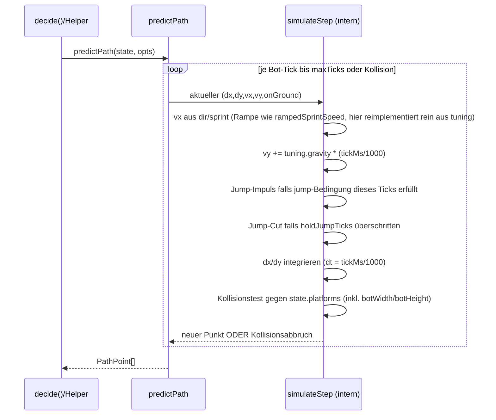

# Design: bot-toolkit

Bezug: `requirements.md` (dieses Feature). Alle US-Referenzen unten beziehen sich
darauf.

## Architektur-Überblick

Das Feature ist rein additiv auf zwei bestehenden Schichten
(`docs/03-architektur.md`):

```
RaceScene.fireBotTick()
  -> buildSnapshot()            [erweitert: platforms, hazard-Velocity]
  -> buildBotState()            [erweitert: platforms, tuning, sprintRampProgress]
       -> BotState (Contract)   [erweitert: @arena/bot-contract]
  -> BotController.getNextActions()
  -> BotRunner.tick()  -> Worker -> decide(state)
```

Neu, parallel dazu, **ohne** Berührung der Sandbox-Kette:

```
current-bot.template.js
  export default { apiVersion: 1, decide }   <- unverändert vom Worker gelesen
  export function predictPath(...)           <- NEU, named export, direkt in
  export function calcLandingCoords(...)        derselben Datei implementiert;
  ... (weitere Helfer aus US-4..US-8)            devkcode darf sie beliebig
                                                  lesen/anpassen/erweitern
```

Der Worker importiert nur `mod.default` (`botWorker.ts:24-31`); named exports
sind für Guard/Validierung/Runtime unsichtbar. Es gibt daher **keine** Änderung
an `botWorker.ts`, `BotRunner.ts`, `staticGuard.ts`, `workerLike.ts`. Die
Helfer sind reine, direkt in `current-bot.template.js` geschriebene
Funktionen – kein separates Modul, kein Re-Export, kein Build-/Sync-Schritt.
Vitest importiert die `.js`-Datei zum Testen ganz normal per ESM-Import (das
ist unabhängig vom Worker/der Sandbox, die nur zur Laufzeit im Spiel greift);
`current-bot.template.test.ts` tut das bereits für den Static-Guard-Test.

Zwei neue reine Module entstehen für die State-Seite:

```
client/src/game/state/
  visiblePlatforms.ts   NEU – US-2: WorldSnapshot-Plattformen -> VisiblePlatform[]
  hazardVelocity.ts     NEU – US-7: Vortick-Position -> vx/vy je Hazard-id
```

## Schnittstellen & Datenmodelle

### US-1: `MOVEMENT_TUNING.GRAVITY_Y`

`client/src/game/movement/movement.ts`:
```ts
export const MOVEMENT_TUNING = {
  ...
  GRAVITY_Y: 900,
} as const;
```
`client/src/game/ArenaView.tsx:85` ersetzt das Literal:
```ts
arcade: { gravity: { x: 0, y: MOVEMENT_TUNING.GRAVITY_Y }, debug: true }
```

### US-2: `VisiblePlatform` (Contract-Erweiterung)

`packages/bot-contract/src/state.ts`:
```ts
export type PlatformKind = "ground" | "float" | "ceiling" | "block";

export interface VisiblePlatform {
  dx: number;     // linke obere Ecke relativ zum Bot, Pixel
  dy: number;     // linke obere Ecke relativ zum Bot, Pixel
  width: number;  // Pixel
  height: number; // Pixel
  kind: PlatformKind;
}

export interface BotState {
  // ... bestehende Felder unverändert ...
  platforms: VisiblePlatform[];   // NEU
  tuning: BotTuning;               // NEU (siehe US-3)
  sprintRampProgress: number;      // NEU (siehe US-3)
}
```

Zwei Geometrie-Quellen fließen in `platforms`, mit unterschiedlicher Höhenableitung:

1. **`level.platforms` (`PlatformDef`)**: `x`/`y` sind Tile-Koordinaten-Basis,
   `y` ist laut `isSolidAt` (`tiles.ts:78-88`) eine **Zeilen-Referenz**
   (`tileSizeToRow(platform.y) === row`). Die tatsächliche solide Fläche ist
   also die volle Tile-Zeile `[floor(y/16)*16, floor(y/16)*16 + 16)`.
   `height` wird für `kind: "ground"` bewusst **nicht** bis `worldHeight`
   ausgedehnt (das würde `calcLandingCoords` für tiefliegende Abfragen
   verlangsamen, ohne einen Anwendungsfall zu bedienen) – Requirements verlangen
   nur die für Trajektorien relevante oberste Kollisionszeile. Dieselbe
   Vereinfachung nutzt bereits `isSolidAt` implizit.
   → `{ dx: x*16 - botX, dy: floor(y*16/16)*16 - botY, width: tilesWide*16,
      height: 16, kind }` (mit `x`/`y` hier als Tile-Indizes wie in `PlatformDef`
      dokumentiert – siehe `tileSizeToCol`/`tileSizeToRow` für die exakte
      Pixel-Umrechnung, die `visiblePlatforms.ts` wiederverwendet statt
      dupliziert).
2. **`level.hiddenCoinBlocks` (ungelöst)**: Body-Größe kommt aus dem
   tatsächlichen Collider (`worldBuilder.ts:234-237`: `28 * scale` ×
   `24 * scale`, `scale = spriteScale(STATIC_IMAGE_KEYS.BLOCK_IDLE) = 1.2`
   → effektiv `33.6 × 28.8` px, zentriert auf `(x, y)` via `resyncStaticBody`).
   → `{ dx: x - 16.8 - botX, dy: y - 14.4 - botY, width: 33.6, height: 28.8,
      kind: "block" }`. Der exakte Skalierungsfaktor wird **nicht** hart
      codiert, sondern aus `spriteScale(STATIC_IMAGE_KEYS.BLOCK_IDLE)` gelesen
      (Single Source of Truth, überlebt Asset-Änderungen).

Sichtbarkeits-/Schnitttest (US-2, Kriterium "vollständig, nicht abgeschnitten"):
Ein Rechteck ist sichtbar, wenn es den Kreis mit `VIEW_RADIUS_PX` um den Bot
schneidet (nicht: sein Mittelpunkt liegt darin). Einfachster korrekter Test:
kürzeste Distanz vom Kreismittelpunkt zum Rechteck ≤ Radius (Clamp-Punkt-Methode).
Kein Sqrt nötig (quadrierter Vergleich wie `withinViewRadius`).

```ts
// visiblePlatforms.ts
function rectIntersectsCircle(rect, cx, cy, radiusSq): boolean {
  const closestX = clamp(cx, rect.x, rect.x + rect.width);
  const closestY = clamp(cy, rect.y, rect.y + rect.height);
  const dx = cx - closestX, dy = cy - closestY;
  return dx * dx + dy * dy <= radiusSq;
}
```

`buildBotState` reicht `snapshot.level.platforms` und
`snapshot.level.hiddenCoinBlocks` (gefiltert um `dynamic.resolvedBlockIds`)
an `buildVisiblePlatforms(level, dynamic, racer.x, racer.y)` weiter, analog zum
bestehenden `toVisibleList`-Muster – aber als eigene Funktion, weil das
Rechteck-Sichtbarkeitskriterium sich von der Punkt-Distanz-Sortierung der
bestehenden `toVisibleList` unterscheidet (kein sinnvolles "dx/dy" auf
Rechteck-Ebene, keine Sortierung nach Zentrum nötig – Reihenfolge ist für
Geometrie-Helfer irrelevant).

### US-3: `BotTuning`

```ts
// packages/bot-contract/src/state.ts
export interface BotTuning {
  gravity: number;
  tileSize: number;
  tickMs: number;
  baseMoveSpeed: number;
  sprintMoveSpeed: number;
  sprintRampMs: number;
  baseJumpVelocity: number;
  sprintJumpVelocity: number;
  minJumpHoldMs: number;
  botWidth: number;
  botHeight: number;
}
```
`botStateBuilder.ts` baut dieses Objekt aus `MOVEMENT_TUNING`, `TILE_SIZE` (aus
`tiles.ts:12`), `BOT_TICK_INTERVAL_MS` (aus `RaceScene.ts:62`, muss dafür
exportiert werden) und den Konstanten `24`/`32` (Bot-Body-Größe,
`RaceScene.ts:200` – wird als benannte Konstante `PLAYER_BODY_SIZE = { width:
24, height: 32 }` neben `MOVEMENT_TUNING` in `movement.ts` gepflegt, damit
`RaceScene.ts:200` und `state.tuning` dieselbe Quelle referenzieren statt zwei
Literale zu duplizieren).

`sprintRampProgress`: `botStateBuilder.ts` erhält zusätzlich `sprintHoldMs` als
neues Feld in `BotStateExtras` (`RaceScene.ts` liefert `this.sprintHoldMs`,
das dort bereits existiert, siehe `RaceScene.ts:479-482`) und berechnet
`clamp(sprintHoldMs / MOVEMENT_TUNING.SPRINT_RAMP_MS, 0, 1)`.

### US-4–US-8: Funktionssignaturen (in `current-bot.template.js`)

```ts
export interface PathOptions {
  dir?: -1 | 0 | 1;          // horizontale Absicht; default: aus state.velocity abgeleitet
  sprint?: boolean;
  jump?: boolean;            // jump im ersten Simulationsschritt auslösen (nur falls onGround)
  holdJumpTicks?: number;    // wie viele Bot-Ticks lang "jump" weiter gehalten wird
  maxTicks?: number;         // Simulationshorizont in Bot-Ticks; default 40 (~1.3s bei 33ms)
}

export interface PathPoint { dx: number; dy: number; vx: number; vy: number; ticks: number }

export function predictPath(state: BotState, opts?: PathOptions): PathPoint[];

export type LandingKind = "ground" | "ceiling" | "none";
export interface LandingResult { dx: number; dy: number; ticks: number; kind: LandingKind }

export function calcLandingCoords(state: BotState, opts?: PathOptions): LandingResult;
export function simulateJump(state: BotState, holdTicks: number): LandingResult;
export function apex(state: BotState, opts?: PathOptions): { dx: number; dy: number; ticks: number };
export function minJumpHoldToReach(state: BotState, dx: number, dy: number): number | null;
export function ticksUntilEdge(state: BotState): number | null;

export function surfaceAt(state: BotState, dx: number): number | null;
export function wallAhead(state: BotState): { distance: number; height: number } | null;

export function predictHazard(
  state: BotState, hazard: VisibleHazard, ticks: number
): { dx: number; dy: number; active: boolean };
export function pathIntersectsHazard(
  state: BotState, path: PathPoint[], hazard: VisibleHazard
): boolean;

export function moveToward(dx: number, sprint?: boolean): Action;
export function createJumpHold(): { tick(wantJump: boolean, targetHoldTicks: number): boolean };
export function pathHits(path: PathPoint[], dx: number, dy: number, radius: number): boolean;
```

Alle Funktionen sind **pure** (kein Zugriff auf Closures/Zeit außerhalb der
Argumente) mit Ausnahme von `createJumpHold`, das bewusst einen
gekapselten Zähler zurückgibt (Vorbild: `AGENTS.md`s bereits empfohlenes
Closure-Pattern für `jumpTicks`).

## Ablauf / Sequenz

### `predictPath` – Simulationsschleife (US-4)



Wichtig – Integrationsschrittweite: Es wird **in `tuning.tickMs`-Schritten**
simuliert (nicht in kleineren Physik-Substeps), weil das dem tatsächlichen
Bot-Beobachtungsraster entspricht (jeder `PathPoint` korrespondiert zu einem
künftigen `decide`-Aufruf) und weil Phasers Arcade-Physik selbst mit
variablem Frame-`delta` integriert – ein exakteres Nachbilden wäre eine
Illusion von Präzision. Die Toleranz aus US-4 (letztes Kriterium) fängt die
verbleibende Abweichung aus Alias-Effekten ab.

Kollisionsauflösung: Für jeden Schritt wird die Bounding-Box des Bots
(`dx - botWidth/2 .. dx + botWidth/2`, `dy - botHeight .. dy`, da `position`
laut `botStateBuilder.ts:55` `racer.x/racer.y` ist und Sprites in `RaceScene`
mit zentriertem Origin unten auf dem Boden stehen – verifiziert gegen
`RaceScene.ts:189` `physics.add.sprite(racer.x, racer.y, ...)` mit
Standard-Phaser-Origin `0.5/1` für Boden-Charaktere; falls Origin abweicht,
wird das im ersten Implementierungsschritt gegen echte `RaceScene`-Werte
gegengetestet, siehe Test-Strategie) gegen jedes `VisiblePlatform`-Rechteck in
`state.platforms` getestet (AABB-Überlappung). Bei Überlappung: Schritt wird
verworfen, letzter gültiger Punkt + Kollisionsflag (`kind: "ground"` wenn von
oben gelandet, `"ceiling"` wenn von unten gegen eine Decke/einen Block
gestoßen) wird zurückgegeben.

### `calcLandingCoords` ohne `opts` (US-5)

„Wenn ich jetzt nichts mehr verändere" wird **nicht** als `dir: 0` übersetzt
(das würde `vx` sofort kappen, siehe Physik-Fakten in `requirements.md`),
sondern als Fortschreibung der aktuellen `state.velocity`/`state.facing`:
```ts
const inferredDir = state.velocity.vx === 0 ? 0
  : state.velocity.vx > 0 ? 1 : -1;
```
Das bildet exakt die reale Situation nach: Der letzte an `RaceScene`
übergebene Bot-Tick hat eine Aktion gesetzt, die bereits in `state.velocity`
sichtbar ist; ohne neue Aktion bleibt genau diese Velocity (bis zur nächsten
`applyMovement`) bestehen. `jump`/`onGround` werden ebenfalls 1:1 aus `state`
übernommen.

### `minJumpHoldToReach` (US-5)

Iteriert `holdTicks` von `1` bis zu einer oberen Schranke (abgeleitet aus
`ceil(SPRINT_RAMP_MS-unabhängiger maximaler Steigzeit / tickMs)`, siehe
`design.md`-Implementierungsnotiz: `MIN_JUMP_HOLD_MS` ist die *Mindest*-Haltezeit,
die *maximale* sinnvolle Haltezeit ist die Zeit bis `vy` durch Gravitation
wieder 0 erreicht, ausgehend vom stärksten Sprungimpuls: `maxHoldTicks =
ceil((-sprintJumpVelocity / gravity) / (tickMs/1000) / tickMs)` grob gerundet
auf ganze Ticks, in der Implementierung exakt als Obergrenze der Schleife
berechnet), ruft für jeden Wert `simulateJump` auf und prüft, ob `(dx, dy)`
innerhalb einer Toleranz von der Bahn erreicht/überflogen wird (`pathHits`
mit kleinem Radius). Erste passende `holdTicks` wird zurückgegeben; keine
Trefferliefert `null`.

### Hazard-Velocity (US-7)

`RaceScene.buildSnapshot()` hält bereits pro Tick die aufgelösten
Hazard-Weltpositionen (`RaceScene.ts:385-403`). Neu:
`client/src/game/state/hazardVelocity.ts` bekommt die **vorherigen**
Positionen (Map `id -> {x, y}`, in `RaceScene` als neues privates Feld
`this.previousHazardPositions` gehalten) und die aktuellen, und berechnet
`vx = (curX - prevX) / (deltaMs/1000)`, `vy` analog. `RaceScene` aktualisiert
die Map am Ende jedes `fireBotTick()`-Aufrufs. Für den allerersten Tick eines
Hazards ist `vx = vy = 0` (kein Vorwert vorhanden) – das ist unkritisch, da
`justRespawned`-artige Edge-Cases hier keine Rolle spielen (Hazards existieren
ab Level-Start durchgehend).

Alternative wäre eine analytische Ableitung pro `kind` (z.B. `patrolX`-Ableitung
für Patrol-Hazards). Verworfen: das würde `kind`-Fallunterscheidungen zurück
in den State-Bau bringen, obwohl `docs/08` die Open/Closed-Registry-Architektur
gerade dafür eingeführt hat, dass die Szene keine `kind`-Spezialfälle kennen
muss. Die finite Differenz ist generisch für jeden aktuellen und jeden künftig
hinzugefügten Hazard-Typ korrekt (bis auf Sprungstellen bei diskreten
Zustandswechseln wie Spikehead-Phasenübergängen, was für eine kurzfristige
Vorhersage über wenige Ticks tolerierbar ist).

## Template-Strategie (US-9)

Denkfehler in einer früheren Version dieses Designs korrigiert: Es gibt
**keinen** Guard-Konflikt. `checkStaticGuard` (`staticGuard.ts:24-32`) verbietet
nur die Wörter `import`, `require(`, `fetch(`, `window.`, `document.`, `eval(`,
`XMLHttpRequest` – ein `export function foo() {}` enthält keins davon und ist
bereits heute völlig unproblematisch (das bestehende `export default { … }`
im Template belegt das).

Die Umsetzung ist deshalb denkbar einfach:

- Die Helferfunktionen (US-4 bis US-8) werden als normale Top-Level-Funktionen
  **direkt in `client/src/bot/current-bot.template.js`** geschrieben, neben
  dem `export default { apiVersion: 1, decide }`. Kein separates Modul, kein
  Re-Export, kein Sync-Skript.
- `npm run reset-bot` kopiert die Datei weiterhin 1:1 zu `current-bot.js`
  (`scripts/reset-bot.mjs`, unverändert). devkcode bearbeitet danach
  ausschließlich `current-bot.js` und darf die Helfer dort **frei lesen,
  anpassen oder ersetzen** – sie sind Startcode, keine geschützte Bibliothek.
- Ob die Funktionen `export function` oder schlicht `function` sind, ist für
  den Worker irrelevant (er importiert ohnehin nur `mod.default`,
  `botWorker.ts:24-31`). `export function` wird trotzdem gewählt, weil das
  US-9-Testkriterium eine begleitende Testdatei verlangt, die die Funktionen
  aus der Template-Datei importiert (siehe Test-Strategie) – dafür müssen sie
  exportiert sein.
- Damit entfällt die zuvor geplante Datei `client/src/bot/botToolkit.ts` sowie
  das Skript `scripts/sync-bot-template.mjs` vollständig aus diesem Feature.

## Fehlerbehandlung & Edge Cases

- **`predictPath` ohne Plattformen in Sicht**: liefert die volle
  Free-Fall-Bahn bis `maxTicks`, `kind: "none"` in `calcLandingCoords`.
- **Bot bereits in einer Kollision** (sollte nicht vorkommen, aber defensiv):
  erster Simulationsschritt bricht sofort ab, `ticks: 0`.
- **`minJumpHoldToReach` mit `dx/dy` hinter einer Wand**: `wallAhead`-Check
  läuft NICHT automatisch in `minJumpHoldToReach` mit (das ist ein separater
  Helfer, US-6) – die Funktion meldet ggf. `null`, weil keine simulierte Bahn
  den Zielpunkt erreicht (implizit korrekt, kein Sonderfall nötig).
- **Hazard ohne Vorwert (erster Tick)**: `vx = vy = 0` (siehe oben), keine
  Exception.
- **`platforms` mit `width <= 0` oder `height <= 0`** (defensiv gegen
  fehlerhafte Level-Daten): werden beim Bau übersprungen (kein Crash).
- **5-ms-Budget**: `predictPath` mit `maxTicks = 40` und `state.platforms`
  typischerweise 5–15 Einträgen ist deutlich unter dem Budget (siehe
  Test-Strategie, Performance-Test als Regressionsschutz).

## Test-Strategie

| Ebene | Was |
|---|---|
| `movement.test.ts` | `MOVEMENT_TUNING.GRAVITY_Y === 900`, `ArenaView` nutzt die Konstante (Snapshot/Config-Test) |
| `visiblePlatforms.test.ts` (neu) | Rechteck-Sichtbarkeit (Kreis-Schnitt inkl. Randfälle), `kind`-Zuordnung, `resolvedBlockIds`-Filterung, keine Abschneidung großer Plattformen |
| `botStateBuilder.test.ts` (erweitert) | `platforms`, `tuning`, `sprintRampProgress`, `hazards[].vx/vy` im gebauten State |
| `hazardVelocity.test.ts` (neu) | finite Differenz korrekt, erster Tick = 0 |
| `current-bot.template.helpers.test.ts` (neu, Kernstück) | importiert die named exports direkt aus `current-bot.template.js`; `predictPath` unit-getestet in Isolation (feste `state`-Fixtures) UND **Referenztest**: dieselbe Aktionsfolge gegen eine minimale `RaceScene`-Testharness gefahren, Vergleich der `dx/dy` nach N Ticks mit Toleranz (siehe Requirements, offene Frage zur Toleranz – Zielwert wird beim ersten Implementierungsschritt anhand des ersten Testlaufs kalibriert und hier nachgetragen) |
| `current-bot.template.helpers.test.ts` | `calcLandingCoords`, `simulateJump`, `apex`, `minJumpHoldToReach`, `ticksUntilEdge`, `surfaceAt`, `wallAhead`, `predictHazard`, `pathIntersectsHazard`, `moveToward`, `createJumpHold`, `pathHits` – je Funktion Normalfall + mind. 1 Edge Case aus obiger Tabelle |
| `current-bot.template.helpers.test.ts` | `predictPath` mit realistischem Level-Ausschnitt bleibt in einer harten Zeitschranke (z.B. < 2ms im Testlauf, großzügig unter dem 5ms-Produktionsbudget) |
| `current-bot.template.test.ts` (bestehend) | weiterhin: Template besteht `checkStaticGuard` – MUSS grün bleiben, da jetzt mehr Code in der Datei liegt |

TDD-Reihenfolge folgt den Tasks (siehe `tasks.md`), beginnend mit US-1
(kleinster, risikoärmster roter Test) und endend mit US-9/US-10.

## Auswirkungen auf bestehenden Code

| Datei | Änderung |
|---|---|
| `client/src/game/movement/movement.ts` | + `GRAVITY_Y`, + `PLAYER_BODY_SIZE` |
| `client/src/game/ArenaView.tsx` | Gravity-Literal → Konstante |
| `client/src/game/scenes/RaceScene.ts` | `BOT_TICK_INTERVAL_MS` exportieren; `previousHazardPositions`-Feld; `sprintHoldMs` in `BotStateExtras` durchreichen; Body-Größe referenziert `PLAYER_BODY_SIZE` statt Literal `24, 32` |
| `packages/bot-contract/src/state.ts` | + `VisiblePlatform`, `PlatformKind`, `BotTuning`, State-Felder `platforms`/`tuning`/`sprintRampProgress`, `VisibleHazard += vx/vy`; Korrektur des `stompable`-Kommentars (US-10) |
| `client/src/game/state/visiblePlatforms.ts` | NEU |
| `client/src/game/state/hazardVelocity.ts` | NEU |
| `client/src/game/state/botStateBuilder.ts` | Zusammenbau der neuen Felder |
| `client/src/game/state/worldSnapshot.ts` | ggf. Erweiterung um vorherige Hazard-Positionen, falls nicht direkt in `RaceScene` gehalten (Design-Entscheidung fällt in Task-Umsetzung anhand bestehendem Muster) |
| `client/src/bot/current-bot.template.js` | + Referenz-Index (Kommentar), + alle Helferfunktionen (US-4..US-8) als `export function` direkt in der Datei |
| `client/src/bot/current-bot.template.helpers.test.ts` | NEU – importiert und testet die Helferfunktionen aus der Template-Datei |
| `docs/02-bot-api.md`, `docs/08-hazards-und-utilities.md`, `client/src/bot/AGENTS.md` | Doku-Nachzug (US-10) |

Keine Änderung an: `botModule.ts`, `botWorker.ts`, `BotRunner.ts`,
`staticGuard.ts`, `workerLike.ts`, `BotController.ts`.
