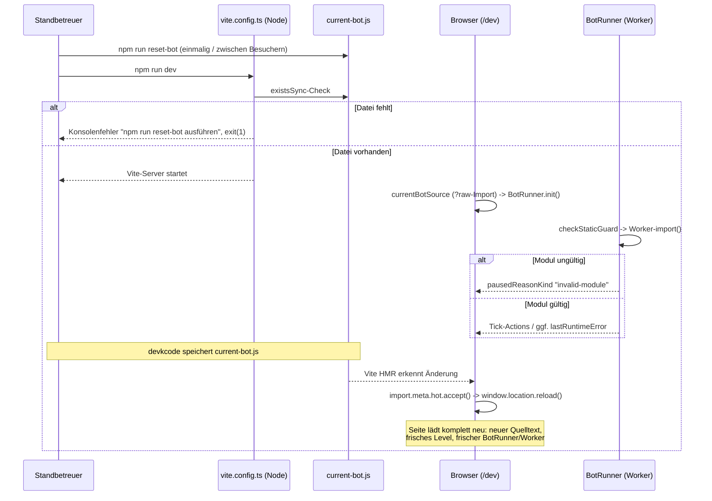

# Design: Dev-Station-Modus

Bezug: `requirements.md` (US-1 bis US-5).

## Architektur-Überblick

Betrifft ausschließlich `client/` (App-Shell `/dev`) sowie Root-Skripte;
`server/` bleibt unverändert (wird nur umbenannt aufgerufen). `/admin` und
`/present` werden von diesem Feature nicht angefasst.

```
Repo-Root
├─ package.json          scripts: dev | present | reset-bot   (geändert)
├─ scripts/
│  └─ reset-bot.mjs                                             (neu)
├─ client/
│  ├─ vite.config.ts      Existenz-Guard für current-bot.js      (geändert)
│  ├─ .gitignore-Eintrag  client/src/bot/current-bot.js          (geändert)
│  └─ src/
│     ├─ bot/
│     │  ├─ current-bot.template.js   (neu, eingecheckt)
│     │  ├─ current-bot.js            (neu, git-ignoriert)
│     │  └─ currentBotSource.ts       (neu, ?raw-Import + Reload-on-Change)
│     ├─ pages/DevPage.tsx                                      (geändert)
│     ├─ game/control/useArenaControls.ts                       (geändert)
│     ├─ game/control/exampleBots.ts                            (gelöscht)
│     ├─ sandbox/workerLike.ts                                  (geändert)
│     ├─ sandbox/botWorker.ts                                   (geändert)
│     └─ sandbox/BotRunner.ts                                   (geändert)
├─ examples/bots/                                                (gelöscht)
└─ client/public/example-bots/                                   (gelöscht)
```

## 1. Startbefehle (US-1)

**`package.json` (root):**
```json
"scripts": {
  "dev": "npm run dev -w @arena/client",
  "present": "npm run dev -w @arena/server",
  "reset-bot": "node scripts/reset-bot.mjs",
  ...
}
```
`@arena/client`s eigenes `dev`-Script ist bereits reines `vite` – keine
Änderung dort nötig. `@arena/server`s `dev`-Script bleibt unverändert (nur der
Aufrufname auf Root-Ebene ändert sich von `dev` zu `present`).

**`scripts/reset-bot.mjs`** (Node, keine neue Abhängigkeit, ESM, `fs`):
```js
import { copyFileSync } from "node:fs";
import { fileURLToPath } from "node:url";
import { dirname, join } from "node:path";

const here = dirname(fileURLToPath(import.meta.url));
const botDir = join(here, "../client/src/bot");
copyFileSync(join(botDir, "current-bot.template.js"), join(botDir, "current-bot.js"));
console.log("current-bot.js wurde aus current-bot.template.js zurückgesetzt.");
```
`copyFileSync` legt die Zieldatei an, falls sie fehlt, und überschreibt sie
sonst – deckt US-3 (Erzeugen **und** Zurücksetzen) mit derselben Codezeile ab.
Bewusst **ein** Skript für beide Fälle (kein zweites "ensure-exists"-Skript –
siehe Abschnitt 2, der Existenz-Fall wird an anderer Stelle behandelt, nicht
durch ein zweites, fast identisches Node-Skript. DRY).

**`.gitignore`:** Eintrag `client/src/bot/current-bot.js` ergänzen.

## 2. Bot-Artefakt-Datei, Laden & Reload-on-Change (US-2)

### `current-bot.template.js`

Enthält das dokumentierte Standard-Modul (Kommentare = lebende API-Referenz,
ersetzt die entfernte `examples/bots/README.md` als Kurzreferenz direkt in der
Datei, die devkcode bearbeitet):

```js
/**
 * Dein Bot – wird einmal pro Simulations-Tick (~150ms) aufgerufen und muss
 * synchron eine Action zurückgeben: "left" | "right" | "jump" | "idle".
 *
 * state enthält u.a.:
 *   position, facing, onGround, isAlive
 *   nearbyTiles        - Sichtfeld-Raster um den Bot
 *   nearestCoin        - { dx, dy, value } | null
 *   nearestHazard      - { dx, dy, kind, active } | null
 *   nearestUtility     - { dx, dy, kind } | null
 *   goalDirection      - { dx, dy }
 *   coinsCollected, livesRemaining, timeElapsedMs
 *
 * Dein Bot läuft isoliert in einem Web Worker: keine Modul-Importe, keine
 * Netzwerk- oder Browser-Zugriffe möglich (das ist bereits durch die
 * Sandbox sichergestellt, du musst dich darum nicht kümmern).
 */
export default {
  apiVersion: 1,
  decide(state) {
    return "idle";
  },
};
```

### Existenz-Guard statt Browser-seitiger Fehlerbehandlung

Ein **statischer** `?raw`-Import ist die einzige Vite-idiomatische Art, HMR für
importierten Rohtext zu bekommen (`import.meta.hot.accept()` setzt einen
statisch auflösbaren Import voraus). Ein statischer Import einer fehlenden
Datei lässt sich im Browser aber nicht catchen (Vite bricht den Modul-Graph
beim Transform ab) – ein dynamischer Import mit künstlichem Cache-Busting wäre
nötig, um das abzufangen, und würde echtes HMR wieder zunichtemachen (siehe
Verwerfung unten). Deshalb: **Vorbedingung statt Fehlerbehandlung** – ein
synchroner Existenz-Check direkt in `client/vite.config.ts` (Node-Kontext,
läuft identisch für `vite` **und** `vite build`, da beide dieselbe Config
laden):

```ts
// client/vite.config.ts
import { existsSync } from "node:fs";
import { fileURLToPath } from "node:url";
import react from "@vitejs/plugin-react";
import { defineConfig } from "vite";

const botFile = fileURLToPath(new URL("./src/bot/current-bot.js", import.meta.url));

if (!existsSync(botFile)) {
  console.error(
    "\n❌ client/src/bot/current-bot.js fehlt.\n" +
      "   Bitte im Repo-Root einmalig ausführen: npm run reset-bot\n"
  );
  process.exit(1);
}

export default defineConfig({
  plugins: [react()],
  build: { outDir: "dist" },
});
```

**Warum das robust und ausreichend ist (kein zusätzlicher Mechanismus nötig):**
- Deckt `npm run dev` **und** `npm run build` mit einem einzigen Guard ab
  (beide laden `vite.config.ts`).
- `client/vitest.config.ts` ist eine **komplett eigenständige** Config (kein
  Import/Merge von `vite.config.ts`, verifiziert) – `npm test` lädt diesen
  Guard also gar nicht und ist von der Existenz der Datei unabhängig. Das ist
  auch inhaltlich richtig so: kein Test importiert `currentBotSource.ts`
  direkt (siehe Test-Strategie unten), daher bräuchte `npm test` die reale
  Datei ohnehin nie.
- Kein Auto-Erzeugen (respektiert die getroffene Entscheidung "manuell
  `reset-bot` ausführen"), aber eine klare, auf `reset-bot` verweisende
  Meldung statt einer kryptischen Vite-Fehlerseite – erfüllt US-2 exakt, ohne
  Browser-seitigen Sonderfall/State (`DevPage` muss "Datei fehlt" nicht mehr
  selbst behandeln, da zur Laufzeit im Browser die Datei durch den Guard
  garantiert existiert).

### `client/src/bot/currentBotSource.ts` – Vite-Glue (nicht unit-getestet)

Bewusste Design-Entscheidung (nach Rückfrage im Chat): **jede** Änderung an
`current-bot.js` löst einen **vollständigen Seiten-Reload** aus – kein
partielles Hot-Swapping des Quelltext-Strings. Das ist einfacher zu verstehen
und zu verifizieren als partielles Modul-Hot-Swapping (keine Frage mehr, "ist
wirklich *alles* frisch – Racer-Position, Coins, BotRunner, Worker?"), robuster
(kein Risiko von Restzustand aus dem alten Lauf) und explizit statt implizit
von Vites Default-Propagationsverhalten abhängig:

```ts
/**
 * Bot-Quelltext als Rohstring (Vite-`?raw`-Import). Bewusst nicht
 * unit-getestet: `?raw`-Import + `import.meta.hot` sind laufzeit-/
 * Vite-spezifisch (analog zu sandbox/botWorker.ts), manuell verifiziert
 * (siehe Test-Strategie).
 *
 * Jede Änderung an current-bot.js löst einen vollständigen Seiten-Reload
 * aus (statt partiellem Hot-Swap) - dadurch starten Level, Racer-State und
 * BotRunner/Worker garantiert komplett frisch, ohne Sonderfall-Logik in
 * ArenaView/RaceScene.
 */
import currentBotSource from "./current-bot.js?raw";

if (import.meta.hot) {
  import.meta.hot.accept(() => {
    window.location.reload();
  });
}

export { currentBotSource };
```

`import.meta.hot.accept(callback)` ist Vites offizielle, dokumentierte API,
um selbst zu bestimmen, was bei einer Änderung dieses Moduls passiert – ein
expliziter `window.location.reload()` im Callback ist kein Hack, sondern
macht die gewünschte Semantik ("jede Bot-Code-Änderung → kompletter Neustart")
lesbar im Code sichtbar, statt sich auf Vites implizite
Fallback-Propagation durch mehrere Zwischenmodule zu verlassen.

`DevPage.tsx` importiert `currentBotSource` direkt (keine React-Hook-Ebene
nötig: der Wert ändert sich zur Laufzeit nie ohne einen vollständigen
Reload, der ohnehin alle Module frisch auswertet) und reicht ihn wie bisher
als `botSourceCode` an `ArenaView` – unveränderter Pfad in die bestehende
Sandbox (`BotRunner.init(sourceCode)` → Static Guard → Worker-`import()`).
Der bestehende "Neu starten"-Button bleibt für einen Test-Neustart **ohne**
Code-Änderung sinnvoll (z.B. nach einem Fehlversuch erneut ausprobieren).

## 3. Sichtbare Diagnose (US-4)

Heutiger Stand: `BotRunner.status`/`pausedReason` deckt bereits **Guard-
Ablehnung** und **harten Kill nach zu vielen Fehlversuchen in Folge** ab. Drei
Lücken bleiben:

1. Ein **ungültiges Modul** (fehlendes `decide`, falsche `apiVersion`) führt
   aktuell zu **stillem** `decide = null` im Worker – jeder Tick liefert
   klaglos `"idle"`, ohne dass der Host das je erfährt.
2. Ein **Laufzeitfehler** in `decide()` wird vom Worker zwar als
   `{type:"error", message}` gemeldet, aber `BotRunner` verwirft die
   `message` bisher komplett (nur `registerFailure()` + `"idle"`).
3. Die **Art** der Pausierung (Guard/ungültiges Modul/zu viele Fehlversuche/
   `dispose()`) ist nur als freier Text (`pausedReason`) verfügbar – für eine
   robuste UI-Verzweigung braucht es einen strukturierten, typsicheren Wert
   statt Teilstring-Vergleichen auf dem Anzeigetext (Clean-Code-Anforderung).

### Protokoll-Erweiterung (`workerLike.ts`)

```ts
export type WorkerToHostMessage =
  | { type: "action"; tick: number; action: Action }
  | { type: "error"; tick: number; message: string }
  | { type: "module-invalid"; reason: string };   // NEU, kein tick-Bezug
```

### `botWorker.ts`

`handleInit` sendet nach fehlgeschlagener `validateBotModule`-Prüfung **oder**
einem Fehler beim `import(blobUrl)` selbst (z.B. Syntaxfehler in der Datei)
eine `module-invalid`-Nachricht:

```ts
async function handleInit(code: string): Promise<void> {
  const blobUrl = URL.createObjectURL(new Blob([code], { type: "text/javascript" }));
  try {
    const mod: { default: unknown } = await import(/* @vite-ignore */ blobUrl);
    const validation = validateBotModule(mod.default);
    if (!validation.valid) {
      decide = null;
      self.postMessage({ type: "module-invalid", reason: validation.reason });
      return;
    }
    decide = validation.module.decide;
  } catch (err) {
    decide = null;
    self.postMessage({ type: "module-invalid", reason: String(err) });
  } finally {
    URL.revokeObjectURL(blobUrl);
  }
}
```

### `BotRunner.ts`

**Strukturierter Pause-Grund** (löst das Teilstring-Matching-Problem):

```ts
export type BotRunnerPauseReasonKind =
  | "guard-rejected"
  | "invalid-module"
  | "too-many-failures"
  | "disposed";
```
- `pause(kind, reason)` (bisher `pause(reason)`) setzt beides; `pausedReason`
  (freier Text, unverändert für bestehende Konsumenten wie `RaceScene`)
  bleibt zusätzlich erhalten. Neuer Getter `pausedReasonKind`.
- Aufrufstellen: Guard-Ablehnung → `"guard-rejected"`; `module-invalid`-
  Nachricht → `"invalid-module"`; Kill-Schwelle erreicht →
  `"too-many-failures"`; `dispose()` → `"disposed"`.

**`module-invalid`-Handling** in `handleWorkerMessage`: wird **vor** der
bestehenden `pendingTick`/`tick`-Korrelationsprüfung behandelt (die Nachricht
hat keinen `tick`):
```ts
if (message.type === "module-invalid") {
  this.pause("invalid-module", `ungültiges Bot-Modul: ${message.reason}`);
  return;
}
```

**Laufender Fehlerzustand** (Bot läuft, wirft aber gelegentlich Fehler – kein
Pause-Fall): neuer Getter `lastRuntimeError: string | null` +
`consecutiveFailureCount: number` (liest das bereits intern geführte
`this.consecutiveFailures` – erlaubt der UI eine frühzeitige Warnung *"3 von
10 Fehlversuchen in Folge"*, bevor der harte Kill greift; bewusste, minimale
Erweiterung über den wörtlichen Requirements-Text hinaus, dient aber direkt
dem Ziel von US-4, Probleme *früh* sichtbar zu machen).

**DRY-Fix Erfolgspfad:** neue private Methode `registerSuccess()` setzt
`consecutiveFailures = 0` **und** `lastRuntimeError = null` gemeinsam (statt
beides an verschiedenen Stellen einzeln zurückzusetzen), aufgerufen im
bisherigen "gültige Action empfangen"-Zweig.

**`registerFailure()`** wird um das Setzen von `lastRuntimeError` ergänzt, wenn
die Ursache eine `error`-Nachricht war (Timeout/ungültige Action haben keinen
Fehlertext, dort bleibt `lastRuntimeError` unverändert – nur eine echte
`decide()`-Exception liefert einen Text).

### `DevPage.tsx` – Diagnose-Anzeige

Schaltet **typsicher** über `pausedReasonKind` (kein String-Matching mehr):

| `pausedReasonKind` / Zustand | Anzeige |
|---|---|
| `"invalid-module"` | 🔴 "Bot ungültig: `<pausedReason>`" |
| `"guard-rejected"` | 🔴 "Bot blockiert: `<pausedReason>`" |
| `"too-many-failures"` | 🔴 "Bot pausiert: reagiert nicht rechtzeitig / wirft wiederholt Fehler" |
| `null`, `lastRuntimeError` gesetzt | 🟠 "Bot läuft, wirft aber Fehler: `<lastRuntimeError>` (`<consecutiveFailureCount>`/10 in Folge)" |
| `null`, kein Fehler | 🟢 "Bot läuft" |

(`"disposed"` tritt nur nach Verlassen der Seite auf, keine UI-Relevanz.)

## 4. Kein WebSocket in `/dev` (US-1)

`DevPage.tsx`: `useWebSocketConnection`, `ConnectionStatusBadge`,
`BroadcastFeed` werden entfernt. `AudioControls` bleibt (hängt nur an
`audioSettings`, keinem Server). Die drei genannten Komponenten/Hooks selbst
werden **nicht** gelöscht (weiterhin von `/admin`/`/present` benötigt) – nur
ihre Verwendung in `DevPage` entfällt.

## 5. Keine Bot-Auswahl mehr (US-5)

- `useArenaControls.ts`: `selectedBot`/`selectBot` entfernt, nur noch `mode`/
  `setMode` (`"keyboard" | "bot"`).
- `game/control/exampleBots.ts` gelöscht.
- `DevPage.tsx`: Dropdown-Auswahl entfällt; im `mode === "bot"`-Zweig wird
  direkt der importierte `currentBotSource`-String verwendet.

## 6. Entfernen der Beispiel-Bots (explizit gefordert, Nicht-Ziel-Klarstellung)

Referenzen verifiziert (Grep über gesamtes Repo): `examples/bots/` (12 `.js`-
Dateien + `README.md`), `client/public/example-bots/`, `client/src/game/
control/exampleBots.ts`, `client/src/pages/DevPage.tsx` (Nutzung),
`docs/09-bot-artefakt-und-turnier.md` (Erwähnung, wird im Doku-Cleanup
angepasst). Alle vier Fundstellen werden bereits durch die obigen Punkte
abgedeckt – keine weiteren versteckten Referenzen gefunden.

## Ablauf / Sequenz (Bot-Testlauf in `/dev`, mit automatischem Reload)



## Fehlerbehandlung & Edge Cases

- **Datei fehlt beim ersten Start:** siehe Existenz-Guard in `vite.config.ts`
  (Abschnitt 2) – klare Meldung, Prozess beendet sich, kein Browser-seitiger
  Sonderfall nötig.
- **Datei ist syntaktisch kaputt (JS-Parse-Fehler):** `?raw`-Import liefert
  trotzdem den Rohtext (kein Parsing durch Vite bei `?raw`). Der eigentliche
  Parse-Fehler tritt beim `import(blobUrl)` **im Worker** auf und wird durch
  den neuen `catch`-Zweig in `handleInit` als `module-invalid` gemeldet (siehe
  Abschnitt 3) – identisch sichtbar wie ein Validierungsfehler.
- **`npm run reset-bot` ohne vorherige Datei:** `copyFileSync` legt die Datei
  neu an (kein Sonderfall im Skript nötig).
- **`npm run reset-bot`, Zielordner fehlt:** kann nicht auftreten, da
  `client/src/bot/` durch `current-bot.template.js` (eingecheckt) immer
  existiert.
- **`npm test` / CI ohne vorherigen `reset-bot`-Lauf:** unkritisch – siehe
  Test-Strategie, kein Test importiert die reale Datei, `vitest.config.ts`
  lädt den Guard aus `vite.config.ts` nicht mit.

## Test-Strategie

- `packages/bot-contract`: unverändert (keine Contract-Änderung).
- `client/src/sandbox/BotRunner.test.ts`: neue Testfälle (Rot-Grün, siehe
  `tasks.md`):
  - `module-invalid`-Nachricht → `status "paused"`,
    `pausedReasonKind === "invalid-module"`, `pausedReason` enthält den vom
    Worker gemeldeten Grund.
  - `error`-Nachricht → `lastRuntimeError` gesetzt, `status` bleibt
    `"running"` (solange Schwelle nicht erreicht).
  - Erfolgreicher Tick nach vorherigem Fehler → `lastRuntimeError` wieder
    `null`, `consecutiveFailureCount` wieder `0` (testet `registerSuccess()`).
  - Bestehende Kill-Schwelle-Tests: zusätzlich `pausedReasonKind ===
    "too-many-failures"` prüfen; `dispose()`-Test: `pausedReasonKind ===
    "disposed"`.
- `client/src/sandbox/testUtils/FakeWorker.ts`: ggf. um eine Methode zum
  Senden einer `module-invalid`-Nachricht ergänzen (prüfen, ob das generische
  `postMessage`-Double dafür schon ausreicht).
- `client/src/game/control/useArenaControls.test.ts` (falls vorhanden/neu):
  Anpassen an reduzierte API (`mode`/`setMode` ohne `selectedBot`/`selectBot`).
- **Bewusst kein Unit-Test** für `client/src/bot/currentBotSource.ts`
  (`?raw`-Import + `import.meta.hot` sind Vite-Laufzeit-spezifisch, analog zu
  `createBrowserWorker.ts`/`botWorker.ts` – manuell verifiziert). Da diese
  Variante nur noch reinen `?raw`-Import + ein `location.reload()`-Callback
  enthält (kein Pub/Sub, kein React-Hook mehr nötig), entfällt auch die Frage
  nach einem separaten Hook-Test vollständig.
- `client/src/pages/DevPage.tsx`: bleibt ohne dedizierten Test (dünne Wiring-
  Komponente, bestehende Projektkonvention).
- `client/src/bot/current-bot.template.test.ts` (nachträglich ergänzt, siehe
  Bugfix-Notiz unten): liest `current-bot.template.js` per `readFileSync` und
  prüft `checkStaticGuard(...).allowed === true`. Regressionsschutz dafür,
  dass das ausgelieferte Standard-Template den eigenen statischen Guard
  besteht - der Guard prüft naiv per Regex über den gesamten Quelltext, auch
  über Kommentare hinweg (siehe unten).
- `scripts/reset-bot.mjs`: kein Unit-Test (triviales Dateisystem-Skript,
  manuell verifiziert: Datei fehlt → wird angelegt; Datei vorhanden mit
  Fremdinhalt → wird überschrieben).
- `client/vite.config.ts`-Guard: kein Unit-Test (Config-Datei, kein
  Test-Runner lädt sie), manuell verifiziert: Datei löschen →
  `npm run dev`/`npm run build` bricht mit der erwarteten Meldung ab; Datei
  vorhanden → Start funktioniert normal.
- Manueller Verifikationsschritt (End-to-End, wie schon bei `bot-decide-api`
  etabliert):
  1. `npm run reset-bot`, `npm run dev`, `/dev` öffnen, Bot-Modus wählen →
     Status "Bot läuft".
  2. `current-bot.js` beliebig ändern und speichern → Browser-Tab lädt
     automatisch komplett neu (kein manueller Klick nötig), Level/Racer
     starten frisch mit dem neuen Code (verifiziert `location.reload()`-Pfad).
  3. In `current-bot.js` `fetch(...)` einfügen und speichern → nach dem
     automatischen Reload Status "Bot blockiert".
  4. `decide` so ändern, dass es einen Fehler wirft → Status "läuft, wirft
     aber Fehler" erscheint, verschwindet wieder nach einem erfolgreichen
     Tick.
  5. `while(true){}` in `decide` einfügen → nach `maxConsecutiveFailures`
     Status "pausiert: zu viele Fehlversuche" (bekanntes Szenario aus
     `bot-decide-api`, hier nur die neue UI-Sichtbarkeit verifizieren).
  6. `current-bot.js` löschen, `npm run dev` neu starten → klare
     Konsolenmeldung mit Hinweis auf `npm run reset-bot`, kein Serverstart.

## Auswirkungen auf bestehenden Code

| Datei | Änderung |
|---|---|
| `package.json` (root) | `dev`/`present`/`reset-bot`-Scripts |
| `.gitignore` | `client/src/bot/current-bot.js` |
| `scripts/reset-bot.mjs` | neu |
| `client/vite.config.ts` | Existenz-Guard für `current-bot.js` |
| `client/src/bot/current-bot.template.js` | neu, eingecheckt |
| `client/src/bot/current-bot.js` | neu, git-ignoriert |
| `client/src/bot/currentBotSource.ts` | neu (`?raw`-Import + `location.reload()` bei Änderung) |
| `client/src/game/control/useArenaControls.ts` | `selectedBot`/`selectBot` entfernt |
| `client/src/game/control/exampleBots.ts` | gelöscht |
| `client/src/pages/DevPage.tsx` | WS-Komponenten raus, Auswahl raus, Diagnose-Anzeige rein |
| `client/src/sandbox/workerLike.ts` | `module-invalid`-Message-Typ |
| `client/src/sandbox/botWorker.ts` | sendet `module-invalid`, Try/Catch um Import |
| `client/src/sandbox/BotRunner.ts` | `pausedReasonKind`, `lastRuntimeError`, `consecutiveFailureCount`, `registerSuccess()` |
| `client/public/example-bots/` | gelöscht |
| `examples/bots/` | gelöscht |
| `docs/01-konzept.md`, `docs/05-scoring-und-heats.md` | Heat-Modus als überholt markiert |
| `docs/03-architektur.md` | `/dev`-Vite-only-Klarstellung, `dev`/`present`-Skripte |
| `docs/07-offene-punkte.md` | Entscheidungen vermerkt |
| `docs/09-bot-artefakt-und-turnier.md` | Verweis auf entfernte `examples/bots/` durch `current-bot.template.js`/API-Kommentar ersetzen |

## Bugfix-Notiz (nachträglich, nach erster Implementierung)

Nach der ersten Implementierung meldete der reale Testlauf: `🔴 Bot
blockiert: statischer Guard abgelehnt: import`. Ursache:
`checkStaticGuard` (siehe `packages/bot-contract/src/staticGuard.ts`) prüft
per Regex (`/\bimport\b/`) über den **gesamten Quelltext** - inklusive
Kommentare. Der ursprüngliche Dokumentationstext in
`current-bot.template.js` ("Kein import/require/fetch/window/document/eval
…") enthielt selbst das Wort "import" und blockierte damit den eigenen
Default-Bot, bevor überhaupt ein Testlauf startete.

**Fix:** Formulierung ohne die wörtlichen verbotenen Schlüsselwörter
("keine Modul-Importe, keine Netzwerk- oder Browser-Zugriffe möglich").
**Regressionsschutz:** neuer Test `current-bot.template.test.ts` (siehe
Test-Strategie oben), der bei jeder künftigen Änderung an der
Template-Dokumentation sofort rot würde, falls erneut ein verbotenes Muster
im Kommentartext auftaucht.
