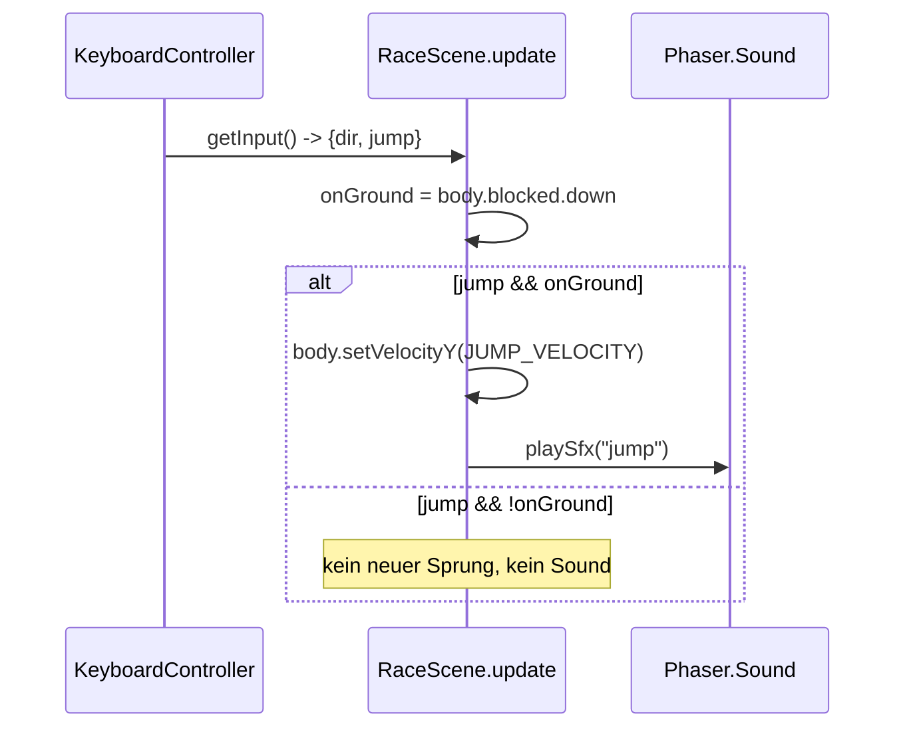
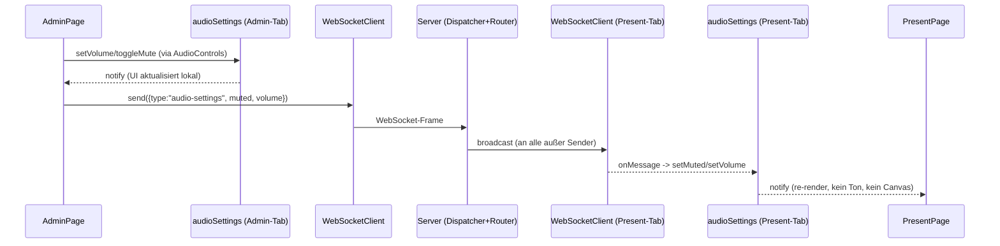

# Design: Game-Audio (Hintergrundmusik + Jump/Collect-SFX + Lautstärke-UI)

Bezug: `.features/game-audio/requirements.md` (US-1 bis US-5)

## Architektur-Überblick

Gleiches Grundprinzip wie in `level-one-arena`: ein **pure, vollständig testbarer Store**
(Audio-Einstellungen: `muted`, `volume`) wird strikt von der **dünnen Phaser-Schicht**
(`RaceScene`, spielt tatsächlich Sounds ab) und der **React-Schicht** (UI-Komponente,
WebSocket-Sync) getrennt. Beide Seiten (Phaser + React) lesen/schreiben denselben
Singleton-Store – das ist der einzige Kopplungspunkt zwischen Phaser und React für Audio
(kein Prop-Drilling von React-State in die Phaser-Szene nötig, da `ArenaView`/`RaceScene`
bereits unabhängig vom React-Render-Zyklus laufen, siehe `ArenaView.tsx`).

```
┌─────────────────────────────┐        ┌──────────────────────────────┐
│   React: AudioControls.tsx   │        │  Phaser: RaceScene.ts         │
│   (Toggle + Slider)          │        │  (spielt theme/jump/collect)  │
│        │  liest/schreibt     │        │        │ liest + subscribed   │
└────────┼─────────────────────┘        └────────┼───────────────────────┘
         │                                        │
         ▼                                        ▼
┌───────────────────────────────────────────────────────────────────────┐
│        client/src/game/audio/audioSettings.ts (pure Singleton-Store)  │
│  { muted, volume } · setVolume · setMuted · toggleMute · subscribe    │
│  · liest/schreibt localStorage                                        │
└───────────────────────────────────────────────────────────────────────┘
```

Für US-5 (Admin→Present) kommt eine zusätzliche, bereits etablierte Schiene dazu: das
bestehende WebSocket-Broadcast-System (`packages/shared`, `server/src/ws/*`,
`client/src/ws/useWebSocketConnection`). Ein neuer Message-Typ `audio-settings` wird
analog zu `ping-broadcast` behandelt (Open/Closed: `MessageDispatcher.register(...)`,
kein bestehender Code muss geändert werden).

```
AdminPage ──send(audio-settings)──▶ Server (Dispatcher → BroadcastRouter) ──▶ PresentPage
                                                                                  │
                                                                                  ▼
                                                                    audioSettings-Store.set(...)
```

## Repo-/Modulstruktur

```
client/src/game/assets/audio.ts              (neu) Audio-Asset-Registry (Keys + Pfade)
client/src/game/audio/audioSettings.ts       (neu) purer Singleton-Store
client/src/game/audio/audioSettings.test.ts  (neu)
client/src/game/audio/useAudioSettings.ts    (neu) React-Hook (useSyncExternalStore)
client/src/components/AudioControls.tsx     (neu) Toggle + Slider, wiederverwendbar
client/src/components/AudioControls.test.tsx (neu)
client/src/game/scenes/RaceScene.ts          (geändert) preload/create/shutdown + SFX-Trigger
client/src/pages/DevPage.tsx                 (geändert) <AudioControls /> einbinden
client/src/pages/AdminPage.tsx               (geändert) <AudioControls /> + Broadcast-Send
client/src/pages/PresentPage.tsx             (geändert) Empfang → Store übernehmen
packages/shared/src/messages.ts              (geändert) AudioSettingsMessage + Type-Guard
packages/shared/src/messages.test.ts         (geändert) Tests für neuen Type-Guard
server/src/index.ts                          (geändert) Dispatcher-Registrierung (1 Zeile)
server/src/ws/handlers/handlePingBroadcast.ts        (umbenannt) → createBroadcastRelayHandler.ts
server/src/ws/handlers/handlePingBroadcast.test.ts   (umbenannt) → createBroadcastRelayHandler.test.ts
```

Kein zweiter Server-Handler nötig: `audio-settings` verhält sich exakt wie
`ping-broadcast` (reines Relay an alle anderen Clients). Der bestehende
`createPingBroadcastHandler` delegiert bereits typ-unabhängig an `router.route(...)` und wird
daher direkt zu `createBroadcastRelayHandler<T>` generalisiert/umbenannt (kein Copy-Paste
eines zweiten, identischen Handlers – DRY) – siehe Abschnitt "Server-Wiring" für Details.

## Schnittstellen & Datenmodelle

### `audioSettings.ts` (purer Store, kein Phaser-/React-Import)

```ts
export interface AudioSettingsState {
  muted: boolean;
  volume: number; // 0..1
}

export interface AudioSettingsStore {
  getState(): AudioSettingsState;
  setVolume(volume: number): void; // clamped auf [0,1]
  setMuted(muted: boolean): void;
  toggleMute(): void;
  /** effektive, tatsächlich anzuwendende Lautstärke (0 wenn muted) */
  getEffectiveVolume(): number;
  subscribe(listener: () => void): () => void; // gibt unsubscribe zurück
}

const STORAGE_KEY = "coin-quest-arena:audio-settings";
const DEFAULT_STATE: AudioSettingsState = { muted: false, volume: 0.6 };

/**
 * Factory statt direktem Klassen-Singleton-Export: hält die Implementierung
 * unit-testbar (jeder Test erzeugt eine frische, isolierte Instanz statt sich
 * globalen Modul-State zu teilen bzw. Module-Reset-Hacks zu brauchen –
 * Dependency Inversion/Testbarkeit). `audioSettings` unten ist die einzige
 * Instanz, die die Anwendung tatsächlich verwendet (ein Store pro Browser-Tab
 * reicht, kein Multi-Instanz-Bedarf zur Laufzeit – KISS für Konsumenten).
 */
export function createAudioSettingsStore(
  storage: Pick<Storage, "getItem" | "setItem"> | null = safeLocalStorage()
): AudioSettingsStore {
  // ... liest DEFAULT_STATE bzw. STORAGE_KEY über `storage`, Zugriffe defensiv
  // in try/catch (siehe "Fehlerbehandlung & Edge Cases") ...
}

export const audioSettings: AudioSettingsStore = createAudioSettingsStore();
```

- Persistenz: bei jeder Änderung wird `{muted, volume}` als JSON unter `STORAGE_KEY` in
  `localStorage` geschrieben (try/catch – in Testumgebungen ohne `localStorage`/SSR
  degradiert der Store auf In-Memory-Defaults, kein Crash).
- Initialzustand: aus `localStorage` gelesen, sonst `DEFAULT_STATE`.
- Tests instanziieren gezielt über `createAudioSettingsStore(mockStorage)` – keine
  Abhängigkeit von der globalen `audioSettings`-Instanz oder Modul-Reset nötig.

### `useAudioSettings.ts` (React-Adapter)

```ts
export function useAudioSettings(): AudioSettingsState & {
  setVolume: (v: number) => void;
  toggleMute: () => void;
};
```

Implementiert via `useSyncExternalStore(audioSettings.subscribe, audioSettings.getState)`
– kein eigener `useEffect`/`useState`-Wiring nötig, React bleibt synchron zum Singleton
(auch bei externen Änderungen, z.B. durch WebSocket-Sync in `PresentPage`).

### `AudioControls.tsx`

```tsx
export function AudioControls(): JSX.Element;
```

- Nutzt intern `useAudioSettings()`.
- Rendert: `<button>` (Mute/Unmute, Label je nach `muted`), `<input type="range" min=0 max=100>`
  (gebunden an `volume*100`, `disabled` NICHT gesetzt bei `muted` – Slider bleibt bedienbar,
  ändert aber erst nach Unmute wieder hörbar etwas, siehe US-4 AC3).
- Keine Kenntnis von WebSocket/Broadcast (Single Responsibility, komplett wiederverwendbar
  in `DevPage`/`AdminPage` ohne Sonderfall-Props). Das Senden der `audio-settings`-Nachricht
  in `AdminPage` erfolgt NICHT über die Komponente, sondern über einen eigenen `useEffect` in
  `AdminPage`, der direkt den Store abonniert:
  ```ts
  // AdminPage.tsx
  useEffect(
    () =>
      audioSettings.subscribe(() => {
        send({ type: "audio-settings", ...audioSettings.getState() });
      }),
    [send]
  );
  ```
  Damit bleibt `AudioControls` unverändert wiederverwendbar (z.B. auch in `PresentPage`,
  falls dort später ein lokaler Regler gewünscht wird), während die
  Broadcast-Verantwortung klar bei der Seite liegt, die sie tatsächlich braucht (SRP).

### `assets/audio.ts`

```ts
export const AUDIO_KEYS = { THEME: "theme", JUMP: "jump", COLLECT: "collect" } as const;
export type AudioKey = (typeof AUDIO_KEYS)[keyof typeof AUDIO_KEYS];
export const AUDIO_SPECS: ReadonlyArray<{ key: AudioKey; path: string }> = [
  { key: AUDIO_KEYS.THEME, path: "assets/Audio/theme.mp3" },
  { key: AUDIO_KEYS.JUMP, path: "assets/Audio/jump.mp3" },
  { key: AUDIO_KEYS.COLLECT, path: "assets/Audio/collect.mp3" },
];
```

Analog zu `STATIC_IMAGE_SPECS` in `spriteSheets.ts` – `RaceScene.preload()` iteriert nur.
`AudioKey` ersetzt `string` überall dort, wo ein Audio-Key erwartet wird (`playSfx`,
Sound-Objekt-Erzeugung) – keine stringly-typed API (TypeScript-Spezifika).

### `RaceScene.ts` Änderungen

- Neues privates Feld `private music: Phaser.Sound.BaseSound | null = null;` und
  `private unsubscribeAudio: (() => void) | null = null;`.
- `preload()`: `for (const spec of AUDIO_SPECS) this.load.audio(spec.key, spec.path);`
- `create()`:
  ```ts
  this.music = this.sound.add(AUDIO_KEYS.THEME, { loop: true });
  this.applyAudioVolume();
  this.music.play();
  this.unsubscribeAudio = audioSettings.subscribe(() => this.applyAudioVolume());
  ```
  `applyAudioVolume()` setzt `this.music.setVolume(audioSettings.getEffectiveVolume())`
  (private Helper-Methode, kein Duplikat-Code an mehreren Stellen).
- Sprung-SFX: in `applyKeyboardInput` beim Zweig `if (jump && onGround) { ...; this.playSfx(AUDIO_KEYS.JUMP); }`
  und in `applyBotAction` beim Zweig `if (action === "jump" && onGround) { ...; this.playSfx(AUDIO_KEYS.JUMP); }`
  – exakt an der bestehenden Stelle, an der der Sprung bereits ausgelöst wird (kein
  zusätzlicher State nötig, erfüllt AC "nur bei tatsächlichem Sprung").
- Collect-SFX: in `onCoinOverlap`, direkt nach `applyCoinPickup`/vor `coin.destroy()`:
  `this.playSfx(AUDIO_KEYS.COLLECT);`.
- Neue private Methode:
  ```ts
  private playSfx(key: AudioKey): void {
    this.sound.play(key, { volume: audioSettings.getEffectiveVolume() });
  }
  ```
- `shutdown()`: `this.music?.stop(); this.unsubscribeAudio?.();` zusätzlich zum bestehenden
  `this.controller?.dispose();`.

### `packages/shared/src/messages.ts` Änderungen

```ts
export interface AudioSettingsMessage {
  type: "audio-settings";
  muted: boolean;
  volume: number; // 0..1
}

export type InboundMessage = PingBroadcastMessage | AudioSettingsMessage;
export type OutboundMessage = PingBroadcastMessage | AudioSettingsMessage;

export function isAudioSettingsMessage(value: unknown): value is AudioSettingsMessage {
  return (
    isRecord(value) &&
    value.type === "audio-settings" &&
    typeof value.muted === "boolean" &&
    typeof value.volume === "number"
  );
}
```

### Server-Wiring (`parseMessage.ts`, `index.ts`)

- `parseMessage.ts`: zusätzlicher `if (isAudioSettingsMessage(candidate)) return candidate;`-Zweig.
- `handlers/handlePingBroadcast.ts` → umbenannt/generalisiert zu
  `handlers/createBroadcastRelayHandler.ts`: der bestehende Handler delegiert bereits nur
  generisch an `router.route(senderId, message)` (siehe bestehenden Test – keine
  Typ-spezifische Logik). Statt einen zweiten, inhaltlich identischen Handler für
  `audio-settings` zu duplizieren (DRY) und statt einen toten Re-Export-Wrapper "für
  Rückwärtskompatibilität" zu behalten (YAGNI – es gibt nur einen Aufrufer, `index.ts`),
  wird die Funktion direkt umbenannt/generalisiert und ihr bestehender Test
  (`handlePingBroadcast.test.ts` → `createBroadcastRelayHandler.test.ts`) entsprechend
  mitgezogen (reines Rename, keine Verhaltensänderung – durch den bestehenden Test
  bereits abgesichert).
  ```ts
  export function createBroadcastRelayHandler<T extends InboundMessage>(
    router: BroadcastRouter
  ): MessageHandler<T> {
    return (senderId, message) => router.route(senderId, message);
  }
  ```
- `index.ts`:
  ```ts
  dispatcher.register("ping-broadcast", createBroadcastRelayHandler(broadcastRouter));
  dispatcher.register("audio-settings", createBroadcastRelayHandler(broadcastRouter));
  ```

## Ablauf / Sequenz

### Sprung-Sound (Sequenzdiagramm, Tastatur-Fall)



### Admin→Present Audio-Sync



## Fehlerbehandlung & Edge Cases

- **`localStorage` nicht verfügbar** (privater Modus, SSR-Test-Umgebung): `audioSettings`
  fängt Zugriffsfehler beim Lesen/Schreiben ab und arbeitet rein im Arbeitsspeicher weiter
  (Default-Werte). Kein Crash, kein ungetesteter Sonderpfad – wird in
  `audioSettings.test.ts` mit gemocktem `localStorage`, das wirft, abgedeckt.
- **Sound-Assets noch nicht geladen** (theoretisch, da `preload` immer vor `create` läuft):
  kein Sonderfall nötig, Phaser wirft in diesem Fall selbst; in der Praxis durch die
  bestehende `preload()`/`create()`-Reihenfolge ausgeschlossen.
- **Mehrere `audio-settings`-Nachrichten kurz hintereinander** (Slider wird gezogen): jede
  Nachricht wird unabhängig verarbeitet (kein Debouncing im Scope dieses Features – YAGNI,
  bei Bedarf später ergänzbar, ohne die Schnittstelle zu ändern).
- **Bot pausiert/Fehler im Bot** (`BotRunner.pausedReason`): unabhängig vom Audio-Feature,
  Musik läuft unbeeinflusst weiter (kein gekoppeltes Verhalten gefordert).
- **Volume aus dem UI außerhalb `[0,100]`**: durch `<input type="range" min=0 max=100>` vom
  Browser bereits eingegrenzt; `setVolume` clamped zusätzlich defensiv auf `[0,1]` (Store ist
  nicht nur von der UI, sondern auch von der WebSocket-Nachricht aus erreichbar, die keine
  Range-Validierung durch ein `<input>` hat).

## Test-Strategie

- **`audioSettings.test.ts`** (Vitest, reine Unit-Tests, kein DOM/Phaser nötig): jeder Test
  erzeugt via `createAudioSettingsStore(mockStorage)` eine frische, isolierte Instanz (kein
  globaler Modul-State zwischen Tests, kein Reset-Hack nötig).
  - Default-State ohne vorhandenen `localStorage`-Eintrag.
  - `setVolume` clamped Werte `< 0` auf `0` und `> 1` auf `1`.
  - `toggleMute` / `setMuted` verändern `muted` korrekt.
  - `getEffectiveVolume()` liefert `0` bei `muted === true`, sonst `volume`.
  - `subscribe`-Listener wird bei jeder Änderung genau einmal aufgerufen; `unsubscribe`
    (Rückgabewert von `subscribe`) verhindert weitere Aufrufe.
  - Persistenz: nach `setVolume`/`setMuted` steht der erwartete Wert unter `STORAGE_KEY` im
    übergebenen Mock-Storage; eine zweite, neu erzeugte Store-Instanz mit demselben
    Mock-Storage liest den Wert korrekt zurück (simulierter Reload, ganz ohne Modul-Reset).
  - Fehlerfall: Mock-Storage, dessen `getItem`/`setItem` wirft → Store bleibt
    funktionsfähig, wirft nicht (Default-Storage-Parameter macht das ohne echtes
    `localStorage`-Mocking testbar).
- **`AudioControls.test.tsx`** (Testing-Library + jsdom, Konvention wie in `client/src/setup.test.ts`
  etabliert):
  - Klick auf Mute-Button togglet den Store (`audioSettings.getState().muted`).
  - Ändern des Sliders (`fireEvent.change`) ruft `setVolume` mit dem erwarteten,
    normalisierten Wert (0..1) auf.
  - Komponente zeigt den aktuellen Store-Zustand korrekt an (z.B. Slider-Wert nach externer
    Store-Änderung, um `useSyncExternalStore`-Anbindung abzusichern).
- **`messages.test.ts`** (Erweiterung, gleiches Muster wie `isPingBroadcastMessage`):
  - `isAudioSettingsMessage` true/false-Fälle analog zu den vier bestehenden
    `isPingBroadcastMessage`-Tests.
- **Server** (`parseMessage.test.ts`, `MessageDispatcher.test.ts`/`BroadcastRouter.test.ts`,
  `createBroadcastRelayHandler.test.ts`): bestehende Tests bleiben grün (bei
  `handlePingBroadcast.test.ts` reines Rename auf den neuen Dateinamen/Funktionsnamen); ggf.
  ein zusätzlicher Test, dass `parseInboundMessage` eine `audio-settings`-Payload korrekt
  erkennt.
- **`RaceScene.ts`-Wiring**: wie im gesamten Projekt etabliert (siehe Kommentar am
  Klassenkopf: "bewusst nicht unit-getestet (Phaser/Canvas nötig), manuell verifiziert") –
  keine neuen Unit-Tests für die Scene selbst; manuelle Verifikation auf `/dev`
  (Musik-Loop hörbar, Slider/Mute wirken live, Jump-Sound nur bei echtem Sprung, Collect-
  Sound bei Coin-Pickup inkl. aus Block ausgelöster Münze).

## Auswirkungen auf bestehenden Code

- `RaceScene.ts`: additive Änderungen an `preload`, `create`, `shutdown`,
  `applyKeyboardInput`, `applyBotAction`, `onCoinOverlap` – keine bestehende Logik wird
  entfernt oder umstrukturiert.
- `DevPage.tsx`, `AdminPage.tsx`, `PresentPage.tsx`: Einbindung von `<AudioControls />`
  (unverändert wiederverwendbar, ohne WS-Kenntnis); `AdminPage` ergänzt zusätzlich einen
  eigenen `useEffect`, der den Store abonniert und Änderungen sendet; `PresentPage` ergänzt
  einen Empfangs-Handler, der eingehende `audio-settings`-Nachrichten in den lokalen Store
  schreibt – beides über den bereits vorhandenen `useWebSocketConnection`-Hook (kein neuer
  WS-Client nötig).
- `packages/shared/src/messages.ts`: rein additive Erweiterung der Union-Typen (bestehender
  `PingBroadcastMessage`-Pfad bleibt unverändert funktionsfähig).
- `server/src/index.ts`, `server/src/ws/parseMessage.ts`: additive Änderungen.
  `server/src/ws/handlers/handlePingBroadcast.ts` wird zu `createBroadcastRelayHandler.ts`
  umbenannt/generalisiert (inkl. Test); bestehendes `ping-broadcast`-Verhalten bleibt
  unverändert (reiner Rename/Generalisierungs-Refactor, durch den migrierten Test
  abgesichert, keine Verhaltensänderung).
