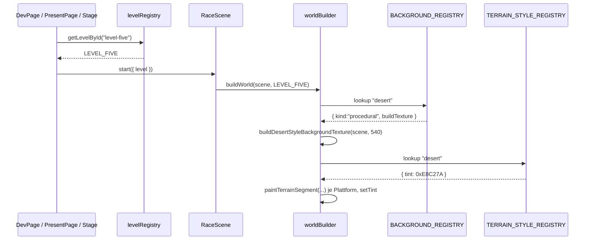

# Design: Level-Five-Desert

## Architektur-Überblick

Level 5 fügt sich vollständig in die bestehende Architektur aus `docs/03-architektur.md` ein und
nutzt ausschließlich existierende Erweiterungspunkte. **Es entsteht keine neue Komponente und
keine neue Abstraktion.**

| Erweiterungspunkt | Eingeführt in | Nutzung durch Level 5 |
|---|---|---|
| `LevelDef` (`level/types.ts`) | `.features/level-one-arena/` | neues Datenmodul `levelFive.ts` |
| `LEVEL_REGISTRY` (`level/levelRegistry.ts`) | `.features/level-two-kaizo/` | neuer Eintrag `level-five` |
| `LEVEL_IDS` (`packages/shared/src/levels.ts`) | `.features/arena-hub-server/` | neuer Eintrag `level-five` |
| `BACKGROUND_REGISTRY` (`world/backgroundRegistry.ts`) | `.features/level-two-background/` | neuer Key `desert` |
| `TERRAIN_STYLE_REGISTRY` (`world/terrainStyleRegistry.ts`) | `.features/level-three-underground/` | neuer Key `desert` |
| `proceduralBackgrounds.ts` | `.features/level-two-background/` | neue `buildDesertStyleBackgroundTexture` |

`worldBuilder.ts`, `level/tiles.ts`, `hazards/*`, `state/botStateBuilder.ts`, die Sandbox und der
`@arena/bot-contract` bleiben **unverändert** (Open/Closed: die Registries verzweigen, nicht der
Builder). Konsumenten der Level-Auswahl (`DevPage`, `PresentPage`, `StageLevelEditor`,
`TournamentSetup`, `BracketView`, `useArenaControls`) speisen sich aus `LEVEL_REGISTRY` und
erhalten Level 5 ohne Codeänderung.

## Physik-Grundlage (Herleitung aller Koordinaten)

Aus `movement/movement.ts` (`GRAVITY_Y = 900`, `BASE_MOVE_SPEED = 200`, `SPRINT_MOVE_SPEED = 320`,
`BASE_JUMP_VELOCITY = -560`, `SPRINT_JUMP_VELOCITY = -650`) und `RaceScene.ts`
(`BOINGO_JUMP_VELOCITY = -820`):

| Größe | Formel | Wert |
|---|---|---|
| Basis-Sprunghöhe | `560² / 1800` | 174 px |
| Sprint-Sprunghöhe | `650² / 1800` | **235 px** |
| Boingo-Steighöhe | `820² / 1800` | **373 px** |
| Sprint-Sprungweite (flach) | `320 · 2·650/900` | **462 px** |
| Boingo-Flugzeit (flach) | `2 · 820/900` | 1,822 s |
| Boingo-Reichweite flach, Basis / Sprint | `1,822 · 200 / 320` | **364 / 583 px** |

**Entscheidender Punkt – Landen auf `float`-Plattformen:** `worldBuilder.ts` setzt bei
`kind: "float"` `checkCollision.down/left/right = false`. Eine Schwebeplattform ist also nur von
oben, d. h. **in der Fallphase** landbar. Für einen Boingo-Sprung mit Höhengewinn zählt deshalb
die *zweite* Nullstelle der Wurfparabel, nicht die erste.

**Aufsteigender Boingo-Hop um +300 px** (Einstieg in die Kette):
`450t² − 820t + 300 = 0` → `t = (820 + √132400)/900 = 1,315 s`
→ Landefenster horizontal: **263 px** (Basistempo) bis **421 px** (Sprint).

**Flacher Boingo-Hop** (Kettenplattform → Kettenplattform, gleiche Höhe):
→ Landefenster horizontal: **364 px** (Basistempo) bis **583 px** (Sprint).

**Herunterlaufen von der Kette** (Fall um 300 px, `t = √(2·300/900) = 0,816 s`):
→ horizontale Drift **163 px** (Basistempo) bis **261 px** (Sprint).

Diese vier Fenster bestimmen Breite und Position jeder Kettenplattform. Sie werden als
exportierte Konstanten in `levelFive.ts` hinterlegt (Muster: `CLEARANCE_*` in `levelFour.ts`) und
in `levelFive.test.ts` als Invarianten geprüft.

## Layout

Weltmaße: `worldWidth = 3120`, `worldHeight = 540`, `groundY = 500`.
Spawn `{ x: 80, y: 420 }`, Ziel `{ x: 3060, y: 484 }`.

```
 y=200  ......................  [K1]      [K2]        [K3]        <- Kettenplattformen
 y=330  .... [H1][H2][H3][H4] ......................              <- Hochroute
 y=500  [==G1==]  [====G2====]  [=G3=]      GRABEN     [==G4==] [=G5=]
        0    352  480     864  1008 1280   1280-2480  2480 2800 2880 3120
```

### Bodensegmente (`kind` default `"ground"`)

| Seg | x | tilesWide | Bereich | Lücke danach |
|---|---|---|---|---|
| G1 | 0 | 22 | 0–352 | 128 |
| G2 | 480 | 24 | 480–864 | 144 |
| G3 | 1008 | 17 | 1008–1280 | **1200 (Großer Graben)** |
| G4 | 2480 | 20 | 2480–2800 | 80 |
| G5 | 2880 | 15 | 2880–3120 | – |

Alle Lücken außer dem Großen Graben sind ≤ 160 px (US-4). Der Graben ist mit 1200 px weit über
der Sprint-Sprungweite von 462 px (US-2).

### Kettenplattformen im Großen Graben (`kind: "float"`, y = 200)

Alle drei liegen 300 px über `groundY` → per Sprint-Sprung (235 px) unerreichbar, per Boingo
(373 px) erreichbar, Marge 73 px.

| Platte | x | tilesWide | Bereich | Absprung von | Landefenster | abgedeckt |
|---|---|---|---|---|---|---|
| K1 | 1440 | 12 | 1440–1632 | `boingo-1` @ x=1180 (G3, y=486) | 1443–1601 (Steig-Hop) | ✔ |
| K2 | 1840 | 17 | 1840–2112 | `boingo-2` @ x=1500 (K1, y=186) | 1864–2083 (flach) | ✔ |
| K3 | 2224 | 17 | 2224–2496 | `boingo-3` @ x=1900 (K2, y=186) | 2264–2483 (flach) | ✔ |

**Ausstieg ohne Trampolin:** K3 endet bei x = 2496. Läuft der Bot dort herunter, landet er bei
2659 (Basistempo) bzw. 2757 (Sprint) – beides innerhalb von G4 (2480–2800). K3 trägt deshalb
bewusst **kein** Trampolin (ein Boingo dort würde über G4 hinausschießen).

### Hochroute (`kind: "float"`, y = 330)

170 px über dem Boden → per Basissprung (174 px) erreichbar, US-3-Kriterium „≤ 200 px" erfüllt.

| Platte | x | tilesWide | Bereich | Lücke danach |
|---|---|---|---|---|
| H1 | 520 | 6 | 520–616 | 64 |
| H2 | 680 | 6 | 680–776 | 64 |
| H3 | 840 | 7 | 840–952 | 58 |
| H4 | 1010 | 7 | 1010–1122 | – |

Parallelstrecke 520 → 1122 = **602 px** (≥ 600, US-3). H3 überbrückt die Bodenlücke 864–1008.
H4 endet über G3 (1008–1280) → der Bot fällt zurück auf die Bodenroute, bevor der Graben kommt
(„mündet zurück", US-3). Die Bodenroute allein führt durchgehend ans Ziel (US-3, letztes
Kriterium).

## Entitäten

### Sichtbare Früchte (13, Vorgabe 10–15)

| id | x | y | Frucht | Bereich |
|---|---|---|---|---|
| coin-1 | 150 | 452 | cherries (5) | G1 |
| coin-2 | 300 | 452 | strawberry (8) | G1 |
| coin-3 | 600 | 452 | cherries (5) | G2 – Parallelstrecke |
| coin-4 | 780 | 452 | strawberry (8) | G2 – Parallelstrecke |
| coin-5 | 1060 | 452 | cherries (5) | G3 – Parallelstrecke |
| coin-6 | 560 | 282 | kiwi (15) | H1 – Hochroute |
| coin-7 | 880 | 282 | melon (20) | H3 – Hochroute |
| coin-8 | 1060 | 282 | pineapple (25) | H4 – Hochroute |
| coin-9 | 1560 | 152 | orange (10) | K1 – Kette |
| coin-10 | 1960 | 152 | orange (10) | K2 – Kette |
| coin-11 | 2360 | 152 | orange (10) | K3 – Kette |
| coin-12 | 2600 | 452 | apple (10) | G4 |
| coin-13 | 2960 | 452 | bananas (12) | G5 |

**Routen-Zielkonflikt (US-3):** Hochroute 15+20+25 = **60** vs. parallele Bodenroute 5+8+5 =
**18**. Die Ketten-Früchte (coin-9..11) sind laut Requirements-Entscheidung 4 ein eigener Bereich
und bleiben aus dem Vergleich ausgenommen.

Konventionen aus den Bestandsleveln: Boden-Früchte `groundY − 48 = 452`, Plattform-Früchte
`plattformY − 48`.

### Versteckte Blöcke (4, Vorgabe 3–5), y = `groundY − 64` = 436

`block-1` kiwi @ 250 (G1) · `block-2` orange @ 1120 (G3) · `block-3` melon @ 2650 (G4) ·
`block-4` pineapple @ 3000 (G5).

`block-2` liegt unter H4 – unkritisch, da `float`-Plattformen jump-through sind (kein Bonk).

### Checkpoints (4, Vorgabe ≥ 3), y = `groundY` = 500

`checkpoint-1` @ 520 (G2) · `checkpoint-2` @ **1030 (G3, unmittelbar vor dem Großen Graben,
US-2)** · `checkpoint-3` @ 2520 (G4, direkt nach dem Graben) · `checkpoint-4` @ 2920 (G5).

Gemäß Requirements-Entscheidung 3 gibt es **keinen** Checkpoint auf den Kettenplattformen.

### Hazards (6 – weniger als Level 2 mit 10, vergleichbar Level 3 mit 6)

| id | kind | Position | Parameter | Bereich |
|---|---|---|---|---|
| ninjafrog-1 | ninjafrog | 180, 484 | minX 140, maxX 320, speed 70 | G1 (stompbar, sanfter Einstieg) |
| stachlinger-1 | stachlinger | 820, 484 | – | G2, Parallelstrecke |
| loderix-1 | loderix | 740, 314 | onMs 1000, offMs 2000 | **H2 – Hochroute** |
| spikehead-1 | spikehead | 900, originY 100, fallToY 314 | triggerMinX 840, triggerMaxX 900, warnMs 600, fallMs 200, restMs 400, riseMs 500 | **H3 – Hochroute** |
| ninjafrog-2 | ninjafrog | 2560, 484 | minX 2500, maxX 2700, speed 65 | G4 |
| stachlinger-2 | stachlinger | 2960, 484 | – | G5 |

**Risiko/Ertrag (US-3):** Hochroute 2 Hazards vs. parallele Bodenroute 1 Hazard → Kriterium
„mindestens so viele" erfüllt. **Schwierigkeitsgrad (US-4):** kein `kugelblitz`, kein
`schnetzler`, kein Mehrfach-Gauntlet, genau ein `spikehead` mit entschärften Timings (lange
Vorwarnung 600 ms, kurze Liegedauer 400 ms – analog Level 3). Der Große Graben bleibt
hazardfrei, damit die Trampolin-Mechanik im Fokus steht.

### Utilities

`boingo-1` @ (1180, 486) auf G3 – Einstieg in die Kette ·
`boingo-2` @ (1500, 186) auf K1 · `boingo-3` @ (1900, 186) auf K2.
Konvention `y = plattformY − 14` wie in Level 1–4.

## Theming

### `proceduralBackgrounds.ts` – `buildDesertStyleBackgroundTexture(scene, worldHeight)`

Gleiches Muster wie `buildNightStyleBackgroundTexture` (idempotent gecacht über
`bg-desert-${worldHeight}`, `TILE_W = 512`, Textur-Höhe = `worldHeight` wegen des in
`bugfix-treetops-and-clouds.md` dokumentierten vertikalen Kachel-Problems):

1. Himmelsverlauf: 6 horizontale Bänder von `0xF2C14E` (oben) nach `0xF7E1A0` (Horizont), per
   linearer Interpolation berechnet – ergibt einen weichen Warmverlauf ohne Gradient-API.
2. Sonnenscheibe `0xFFF3C4` bei `(400, worldHeight · 0,22)`, r = 34, plus schwacher Halo
   (r = 52, Alpha 0,25).
3. Drei gestaffelte Dünen-Silhouetten am unteren Rand (`fillEllipse`, an `baseY = worldHeight`
   verankert) in `0xD9A441` / `0xC98F35` / `0xB87B2A` – hinterste am hellsten (Lufttrübung).
4. Zwei Kaktus-Silhouetten in `0x8A6A2A` als dezente Akzente (Rechteck-Stamm + zwei Arme).

Keine Laufzeit-Zufälligkeit (deterministische Koordinaten), wie bei allen Bestandsgeneratoren.

### `backgroundRegistry.ts`

`desert: { kind: "procedural", buildTexture: buildDesertStyleBackgroundTexture }`

### `terrainStyleRegistry.ts`

`desert: { tint: 0xE8C27A }` – warmer Sandton auf dem bestehenden `TERRAIN_TILES`-Frameset
(Gras/Erde). Kein neues Tileset, kein neues Asset (US-1, Nicht-Ziele). Phasers `setTint` wirkt
multiplikativ; der Sandton verschiebt das Grün-Braun-Set sichtbar ins Gelbliche.

## Registrierung

```ts
// client/src/game/level/levelRegistry.ts
{ id: "level-five", label: "Level 5 – Desert", level: LEVEL_FIVE },
```
eingefügt nach `level-four`, vor `toolkit-test`. `DEFAULT_LEVEL_ID` bleibt `"level-one"`.

```ts
// packages/shared/src/levels.ts
export const LEVEL_IDS = [..., "level-four", "level-five", "toolkit-test"] as const;
```

Damit gilt `isValidLevelId("level-five") === true` serverseitig (US-5). Level 5 wird **nicht**
als Default-Stage in `tournament/stageLevelList.ts` gesetzt (Nicht-Ziel).

## Ablauf: Rendern von Level 5



Kein Sonderpfad: `worldBuilder` schlägt beide Keys nur nach.

## Fehlerbehandlung & Edge Cases

| Fall | Verhalten | Quelle |
|---|---|---|
| Unbekannte Level-ID | `getLevelById` wirft mit Auflistung aller IDs (Fail-Fast) | bestehend, unverändert |
| Unbekannter `backgroundKey`/`terrainStyleKey` | Registry-Lookup, Default-Key als Fallback | bestehend, unverändert |
| Bot fällt in den Großen Graben | Leben −1, Respawn an `checkpoint-2` (x = 1030) | bestehend, `rules/raceRules.ts` |
| Bot verpasst K1 und stürzt ab | identisch – Respawn direkt vor dem Graben, kein Fortschrittsverlust | Design-Entscheidung |
| Bot ignoriert die Hochroute | erreicht das Ziel über die Bodenroute | Layout |
| Bot springt von K3 statt zu laufen | Sprint-Sprung ab x = 2496 landet bei ≈ 3076 → G5; Laufen landet auf G4 | beides sicher |
| Boingo-Sprung bei Zwischentempo | Landefenster ist komplett von der Zielplattform abgedeckt | Geometrie oben |
| Zeitlimit 90 s | Level ist mit 3120 px kürzer als Level 1 (3450 px) → unkritisch | `racerState.ts` |

## Test-Strategie

Vitest (`client/vitest.config.ts`, jsdom). Reine Daten-/Konstanten-Tests ohne Phaser-Instanz –
konsistent zu `levelFour.test.ts`. Der prozedurale Hintergrund wird **nicht** unit-getestet
(Canvas-Rendering nötig; bewusste Entscheidung analog `.features/level-two-background/design.md`),
sondern manuell abgenommen.

### `client/src/game/level/levelFive.test.ts` (neu)

**A – Struktur-Invarianten (US-4)**
- 10–15 sichtbare Früchte, 3–5 versteckte Blöcke, ≥ 3 Checkpoints, genau ein Spawn/Ziel
- `worldHeight === 540`, `groundY === 500`, `worldWidth` im Bereich 2500–3500
- alle Entitäts-IDs paarweise verschieden (über Früchte, Blöcke, Checkpoints, Hazards, Utilities)
- Hazard-`kind`s ⊆ bekannte Kinds; kein `kugelblitz`, ≤ 1 `spikehead`
- `backgroundKey === "desert"`, `terrainStyleKey === "desert"`
- keine `kind: "ceiling"`-Plattform (Requirements-Entscheidung 2)

**B – Großer Graben & Trampolin-Kette (US-2)**
- genau eine Bodenlücke > 1000 px; alle übrigen Bodenlücken ≤ 160 px
- ≥ 3 `float`-Plattformen liegen vollständig innerhalb der Grabenbreite
- jede Kettenplattform: `groundY − y > 235` **und** `groundY − y ≤ 340`
- für jeden Ketten-Boingo: die nächste Kettenplattform überdeckt das komplette Landefenster
  `[boingoX + reichweiteBasis, boingoX + reichweiteSprint]` (Fenster aus den oben hergeleiteten
  Formeln im Test nachgerechnet, nicht als Magic Number)
- der Einstiegs-Boingo liegt auf dem Bodensegment direkt vor dem Graben
- jede Kettenplattform mit Folge-Hop trägt genau ein `boingo` mit `y === plattformY − 14`
- die letzte Kettenplattform trägt kein Boingo, und die Falldrift beim Herunterlaufen
  (Basis- wie Sprinttempo) landet innerhalb des ersten Bodensegments hinter dem Graben
- Checkpoint existiert auf dem Bodensegment unmittelbar vor dem Graben

**C – Zwei Routen (US-3)**
- Hochrouten-Plattformen bilden eine zusammenhängende Kette mit Parallelstrecke ≥ 600 px
- Einstiegshöhe ≤ 200 px über `groundY`; Lücken zwischen Hochrouten-Plattformen ≤ 249 px
  (Basis-Sprungweite)
- letzte Hochrouten-Plattform endet horizontal über einem Bodensegment (Rückmündung)
- Summe `FRUIT_VALUES` auf der Hochroute > Summe auf der parallelen Bodenstrecke
- Hazard-Anzahl Hochroute ≥ Hazard-Anzahl parallele Bodenstrecke
- Bodensegmente decken 0 → Ziel lückenlos bis auf zulässige Sprunglücken ab

### `client/src/game/level/levelRegistry.test.ts` (erweitert)

- `level-five` in `LEVEL_REGISTRY`, Label nicht leer
- `getLevelById("level-five") === LEVEL_FIVE`
- Zwei-Wege-Konsistenz mit `LEVEL_IDS` (bestehende Tests greifen automatisch)

### `packages/shared` (erweitert)

- `isValidLevelId("level-five") === true` (im bestehenden Shared-Test ergänzen, falls vorhanden;
  sonst über den Client-Konsistenztest abgedeckt)

### `client/src/game/world/terrainStyleRegistry.test.ts` (erweitert)

- `desert` existiert, `tint` ist eine endliche Zahl, Farbe ist warm (`r > b` und `g > b`)

### Manuelle Abnahme

`/dev` mit Level 5 und einem Beispiel-Bot: Wüsten-Optik prüfen, Trampolin-Kette einmal per Bot
durchspielen (Einstieg, zwei Hops, Ausstieg), Hochroute betreten und Rückmündung prüfen.

## Auswirkungen auf bestehenden Code

| Datei | Art |
|---|---|
| `client/src/game/level/levelFive.ts` | **neu** |
| `client/src/game/level/levelFive.test.ts` | **neu** |
| `client/src/game/level/levelRegistry.ts` | Import + Registry-Eintrag |
| `client/src/game/level/levelRegistry.test.ts` | Tests für `level-five` |
| `packages/shared/src/levels.ts` | `"level-five"` in `LEVEL_IDS` |
| `client/src/game/world/proceduralBackgrounds.ts` | neue Export-Funktion + Farbkonstanten |
| `client/src/game/world/backgroundRegistry.ts` | Import + Key `desert` |
| `client/src/game/world/terrainStyleRegistry.ts` | Key `desert` |
| `client/src/game/world/terrainStyleRegistry.test.ts` | Test für `desert` |
| `client/src/game/movement/movement.ts` | `BOINGO_JUMP_VELOCITY` in `MOVEMENT_TUNING` aufnehmen (siehe unten) |
| `client/src/game/movement/movement.test.ts` | Test für die neue Konstante |
| `client/src/game/scenes/RaceScene.ts` | modul-private Konstante entfernen, aus `MOVEMENT_TUNING` beziehen |
| `docs/06-level-design.md` | Level-5-Abschnitt in der Level-Übersicht |

### Nachtrag: Extraktion von `BOINGO_JUMP_VELOCITY` (Entscheidung des Users, Variante B)

`BOINGO_JUMP_VELOCITY = -820` liegt bisher modul-privat in `RaceScene.ts:62` und ist damit in
einem Phaser-freien Daten-Test nicht verfügbar. Da die gesamte Ketten-Geometrie von diesem Wert
abhängt, würde eine im Test gespiegelte Kopie bei einer künftigen Änderung der Sprungkraft still
auseinanderlaufen (die Level-Tests blieben grün, das Level wäre unspielbar).

Der Wert wandert deshalb nach `MOVEMENT_TUNING` in `movement/movement.ts` – dieselbe Quelle, aus
der bereits `GRAVITY_Y`, `BASE_/SPRINT_JUMP_VELOCITY` und die Tempi stammen. `RaceScene.ts`
bezieht ihn von dort; das Laufzeitverhalten ändert sich nicht (identischer Wert). Bewusst
**nicht** Teil dieser Extraktion: eine Aufnahme in die Bot-Sicht über
`state/botStateBuilder.ts` – das wäre eine Bot-API-Änderung und laut Requirements ein Nicht-Ziel.

**Nicht angefasst:** `worldBuilder.ts`, `level/tiles.ts`, `level/types.ts`, `hazards/*`,
`rules/*`, `state/botStateBuilder.ts`, `packages/bot-contract/*`, die Sandbox sowie Level 1–4 und
das Toolkit-Test-Level. An `movement/movement.ts` und `RaceScene.ts` erfolgt ausschließlich die
oben beschriebene, verhaltensneutrale Konstanten-Extraktion.
