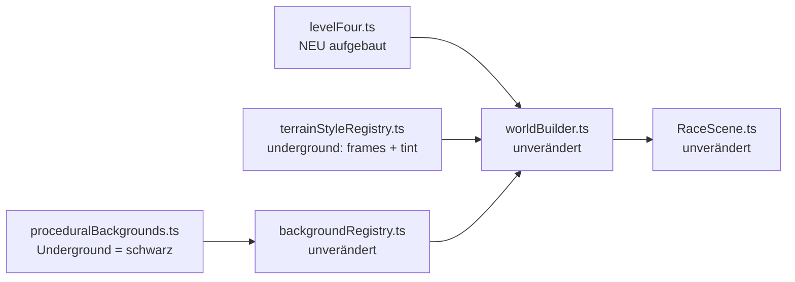

# Design: Level-Four-Redesign

## Architektur-Überblick

Dieses Feature ändert **keine** Architektur – es nutzt ausschließlich Erweiterungspunkte, die
`.features/level-four-underground/` bereits eingeführt hat:

- `PlatformDef.kind: "ceiling"` (`level/types.ts`) + `paintTerrainSegment`-Zweig
  (`world/worldBuilder.ts`) → bleiben unverändert.
- `TerrainStyleSpec.frames` / `.tint` (`world/terrainStyleRegistry.ts`) → bleiben unverändert;
  `worldBuilder.ts` wendet beide bereits unabhängig voneinander an (Z. 149 `style.frames ??
  TERRAIN_TILES`, Z. 188 `style.tint`). Die Kombination "Frame-Set **und** Tint" ist damit ohne
  Codeänderung möglich – genau das brauchen wir für die blauen Blöcke.
- `BACKGROUND_REGISTRY.underground` → Eintrag bleibt, nur die dahinterliegende Zeichenfunktion
  wird vereinfacht.

Geändert werden also nur: **Level-Daten** (`levelFour.ts`), **zwei Registry-/Zeichen-Details**
(Farbe) und die **Tests**.



## Physik-Grundlage (korrigiert)

Alle bestehenden Level-Kommentare behaupten „max. Sprunghöhe ≈174px". Das gilt nur für den
**Basissprung**. Seit `.features/movement-sprint-and-variable-jump/` gibt es zusätzlich den
Sprint-Sprung:

| Größe | Quelle | Wert |
|---|---|---|
| `BASE_JUMP_VELOCITY` | `movement/movement.ts:15` | -560 |
| `SPRINT_JUMP_VELOCITY` | `movement/movement.ts:17` | -650 |
| `GRAVITY_Y` | `movement/movement.ts:24` | 900 |
| `BOINGO_JUMP_VELOCITY` | `scenes/RaceScene.ts:69` | -820 |
| Spieler-Hitbox | `movement/movement.ts:28` | 24×32 |

`h = v² / (2·g)`:

- Basissprung: `560² / 1800` ≈ **174px**
- **Sprint-Sprung: `650² / 1800` ≈ 235px**
- Boingo: `820² / 1800` ≈ **374px**

**Konsequenz:** Die bisherige `CEILING_CLEARANCE = 224` in Level 4 ist zu niedrig – ein
Sprint-Sprung (235 + 32 = 267px Platzbedarf) stößt zwingend an. Die neue „normale" Deckenhöhe
wird deshalb auf **272px** angehoben.

## Schnittstellen & Datenmodelle

Keine Typ-Änderungen. `levelFour.ts` exportiert statt `CEILING_CLEARANCE` künftig drei
Konstanten (nur von `levelFour.test.ts` konsumiert, siehe Grep – keine weiteren Nutzer):

```ts
export const GROUND_Y = 500;

/** Kriechzone: Springen bringt nichts (nur ~32px Kopffreiheit). */
export const CLEARANCE_LOW = 64;
/** Normale Passage: auch ein Sprint-Sprung (≈235px + 32px Hitbox = 267px) passt darunter. */
export const CLEARANCE_NORMAL = 272;
/** Boingo-Schacht: Platz für den Trampolin-Sprung (≈374px). */
export const CLEARANCE_HIGH = 400;
```

### Farbschema

**`world/terrainStyleRegistry.ts`**

```ts
underground: { frames: STONE_TERRAIN_TILES, tint: 0x4a8cff },
```

Begründung Tint-Wahl: Phasers `setTint` wirkt **multiplikativ**. Die grauen `STONE_TERRAIN_TILES`
sind farbneutral (R≈G≈B), ein Blau-Tint verschiebt sie sauber in die NES-Untergrund-Palette
(`#4A8CFF` ≈ SMB-Cyanblau) und erhält dabei die Hell-/Dunkel-Struktur der Tiles. Ein Tint auf den
roten Backstein-Tiles wäre dagegen ungeeignet (Rot × Blau ≈ Schwarz).

**`world/proceduralBackgrounds.ts`**

`buildUndergroundStyleBackgroundTexture` zeichnet künftig nur noch eine schwarze Fläche:

```ts
const g = scene.add.graphics();
g.fillStyle(UNDERGROUND_BASE_COLOR, 1);
g.fillRect(0, 0, TILE_W, worldHeight);
g.generateTexture(textureKey, TILE_W, worldHeight);
```

`drawBrickGrid()` sowie `UNDERGROUND_BRICK_COLOR`, `UNDERGROUND_MORTAR_COLOR`, `BRICK_W`,
`BRICK_H`, `MORTAR_THICKNESS` entfallen ersatzlos (toter Code nach der Änderung).

### Level-Geometrie

`worldWidth: 2800` (= 175 Tiles), `worldHeight: 540`, `groundY: 500`.

**Sektionen** (bestimmen die Deckenhöhe, unabhängig von der Boden-Segmentierung geschnitten):

| # | Name | x-Bereich | Tiles | Clearance | Decken-`y` |
|---|---|---|---|---|---|
| S1 | Eingang | 0–560 | 35 | NORMAL 272 | 228 |
| S2 | Kriechgang 1 | 560–880 | 20 | LOW 64 | 436 |
| S3 | Stalaktiten-Halle | 880–1520 | 40 | NORMAL 272 | 228 |
| S4 | Boingo-Schacht | 1520–1760 | 15 | HIGH 400 | 100 |
| S5 | Zwei-Ebenen-Passage | 1760–2320 | 35 | NORMAL 272 | 228 |
| S6 | Kriechgang 2 | 2320–2560 | 15 | LOW 64 | 436 |
| S7 | Zielgerade | 2560–2800 | 15 | NORMAL 272 | 228 |

Summe 175 Tiles = 2800px → Decke deckt `[0, worldWidth]` lückenlos und überlappungsfrei ab.
Die Höhenwechsel liegen bewusst **nicht** auf Boden-Segmentgrenzen – genau das unterscheidet
Level 4 vom bisherigen „jedes Ground-Segment bekommt sein Ceiling-Pendant".

**Boden-Segmente** (`kind: "ground"`):

| # | x | tilesWide | Bereich | Lücke danach |
|---|---|---|---|---|
| G1 | 0 | 22 | 0–352 | 112px |
| G2 | 464 | 26 | 464–880 | 144px |
| G3 | 1024 | 16 | 1024–1280 | 160px |
| G4 | 1440 | 25 | 1440–1840 | 128px |
| G5 | 1968 | 10 | 1968–2128 | 160px |
| G6 | 2288 | 32 | 2288–2800 | – |

Lückenbreiten: 112 / 144 / 160 / 128 / 160 → **4 verschiedene Breiten**, alle ≤ 170px (US-2, US-4).
Keine Lücke liegt in einer LOW-Zone (S2 ⊂ G2, S6 ⊂ G6) oder im Boingo-Schacht (S4 ⊂ G4) → US-3
erfüllt.

**Schwebeplattformen** (`kind: "float"`, jump-through):

| # | x | y | tilesWide | Zweck |
|---|---|---|---|---|
| F1 | 1856 | 370 | 5 | obere Route über Lücke 4 |
| F2 | 2032 | 370 | 5 | obere Route (Zwischenschritt) |
| F3 | 2144 | 370 | 6 | obere Route über Lücke 5 |
| F4 | 1600 | 240 | 5 | Alkove im Boingo-Schacht |

Erreichbarkeit: F1–F3 liegen 130px über dem Boden (< 174px Basissprung ✓); Kopffreiheit über
ihnen 370 − 244 (Decken-Unterkante S5) = 126px → Springen auf der oberen Route möglich.
F4 liegt 260px über dem Boden – **nur** per Boingo erreichbar (374px), und da Float-Plattformen
jump-through sind, fliegt der Bot von unten hindurch und landet oben auf (offene Frage 2 aus
`requirements.md` damit beantwortet). Kopffreiheit über F4: 240 − 116 = 124px, der Bot kann also
wieder herunterspringen und bleibt nicht hängen.

**Hazards (8 – mehr als L3 mit 6, weniger als L2 mit 10):**

| id | kind | Position | Sektion |
|---|---|---|---|
| `ninjafrog-1` | ninjafrog | x=120, y=484, patrol 120–320, speed 70 | S1 |
| `loderix-1` | loderix | x=640, y=484, on 1100 / off 1900, phase 0 | S2 |
| `loderix-2` | loderix | x=800, y=484, on 1100 / off 1900, phase 1500 | S2 |
| `spikehead-1` | spikehead | x=1100, originY 260, fallToY 484, Trigger 1030–1100 | S3 |
| `stachlinger-1` | stachlinger | x=1180, y=492 | S3 |
| `spikehead-2` | spikehead | x=1240, originY 260, fallToY 484, Trigger 1170–1240 | S3 |
| `schnetzler-1` | schnetzler | x=2000, y=484, patrol 1990–2110, speed 75 | S5 |
| `loderix-3` | loderix | x=2420, y=484, on 1200 / off 1400, phase 0 | S6 |

- Kein `kugelblitz` (US-2).
- In den LOW-Zonen stehen ausschließlich `loderix` (US-3). Wichtig: Bei `CLEARANCE_LOW = 64` hat
  der Bot nur ~32px Kopffreiheit; sein höchstmöglicher Hüpfer bringt die Füße auf y≈468, während
  die Loderix-Hitbox bis y≈478 hinaufreicht → **Überspringen ist physisch ausgeschlossen**, die
  einzige Lösung ist das Abwarten der „Aus"-Phase. Genau diese Strategie ist allein aus dem
  Hazard-Zustand im Bot-State ableitbar und damit auch ohne Deckenwahrnehmung fair (offene
  Frage 1 aus `requirements.md`).
- `spikehead-1`/`-2` hängen mit `originY = 260` direkt unter der Decken-Unterkante von S3 (244) –
  optisch Stalaktiten. `stachlinger-1` liegt zwischen ihren beiden Trigger-Zonen: Wer vor dem
  ersten Spikehead zurückweicht, steht auf den Stacheln.
- Keine Hazard-x-Position stimmt mit einer aus `LEVEL_THREE` (520, 900, 1000, 1380, 1720, 2280)
  überein (US-2).

**Münzen (14), versteckte Blöcke (4), Checkpoints (4), Utilities (1):**

```
coins:   150/452 · 300/452 · 500/452 · 700/470 · 840/470 · 1080/452 · 1260/452
         1480/452 · 1640/200 (F4) · 1890/330 (F1) · 2000/452 · 2180/330 (F3)
         2400/470 · 2650/452
blocks:  220/436 · 1120/436 · 1560/436 · 2620/436
checks:  1024/500 · 1460/500 · 1980/500 · 2600/500
utils:   boingo-1 @ 1640/486 (S4, direkt unter F4)
```

- Münzen in LOW-Zonen liegen auf y=470 (Decken-Unterkante dort: 452) – sie passen in den
  Kriechgang und sind im Laufen einsammelbar.
- **Keine** versteckten Blöcke in LOW-Zonen: Ein Block auf der üblichen Höhe `GROUND_Y - 64 = 436`
  läge dort in der Decke und wäre nicht von unten anschlagbar.
- Checkpoints jeweils nach einer schweren Passage: nach Kriechgang 1 (1024), nach der
  Stalaktiten-Halle (1460), nach dem Boingo-Schacht (1980), nach Kriechgang 2 (2600).

Spawn `80/420`, Ziel `2700/484`.

## Ablauf / Sequenz

Unverändert gegenüber `.features/level-four-underground/design.md` – `buildWorld` liest die
`LevelDef`, holt Hintergrund und Terrain-Style aus den Registries und malt Boden-/Decken-/
Float-Segmente. Der einzige neue Ablauf-Aspekt ist, dass die Decken-Segmente jetzt eine eigene,
vom Boden entkoppelte Segmentierung mit drei unterschiedlichen `y`-Werten haben – dafür ist in
`worldBuilder.ts` nichts zu ändern, da `paintTerrainSegment` die Reihenzahl bereits aus
`platform.y` ableitet (`Math.ceil(platform.y / TILE_SIZE) + 1`).

## Fehlerbehandlung & Edge Cases

- **Bot bleibt in einer Kriechzone hängen:** Kann nicht dauerhaft passieren – die Zone ist
  durchgehend Boden ohne Lücke; die Loderix haben eine „Aus"-Phase von 1900ms bzw. 1400ms, die
  bei `BASE_MOVE_SPEED = 200` für ein Durchqueren der jeweils 320px/240px langen Zone reicht.
- **Bot stößt in einer Kriechzone an die Decke:** Kostet nur Zeit, nie ein Leben (kein Hazard,
  der von oben trifft). Bewusst akzeptiert, siehe offene Frage 1.
- **Sprint-Sprung unter normaler Decke:** Durch `CLEARANCE_NORMAL = 272` > 267 ausgeschlossen.
- **Decken-`y` außerhalb der Welt:** `500 − 400 = 100 > 0` ✓, keine Laufzeitprüfung nötig
  (statische Level-Daten).
- **Boingo-Sprung stößt an die Schacht-Decke:** `374 + 32 = 406 > 400` – der Bot streift die
  Decke minimal. Unkritisch, da F4 bereits auf 240 liegt (also 134px unter dem Apex) und der Bot
  dort landet, bevor die Decke relevant wird.
- **Münze/Block ohne Boden darunter:** Für F1/F3/F4-Münzen bewusst gewollt (US-5-Ausnahme); der
  Test prüft deshalb „über Boden **oder** über einer Float-Plattform".

## Test-Strategie

Test-Framework: Vitest (wie bisher). TDD Rot-Grün-Refactor je Task.

**`client/src/game/level/levelFour.test.ts` – neu geschnitten:**

*Bestehende Tests bleiben (US-5):* 10–15 Münzen, 3–5 versteckte Blöcke, ≥3 Checkpoints, nur
existierende Hazard-Kinds, eindeutige IDs, `worldWidth` 2400–3000, `backgroundKey`/
`terrainStyleKey` = `"underground"`.

*Angepasst:*
- „Münzen/Blöcke/Checkpoints/Utilities über Boden" → erlaubt zusätzlich Float-Plattformen als
  Träger.
- Lücken-Test: ≤ 170px (statt ≤ 128px) **und** mindestens 3 verschiedene Lückenbreiten.

*Entfällt (durch die neue Decken-Logik ungültig):*
- „jedes Ground-Segment hat ein deckungsgleiches Ceiling-Segment"
- „jedes Ceiling-Segment liegt auf `GROUND_Y - CEILING_CLEARANCE`"

*Neu:*
1. **Lückenlose Decke:** Nach `x` sortierte Ceiling-Segmente decken `[0, worldWidth]` ohne Loch
   und ohne Überlappung ab.
2. **Nur definierte Höhen:** Jedes Ceiling-`y` ∈ `{GROUND_Y − LOW, GROUND_Y − NORMAL,
   GROUND_Y − HIGH}`, und alle drei kommen mindestens einmal vor.
3. **Normale Höhe erlaubt Sprint-Sprünge:** `CLEARANCE_NORMAL >= 235 + 32`.
4. **Kriechzone niedrig genug:** `CLEARANCE_LOW < 174 + 32` (Springen wirkungslos).
5. **Solvability der LOW-Zonen:** Über keiner LOW-Zone liegt (a) eine Boden-Lücke, (b) eine
   Float-Plattform, (c) ein Hazard mit `kind !== "loderix"`.
6. **Stalaktiten-Verankerung:** Für jeden `spikehead` gilt `originY` liegt unterhalb der
   Decken-Unterkante seiner Sektion und höchstens 32px darunter; `fallToY` liegt auf Bodenhöhe;
   die Trigger-Zone liegt vollständig über einem Boden-Segment.
7. **Ninjafrog exklusiv:** `LEVEL_FOUR` enthält ≥1 `ninjafrog`; `LEVEL_ONE`/`TWO`/`THREE`
   enthalten keinen (sichert die „nur in Level 4"-Aussage ab).
8. **Kein Kugelblitz** in `LEVEL_FOUR`.
9. **Anti-Klon:** Die Folge der `[x, tilesWide]`-Paare der Boden-Segmente unterscheidet sich von
   der aus `LEVEL_THREE`; keine Hazard-`x`-Position von `LEVEL_FOUR` kommt in `LEVEL_THREE` vor.
10. **Schwierigkeitskorridor:** `LEVEL_THREE.hazards.length < LEVEL_FOUR.hazards.length <=
    LEVEL_TWO.hazards.length`.

**`client/src/game/world/terrainStyleRegistry.test.ts` – erweitert:**
- `underground` hat `frames` **und** einen `tint`.
- Der Tint ist ein „blauer" Wert im Sinne von: Blau-Kanal > Rot-Kanal und Blau-Kanal >
  Grün-Kanal.

**Bewusst NICHT unit-getestet** (Phaser/Canvas-Rendering, wie bisher):
- `buildUndergroundStyleBackgroundTexture` (Pixel-Komposition).
- Optischer Eindruck des Blau-Tints und der Kriechgänge → manuelle Verifikation im Dev-Modus
  (`npm run dev`, Level 4): schwarzer Hintergrund, blaue Blöcke, Kriechgang optisch als Tunnel
  lesbar, Loderix in der Kriechzone nicht überspringbar, Boingo trägt bis zur Alkove.

## Auswirkungen auf bestehenden Code

| Datei | Änderung |
|---|---|
| `client/src/game/level/levelFour.ts` | vollständig neu aufgebaut; Export `CEILING_CLEARANCE` → `CLEARANCE_LOW`/`_NORMAL`/`_HIGH` |
| `client/src/game/level/levelFour.test.ts` | Tests angepasst/ersetzt/ergänzt (s.o.) |
| `client/src/game/world/terrainStyleRegistry.ts` | `underground` bekommt zusätzlich `tint: 0x4a8cff` |
| `client/src/game/world/terrainStyleRegistry.test.ts` | Test für Tint ergänzt |
| `client/src/game/world/proceduralBackgrounds.ts` | `buildUndergroundStyleBackgroundTexture` malt nur noch Schwarz; `drawBrickGrid` + Brick-Konstanten entfernt |
| `docs/06-level-design.md` | Level-4-Beschreibung aktualisiert (Kriechgänge, Farbschema) |

**Nicht betroffen:** `level/types.ts`, `level/tiles.ts`, `world/worldBuilder.ts`,
`world/backgroundRegistry.ts`, `assets/spriteSheets.ts`, `level/levelRegistry.ts`,
`scenes/RaceScene.ts`, `hazards/*`, Scoring/Heats/Turniermodus, Level 1–3.
