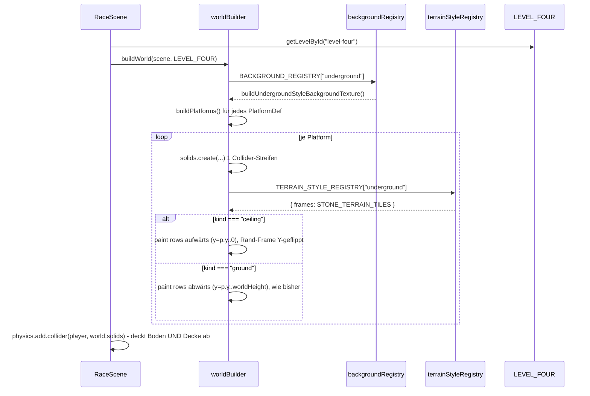

# Design: Level-Four-Underground

## Architektur-Überblick

Das Feature fügt sich in die bestehende Level-Architektur ein (`docs/03-architektur.md`,
`level-one-arena`/`level-three-underground`): Level-Inhalt bleibt reine, deklarative Daten
(`LevelDef`), getrennt von Rendering (`worldBuilder.ts`) und Physik (`RaceScene.ts`).

Drei bestehende Erweiterungspunkte werden genutzt, ein neuer eingeführt:

1. **Neues Level-Modul** `client/src/game/level/levelFour.ts` (`LEVEL_FOUR`), registriert in
   `levelRegistry.ts` als `"level-four"` / "Level 4 – Underground". Analog zu `LEVEL_THREE`.
2. **Neuer `backgroundKey: "underground"`** in `world/backgroundRegistry.ts` ->
   `buildUndergroundStyleBackgroundTexture()` (neue Funktion in `proceduralBackgrounds.ts`,
   SMB-1-2-Optik: schwarzer Grund + grünliches Backstein-/Blockraster).
3. **Neuer `terrainStyleKey: "underground"`** in `world/terrainStyleRegistry.ts` – anders als
   `"night"` (reiner Tint) referenziert dieser Style ein **eigenes Frame-Set** (echte graue
   Stein-Tiles aus `Terrain (16x16).png`, s.u.), kein Tint.
4. **Neues `PlatformDef.kind: "ceiling"`** (`level/types.ts`) + Rendering-Zweig in
   `worldBuilder.ts#paintTerrainSegment`. Das ist die einzige strukturelle Neuerung; Physik und
   Bot-Sicht (`level/tiles.ts`) benötigen **keine** Änderung (siehe unten, "Warum Decke ohne
   Physik-/Tiles-Änderung funktioniert").

Alle vier Punkte sind additiv (Open/Closed): `LEVEL_ONE`-`LEVEL_THREE` und ihr Rendering bleiben
unverändert, da sie weder den neuen `kind`, noch die neuen Registry-Keys referenzieren.

### Warum Decke ohne Physik-/Tiles-Änderung funktioniert

Zwei bestehende Mechanismen tragen die Decke bereits, ohne angefasst zu werden müssen:

- **Kollision:** `RaceScene.ts` registriert `this.physics.add.collider(this.player,
  this.world.solids)` gegen die GESAMTE `solids`-StaticGroup. `buildPlatforms()` erzeugt pro
  `PlatformDef` genau EINEN unsichtbaren Collider (`p.x + segWidth/2, p.y + TILE_SIZE/2`, Höhe
  `TILE_SIZE`). Nur `kind: "float"` schränkt `checkCollision` auf "von oben" ein; jeder andere
  `kind` (bisher nur `"ground"`, künftig auch `"ceiling"`) kollidiert per Arcade-Physics-Default
  von ALLEN Seiten. Ein `"ceiling"`-Collider-Streifen blockt den Bot also automatisch von unten,
  ohne dass `RaceScene.ts` einen Sonderfall braucht.
- **Bot-Sicht:** `level/tiles.ts#isSolidAt(level, col, row)` iteriert bereits alle
  `level.platforms` unabhängig von `kind` und prüft nur `row === tileSizeToRow(platform.y)`. Ein
  `"ceiling"`-Segment mit passendem `y` wird dadurch automatisch als `"solid"` erkannt –
  `isSolidAt`/`tileTypeAt`/`buildNearbyTiles` bleiben unverändert.

Der einzige Ort, der tatsächlich `kind`-spezifisch reagieren muss, ist die rein visuelle
`paintTerrainSegment()` (Zeichenrichtung + Frame-Auswahl).

## Schnittstellen & Datenmodelle

### `level/types.ts`

```ts
export interface PlatformDef {
  x: number;
  y: number;
  tilesWide: number;
  /** "ground" = solides Bodensegment (füllt nach unten bis worldHeight),
   *  "float" = schmale Schwebeplattform (jump-through),
   *  "ceiling" = solides Deckensegment (füllt nach oben bis y=0).
   *  Default "ground". */
  kind?: "ground" | "float" | "ceiling";
}
```

Kein Feld wird entfernt/umbenannt – rein additive Erweiterung der Union.

### `world/terrainStyleRegistry.ts`

```ts
export interface TerrainFrameSet {
  topLeft: number; topMid: number; topRight: number;
  midLeft: number; midMid: number; midRight: number;
}

export interface TerrainStyleSpec {
  tint?: number;
  /** Alternatives Frame-Set (statt Tint auf TERRAIN_TILES). Optional -
   *  Default: TERRAIN_TILES (bestehendes Gras/Erd-Set). */
  frames?: TerrainFrameSet;
}

export const TERRAIN_STYLE_REGISTRY: Record<string, TerrainStyleSpec> = {
  default: {},
  night: { tint: 0x4a4a63 },
  underground: { frames: STONE_TERRAIN_TILES }, // neu
};
```

`STONE_TERRAIN_TILES` wird in `assets/spriteSheets.ts` neben `TERRAIN_TILES` exportiert (gleiche
Datei, da dort bereits `TILESET_COLS`/`tileIndex()` leben):

```ts
// Grauer "Castle"-Steinblock: Spalten 0-2, Reihe 0 (siehe Analyse unten) -
// einzige durchgehend deckende (nicht-transparente) Reihe dieses Sets.
// Reihe 1 hat in Spalte 1 einen transparenten Bereich (Rahmen-Innenseite)
// und eignet sich daher NICHT als Fläche - Reihe 0 wird deshalb sowohl für
// die Rand- als auch die Füll-Frames verwendet (ergibt eine gleichmäßige
// Backstein-Wand statt eines hohlen Rahmens).
export const STONE_TERRAIN_TILES: TerrainFrameSet = {
  topLeft: tileIndex(0, 0),
  topMid: tileIndex(1, 0),
  topRight: tileIndex(2, 0),
  midLeft: tileIndex(0, 0),
  midMid: tileIndex(1, 0),
  midRight: tileIndex(2, 0),
};
```

*Bildanalyse (durchgeführt für dieses Design, siehe unten "Tileset-Sichtung"): Das Tileset
enthält keinen zweiten, durchgehend deckenden grauen Bereich, der dem bestehenden
Top/Mid-Schema entspricht (die "Castle"-Reihe 1 ist als Rahmen mit transparenter Mitte gebaut,
die grauen "Rohr"-Blöcke bei Spalte 12-14/Reihe 4-6 sehen wie Lüftungsrohre aus, nicht wie
Naturstein). Reihe 0 (Spalten 0-2) ist die einzige saubere, vollständig deckende graue Fläche
und wird deshalb sowohl für Rand- als auch Füll-Tiles verwendet.*

### `world/backgroundRegistry.ts`

```ts
export const BACKGROUND_REGISTRY: Record<string, BackgroundSpec> = {
  default: { kind: "image", textureKey: "background" },
  "smb1-1": { kind: "procedural", buildTexture: buildSmb1StyleBackgroundTexture },
  night: { kind: "procedural", buildTexture: buildNightStyleBackgroundTexture },
  underground: { kind: "procedural", buildTexture: buildUndergroundStyleBackgroundTexture }, // neu
};
```

### `world/proceduralBackgrounds.ts` – neue Funktion

```ts
export function buildUndergroundStyleBackgroundTexture(
  scene: Phaser.Scene,
  worldHeight: number
): string
```

Analog zu `buildNightStyleBackgroundTexture`: einheitlicher fast-schwarzer Grundton
(`0x000000`/`0x0a0a0a`), darüber ein regelmäßiges Raster aus grünlichen Backstein-Rechtecken
(`0x2a7a3a`-artiger NES-Grünton für die Fläche, dunklerer Grün-/Schwarzton für die Fugenlinien),
gezeichnet als sich wiederholendes Muster über `TILE_W=512` (gleiche Kachel-Breite wie die
bestehenden Hintergründe). Kein Gradient/keine Perspektive nötig – SMB-1-2 nutzt ein flaches,
sich wiederholendes 2D-Rechteckraster.

### `level/levelFour.ts` – neue `LevelDef`

- `worldWidth: 2600`, `worldHeight: 540`, `groundY: 500` (gleiche Größenordnung wie
  `LEVEL_ONE`-`LEVEL_THREE`).
- `backgroundKey: "underground"`, `terrainStyleKey: "underground"`.
- **Korridorhöhe:** `CEILING_CLEARANCE = 224` (14 Tiles). Ceiling-Collider-Row liegt bei
  `y = GROUND_Y - CEILING_CLEARANCE`. Herleitung: max. Sprunghöhe bei `JUMP_VELOCITY=-560`,
  `gravity=900` ist laut bestehenden Level-Kommentaren ≈174px; Spieler-Hitbox ist 32px hoch
  (`RaceScene.ts: body.setSize(24, 32)`); 224px lässt ⁠>⁠30px Sicherheitsabstand über einem vollen
  Sprung + Spielerhöhe (174 + 32 = 206 < 224), sodass reguläre Sprünge unter der Decke ohne
  zwingenden Kopfstoß möglich sind (AC US-1). Ein Bot KANN sich absichtlich stoßen (z.B. um einen
  versteckten Deckenblock zu treffen), muss es aber für normale Fortbewegung nicht.
- **Platzierung:** Für jedes Boden-Segment (`kind: "ground"`, wie in `LEVEL_THREE`) wird ein
  exakt deckungsgleiches Decken-Segment (`kind: "ceiling"`, gleiche `x`/`tilesWide`, `y: GROUND_Y
  - CEILING_CLEARANCE`) ergänzt – durchgehend geschlossener Korridor über die ganze befahrbare
  Strecke (offene Frage aus `requirements.md` damit entschieden: **kein** deckenloser Abschnitt,
  volle Konsistenz mit dem "geschlossener Tunnel"-Bild).
- **Lücken:** identische Boden-Lücken-Logik wie `LEVEL_THREE` (128px, komfortabel), da laut
  Requirements Level 4 primär thematisch, nicht schwierigkeitssteigernd, gedacht ist.
- **Hazards:** Wiederverwendung bestehender Kinds (Schnetzler, Stachlinger, Loderix – reduzierte
  Anzahl/Timing wie `LEVEL_THREE`), kein neuer Typ. Kein Spikehead, da dessen Fallhöhe
  (`originY` typ. deutlich über Bodenhöhe) in einem 224px-Korridor knapper zu takten wäre – wird
  in diesem Level bewusst ausgelassen (YAGNI, vermeidet zusätzliche Timing-Feinarbeit für ein
  primär thematisches Level).
- **Coins/Blöcke/Checkpoints:** gleiche Größenordnung wie die übrigen Level (10-15 sichtbare
  Münzen, 3-5 versteckte Blöcke, ≥3 Checkpoints).

## Ablauf / Sequenz



## Fehlerbehandlung & Edge Cases

- **Unbekannter `terrainStyleKey`/`backgroundKey`:** bestehendes Verhalten (`Record`-Lookup ohne
  Fallback) bleibt – ein Tippfehler in `LEVEL_FOUR` führt zu `undefined`/Laufzeitfehler beim
  Zugriff, analog zum bestehenden Verhalten bei `LEVEL_THREE`. Kein neues Fail-Fast nötig (keine
  Verschlechterung ggü. Status quo).
- **Ceiling-Segment ohne passendes Boden-Segment (Asymmetrie):** wird für `LEVEL_FOUR` durch
  Konstruktion ausgeschlossen (jedes Ground-Segment bekommt sein Ceiling-Pendant, per Test
  abgesichert, siehe Test-Strategie) – kein Laufzeit-Check in `worldBuilder.ts` nötig (YAGNI,
  Level ist statische, entwicklerkontrollierte Daten, keine Nutzereingabe).
  Bewusst KEIN generischer "jedes Ground braucht Ceiling"-Zwang in `types.ts`/`worldBuilder.ts` –
  andere Level bleiben deckenlos, das ist weiterhin gültig.
- **`tilesWide=0`/negative Werte:** wie bisher nicht separat validiert (bereits bestehendes
  Verhalten für `"ground"`/`"float"`, keine Regression, kein neuer Sonderfall für `"ceiling"`).
- **Ceiling-Row außerhalb der Welt (`y < 0`):** durch die feste `CEILING_CLEARANCE`-Konstante und
  `worldHeight=540`/`groundY=500` numerisch ausgeschlossen (`500-224=276 > 0`); keine Laufzeit-
  Prüfung nötig, da rein statische Level-Daten.

## Test-Strategie

**Unit-getestet (Vitest), TDD Rot-Grün-Refactor:**

- `client/src/game/level/levelFour.test.ts` (neu, analog `levelThree.test.ts`):
  - 10-15 sichtbare Münzen, 3-5 versteckte Blöcke, ≥3 Checkpoints.
  - nur bestehende Hazard-Kinds.
  - `backgroundKey === "underground"`, `terrainStyleKey === "underground"`.
  - eindeutige IDs über alle Entities.
  - `worldWidth` 2400-3000px.
  - jede Boden-Lücke ≤128px (wie `LEVEL_THREE`).
  - **neu:** jedes `kind: "ground"`-Segment hat ein deckungsgleiches `kind: "ceiling"`-Segment
    (gleiches `x`/`tilesWide`) – sichert den "durchgehend geschlossener Korridor"-Anspruch ab.
  - **neu:** jedes `kind: "ceiling"`-Segment liegt bei `y === GROUND_Y - CEILING_CLEARANCE`
    (konsistente Korridorhöhe).
  - Münzen/Blöcke/Checkpoints/Utilities liegen über einem Boden-Segment (wie bisher).
- `client/src/game/level/levelRegistry.test.ts` (erweitert): `"level-four"` ist auflösbar,
  liefert `LEVEL_FOUR`, bestehende Einträge bleiben unverändert (Regressionsschutz).
- `client/src/game/world/terrainStyleRegistry.test.ts` (erweitert): `"underground"`-Eintrag hat
  `frames` (kein `tint`), `STONE_TERRAIN_TILES`-Frame-Indizes sind gültige, verschiedene
  Zahlen (kein versehentliches Duplikat, das drei identische Frames ergäbe – hier bewusst
  gewollt für Rand UND Mitte, siehe Design, daher: Test prüft nur "sind gültige Tile-Indizes im
  Wertebereich des 22×11-Tilesets", nicht "sind paarweise verschieden").
- `level/tiles.test.ts` (erweitert): ein `"ceiling"`-Platform-Fixture wird von `isSolidAt`
  korrekt als solid erkannt (Regressionsschutz/Dokumentation, dass die bestehende
  kind-agnostische Logik auch für `"ceiling"` funktioniert – siehe Architektur-Überblick).

**Bewusst NICHT unit-getestet (Phaser/Canvas-Rendering, analog `level-three-underground`):**

- `buildUndergroundStyleBackgroundTexture()` (visuelle Pixel-Komposition).
- Der `"ceiling"`-Zweig in `paintTerrainSegment()` (visuelles Zeichnen/Flip) – manuell im
  Dev-Modus (`npm run dev`, Level 4 auswählen) verifiziert: Korridor sieht geschlossen aus,
  Deckentiles wirken nicht wie invertierter Boden.
- Tatsächliches Spielgefühl der Kollision (Kopf stößt nicht bei normalem Sprung an) – manuell im
  Dev-Modus verifiziert (Bot-frei durchspringen der Passagen).

## Auswirkungen auf bestehenden Code

| Datei | Änderung |
|---|---|
| `level/types.ts` | `PlatformDef.kind` um `"ceiling"` erweitert (additiv) |
| `level/levelFour.ts` | neu |
| `level/levelFour.test.ts` | neu |
| `level/levelRegistry.ts` | neuer Eintrag `"level-four"` |
| `level/levelRegistry.test.ts` | erweitert um `"level-four"`-Fall |
| `level/tiles.test.ts` | erweitert um `"ceiling"`-Fixture-Test |
| `assets/spriteSheets.ts` | neuer Export `STONE_TERRAIN_TILES` (+ `TerrainFrameSet`-Typ, falls dort statt in `terrainStyleRegistry.ts` platziert – finale Platzierung: Typ in `terrainStyleRegistry.ts`, da dort bereits `TerrainStyleSpec` lebt; Frame-Konstante in `spriteSheets.ts`, da dort bereits `TERRAIN_TILES`/`tileIndex()` leben) |
| `world/terrainStyleRegistry.ts` | `TerrainStyleSpec.frames?` (neues optionales Feld), neuer Eintrag `"underground"` |
| `world/terrainStyleRegistry.test.ts` | erweitert um `"underground"`-Fall |
| `world/proceduralBackgrounds.ts` | neue Funktion `buildUndergroundStyleBackgroundTexture` |
| `world/backgroundRegistry.ts` | neuer Eintrag `"underground"` |
| `world/worldBuilder.ts` | `paintTerrainSegment()`: neuer `"ceiling"`-Zweig (aufwärts zeichnen, Rand-Frame Y-geflippt) + Frame-Set kommt aus `style.frames ?? TERRAIN_TILES` statt hartkodiert `TERRAIN_TILES` |
| `docs/06-level-design.md` | Ergänzung um Level 4 (siehe Begleitende Doku-Updates in `requirements.md`) |

Keine Änderung an `RaceScene.ts`, `level/tiles.ts` (Produktivcode – nur Test erweitert),
`hazards/*`, Scoring/Turniermodus.

## Tileset-Sichtung (Referenz)

Für die Frame-Auswahl wurde `client/public/assets/Terrain/Terrain (16x16).png` (352×176px,
22×11 Tiles à 16px) systematisch gerastert und gesichtet:

- Spalten 0-2, Reihe 0: durchgehend deckende graue Steinblock-Tiles (gewählt, s.o.).
- Spalten 0-2, Reihe 1: selbes Set als Rahmen gedacht – Mitte transparent (verworfen).
- Spalten 3-5, Reihen 0-1: einzelne lose Stein-Deko-Chunks, keine Fläche (nicht relevant hier).
- Spalten 6-8, Reihen 0-1: bestehendes Gras/Erd-Set (`TERRAIN_TILES`, unverändert genutzt von
  `LEVEL_ONE`/`LEVEL_TWO`/Default-Style).
- Spalten 12-14, Reihen 4-6: graue "Rohr/Lüftungs"-Blöcke – optisch nicht als Naturstein lesbar
  (verworfen).
- Spalten 16-18, Reihen 4-6: rote Backstein-Wand, durchgehend deckend, aber rot statt grau
  (nicht relevant für "graue Steine", potenzieller Kandidat für ein ggf. späteres Level).
