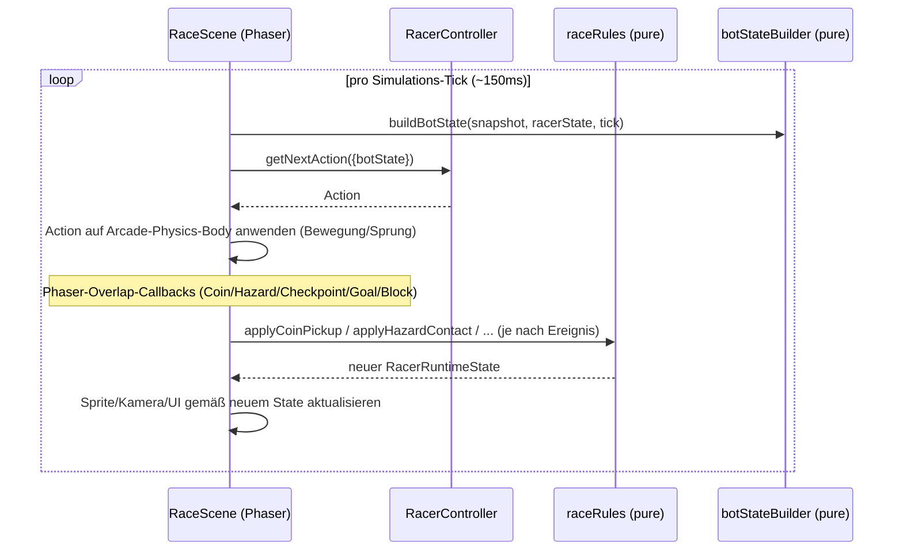

# Design: Level-One-Arena (erstes Level + Phaser-Integration)

Bezug: `.features/level-one-arena/requirements.md` (US-1 bis US-9)

## Architektur-Überblick

Gleiches Grundprinzip wie in `bot-decide-api`: eine **pure, vollständig testbare
"Rules Engine"** (Level-Daten, Hazard-Zeitverhalten, Kollisions-Entscheidungen,
State-Building, Scoring) wird strikt von einer **dünnen Phaser-Schicht** (Rendering,
Input, Arcade-Physics-Wiring) getrennt. Die Phaser-Schicht ruft nur die pure Engine
auf und wendet deren Ergebnisse auf Sprites/Kamera an – sie enthält selbst **keine**
Spielregel-Entscheidungen (SRP, Testbarkeit ohne Canvas/Browser).

```
┌─────────────────────────────────────────────────────────────────────┐
│                  client/src/game (Phaser-Schicht, dünn)              │
│  RaceScene.ts  ──▶  worldBuilder.ts  ──▶  hazards/factory.ts          │
│       │                                                                │
│       ├─ liest Input (Tastatur) ODER fragt BotController/BotRunner    │
│       └─ ruft pro Tick die Rules Engine auf, wendet Ergebnis auf      │
│          Sprites/RacerRuntimeState an                                 │
└───────────────────────────┬───────────────────────────────────────────┘
                              │ ruft auf (rein, keine Phaser-Typen)
┌───────────────────────────▼───────────────────────────────────────────┐
│               client/src/game/{level,hazards,rules,state} (pure)      │
│  level/levelOne.ts   hazards/behaviors.ts   rules/raceRules.ts         │
│  state/botStateBuilder.ts   scoring.ts                                 │
└─────────────────────────────────────────────────────────────────────┘
```

Steuerung (US-6/US-7) ist über eine schmale `RacerController`-Abstraktion entkoppelt
(Dependency Inversion): `RaceScene` kennt nur `RacerController`, nicht ob dahinter
Tastatur oder ein `BotRunner` (aus `@arena/bot-contract`/`client/src/sandbox`) steckt.
Das macht US-8 (Wiederverwendbarkeit, künftiges Multi-Racer-Setup) einfacher: pro
Racer genau ein `RacerController` + ein `RacerRuntimeState`, nichts davon ist global
auf "einen" Racer festverdrahtet.

## Repo-/Modulstruktur

```
client/src/game/
  level/
    types.ts                # LevelDef, PlatformDef, CoinDef, HiddenCoinBlockDef,
                             # CheckpointDef, GoalDef, HazardInstanceDef, UtilityInstanceDef
    levelOne.ts              # Die konkrete LEVEL_ONE-Daten (siehe US-1)
    levelOne.test.ts         # Größen-/Struktur-Assertions gemäß docs/06 + US-1
    tiles.ts                 # tileTypeAt(), buildNearbyTiles() – pure Tile-Ableitung
    tiles.test.ts
  hazards/
    registry.ts              # HAZARD_REGISTRY/UTILITY_REGISTRY: kind -> {texture, stompable, behavior, hitbox}
    behaviors.ts             # pure Zeit-Funktionen: patrolX(), timedActive(), pendulumOffset()
    behaviors.test.ts
    factory.ts               # Phaser: Sprite+Body aus Def+Registry (dünn, ungetestet)
  rules/
    racerState.ts            # RacerRuntimeState-Typ + createInitialRacerState()
    raceRules.ts             # pure Reducer: applyCoinPickup, applyHazardContact,
                             # resolveHazardContact, applyCheckpointReached,
                             # applyBlockHit, applyGoalReached, applyPitFall,
                             # applyTimeLimitReached
    raceRules.test.ts
  state/
    worldSnapshot.ts         # WorldSnapshot-Typ (plain data, keine Phaser-Typen)
    botStateBuilder.ts       # pure: (WorldSnapshot, RacerRuntimeState) -> BotState
    botStateBuilder.test.ts
  scoring.ts                 # pure computeScore() gemäß docs/05
  scoring.test.ts
  control/
    RacerController.ts       # Interface: getNextAction(input): Action | Promise<Action>
    KeyboardController.ts    # liest Phaser.Types.Input.Keyboard.CursorKeys
    KeyboardController.test.ts
    BotController.ts         # wrappt BotRunner (client/src/sandbox), async
    BotController.test.ts
    useArenaControls.ts       # React-Hook: Modus-/Bot-Auswahl-State für DevPage
    useArenaControls.test.ts  # (US-8, analog zu useWebSocketConnection-Muster)
  world/
    worldBuilder.ts           # Phaser: LevelDef -> Sprites/Bodies (dünn, ungetestet)
  scenes/
    RaceScene.ts               # Orchestrierung (dünn, ungetestet, manuell verifiziert)
  ArenaView.tsx                # React-Komponente, mountet Phaser.Game (US-8)

client/src/pages/DevPage.tsx     # nutzt <ArenaView/>, Umschalt-/Bot-Auswahl-UI (US-8)
```

Bewusst KEIN `scenes/sceneKeys.ts` (anders als im Prototyp): Es gibt in diesem
Feature genau eine Phaser-Szene (`RaceScene`). Eine eigene Datei zur Verwaltung
mehrerer Szenen-Schlüssel wäre Über-Engineering für ein Problem, das noch nicht
existiert (YAGNI) – `RaceScene` nutzt einfach ihren Klassennamen als Scene-Key.
Sobald ein zweites Szenen-Bedürfnis entsteht (z.B. eine Menü-/Boot-Szene für
`/present`), wird an der Stelle eingeführt, was dann tatsächlich gebraucht wird.

Ebenfalls bewusst noch KEIN `ArenaView.test.tsx` in der Struktur gelistet: laut
Test-Strategie ist `ArenaView` vorerst nicht unit-getestet (reines Mounting ohne
eigene Verzweigungslogik). Ein Test wird erst angelegt, wenn tatsächlich
Verzweigungslogik entsteht (Rot-Grün-Prinzip gilt dann genauso) – eine vorab
gelistete, leere Test-Datei wäre nur Attrappe.

Warum diese Aufteilung? `level/`, `hazards/registry.ts`, `hazards/behaviors.ts`,
`rules/`, `state/`, `scoring.ts` sind **reine Funktionen/Daten ohne Phaser-Import**
– exakt wie `@arena/bot-contract` in `bot-decide-api`. `hazards/factory.ts`,
`world/`, `scenes/`, `control/KeyboardController.ts` sind Phaser-/Browser-
spezifisch. Diese Trennung existiert bewusst **innerhalb von `client`** (nicht
als eigenes Package): anders als der Bot-Contract wird diese Logik aktuell
ausschließlich vom `client` gebraucht (kein zukünftiger Server-Bedarf
ersichtlich) – ein eigenes Package wäre hier YAGNI.

## Schnittstellen & Datenmodelle

### `level/types.ts`

```ts
import type { HazardKind, UtilityKind } from "@arena/bot-contract";

export interface PlatformDef {
  x: number; y: number; tilesWide: number;
  kind?: "ground" | "float"; // Default "ground"
}

export interface CoinDef { id: string; x: number; y: number; fruit: FruitKind; }

/** Versteckter Block – wird erst nach Treffer von unten zu einer CoinDef-artigen Münze. */
export interface HiddenCoinBlockDef { id: string; x: number; y: number; fruit: FruitKind; }

export interface CheckpointDef { id: string; x: number; y: number; }

export interface GoalDef { x: number; y: number; }

// Hazard-/Utility-Geometrie – Kind kommt aus @arena/bot-contract (Single Source of
// Truth für die Kind-Strings), Geometrie/Timing lebt hier (Level-Belang, nicht
// Bot-Contract-Belang – siehe bot-decide-api/design.md, Abgrenzungsprinzip).
// `Extract<HazardKind, "...">` statt eines einfachen String-Literals ist bewusst
// gewählt: entfernte/umbenannte HazardKind-Werte in @arena/bot-contract würden
// hier zu `never` und damit zu einem Compile-Fehler führen (Drift-Schutz
// zwischen Bot-Contract und Level-Daten, statt stillem Auseinanderlaufen).
export type HazardInstanceDef =
  | { kind: Extract<HazardKind, "schnetzler">; id: string; x: number; y: number; minX: number; maxX: number; speed: number }
  | { kind: Extract<HazardKind, "stachlinger">; id: string; x: number; y: number }
  | { kind: Extract<HazardKind, "loderix">; id: string; x: number; y: number; onMs?: number; offMs?: number; phaseMs?: number }
  | { kind: Extract<HazardKind, "kugelblitz">; id: string; pivotX: number; pivotY: number; length: number; periodMs?: number; amplitudeDeg?: number };

export interface UtilityInstanceDef {
  kind: UtilityKind; // "boingo"
  id: string; x: number; y: number;
}

export interface LevelDef {
  worldWidth: number; worldHeight: number; groundY: number;
  spawn: { x: number; y: number };
  goal: GoalDef;
  platforms: PlatformDef[];
  coins: CoinDef[];
  hiddenCoinBlocks: HiddenCoinBlockDef[];
  checkpoints: CheckpointDef[];
  hazards: HazardInstanceDef[];
  utilities: UtilityInstanceDef[];
}
```

`FruitKind` (Frucht → Score-Wert-Mapping) lebt ebenfalls in `level/types.ts` als
kleines, festes Mapping (`FRUIT_VALUES: Record<FruitKind, number>`), analog zum
Prototyp – reine Daten, kein Test nötig (keine Verzweigungslogik).

### `level/levelOne.test.ts` (Task vor `levelOne.ts` – US-1)

Statt eines generischen Level-Validators (YAGNI: wir haben genau ein Level) prüft
ein Test direkt die Struktur-Vorgaben aus `docs/06`/US-1 gegen die konkrete
`LEVEL_ONE`-Konstante:
```ts
expect(LEVEL_ONE.coins.length).toBeGreaterThanOrEqual(10);
expect(LEVEL_ONE.coins.length).toBeLessThanOrEqual(15);
expect(LEVEL_ONE.hiddenCoinBlocks.length).toBeGreaterThanOrEqual(3);
expect(LEVEL_ONE.hiddenCoinBlocks.length).toBeLessThanOrEqual(5);
expect(LEVEL_ONE.checkpoints.length).toBeGreaterThanOrEqual(2);
expect(LEVEL_ONE.hazards.map(h => h.kind)).toEqual(
  expect.arrayContaining(["schnetzler", "stachlinger", "loderix", "kugelblitz"])
);
expect(LEVEL_ONE.utilities.length).toBeGreaterThanOrEqual(1);
```

### `level/tiles.ts` – pure Tile-Ableitung (US-4, Sichtfeld)

Kein vorab berechnetes Grid nötig (KISS): Tile-Typ wird pro Zelle **on demand**
aus der Plattform-Geometrie + dynamischem Zustand abgeleitet.

```ts
export interface DynamicTileState {
  /** IDs aktuell aktiver (gefährlicher) Hazards. */
  activeHazardIds: ReadonlySet<string>;
  /** IDs bereits ausgelöster (zu Münzen gewordener) Blöcke. */
  resolvedBlockIds: ReadonlySet<string>;
}

/**
 * `DynamicTileState` wird NIE eigenständig gespeichert/gepflegt (DRY: kein
 * zweiter Ort, an dem "welcher Block ist schon offen" oder "welcher Hazard ist
 * gerade aktiv" auseinanderdriften könnte). Stattdessen wird sie jeden Tick neu
 * abgeleitet:
 * - `activeHazardIds` rein aus `(level.hazards, elapsedMs)` via `isTimedActive`
 *   (siehe `hazards/behaviors.ts`) – ein globaler, zeitbasierter Wert, unabhängig
 *   vom Racer.
 * - `resolvedBlockIds` 1:1 aus `racer.resolvedBlockIds` (siehe `racerState.ts`) –
 *   `RacerRuntimeState` ist hier die einzige Quelle der Wahrheit.
 */
export function buildDynamicTileState(
  level: LevelDef,
  racer: RacerRuntimeState,
  elapsedMs: number
): DynamicTileState;

export function tileTypeAt(
  level: LevelDef,
  col: number,
  row: number,
  dynamic: DynamicTileState
): TileType; // "solid" | "hazard" | "coinBlock" | "goal" | "empty"

export function buildNearbyTiles(
  level: LevelDef,
  dynamic: DynamicTileState,
  centerCol: number,
  centerRow: number,
  width = 7,
  height = 5
): TileType[][];
```
`tileTypeAt` prüft in fester Reihenfolge (Fail-Fast-Kette, analog `validateBotModule`):
aktiver Hazard an dieser Position? → `"hazard"`; unresolved `HiddenCoinBlockDef` an
dieser Position? → `"coinBlock"`; Ziel-Tile? → `"goal"`; innerhalb eines
Plattform-Segments? → `"solid"`; sonst `"empty"`. `"unknown"` wird hier nicht
erzeugt (nur relevant, falls das Sichtfeld über den Levelrand hinausragt – dann
`"empty"`, da außerhalb der Welt nichts Gefährliches lauert – bewusste
Vereinfachung, YAGNI).

### `hazards/registry.ts` – Rendering-/Verhaltens-Metadaten (US-9, Open/Closed)

Analog zum `HAZARD_REGISTRY`-Muster aus `bot-decide-api`'s Vorbild (`docs/08`):
bündelt pro Hazard-/Utility-Kind alle darstellungs- und verhaltensrelevanten
Metadaten an EINER Stelle, damit `worldBuilder`/`factory` keine
Kind-spezifischen Sonderfälle kennen müssen.

```ts
export type HazardBehaviorKind = "patrol" | "static" | "timed" | "pendulum";

export interface HitboxSpec {
  width: number; height: number; offsetX?: number; offsetY?: number;
}

export interface HazardSpec {
  texture: string;
  anim?: string;
  stompable: boolean;
  behavior: HazardBehaviorKind;
  hitbox: HitboxSpec;
}

export const HAZARD_REGISTRY: Record<HazardKind, HazardSpec> = {
  schnetzler: { texture: "saw", anim: "saw-spin", stompable: true, behavior: "patrol", hitbox: { width: 28, height: 28 } },
  stachlinger: { texture: "spikes", stompable: false, behavior: "static", hitbox: { width: 16, height: 10 } },
  loderix: { texture: "fire-on", stompable: false, behavior: "timed", hitbox: { width: 12, height: 22 } },
  kugelblitz: { texture: "spiked-ball", stompable: false, behavior: "pendulum", hitbox: { width: 24, height: 24 } },
};

export interface UtilitySpec {
  texture: string; idleAnim: string; triggerAnim: string; hitbox: HitboxSpec;
}
export const UTILITY_REGISTRY: Record<UtilityKind, UtilitySpec> = {
  boingo: { texture: "trampoline", idleAnim: "boingo-idle", triggerAnim: "boingo-jump", hitbox: { width: 26, height: 10 } },
};
```
Neuer Hazard-Typ = neuer Eintrag in `HAZARD_REGISTRY` (+ ggf. neuer
`HazardBehaviorKind`, falls kein bestehendes Verhalten passt) – `factory.ts`
und `RaceScene` verzweigen nie selbst nach `kind`, sondern lesen nur aus dieser
Registry (Open/Closed, exakt wie in `docs/08` beschrieben). Reine
Konstanten-Deklaration ohne Verzweigungslogik – kein eigener Test nötig.

### `hazards/behaviors.ts` – pure Zeitfunktionen (US-3)

```ts
type SchnetzlerDef = Extract<HazardInstanceDef, { kind: "schnetzler" }>;
type LoderixDef = Extract<HazardInstanceDef, { kind: "loderix" }>;
type KugelblitzDef = Extract<HazardInstanceDef, { kind: "kugelblitz" }>;

export function patrolX(def: SchnetzlerDef, elapsedMs: number): number; // aktuelle x-Position
export function isTimedActive(def: LoderixDef, elapsedMs: number): boolean;
export function pendulumOffset(def: KugelblitzDef, elapsedMs: number): { x: number; y: number };
```
Alle drei sind reine Funktionen von `(Def, elapsedMs) -> Wert` – vollständig ohne
Phaser testbar (kein Sprite nötig). `hazards/factory.ts` (Phaser-Schicht) ruft sie
pro Frame auf und setzt die berechnete Position/den Aktivzustand aufs Sprite.
`stachlinger` (immer aktiv, unbeweglich) und `boingo` (kein Zeitverhalten)
brauchen keine eigene Behavior-Funktion (`HAZARD_REGISTRY.stachlinger.behavior
=== "static"` heißt schlicht: keine Positions-/Aktivitäts-Berechnung nötig).

### `rules/racerState.ts`

```ts
export interface RacerRuntimeState {
  x: number; y: number; facing: "left" | "right"; onGround: boolean;
  isAlive: boolean; finished: boolean; didNotFinish: boolean;
  coinsCollected: number; fruitScore: number; livesRemaining: number;
  deaths: number; timeElapsedMs: number;
  /** Position des zuletzt erreichten Checkpoints (Respawn-Ziel). Nur der
   *  LETZTE wird gebraucht (siehe US-3) – bewusst KEIN Set aller jemals
   *  erreichten Checkpoints (YAGNI, kein Akzeptanzkriterium braucht das). */
  lastCheckpoint: { x: number; y: number };
  /**
   * IDs bereits eingesammelter Münzen (inkl. aus aufgelösten Blöcken
   * entstandener) und bereits ausgelöster Blöcke. Bewusst Teil des
   * Racer-State (nicht der Phaser-Szene): `WorldSnapshot`/`nearbyTiles` für
   * einen Racer lassen sich dadurch rein aus `(LevelDef, RacerRuntimeState)`
   * ableiten, ohne lebende Phaser-Sprites abzufragen (Single Source of
   * Truth, passt zum unidirektionalen Datenfluss – siehe "Ablauf/Sequenz").
   * Zusätzlicher Nutzen für US-8: ein künftiger zweiter Racer bekommt einfach
   * seinen EIGENEN `RacerRuntimeState` – da es keine Bot-zu-Bot-Kollision
   * gibt (docs/03), braucht jeder Racer ohnehin seine eigene Sicht auf
   * "welche Münzen/Blöcke habe ICH schon konsumiert".
   */
  collectedCoinIds: ReadonlySet<string>;
  resolvedBlockIds: ReadonlySet<string>;
}

export function createInitialRacerState(level: LevelDef): RacerRuntimeState;
// lastCheckpoint startet als level.spawn (der Startpunkt IST der erste,
// implizite Checkpoint – siehe requirements.md "Checkpoints"-Entscheidung).
// livesRemaining startet bei LIVES_PER_RUN.
```

### `rules/raceRules.ts` – die eigentlichen Spielregeln (pure, das Herzstück)

```ts
export const LIVES_PER_RUN = 3;               // docs/05
export const RUN_TIME_LIMIT_MS = 90_000;      // docs/05 ("Zeitlimit pro Heat")

export function applyCoinPickup(
  state: RacerRuntimeState, coinId: string, fruitValue: number
): RacerRuntimeState;

export function applyBlockHit(
  state: RacerRuntimeState, blockId: string
): RacerRuntimeState; // markiert blockId als resolved; die daraus entstehende
                       // Münze wird erst separat via applyCoinPickup(state,
                       // blockId, fruitValue) eingesammelt, sobald berührt –
                       // blockId wird dabei 1:1 als coinId weiterverwendet
                       // (DRY: keine zweite ID für dasselbe Objekt nötig).
                       // Nimmt bewusst nur die ID entgegen (nicht den ganzen
                       // HiddenCoinBlockDef) – Fruchtwert/Position werden hier
                       // nicht gebraucht (ISP/KISS: schmalste ausreichende
                       // Signatur, analog zu applyCoinPickup).

export type HazardContactKind = "none" | "stomped" | "hit";

/**
 * Reine Entscheidung, OHNE Wissen über Phaser-Kollisions-Directions im Detail –
 * bekommt bereits vorverarbeitet, ob der Kontakt "von oben" war. Nimmt bewusst
 * nur `HazardKind` entgegen (nicht den vollen `HazardInstanceDef`): Geometrie
 * (`minX`/`speed`/`pivotX`/…) ist für diese Entscheidung irrelevant, nur
 * `HAZARD_REGISTRY[kind].stompable` zählt.
 */
export function resolveHazardContact(
  kind: HazardKind,
  isActive: boolean,
  contactFromAbove: boolean
): HazardContactKind;

/**
 * Nimmt bewusst NUR "stomped" | "hit" an (nicht "none"): Der Aufrufer
 * (`RaceScene`) ruft diese Funktion ausschließlich auf, wenn
 * `resolveHazardContact` bereits einen tatsächlichen Kontakt ermittelt hat.
 * Ein State-Update für "es gab gar keinen relevanten Kontakt" wäre eine
 * bedeutungslose No-Op-Fallunterscheidung, die der Typ von vornherein
 * ausschließt (KISS: kein toter Zweig, der trotzdem "getestet" werden müsste).
 * Braucht bewusst KEIN `LevelDef` mehr (anders als ein früherer Entwurf):
 * `state.lastCheckpoint` ist durch `createInitialRacerState` bereits immer
 * gültig (Default `level.spawn`) – ein zusätzlicher Level-Zugriff für einen
 * Fallback-Spawn-Punkt ist daher unnötig (YAGNI/geringere Kopplung).
 */
export function applyHazardContact(
  state: RacerRuntimeState,
  contact: Exclude<HazardContactKind, "none">
): RacerRuntimeState; // "hit" -> Leben--, Reset auf state.lastCheckpoint,
                       // isAlive=false falls livesRemaining danach 0 (s.u.);
                       // "stomped" -> keine Racer-State-Änderung (nur der
                       // Hazard selbst wird in der Szene deaktiviert/entfernt)

export function applyPitFall(state: RacerRuntimeState): RacerRuntimeState;
// identische Konsequenz wie ein Hazard-Treffer (siehe US-3), ebenfalls ohne
// LevelDef-Parameter (siehe Begründung bei applyHazardContact)

export function applyCheckpointReached(
  state: RacerRuntimeState, checkpoint: CheckpointDef
): RacerRuntimeState;

export function applyGoalReached(state: RacerRuntimeState): RacerRuntimeState;
// finished=true, isAlive bleibt wie zuvor, timeElapsedMs wird vom Aufrufer VOR
// diesem Call bereits aktuell gehalten (Scene erhöht es jeden Frame)

export function applyTimeLimitReached(state: RacerRuntimeState): RacerRuntimeState;
// didNotFinish=true, sofern nicht bereits finished
```

`applyHazardContact`/`applyPitFall` teilen sich eine kleine private Hilfsfunktion
`loseLifeAndRespawn(state)` (DRY: identische Konsequenz laut US-3) – setzt Position
auf `state.lastCheckpoint` zurück, zieht ein Leben ab. Wird `livesRemaining`
dadurch 0, wird zusätzlich `didNotFinish = true` und `isAlive = false` gesetzt
(US-3, "ausgeschieden").

### `state/worldSnapshot.ts` + `botStateBuilder.ts` (US-4)

```ts
export interface WorldSnapshot {
  level: LevelDef;
  dynamic: DynamicTileState;
  visibleCoins: ReadonlyArray<{ id: string; x: number; y: number; value: number }>;
  hazards: ReadonlyArray<{ id: string; kind: HazardKind; x: number; y: number; active: boolean }>;
  utilities: ReadonlyArray<{ id: string; kind: UtilityKind; x: number; y: number }>;
}

export function buildBotState(
  snapshot: WorldSnapshot,
  racer: RacerRuntimeState,
  tick: number
): BotState;
```
Nutzt intern `buildNearbyTiles` (aus `level/tiles.ts`) sowie einfache
Distanz-Minimierung (`nearestByDistance`) für `nearestCoin`/`nearestHazard`/
`nearestUtility` – eine kleine, wiederverwendete private Helper-Funktion (DRY,
statt drei Mal denselben "finde nächstes Element"-Code).

**Drift-Schutz:** `snapshot.hazards[i].active` und `snapshot.dynamic.activeHazardIds`
drücken denselben Fakt in zwei unterschiedlichen Formen aus (Bool pro Item vs.
ID-Set). Damit beide niemals auseinanderlaufen können, wird `snapshot.hazards`
IMMER aus `snapshot.dynamic.activeHazardIds` abgeleitet (`active:
dynamic.activeHazardIds.has(hazard.id)`) – es gibt nur EINE Berechnung
(`isTimedActive` in `hazards/behaviors.ts`), die aufrufende Scene baut daraus
zuerst `dynamic`, dann `hazards` (nie unabhängig parallel berechnet).

### `scoring.ts` (US-5)

Identisches Muster wie im Prototyp, aber mit den in US-5 benannten Konstanten als
einzige Quelle der Wahrheit:
```ts
export const SCORING = {
  POINTS_PER_COIN: 10,
  TIME_BUDGET_MS: 60_000,     // Schwelle für Zeitbonus – ACHTUNG: eigener Wert,
  TIME_BONUS_FACTOR: 0.01,    // unabhängig von RUN_TIME_LIMIT_MS (90s) aus raceRules.ts!
  DEATH_PENALTY: 15,
  DNF_PENALTY: 50,
} as const;

export interface ScoreInput {
  fruitScore: number; timeElapsedMs: number; deaths: number; reachedGoal: boolean;
}
export function computeScore(input: ScoreInput): number;
```
Bewusste begriffliche Trennung: `SCORING.TIME_BUDGET_MS` (60s, Schwelle für den
Zeitbonus in der Score-Formel) ist ein **anderer** Wert als `RUN_TIME_LIMIT_MS`
(90s, ab wann ein Lauf hart als DNF beendet wird) – beide stehen so in `docs/05`
("Referenzzeit für Bonus" vs. "Zeitlimit pro Heat") und dürfen nicht verwechselt/
zusammengelegt werden.

### `control/RacerController.ts` (US-6/US-7, DIP)

```ts
export interface ControllerInput {
  botState: BotState; // für BotController; KeyboardController ignoriert es
}

export interface RacerController {
  getNextAction(input: ControllerInput): Action | Promise<Action>;
  dispose(): void;
}
```
Bewusster Kompromiss (dokumentiert statt stillschweigend in Kauf genommen):
`KeyboardController` bekommt mit `input.botState` ein Argument, das es nie
braucht. Eine strengere ISP-Lösung (zwei unterschiedliche Interfaces) würde
`RaceScene` zwingen, den Controller-Typ zu kennen und unterschiedlich
aufzurufen – das widerspräche gerade dem Zweck dieser Abstraktion (US-6/US-7:
Scene kennt nur EINE `RacerController`-Schnittstelle). Der `BotState` wird pro
Tick ohnehin für andere Zwecke gebaut (Anzeige, potenzieller Logging-Bedarf),
die Mehrkosten sind bei ~150ms Tick-Rate vernachlässigbar – ein zweites
Interface wäre hier Über-Engineering (YAGNI).

```ts
// KeyboardController.ts
export class KeyboardController implements RacerController {
  constructor(private readonly keys: Phaser.Types.Input.Keyboard.CursorKeys) {}
  getNextAction(): Action {
    if (this.keys.left.isDown) return "left";
    if (this.keys.right.isDown) return "right";
    if (this.keys.space.isDown) return "jump"; // oder up.isDown
    return "idle";
  }
  dispose(): void {}
}
```
`KeyboardController` ist **doch** unit-testbar: `keys` ist bereits eine reine
Datenstruktur (`{left:{isDown}, right:{isDown}, space:{isDown}}`), kein
Phaser-Objekt muss dafür instanziiert werden – ein einfaches Test-Double reicht.

```ts
// BotController.ts
export class BotController implements RacerController {
  constructor(private readonly runner: BotRunner) {}
  getNextAction(input: ControllerInput): Promise<Action> {
    return this.runner.tick(input.botState);
  }
  dispose(): void { this.runner.dispose(); }
}
```
Dünner Adapter, aber mit eigenem Test (Fake-`BotRunner`, prüft reine
Delegation) – bewusst kein Verzicht auf den Test, da er die einzige Bindung
zwischen `bot-decide-api` und diesem Feature ist (Regressions-Schutz an der
Nahtstelle).

## Ablauf / Sequenz



`RaceScene` hält `RacerRuntimeState` als einzige Quelle der Wahrheit für
Spielfortschritt; Phaser-Objekte (Position, Sichtbarkeit) werden **aus** diesem
State abgeleitet, nicht umgekehrt (unidirektionaler Datenfluss, einfacher zu
debuggen/testen).

## Fehlerbehandlung & Edge Cases

- **`BotController` mit pausiertem `BotRunner`**: `runner.tick()` liefert laut
  `bot-decide-api` immer `"idle"`, wenn `status==="paused"` – `RaceScene` zeigt das
  über `runner.status`/`pausedReason` in der UI an (US-7), ohne Sonderfall im
  Kollisions-/Regel-Code.
- **Racer fällt mehrfach kurz hintereinander in denselben Abgrund** (z.B. direkt
  nach Respawn erneut Pech): `applyPitFall` reduziert `livesRemaining` jedes Mal
  regulär; kein Cooldown/Unverwundbarkeits-Fenster in diesem Feature (YAGNI – kein
  Akzeptanzkriterium verlangt Invulnerability-Frames; kann später ergänzt werden,
  falls sich das als zu hart erweist – siehe `docs/07` Kalibrierungs-Hinweis).
- **Block wird getroffen, aber die daraus entstandene Münze wird nie eingesammelt**
  (Bot ignoriert sie): bleibt bis Laufende liegen, zählt nicht zum Score – korrekt,
  da nur `coinsCollected`/`fruitScore` in die Formel eingehen.
- **Zeitlimit (`RUN_TIME_LIMIT_MS`) erreicht, während Racer gleichzeitig das Ziel
  berührt**: `RaceScene` prüft Zielkontakt-Overlap **vor** dem Zeitlimit-Check pro
  Frame (Reihenfolge in der Szene) – wer das Ziel im selben Frame erreicht, gilt
  als "finished", nicht als DNF (fairer für den Bot).
- **`livesRemaining` erreicht 0 mitten in einem Hazard-Kontakt**: `applyHazardContact`
  setzt in einem Aufruf sowohl den Life-Abzug als auch (falls danach 0)
  `didNotFinish=true`/`isAlive=false` – kein zweiter Regel-Aufruf nötig (Atomarität
  der Zustandstransition).

## Test-Strategie

Rot-Grün-Refactor pro Modul (siehe `tasks.md`).

- **Pure Module – vollständig unit-getestet (Vitest, `node`-Environment, keine
  Phaser-/DOM-Abhängigkeit):**
  - `level/levelOne.test.ts` – Struktur-/Größen-Assertions (siehe oben).
  - `level/tiles.test.ts` – `tileTypeAt` für jede Kategorie (solid/hazard/
    coinBlock/goal/empty), `buildNearbyTiles` liefert korrekte Dimension und
    Zentrierung auf den Racer; `buildDynamicTileState` leitet `resolvedBlockIds`
    korrekt 1:1 aus `racer.resolvedBlockIds` ab und `activeHazardIds` korrekt aus
    `isTimedActive`/den nicht-getakteten (immer aktiven) Hazard-Kinds.
  - `hazards/behaviors.test.ts` – `patrolX` liefert erwartete Position an
    Intervall-Grenzen (min/max/Umkehrpunkt), `isTimedActive` togglet korrekt
    inkl. `phaseMs`-Versatz, `pendulumOffset` liefert erwartete Werte an
    Viertel-/Halbperiode.
  - `rules/raceRules.test.ts` – je ein Test pro Reducer-Funktion (Münze
    einsammeln erhöht Score/Coins; Block-Hit markiert resolved; Hazard-"hit"
    reduziert Leben + resettet Position; Hazard-"stomped" verändert Leben NICHT;
    Pit-Fall verhält sich wie Hazard-Hit; Checkpoint aktualisiert
    `lastCheckpoint`; 0 Leben nach Hit → `didNotFinish`+`isAlive=false`; Ziel
    erreicht → `finished=true`; Zeitlimit → `didNotFinish=true` (außer bereits
    `finished`)); `resolveHazardContact` für alle Kombinationen (stompbar+von
    oben → `"stomped"`, stompbar+seitlich → `"hit"`, nicht stompbar (egal woher)
    → `"hit"`, inaktiver Hazard → `"none"`).
  - `state/botStateBuilder.test.ts` – `nearestCoin`/`nearestHazard`/
    `nearestUtility` korrekt bei mehreren Kandidaten (nimmt den nächsten), `null`
    bei keinem Kandidaten; `nearestHazard.active` spiegelt `dynamic`-Zustand;
    übrige Felder (`coinsCollected`, `livesRemaining`, …) 1:1 aus
    `RacerRuntimeState` übernommen.
  - `scoring.test.ts` – Formel für: Ziel erreicht innerhalb Budget (Bonus > 0),
    Ziel erreicht nach Budget (Bonus = 0, kein negativer Bonus), DNF (Penalty),
    mehrere Tode (kumulativer Abzug), Rundung.
  - `control/KeyboardController.test.ts` – jede Tasten-Kombination (links,
    rechts, Sprung, keine) → erwartete Action; Priorität bei gleichzeitigem
    Druck (z.B. links+rechts → definiertes Verhalten, z.B. "erstere gewinnt",
    getestet und dokumentiert).
  - `control/BotController.test.ts` – delegiert `getNextAction` 1:1 an
    `runner.tick(botState)` (Fake-`BotRunner`), `dispose()` ruft
    `runner.dispose()`.
- **Bewusst nicht unit-getestet (Phaser/Canvas nötig, siehe `bot-decide-api`-
  Präzedenzfall):**
  - `hazards/factory.ts`, `world/worldBuilder.ts`, `scenes/RaceScene.ts` – dünne
    Wiring-Schicht ohne eigene Verzweigungslogik (ruft nur die bereits getestete
    Rules Engine auf).
  - `ArenaView.tsx` – mountet nur `Phaser.Game`; falls sie doch nicht-triviale
    Verzweigung bekommt (z.B. Prop-Handling für Moduswechsel), wird dafür
    gezielt nachträglich ein Test ergänzt (Rot-Grün-Prinzip gilt weiterhin für
    jede neu hinzukommende Verzweigung).
- **Manueller Verifikationsschritt (Browser, wie in `bot-decide-api`):**
  1. `/dev` öffnen, Level lädt sichtbar (Terrain, Münzen, Checkpoints, alle 4
     Hazards + Boingo, Ziel).
  2. Manuell spielen: Münzen einsammeln, versteckten Block von unten treffen →
     Münze erscheint; Schnetzler stompen (kein Lebensverlust) vs. seitlich
     berühren (Lebensverlust + Checkpoint-Respawn); Loderix im "Aus"-Zustand
     passieren (kein Schaden); Boingo nutzen, um eine hochgelegene Münze zu
     erreichen; Ziel erreichen → Lauf endet, Score wird angezeigt.
  3. Auf "Bot laufen lassen" umschalten, einen Beispiel-Bot auswählen (z.B.
     `bot-sammler.js`), verifizieren, dass er sich analog zur manuellen
     Steuerung bewegt und Ereignisse korrekt auslöst.
  4. Zeitlimit-Fall: künstlich (Debug) ein sehr kurzes Zeitlimit setzen oder
     lange genug warten, verifizieren, dass DNF korrekt eintritt.

## Auswirkungen auf bestehenden Code

- Neuer Ordner `client/src/game/**` (siehe Struktur oben) – rein additiv.
- `client/src/pages/DevPage.tsx` wird erweitert um `<ArenaView/>` + Umschalt-UI
  (Modus, Bot-Auswahl aus `client/public/example-bots/`) – bestehender
  Broadcast-Test-Teil (`BroadcastFeed`, `ConnectionStatusBadge`) bleibt
  unverändert erhalten (additive Erweiterung der Seite).
- Nutzt `@arena/bot-contract` (Typen) und `client/src/sandbox/{BotRunner,
  createBrowserWorker}` (aus `bot-decide-api`) – keine Änderungen an diesen
  Modulen nötig.
- Neue Dependency `phaser` in `client/package.json`.
- Assets: Terrain/Background/Fruits/Checkpoints/Traps/Charakter-Spritesheets aus
  `coin-quest-arena-tmp/public/assets` nach `client/public/assets/` übernehmen
  (bereits in einem früheren Schritt teilweise vorbereitet, hier vollständig
  für die tatsächlich genutzten Hazard-/Utility-/Charakter-Typen).
