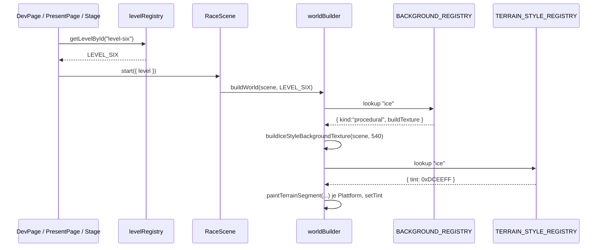

# Design: Level-Six-Frost

## Architektur-Überblick

Level 6 fügt sich vollständig in die bestehende Architektur aus `docs/03-architektur.md` ein und
nutzt ausschließlich existierende Erweiterungspunkte. **Es entsteht keine neue Komponente und
keine neue Abstraktion.**

| Erweiterungspunkt | Eingeführt in | Nutzung durch Level 6 |
|---|---|---|
| `LevelDef` (`level/types.ts`) | `.features/level-one-arena/` | neues Datenmodul `levelSix.ts` |
| `LEVEL_REGISTRY` (`level/levelRegistry.ts`) | `.features/level-two-kaizo/` | neuer Eintrag `level-six` |
| `LEVEL_IDS` (`packages/shared/src/levels.ts`) | `.features/arena-hub-server/` | neuer Eintrag `level-six` |
| `BACKGROUND_REGISTRY` (`world/backgroundRegistry.ts`) | `.features/level-two-background/` | neuer Key `ice` |
| `TERRAIN_STYLE_REGISTRY` (`world/terrainStyleRegistry.ts`) | `.features/level-three-underground/` | neuer Key `ice` |
| `proceduralBackgrounds.ts` | `.features/level-two-background/` | neue `buildIceStyleBackgroundTexture` |
| `isTimedActive` (`hazards/behaviors.ts`) | `.features/level-one-arena/` | **unverändert wiederverwendet** – zwei `loderix`-Instanzen mit gegenläufigem `phaseMs` |
| `spikeheadState`/Trigger-Mechanik (`hazards/behaviors.ts`, `RaceScene.ts`) | `.features/level-two-kaizo/` | **unverändert wiederverwendet** – ein `spikehead` direkt hinter dem Loderix-Duo |

`worldBuilder.ts`, `level/tiles.ts`, `hazards/registry.ts`/`behaviors.ts`/`factory.ts`,
`state/botStateBuilder.ts`, die Sandbox und der `@arena/bot-contract` bleiben **unverändert**
(Open/Closed: die Registries verzweigen, nicht der Builder). Das Frost-Gauntlet-Puzzle entsteht
**ausschließlich durch Parametrisierung** bestehender Hazard-Instanzen (`onMs`/`offMs`/`phaseMs`
bei `loderix`, `triggerMinX`/`triggerMaxX` bei `spikehead`) – keine neue Verhaltenslogik.
Konsumenten der Level-Auswahl (`DevPage`, `PresentPage`, `StageLevelEditor`, `TournamentSetup`,
`BracketView`) erhalten Level 6 ohne Codeänderung.

## Physik-/Timing-Grundlage

### Bewegung (aus `MOVEMENT_TUNING`)

| Größe | Formel | Wert |
|---|---|---|
| Basis-Sprungweite (flach) | `200 · 2·560/900` | ≈ 249 px |
| Sprint-Sprungweite (flach) | `320 · 2·650/900` | ≈ 462 px |
| Boingo-Steighöhe | `820² / 1800` | ≈ 373 px |

Alle Bodenlücken außerhalb der Frost-Gauntlet-Zone bleiben ≤ 160 px – deutlich unter der
Basis-Sprungweite, damit die Lücken selbst kein zusätzliches Timing-Risiko neben dem Gauntlet
erzeugen (Fokus liegt auf dem Hazard-Timing, nicht auf Sprung-Präzision).

### Loderix-Timing (aus `hazards/behaviors.ts`)

`isTimedActive(def, t)` = `(t + phaseMs) % (onMs + offMs) < onMs`.

**Ziel (US-2):** zu jedem Zeitpunkt ist genau eine der beiden Instanzen aktiv. Das wird exakt
erreicht mit `onMs₁ = offMs₁ = onMs₂ = offMs₂ = 900`, `phaseMs₁ = 0`, `phaseMs₂ = 900` (= halbe
Zykluslänge `T = 1800`):

- Instanz 1 aktiv auf `[0, 900) mod 1800`, sicher auf `[900, 1800) mod 1800`.
- Instanz 2: `(t + 900) mod 1800 < 900` ⟺ `t mod 1800 ∈ [900, 1800)`. Also aktiv auf
  `[900, 1800) mod 1800`, sicher auf `[0, 900) mod 1800`.

Für **jedes** `t` gilt: Instanz 1 aktiv ⟺ Instanz 2 sicher, und umgekehrt – exakte
Komplementärität, algebraisch bewiesen (kein Sampling nötig, wird aber zusätzlich per Test an
vielen Stichproben verifiziert, siehe Test-Strategie).

**Abstand der beiden Instanzen:** Ein Bot passiert Instanz 1 im Moment `t₀ ≡ 900 (mod 1800)`
(Wechsel aktiv→sicher) und legt die Distanz `d` mit Sprint-Tempo (320 px/s) zurück. Ankunft bei
Instanz 2: `t₁ = t₀ + 1000·d/320`. Damit `t₁ mod 1800` im sicheren Fenster `[0, 900)` von Instanz 2
liegt, muss `Δ = 1000·d/320 ∈ [900, 1800)` gelten (siehe Herleitung unten). Gewählt: `Δ = 1200 ms`
(mittig im Fenster, je 300/600 ms Marge) → `d = 320 · 1,2 = 384 px`.

*Herleitung von `Δ ∈ [900, 1800)`:* gesucht `Δ ≥ 0` mit `(900 + Δ) mod 1800 < 900`. Für
`Δ ∈ [0, 900)` ist `900 + Δ ∈ [900, 1800)` → nicht `< 900`. Für `Δ ∈ [900, 1800)` ist
`900 + Δ ∈ [1800, 2700)`, `mod 1800 ∈ [0, 900)` → erfüllt. Für `Δ ≥ 1800` wiederholt sich das
Muster periodisch. Also `Δ ∈ [900, 1800)`. ∎

### Spikehead direkt danach

Trigger-Zone beginnt 20 px nach Instanz 2 (`triggerMinX = x₂ + 20`, innerhalb der geforderten
≤ 40 px), ist 60 px breit (Konvention aus Level 5, H3). Spikehead-`x` liegt am Ende der
Trigger-Zone (Konvention aus Level 5, H3: `x = triggerMaxX`).

**Der gut getimte Durchlauf ist sicher, ohne anzuhalten:** Ein Bot, der Instanz 1 exakt beim
Wechsel passiert und durchgehend sprintet, erreicht Instanz 2 bei `t₁` (sicher, s.o.) und danach
die Trigger-Zone `20 px` weiter (`+62,5 ms`) sowie den Spikehead selbst `60 px` weiter
(`+250 ms` seit Betreten der Trigger-Zone). Der Standard-`warnMs` von Spikehead ist 400 ms – der
Bot passiert die gefährliche `x`-Position also noch in der ungefährlichen `warning`-Phase
(250 ms < 400 ms) und ist längst vorbei, wenn der Kopf fällt.

**Die eigentliche Falle:** Ein Bot, der (naiv) innerhalb der Trigger-Zone **anhält** – z. B. um
dort auf ein Loderix-Fenster zu "warten" –, löst den Fall trotzdem aus und bleibt in der
Gefahrenzone, wenn diese fällt/liegt/aufsteigt (200 + 600 + 500 = 1300 ms gefährlich). Anhalten
ist hier riskanter als kontinuiertes Durchlaufen – das ist die eigentliche Lektion des Gauntlets
und der Grund, warum Trigger-Zone und Loderix-Duo als **ein** zusammenhängender Vorgang geplant
werden müssen (US-2), nicht als zwei unabhängige Hindernisse.

Ein Bot mit **Basis-Tempo** (200 px/s) statt Sprint erreicht Instanz 2 später (`Δ_Basis = 1000 ·
384/200 = 1920 ms`) – das liegt **außerhalb** des sicheren Fensters (`[900,1800)`), landet also in
der nächsten Aktiv-Phase von Instanz 2, sofern der Bot exakt beim selben `t₀` losläuft. Ein
Bot mit Basis-Tempo kann die Zone dennoch sicher durchqueren, muss dafür aber tatsächlich die
Live-Flags (`active`/`warning` aus `WorldSnapshot.hazards`) lesen und ggf. kurz vor Instanz 1
oder Instanz 2 pausieren, statt blind loszulaufen – exakt das vom Nutzer gewünschte
"Muster erkennen und abwarten" (siehe Kontext in `requirements.md`).

## Layout

Weltmaße: `worldWidth = 2760`, `worldHeight = 540`, `groundY = 500`.
Spawn `{ x: 80, y: 420 }`, Ziel `{ x: 2700, y: 484 }`.

```
 y=240                                                          [ALK]
 y=250 (Pendel-Mittelpunkt)                            (o)
 y=500  [==G1==]   [====G2====]   [========G3 (Frost-Gauntlet)========]   [========G4========]
        0     320  470       854  1014                              2102  2262            2758
                150-Lücke        160-Lücke                               160-Lücke (Pendel)
```

### Bodensegmente (`kind` default `"ground"`, keine `ceiling`-Segmente – Level 6 bleibt wie
Level 1/2/3/5 deckenfrei)

| Seg | x | tilesWide | Bereich | Lücke danach |
|---|---|---|---|---|
| G1 | 0 | 20 | 0–320 | 150 |
| G2 | 470 | 24 | 470–854 | 160 |
| G3 | 1014 | 68 | 1014–2102 | **160 (Pendel-Kugelblitz darüber)** |
| G4 | 2262 | 31 | 2262–2758 | – |

G3 ist die Frost-Gauntlet-Zone: durchgehender Boden ohne Lücke oder Plattform-Wechsel (US-2), von
1014 (kurz nach Checkpoint-1-Nachfolger) bis 2102 (kurz vor dem Kugelblitz-Graben).

### Alkove (`kind: "float"`, optionaler Bonus)

`ALK` @ x=2320, tilesWide=6, y=240 → 260 px über `groundY` (> Sprint-Sprunghöhe 235 px, per
Boingo mit 373 px komfortabel erreichbar). Nur über `boingo-1` (x=2300, G4) erreichbar; kein
Pflichtelement, kein Rückweg-Trampolin nötig (Rücksprung/-fall auf G4 jederzeit möglich).

## Frost-Gauntlet-Details (auf G3, US-2)

| Element | x | Parameter |
|---|---|---|
| `checkpoint-2` | 1390 | unmittelbar vor `loderix-1` |
| `loderix-1` | 1400 | y=484, onMs=900, offMs=900, phaseMs=0 |
| `loderix-2` | 1784 | y=484, onMs=900, offMs=900, phaseMs=900 (Abstand 384 px, s. Herleitung oben) |
| `spikehead-1` (Trigger-Zone) | triggerMinX=1804, triggerMaxX=1864 | Abstand zu `loderix-2`: 20 px (≤ 40 px, US-2) |
| `spikehead-1` (Position) | x=1864 | originY=90, fallToY=484 (= `GROUND_Y - 16`, Bodenniveau der Zone), Default-Timings (warnMs=400, fallMs=200, restMs=600, riseMs=500) |
| `checkpoint-3` | 1950 | unmittelbar nach dem Spikehead (86 px Puffer) |

Vor der Zone (1014–1390, sicherer Bereich): `coin-5`, `coin-6`, `block-3` – Belohnung fürs
Vorbereiten, kein Zeitdruck. Nach der Zone (1950–2102): `coin-7` als Belohnung fürs Meistern.

## Entitäten

### Sichtbare Früchte (12, Vorgabe 10–15), `y = groundY − 48 = 452` (Boden) bzw. `y = plattformY − 48` (Alkove)

| id | x | y | Frucht | Bereich |
|---|---|---|---|---|
| coin-1 | 150 | 452 | cherries (5) | G1 |
| coin-2 | 280 | 452 | strawberry (8) | G1 |
| coin-3 | 520 | 452 | cherries (5) | G2 |
| coin-4 | 760 | 452 | strawberry (8) | G2 |
| coin-5 | 1050 | 452 | cherries (5) | G3 – vor der Zone |
| coin-6 | 1200 | 452 | strawberry (8) | G3 – vor der Zone |
| coin-7 | 1980 | 452 | orange (10) | G3 – nach der Zone |
| coin-8 | 2360 | 192 | pineapple (25) | Alkove (Bonus) |
| coin-9 | 2300 | 452 | apple (10) | G4 |
| coin-10 | 2500 | 452 | bananas (12) | G4 |
| coin-11 | 2600 | 452 | kiwi (15) | G4 |
| coin-12 | 2680 | 452 | cherries (5) | G4 |

### Versteckte Blöcke (4, Vorgabe 3–5), `y = groundY − 64 = 436`

`block-1` kiwi @ 200 (G1) · `block-2` orange @ 650 (G2) · `block-3` orange @ 1150 (G3, vor der
Zone) · `block-4` melon @ 2450 (G4).

### Checkpoints (4, Vorgabe ≥ 3), `y = groundY = 500`

`checkpoint-1` @ 500 (G2) · `checkpoint-2` @ **1390 (G3, unmittelbar vor der Frost-Gauntlet-Zone,
US-2)** · `checkpoint-3` @ **1950 (G3, unmittelbar nach der Zone, US-2)** · `checkpoint-4` @ 2350
(G4, vor Alkove/Ziel).

### Hazards (6 – fünf verschiedene Kinds, `schnetzler` bewusst nicht eingesetzt)

| id | kind | Position | Parameter | Bereich |
|---|---|---|---|---|
| ninjafrog-1 | ninjafrog | 180, 484 | minX 140, maxX 300, speed 70 | G1 (stompbar, sanfter Einstieg) |
| stachlinger-1 | stachlinger | 680, 484 | – | G2 |
| loderix-1 | loderix | 1400, 484 | onMs 900, offMs 900, phaseMs 0 | G3 – Frost-Gauntlet |
| loderix-2 | loderix | 1784, 484 | onMs 900, offMs 900, phaseMs 900 | G3 – Frost-Gauntlet |
| spikehead-1 | spikehead | 1864, originY 90, fallToY 484 | triggerMinX 1804, triggerMaxX 1864 | G3 – Frost-Gauntlet |
| kugelblitz-1 | kugelblitz | pivotX 2182, pivotY 250 | length 140 (Default-Timing) | über der Lücke G3→G4 |

**Schwierigkeitsgrad (mittel, wie US-3 gefordert):** kein `schnetzler`, kein Mehrfach-Gauntlet
gleichartiger Hazards, dafür ein neuartiges **Zwei-Hazard-Timing-Puzzle** – anspruchsvoller als
Level 3/5 (Einzel-Hazards), aber ohne Kaizo-artige Lücken-Präzision wie Level 2.

### Utilities

`boingo-1` @ (2300, 486) auf G4 – einziger Zugang zur optionalen Alkove. Konvention
`y = plattformY − 14` wie in Level 1–5.

## Theming

### `proceduralBackgrounds.ts` – `buildIceStyleBackgroundTexture(scene, worldHeight)`

Gleiches Muster wie `buildDesertStyleBackgroundTexture` (idempotent gecacht über
`bg-ice-${worldHeight}`, `TILE_W = 512`, Textur-Höhe = `worldHeight`):

1. Himmelsverlauf: 6 horizontale Bänder von `0x6FB7E0` (kühles Blau, oben) nach `0xEFFBFF`
   (fast weiß, Horizont) – kalte Umkehrung des Desert-Warmverlaufs.
2. Blasse "Wintersonne" `0xF3FBFF` bei `(400, worldHeight · 0,2)`, r=30, schwacher Halo (r=46,
   Alpha 0,2) – deutlich blasser als die Desert-Sonne (haziger Eindruck).
3. Drei gestaffelte, verschneite Berg-Silhouetten am unteren Rand (`fillEllipse`/Dreieckszüge,
   an `baseY = worldHeight` verankert) in `0xB2D6ED` / `0xC7E3F2` / `0xDCEFFA` – hinterste am
   hellsten (Lufttrübung, gleiche Konvention wie Desert-Dünen).
4. Handvoll kleiner, statischer "Schneeflocken"-Punkte (`0xFFFFFF`, deterministische
   Koordinaten) als dezente Akzente, analog zu den Desert-Kakteen.

Keine Laufzeit-Zufälligkeit (deterministische Koordinaten), wie bei allen Bestandsgeneratoren.

### `backgroundRegistry.ts`

`ice: { kind: "procedural", buildTexture: buildIceStyleBackgroundTexture }`

### `terrainStyleRegistry.ts`

`ice: { frames: STONE_TERRAIN_TILES, tint: 0xeaf6ff }` – **Korrektur nach manueller Abnahme**
(siehe `requirements.md`, „Nachträgliche Korrektur"): ein reiner Tint auf dem
`TERRAIN_TILES`-Frameset (Gras/Erde) kann dessen gesättigtes Grün multiplikativ nicht
neutralisieren – das Terrain sah trotz hellem Tint weiterhin nach Wiese aus. Level 6 verwendet
deshalb wie `underground` das bereits vorhandene, neutral-graue `STONE_TERRAIN_TILES`-Frameset
(dieselbe bereits geladene `Terrain (16x16).png`-Textur, nur ein anderer Frame-Ausschnitt – kein
neues Tileset, kein neues Asset, US-1/Nicht-Ziele weiterhin erfüllt), eingefärbt mit einem sehr
blassen, nahezu weißen Eis-Tint (`0xeaf6ff`, deutlich heller/blasser als der satte
`underground`-Blauton `0x4a8cff`) – neutral-graue Ausgangsfarben nehmen den Tint sauber an und
ergeben einen echten Schnee-/Eis-Boden statt eingefärbtem Gras.

## Registrierung

```ts
// client/src/game/level/levelRegistry.ts
{ id: "level-six", label: "Level 6 – Frost", level: LEVEL_SIX },
```
eingefügt nach `level-five`, vor `toolkit-test`. `DEFAULT_LEVEL_ID` bleibt `"level-one"`.

```ts
// packages/shared/src/levels.ts
export const LEVEL_IDS = [..., "level-five", "level-six", "toolkit-test"] as const;
```

Damit gilt `isValidLevelId("level-six") === true` serverseitig (US-4). Level 6 wird **nicht** als
Default-Stage in `tournament/stageLevelList.ts` gesetzt (Nicht-Ziel).

## Ablauf: Rendern von Level 6



Kein Sonderpfad: `worldBuilder` schlägt beide Keys nur nach.

## Fehlerbehandlung & Edge Cases

| Fall | Verhalten | Quelle |
|---|---|---|
| Unbekannte Level-ID | `getLevelById` wirft mit Auflistung aller IDs (Fail-Fast) | bestehend, unverändert |
| Unbekannter `backgroundKey`/`terrainStyleKey` | Registry-Lookup, Default-Key als Fallback | bestehend, unverändert |
| Bot berührt Loderix während `active` | Leben −1, Respawn am letzten Checkpoint | bestehend, `rules/raceRules.ts` |
| Bot bleibt in der Spikehead-Trigger-Zone stehen | Fall wird trotzdem ausgelöst, Bot bleibt in der Gefahrenzone (bewusste Design-Falle, s. o.) | bestehend, `RaceScene`/`spikeheadState` |
| Bot sprintet gut getimt durch (t₀ bei Wechsel aktiv→sicher) | passiert Loderix-Duo und Spikehead ohne Anhalten | Geometrie oben |
| Bot nutzt Basis-Tempo statt Sprint | muss mind. einmal auf ein Sicherheitsfenster warten, bleibt aber lösbar | Geometrie oben |
| Bot ignoriert die Alkove | erreicht das Ziel trotzdem (optionales Bonus-Element) | Layout |
| Zeitlimit 90 s | Level ist mit 2760 px kürzer als Level 1 (3450 px) und Level 5 (3120 px) → unkritisch | `racerState.ts` |

## Test-Strategie

Vitest (`client/vitest.config.ts`, jsdom). Reine Daten-/Konstanten-Tests ohne Phaser-Instanz –
konsistent zu `levelFive.test.ts`. Der prozedurale Hintergrund wird **nicht** unit-getestet
(Canvas-Rendering nötig, analog zu allen bisherigen `backgroundKey`-Einführungen), sondern
manuell abgenommen.

### `client/src/game/level/levelSix.test.ts` (neu)

**A – Struktur-Invarianten (US-3)**
- 10–15 sichtbare Früchte, 3–5 versteckte Blöcke, ≥ 3 Checkpoints, genau ein Spawn/Ziel
- `worldHeight === 540`, `groundY === 500`
- alle Entitäts-IDs paarweise verschieden (über Früchte, Blöcke, Checkpoints, Hazards, Utilities)
- Hazard-`kind`s ⊆ bekannte Kinds; `ninjafrog`, `stachlinger`, `kugelblitz`, `loderix` (2×),
  `spikehead` je mindestens einmal vorhanden
- `backgroundKey === "ice"`, `terrainStyleKey === "ice"`
- keine `kind: "ceiling"`-Plattform
- alle Bodenlücken außerhalb der Frost-Gauntlet-Zone (G1→G2, G2→G3, G3→G4) ≤ 190 px

**B – Frost-Gauntlet-Invariante (US-2, Kern-Test)**
- `onMs`/`offMs` beider Loderix-Instanzen sind gleich groß und je Instanz identisch
  (`onMs === offMs`)
- `phaseMs` der zweiten Instanz = `phaseMs` der ersten + `(onMs + offMs) / 2` (mod Zykluslänge)
- Property-Test: `isTimedActive` (echte Funktion aus `hazards/behaviors.ts`, importiert – keine
  Neuimplementierung der Formel im Test) wird für beide Instanzen an z. B. 200 gleichmäßig über
  zwei volle Zyklen verteilten Zeitpunkten ausgewertet; für jeden Zeitpunkt gilt
  `active(instanz1, t) !== active(instanz2, t)` (echtes XOR, nie beide gleich)
- Abstand `loderix-2.x − loderix-1.x` entspricht der oben hergeleiteten Distanz (Sprint-Tempo ×
  `Δ`, `Δ` im offenen Intervall `[900, 1800)`ms)
- `spikehead-1.triggerMinX − loderix-2.x ≤ 40`
- `spikehead-1.fallToY === GROUND_Y - 16`
- Checkpoint unmittelbar vor `loderix-1.x` und unmittelbar nach `spikehead-1.triggerMaxX`
  vorhanden (kein weiterer Checkpoint/keine Plattformkante dazwischen)
- innerhalb der Gauntlet-Zone (zwischen `checkpoint-2.x` und `checkpoint-3.x`) liegt keine
  zusätzliche Bodenlücke und kein Plattform-Wechsel (ein einziges zusammenhängendes
  `PlatformDef` deckt den Bereich ab)

### `client/src/game/level/levelRegistry.test.ts` (erweitert)

- `level-six` in `LEVEL_REGISTRY`, Label nicht leer
- `getLevelById("level-six") === LEVEL_SIX`
- Zwei-Wege-Konsistenz mit `LEVEL_IDS` (bestehende Tests greifen automatisch)

### `packages/shared` (erweitert)

- `isValidLevelId("level-six") === true`

### `client/src/game/world/terrainStyleRegistry.test.ts` (erweitert)

- `ice` existiert, `tint` ist eine endliche Zahl, Farbe ist kühl (`b > r` und `b > g`, Gegentest
  zu Desert's `r > b`/`g > b`)

### Manuelle Abnahme

`/dev` mit Level 6 und einem Beispiel-Bot: Eis-Optik prüfen, Frost-Gauntlet einmal gut getimt
durchsprinten (soll klappen, ohne anzuhalten), danach bewusst in der Spikehead-Trigger-Zone
stehen bleiben (soll vom fallenden Kopf getroffen werden), Alkove per Boingo besuchen.

## Auswirkungen auf bestehenden Code

| Datei | Art |
|---|---|
| `client/src/game/level/levelSix.ts` | **neu** |
| `client/src/game/level/levelSix.test.ts` | **neu** |
| `client/src/game/level/levelRegistry.ts` | Import + Registry-Eintrag |
| `client/src/game/level/levelRegistry.test.ts` | Tests für `level-six` |
| `packages/shared/src/levels.ts` | `"level-six"` in `LEVEL_IDS` |
| `packages/shared/src/levels.test.ts` | Erweiterung |
| `client/src/game/world/proceduralBackgrounds.ts` | neue Export-Funktion + Farbkonstanten |
| `client/src/game/world/backgroundRegistry.ts` | Import + Key `ice` |
| `client/src/game/world/terrainStyleRegistry.ts` | Key `ice` |
| `client/src/game/world/terrainStyleRegistry.test.ts` | Test für `ice` |
| `docs/06-level-design.md` | Level-6-Abschnitt in der Level-Übersicht |

**Nicht angefasst:** `worldBuilder.ts`, `level/tiles.ts`, `level/types.ts`, `hazards/registry.ts`,
`hazards/behaviors.ts`, `hazards/factory.ts`, `rules/*`, `state/botStateBuilder.ts`,
`movement/movement.ts`, `RaceScene.ts`, `packages/bot-contract/*`, die Sandbox sowie Level 1–5 und
das Toolkit-Test-Level. Die Frost-Gauntlet-Mechanik entsteht ausschließlich durch Datenwerte in
`levelSix.ts`, keine Verhaltensänderung an bestehendem Code.
