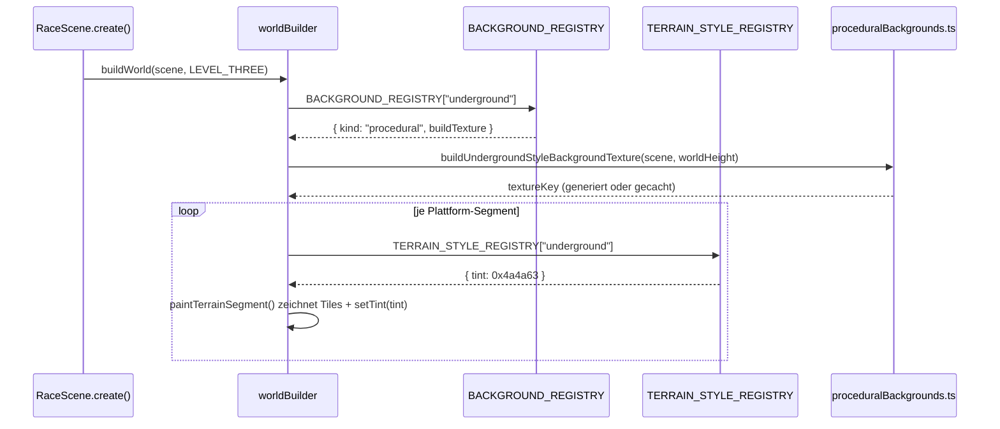

# Design: Level-Three-Underground (drittes, leichteres Untergrund-Level)

Bezug: `.features/level-three-underground/requirements.md` (US-1 bis US-4)

> **Amendment (nach initialer Umsetzung):** Auf Wunsch in "Night" umbenannt (reine
> Umbenennung ohne Verhaltensänderung, siehe AGENTS.md "trivialste Änderungen"). Betroffen:
> `backgroundKey`/`terrainStyleKey` (`"underground"` → `"night"`), Level-Label ("Level 3 –
> Night"), `buildUndergroundStyleBackgroundTexture` → `buildNightStyleBackgroundTexture`,
> Textur-Key-Präfix (`bg-underground` → `bg-night`), zugehörige Tests und Doku-Referenzen.
> Der Feature-Ordner-Name (`level-three-underground`) und der restliche Text unten bleiben
> als historischer Kontext unverändert (analog `level-two-kaizo`s Spikehead-Amendment).

## Architektur-Überblick

Reine additive Erweiterung der bestehenden Architektur aus `level-two-kaizo` (Level-Registry,
`LevelDef`, Hazard-Registry) und `level-two-background` (Background-Registry,
`proceduralBackgrounds.ts`). Kein neuer Hazard-Typ, kein neues Architektur-Prinzip. Zusätzlich
zur Background-Registry entsteht eine analoge, kleine **Terrain-Style-Registry** für US-3
(dunkles Terrain), damit `worldBuilder.ts` auch beim Terrain nie Level-spezifisch verzweigt.

```
┌─────────────────────────────────────────────────────────────────────────┐
│ level/levelRegistry.ts (+Eintrag "level-three")                          │
│ level/levelThree.ts (NEU) – LevelDef, reine Daten                        │
├─────────────────────────────────────────────────────────────────────────┤
│ world/backgroundRegistry.ts (+Eintrag "underground")                     │
│ world/proceduralBackgrounds.ts (+buildUndergroundStyleBackgroundTexture) │
├─────────────────────────────────────────────────────────────────────────┤
│ world/terrainStyleRegistry.ts (NEU) – terrainStyleKey -> { tint? }       │
│ level/types.ts (+LevelDef.terrainStyleKey?: string)                      │
│ world/worldBuilder.ts::paintTerrainSegment() liest die Registry und      │
│   wendet ggf. setTint() auf die erzeugten Terrain-Tile-Images an         │
└─────────────────────────────────────────────────────────────────────────┘
```

Keine Änderung an `hazards/*`, `rules/*`, `@arena/bot-contract` nötig (keine neuen Hazard-
Kinds, siehe Nicht-Ziele).

## Schnittstellen & Datenmodelle

### `level/types.ts` – neues optionales Feld (additiv, keine Regression)

```ts
export interface LevelDef {
  // ... bestehende Felder unverändert ...
  backgroundKey?: string;
  /** Welcher Terrain-Style für Boden-/Plattform-Tiles verwendet wird (siehe
   *  `world/terrainStyleRegistry.ts`). Optional - Default `"default"`
   *  (bisheriges helles Terrain, keine Tint-Anwendung), damit LEVEL_ONE/
   *  LEVEL_TWO unverändert bleiben (US-3, dritte Akzeptanzkriterium). */
  terrainStyleKey?: string;
}
```

### `world/terrainStyleRegistry.ts` (neu) – zentrale Zuordnung (US-3, Open/Closed)

```ts
export interface TerrainStyleSpec {
  /** Phaser-Tint-Farbwert (0xRRGGBB), angewendet auf jedes Terrain-Tile-Image.
   *  `undefined` = keine Einfärbung (Original-Optik). */
  tint?: number;
}

export const TERRAIN_STYLE_REGISTRY: Record<string, TerrainStyleSpec> = {
  default: {}, // keine Einfärbung - bestehendes helles Terrain
  underground: { tint: 0x4a4a63 }, // dunkles Blaugrau, höhlenartig
};

export const DEFAULT_TERRAIN_STYLE_KEY = "default";
```
Reine Konstanten-Deklaration ohne Verzweigungslogik, analog `BACKGROUND_REGISTRY` – kein
eigener Unit-Test nötig (siehe Test-Strategie).

Neuer Terrain-Style = neuer Eintrag hier, `worldBuilder.ts` verzweigt nie selbst nach
`terrainStyleKey`.

### `world/worldBuilder.ts` – `paintTerrainSegment` wendet den Tint an

```ts
function paintTerrainSegment(scene: Phaser.Scene, level: LevelDef, platform: PlatformDef): void {
  const style = TERRAIN_STYLE_REGISTRY[level.terrainStyleKey ?? DEFAULT_TERRAIN_STYLE_KEY];
  // ... bestehende Zeilen-/Spalten-/Frame-Berechnung unverändert ...
  for (...) {
    const image = scene.add
      .image(/* ... wie bisher ... */)
      .setDepth(WORLD_DEPTH.terrain);
    if (style.tint !== undefined) {
      image.setTint(style.tint);
    }
  }
}
```
Fail-Fast bei unbekanntem `terrainStyleKey` (analog `BACKGROUND_REGISTRY`/`getLevelById`):
`TERRAIN_STYLE_REGISTRY[...]` wäre `undefined` → Laufzeitfehler beim Zugriff auf `.tint`,
kein stiller Fallback (Tippfehler sofort sichtbar).

### `world/proceduralBackgrounds.ts` – `buildUndergroundStyleBackgroundTexture` (neu)

Analog zu `buildSmb1StyleBackgroundTexture`: einmalig gecachte Textur pro `worldHeight`,
gezeichnet mit `Graphics` + `generateTexture`, dieselbe Cache-Key-Strategie
(`bg-underground-<worldHeight>`).

```ts
const UNDERGROUND_TEXTURE_KEY_PREFIX = "bg-underground";
const CAVE_BASE_COLOR = 0x0d0d1a;      // fast schwarzer, leicht bläulicher Grundton
const CAVE_ROCK_FAR_COLOR = 0x1c1c2e;  // entfernte Fels-Silhouette (dunkelstes Grau-Blau)
const CAVE_ROCK_MID_COLOR = 0x2a2a40;  // mittlere Fels-Ebene
const CAVE_ROCK_NEAR_COLOR = 0x38384f; // nahe Fels-Ebene (hellstes, aber immer noch dunkel)
const CRYSTAL_GLOW_COLOR = 0x66e0ff;   // helle Akzent-Kristalle/Glüh-Punkte

export function buildUndergroundStyleBackgroundTexture(
  scene: Phaser.Scene,
  worldHeight: number
): string {
  const textureKey = `${UNDERGROUND_TEXTURE_KEY_PREFIX}-${worldHeight}`;
  if (scene.textures.exists(textureKey)) return textureKey;

  const g = scene.add.graphics();
  g.fillStyle(CAVE_BASE_COLOR, 1);
  g.fillRect(0, 0, TILE_W, worldHeight);

  drawRockLayer(g, worldHeight, CAVE_ROCK_FAR_COLOR, 0.55, /* jitterSeed */ 1);
  drawRockLayer(g, worldHeight, CAVE_ROCK_MID_COLOR, 0.75, 2);
  drawRockLayer(g, worldHeight, CAVE_ROCK_NEAR_COLOR, 0.92, 3);
  drawCrystals(g, worldHeight);

  g.generateTexture(textureKey, TILE_W, worldHeight);
  g.destroy();
  return textureKey;
}
```
- `drawRockLayer(g, worldHeight, color, heightFactor, seed)`: zeichnet analog zu `drawHills`
  eine Reihe überlappender `fillEllipse`/`fillTriangle`-Formen (spitzere, unregelmäßigere
  Silhouette als die runden SMB-Hügel, damit es wie Fels statt Gras wirkt) am unteren Rand,
  `heightFactor * worldHeight` hoch, deterministisch (kein `Math.random()`, feste, pro Ebene
  leicht versetzte x-Positionen anhand von `seed`, analog zur festen Wolken-/Hügel-Platzierung
  in `drawClouds`/`drawHills` - keine Laufzeit-Zufälligkeit, damit die Textur bei jedem
  Level-Load identisch aussieht).
- `drawCrystals(g, worldHeight)`: wenige (4-6) kleine `fillCircle`-Punkte in
  `CRYSTAL_GLOW_COLOR` mit reduzierter Alpha (`g.fillStyle(color, 0.6)`), verteilt über die
  mittlere/untere Bildhälfte, als visuelles Highlight (rein dekorativ, keine Spiellogik).

### `world/backgroundRegistry.ts` – neuer Eintrag

```ts
export const BACKGROUND_REGISTRY: Record<string, BackgroundSpec> = {
  default: { kind: "image", textureKey: "background" },
  "smb1-1": { kind: "procedural", buildTexture: buildSmb1StyleBackgroundTexture },
  underground: { kind: "procedural", buildTexture: buildUndergroundStyleBackgroundTexture }, // NEU
};
```

### `level/levelThree.ts` (neu) – `LEVEL_THREE`

Gleiche Bewegungswerte wie `LEVEL_ONE`/`LEVEL_TWO` (`MOVE_SPEED=200`, `JUMP_VELOCITY=-560`,
Gravity=900, max. Sprunghöhe ≈174px, max. Sprungweite ≈250px). Schwierigkeit klar unterhalb
von `LEVEL_TWO`, in der Größenordnung von `LEVEL_ONE`:

- `worldWidth: 2700`, `worldHeight: 540`, `groundY: 500` (gleiche Konventionen wie L1/L2).
- `backgroundKey: "underground"`, `terrainStyleKey: "underground"`.
- **Bodensegmente:** 6 Ground-Plattformen + 1 Float-Bonus-Plattform. Lücken durchgehend
  **128px** (identisch zu `LEVEL_ONE`, nicht enger) – klar komfortabler als `LEVEL_TWO`s
  176-208px.
- **Hazards** (nur bestehende Kinds, entschärft ggü. Level 2, keine Gauntlets):
  - 2× `schnetzler`, **einzeln** platziert (kein überlappendes Mehrfach-Gauntlet wie in L2),
    moderate `speed` (60-70, niedriger als L2s 70-90).
  - 2× `stachlinger` (statisch, wie in L1/L2, gut sichtbar vor der jeweiligen Plattformkante).
  - 1× `loderix` mit **längerer `offMs` relativ zu `onMs`** (z.B. `onMs: 900, offMs: 1800`
    statt L2s 1500/1500) - mehr sichere Durchlaufzeit pro Zyklus.
  - 1× `spikehead` mit **entschärften Timings**: `warnMs: 700` (länger als L2s 400 -> mehr
    Reaktionszeit), `restMs: 400` (kürzer als L2s 600), Trigger-Zone bewusst vor einer
    kurzen, geraden Passage (kein zusätzlicher Gegner in derselben Zone).
  - **Kein** `kugelblitz` (Pendel-Hazards sind schwer präzise zu timen und in L2 bewusst über
    einer Lücke platziert - für ein "leichteres" Level ausgelassen, siehe Nicht-Ziele/
    Offene Fragen in requirements.md; rein additiv später ergänzbar).
- **Utilities:** 1× `boingo` unter einer optionalen Bonus-Schwebeplattform (wie L2s F2-Muster,
  aber die Bonus-Plattform ist NICHT zwingend für den Zielweg nötig).
- **Coins:** 12 sichtbar + 4 versteckte Blöcke (innerhalb der geforderten 10-15/3-5-Spanne).
- **Checkpoints:** 3, jeweils nach einer der drei Hazard-Passagen.
- **Spawn/Goal:** `spawn: {x: 80, y: groundY-80}`, `goal` am Ende des letzten Segments.

Konkrete Koordinaten werden 1:1 wie bei `LEVEL_TWO` als feste Zahlen in der Datei hinterlegt
(kein generischer Level-Generator - bewusst hand-authored, siehe `docs/06`).

## Ablauf / Sequenz

Kein neuer Ablauf nötig - identischer Lade-/Render-Pfad wie bei Level 1/2
(`RaceScene.create()` → `getLevelById()` → `buildWorld()` → `buildBackground()` /
`buildPlatforms()`/`paintTerrainSegment()`), nur mit zusätzlichen Registry-Lookups
(`BACKGROUND_REGISTRY["underground"]`, `TERRAIN_STYLE_REGISTRY["underground"]`) analog zum
bestehenden Muster aus `level-two-background`.



## Fehlerbehandlung & Edge Cases

- **Unbekannter `terrainStyleKey`:** analog zu `backgroundKey` - Fail-Fast durch
  `undefined`-Zugriff, kein stiller Default (Tippfehler früh sichtbar).
- **`LEVEL_ONE`/`LEVEL_TWO` ohne `terrainStyleKey`:** `?? DEFAULT_TERRAIN_STYLE_KEY` greift
  → `TERRAIN_STYLE_REGISTRY.default` (`{}`, kein Tint) → `image.setTint()` wird nicht
  aufgerufen → optisch exakt wie bisher (keine Regression, US-3 dritte Akzeptanzkriterium).
- **Sichtbarkeit von Hazards vor dunklem Hintergrund:** bestehende Hazard-Sprites (Saw, Fire,
  Spikes) behalten ihre Original-Textur/Farbe (kein Tint auf Hazards in diesem Feature) -
  sie heben sich dadurch farblich vom dunklen Terrain/Hintergrund ab und bleiben gut
  erkennbar (kein zusätzlicher Kontrast-Mechanismus nötig).

## Test-Strategie

- **Pure, testbare Teile (Rot-Grün-Refactor, vor Implementierung mit fehlschlagendem Test):**
  - Struktur-Validierung von `LEVEL_THREE` (analog `levelTwo.test.ts`): Weltgröße im
    erwarteten Rahmen, Anzahl Checkpoints ≥ 3, Coin-/versteckte-Block-Anzahl in der
    10-15/3-5-Spanne, alle Boden-Lücken ≤ 128px, keine `kugelblitz`/Gauntlet-Häufung,
    Spikehead-Timings (`warnMs`/`restMs`) liegen im "leichter als L2"-Bereich
    (`warnMs > 400`, `restMs < 600`), Schnetzler-`speed` ≤ 70.
  - `LEVEL_REGISTRY`: enthält `"level-three"`, `getLevelById("level-three")` liefert
    `LEVEL_THREE`, bestehende Einträge unverändert.
  - `TERRAIN_STYLE_REGISTRY`/`BACKGROUND_REGISTRY`: enthalten neue Keys `"underground"`,
    bestehende Einträge (`default`, `smb1-1`) unverändert erreichbar.
- **Bewusst nicht unit-getestet (Phaser/Canvas-Rendering nötig, analog
  `level-two-background`):**
  - `buildUndergroundStyleBackgroundTexture` (Zeichenlogik) und die angepasste
    `paintTerrainSegment()`-Tint-Anwendung in `worldBuilder.ts`.
- **Manueller Verifikationsschritt (Browser, `/dev`):**
  1. Level-Dropdown zeigt jetzt drei Einträge; Level 1/2 sehen unverändert aus (Regression
     prüfen).
  2. Level 3 auswählen → dunkler, höhlenartiger Hintergrund mit erkennbaren Fels-Ebenen und
     Kristall-Akzenten sichtbar, Parallax-Scroll wie gewohnt.
  3. Terrain/Boden wirkt sichtbar dunkler/eingefärbt gegenüber Level 1/2.
  4. Level 3 mit Tastatur einmal komplett durchspielen: alle Lücken springbar, Schnetzler/
     Stachlinger/Loderix/Spikehead spürbar leichter zu timen als in Level 2, Ziel erreichbar
     ohne wiederholte Fehlversuche bei normalem Timing.

## Auswirkungen auf bestehenden Code

- `client/src/game/level/types.ts`: `LevelDef.terrainStyleKey?: string` (additiv, optional).
- `client/src/game/level/levelThree.ts` (neu): `LEVEL_THREE`.
- `client/src/game/level/levelThree.test.ts` (neu): Struktur-Validierung.
- `client/src/game/level/levelRegistry.ts`: `LEVEL_THREE` importieren, Eintrag
  `{ id: "level-three", label: "Level 3 - Underground", level: LEVEL_THREE }` ergänzen.
- `client/src/game/level/levelRegistry.test.ts` (falls vorhanden, sonst neuer Test):
  neuer Registry-Eintrag geprüft.
- `client/src/game/world/proceduralBackgrounds.ts`: `buildUndergroundStyleBackgroundTexture`
  + private `drawRockLayer`/`drawCrystals`-Helfer ergänzt.
- `client/src/game/world/backgroundRegistry.ts`: Eintrag `"underground"` ergänzt.
- `client/src/game/world/terrainStyleRegistry.ts` (neu).
- `client/src/game/world/terrainStyleRegistry.test.ts` (neu, falls sinnvoll testbar -
  Registry-Lookup).
- `client/src/game/world/worldBuilder.ts`: `paintTerrainSegment()` liest
  `TERRAIN_STYLE_REGISTRY` und wendet ggf. `setTint()` an.
- `docs/06-level-design.md`: Hinweis auf drei Level mit unterschiedlichem Schwierigkeitsgrad.
- `docs/08-hazards-und-utilities.md`: kurzer Hinweis, dass Level 3 bestehende Hazards
  entschärft wiederverwendet (keine neue Tabellen-Zeile nötig).
