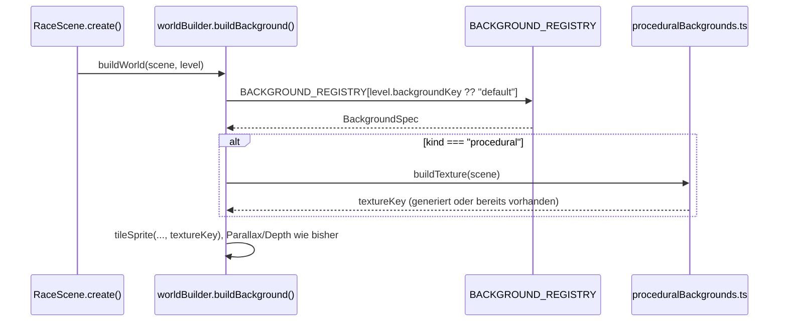

# Design: Level-Two-Background

Bezug: `.features/level-two-background/requirements.md` (US-1 bis US-3)

## Architektur-Überblick

Analog zur Hazard-Registry (`docs/08`): ein zentrales Mapping von `backgroundKey` auf eine
Erzeugungs-Funktion, damit `worldBuilder.ts` selbst nie Kind-spezifisch nach Level
unterscheidet (Open/Closed). Neues, in sich geschlossenes Modul
`client/src/game/world/proceduralBackgrounds.ts` kapselt die eigentliche Zeichenlogik.

```
┌────────────────────────────────────────────────────────────────────────┐
│ world/worldBuilder.ts                                                   │
│  buildBackground(scene, level) -> liest level.backgroundKey             │
│       └─▶ BACKGROUND_REGISTRY[level.backgroundKey] liefert entweder     │
│           { kind: "image", textureKey } ODER                            │
│           { kind: "procedural", ensureTexture: (scene) => textureKey }  │
├────────────────────────────────────────────────────────────────────────┤
│ world/proceduralBackgrounds.ts (neu, Phaser Graphics, ungetestet)       │
│  buildSmb1StyleBackgroundTexture(scene) -> zeichnet einmalig via         │
│  Graphics + generateTexture(), liefert Textur-Key                       │
└────────────────────────────────────────────────────────────────────────┘
```

## Schnittstellen & Datenmodelle

### `level/types.ts` – `LevelDef.backgroundKey`

```ts
export interface LevelDef {
  // ... bestehende Felder unverändert ...
  /** Welcher Hintergrund für dieses Level verwendet wird (siehe
   *  `world/backgroundRegistry.ts`). Optional - Default `"default"`
   *  (bisheriges einfarbiges Blue-Background), damit LEVEL_ONE unverändert
   *  bleibt (US-1, keine Regression). */
  backgroundKey?: string;
}
```
`LEVEL_ONE` bleibt unverändert (kein neues Feld gesetzt). `LEVEL_TWO` bekommt
`backgroundKey: "smb1-1"`.

### `world/backgroundRegistry.ts` (neu) – zentrale Zuordnung (US-1, Open/Closed)

```ts
export type BackgroundSpec =
  | { kind: "image"; textureKey: string }
  | { kind: "procedural"; buildTexture: (scene: Phaser.Scene) => string };

export const BACKGROUND_REGISTRY: Record<string, BackgroundSpec> = {
  default: { kind: "image", textureKey: "background" }, // bestehendes Blue.png
  "smb1-1": { kind: "procedural", buildTexture: buildSmb1StyleBackgroundTexture },
};

export const DEFAULT_BACKGROUND_KEY = "default";
```
Neuer Hintergrund = neuer Eintrag hier + (falls prozedural) eine neue `buildTexture`-Funktion
in `proceduralBackgrounds.ts` – `worldBuilder.ts` verzweigt nie selbst nach `backgroundKey`.

### `world/proceduralBackgrounds.ts` (neu) – SMB1-1-artiger Hintergrund

```ts
const SMB1_BACKGROUND_TEXTURE_KEY = "bg-smb1-1";

/**
 * Zeichnet einmalig (idempotent - prüft, ob die Textur schon existiert)
 * einen SMB1-1-artigen Hintergrund per Graphics: blauer Himmel, Wolken,
 * Hügel-Silhouetten, Büsche. Liefert den Textur-Key zur Weiterverwendung
 * in einem `tileSprite` (Parallax, wie der bestehende Hintergrund).
 */
export function buildSmb1StyleBackgroundTexture(scene: Phaser.Scene): string {
  if (scene.textures.exists(SMB1_BACKGROUND_TEXTURE_KEY)) return SMB1_BACKGROUND_TEXTURE_KEY;

  const TILE_W = 512;
  const TILE_H = 288; // wiederholbares Kachel-Muster für den tileSprite

  const g = scene.add.graphics();
  g.fillStyle(0x5c94fc); // klassisches SMB1-Himmelblau
  g.fillRect(0, 0, TILE_W, TILE_H);

  drawClouds(g);
  drawBushes(g);
  drawHills(g);

  g.generateTexture(SMB1_BACKGROUND_TEXTURE_KEY, TILE_W, TILE_H);
  g.destroy();
  return SMB1_BACKGROUND_TEXTURE_KEY;
}

function drawHills(g: Phaser.GameObjects.Graphics): void {
  // Halbrunde, hellgrüne Hügel-Silhouetten am unteren Rand, mehrfach
  // versetzt über die Kachelbreite (NES-typisch: einfache Halbkreise/
  // Bögen, kein Farbverlauf).
}

function drawClouds(g: Phaser.GameObjects.Graphics): void {
  // Weiße, aus 2-3 überlappenden Kreisen zusammengesetzte Pixel-Wolken
  // (klassische SMB1-Wolkenform), mehrfach über die obere Hälfte verteilt.
}

function drawBushes(g: Phaser.GameObjects.Graphics): void {
  // Dunkelgrüne, aus überlappenden Kreisen zusammengesetzte Busch-Cluster
  // am unteren Rand, zwischen den Hügeln verteilt.
}
```
Alle Formen werden mit `g.fillCircle`/`g.fillRect` gezeichnet (keine Bézier-Kurven o.ä.) –
grobe, blockige Pixel-Optik passend zum restigen Asset-Pack (`image-rendering: pixelated`
wird zusätzlich auf die erzeugte Textur angewendet, siehe unten).

### `world/worldBuilder.ts` – `buildBackground` liest die Registry

```ts
function buildBackground(scene: Phaser.Scene, level: LevelDef): void {
  const spec = BACKGROUND_REGISTRY[level.backgroundKey ?? DEFAULT_BACKGROUND_KEY];
  const textureKey = spec.kind === "procedural" ? spec.buildTexture(scene) : spec.textureKey;

  scene.add
    .tileSprite(0, 0, level.worldWidth, level.worldHeight, textureKey)
    .setOrigin(0, 0)
    .setScrollFactor(0.3)
    .setDepth(WORLD_DEPTH.bg);
}
```
Unverändertes Parallax-/Depth-Verhalten (US-2, zweites Akzeptanzkriterium) – nur die
Textur-Quelle wird jetzt über die Registry aufgelöst statt hart auf `"background"` verdrahtet.

Kein `preload()`-Eintrag nötig für den prozeduralen Hintergrund (im Gegensatz zum bisherigen
Bild-Asset): `generateTexture` läuft zur Laufzeit in `create()`, sobald `buildWorld()`
aufgerufen wird – Phaser erlaubt das Erzeugen von Texturen außerhalb von `preload()`.

## Ablauf / Sequenz



## Fehlerbehandlung & Edge Cases

- **Level-Wechsel Level 2 -> Level 1 -> Level 2 in derselben Session** (aktuell nicht möglich,
  da `/dev` bei Levelwechsel per `key`-Remount die komplette Phaser-Game-Instanz neu erzeugt,
  siehe `.features/level-two-kaizo/design.md`): `scene.textures.exists(...)`-Check verhindert
  dennoch doppeltes Zeichnen, falls sich das künftig ändert (z.B. `/present` mit mehreren
  Levels ohne vollen Remount).
- **`level.backgroundKey` verweist auf einen unbekannten Key:** `BACKGROUND_REGISTRY[...]`
  wäre `undefined` → `worldBuilder.ts` würde beim Zugriff auf `spec.kind` einen
  Laufzeitfehler werfen (Fail-Fast, analog zu `getLevelById`). Kein stiller Fallback auf
  `"default"`, um Tippfehler in künftigen Level-Definitionen früh sichtbar zu machen.

## Test-Strategie

- **Pure Teile:** Die `BACKGROUND_REGISTRY`-Zuordnung selbst ist reine Konstanten-Deklaration
  ohne Verzweigungslogik (kein Test nötig, analog `HAZARD_REGISTRY`).
- **Bewusst nicht unit-getestet (Phaser/Canvas/Graphics-Rendering nötig):**
  - `world/proceduralBackgrounds.ts` (Zeichenlogik) und die angepasste `buildBackground()` in
    `worldBuilder.ts` – dünne, rein visuelle Wiring-Schicht ohne Spielregel-Verzweigung.
- **Manueller Verifikationsschritt (Browser):**
  1. `/dev`, Level 1 auswählen → unveränderter, bisheriger einfarbiger Hintergrund.
  2. Auf Level 2 wechseln → neuer Hintergrund mit blauem Himmel, Wolken, Hügeln, Büschen
     sichtbar, bewegt sich beim Durchlaufen des Levels erkennbar parallax (langsamer als das
     Terrain).

## Auswirkungen auf bestehenden Code

- `client/src/game/level/types.ts`: `LevelDef.backgroundKey?: string` (additiv, optional).
- `client/src/game/level/levelTwo.ts`: `backgroundKey: "smb1-1"` ergänzt.
- `client/src/game/world/backgroundRegistry.ts` (neu).
- `client/src/game/world/proceduralBackgrounds.ts` (neu).
- `client/src/game/world/worldBuilder.ts`: `buildBackground()` liest jetzt die Registry statt
  hart `"background"` zu verwenden.
- Keine Änderung an `RaceScene.preload()`, `assets/spriteSheets.ts` (bestehendes
  `BACKGROUND`-Image bleibt als `"default"`-Eintrag unverändert bestehen).
