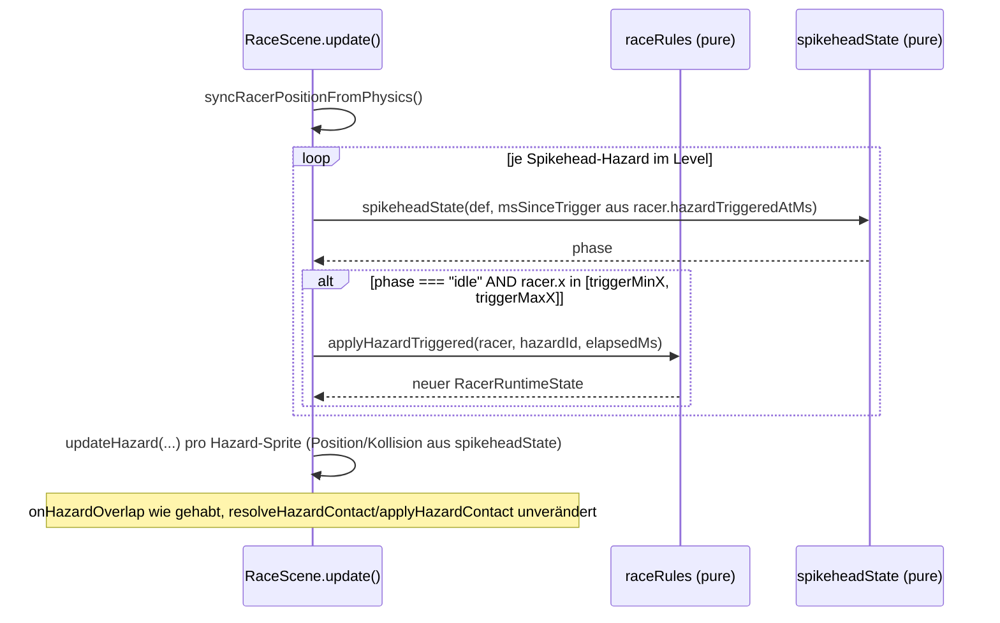

# Design: Level-Two-Kaizo (zweites, schwereres Level)

Bezug: `.features/level-two-kaizo/requirements.md` (US-1 bis US-5)

> **Amendment (nach initialer Umsetzung):** Auf Wunsch wurde Spikehead
> überarbeitet, bevor es final abgenommen wurde:
> 1. Sprite: nutzt jetzt das **Kugelblitz-Asset** (Spiked Ball, rot
>    eingefärbt) statt des Stachlinger-Sprites – wirkt als fallendes/
>    aufsteigendes Objekt stimmiger als das flache Stachel-Sprite.
> 2. Verhalten: nach `resting` folgt eine neue **`rising`-Phase**
>    (`riseMs`, Default 500ms) – der Hazard steigt langsam zurück zu
>    `originY` auf und wird erst dort (wieder im "idle"-Zustand) erneut
>    auslösbar, statt direkt nach `restMs` wieder scharf zu sein.
> Betroffen: `hazards/registry.ts` (Textur/Hitbox), `hazards/behaviors.ts`
> (`spikeheadState`-Phasen + `SpikeheadPhase`-Union), `level/types.ts`
> (`riseMs`), `HAZARD_DEFAULTS.spikehead`. Der restliche Abschnitt unten
> beschreibt weiterhin die grundlegende Architektur (Trigger-Zone,
> `hazardTriggeredAtMs`, Registry/Behavior-Aufteilung) unverändert korrekt;
> nur die konkreten Phasen/Texturen unten sind entsprechend zu lesen.

## Architektur-Überblick

Reine Erweiterung der bestehenden `level-one-arena`-Architektur (pure Rules-Engine strikt
getrennt von der dünnen Phaser-Schicht, siehe dortiges `design.md`). Kein neues
Architektur-Prinzip nötig – dieses Feature fügt an genau den Stellen an, die die bestehende
Registry-/Behavior-Struktur für "neuer Kind" bzw. "neues Level" vorsieht (Open/Closed):

```
┌────────────────────────────────────────────────────────────────────────┐
│ client/src/game (Phaser-Schicht)                                        │
│  RaceScene.ts ──▶ liest this.level via LEVEL_REGISTRY[levelId]           │
│       │           ruft updateHazard(instance, elapsedMs, triggerMap)     │
│       └─ erkennt Spikehead-Trigger-Zone-Eintritt, ruft                  │
│          applyHazardTriggered() auf (neuer Reducer-Aufruf, wie          │
│          applyBlockHit() bei Block-Kollision)                          │
├────────────────────────────────────────────────────────────────────────┤
│ client/src/game/{level,hazards,rules,state} (pure)                     │
│  level/levelRegistry.ts (NEU)   level/levelTwo.ts (NEU)                 │
│  hazards/behaviors.ts (+spikeheadState)  hazards/registry.ts (+Eintrag) │
│  rules/racerState.ts (+hazardTriggeredAtMs)                             │
│  rules/raceRules.ts (+applyHazardTriggered)                             │
│  level/tiles.ts (Trigger-Hazards in Dynamic-State einbeziehen)          │
└────────────────────────────────────────────────────────────────────────┘
```

## Schnittstellen & Datenmodelle

### `@arena/bot-contract` – `hazards.ts`

```ts
export type HazardKind = "schnetzler" | "stachlinger" | "loderix" | "kugelblitz" | "spikehead";
```
Einzige Änderung an diesem Package (Single Source of Truth für Kind-Strings, siehe
`level-one-arena/design.md`).

### `level/types.ts` – neuer Hazard-Instanz-Typ

```ts
export type HazardInstanceDef =
  | { kind: Extract<HazardKind, "schnetzler">; /* ... unverändert ... */ }
  | { kind: Extract<HazardKind, "stachlinger">; /* ... unverändert ... */ }
  | { kind: Extract<HazardKind, "loderix">; /* ... unverändert ... */ }
  | { kind: Extract<HazardKind, "kugelblitz">; /* ... unverändert ... */ }
  | {
      kind: Extract<HazardKind, "spikehead">;
      id: string;
      x: number;
      /** Ruheposition (oben, ungefährlich, bis getriggert). */
      originY: number;
      /** Position nach dem Fall (typ. Bodenhöhe). */
      fallToY: number;
      /** Horizontale Zone, deren Betreten den Fall auslöst. */
      triggerMinX: number;
      triggerMaxX: number;
      warnMs?: number; // Default 400 – Vorwarnzeit, noch ungefährlich
      fallMs?: number; // Default 200 – Falldauer, ab hier gefährlich
      restMs?: number; // Default 600 – Liegedauer unten, weiterhin gefährlich
    };
```
`warnMs`/`fallMs`/`restMs` optional mit Defaults (analog zu Loderix' `onMs`/`offMs`) – neue
Einträge in `HAZARD_DEFAULTS.spikehead` (`hazards/registry.ts`).

### `hazards/registry.ts`

```ts
export type HazardBehaviorKind = "patrol" | "static" | "timed" | "pendulum" | "trigger";

export interface HazardSpec {
  texture: string;
  anim?: string;
  inactiveTexture?: string;
  /** Tint (Phaser `setTint`-Farbwert), um ein bestehendes Sprite ohne neues
   *  Asset optisch zu unterscheiden (US-3: Spikehead nutzt das
   *  Stachlinger-Sprite in Rot). Nur additiv genutzt, ändert keine
   *  bestehenden Specs. */
  tint?: number;
  stompable: boolean;
  behavior: HazardBehaviorKind;
  hitbox: HitboxSpec;
}

export const HAZARD_REGISTRY: Record<HazardKind, HazardSpec> = {
  // ... bestehende vier Einträge unverändert ...
  spikehead: {
    texture: "spikes",           // dasselbe Asset wie Stachlinger
    stompable: false,
    behavior: "trigger",
    hitbox: { width: 10, height: 10, offsetX: 3, offsetY: 6 }, // identisch zu Stachlinger
    tint: 0xff5555,              // rötlich eingefärbt, optisch unterscheidbar
  },
};

export const HAZARD_DEFAULTS = {
  loderix: { onMs: 1500, offMs: 1500, phaseMs: 0 },
  kugelblitz: { periodMs: 2400, amplitudeDeg: 50 },
  spikehead: { warnMs: 400, fallMs: 200, restMs: 600 }, // NEU
} as const;
```
Kein Kind-spezifischer Sonderfall in `RaceScene`/`worldBuilder` nötig – exakt das
Open/Closed-Muster aus `docs/08`.

### `hazards/behaviors.ts` – `spikeheadState` (pure, das Herzstück von US-3)

```ts
export interface SpikeheadLike {
  originY: number;
  fallToY: number;
  warnMs?: number;
  fallMs?: number;
  restMs?: number;
}

export type SpikeheadPhase = "idle" | "warning" | "falling" | "resting";

export interface SpikeheadState {
  phase: SpikeheadPhase;
  y: number;      // aktuelle vertikale Position
  active: boolean; // gerade gefährlich?
}

/**
 * Rein zeitbasiert ab dem Moment des Triggers: `msSinceTrigger === null`
 * bedeutet "noch nie/nicht mehr getriggert" -> idle an `originY`.
 * Reihenfolge: idle -(Trigger)-> warning (an originY, UNGEFÄHRLICH,
 * Vorwarnzeit) -> falling (Y interpoliert originY->fallToY, GEFÄHRLICH)
 * -> resting (an fallToY, GEFÄHRLICH) -> zurück zu idle (Aufrufer muss dann
 * erneut triggern können, siehe RaceScene-Rearm-Logik unten).
 */
export function spikeheadState(
  def: SpikeheadLike,
  msSinceTrigger: number | null
): SpikeheadState {
  if (msSinceTrigger === null) {
    return { phase: "idle", y: def.originY, active: false };
  }
  const warnMs = def.warnMs ?? HAZARD_DEFAULTS.spikehead.warnMs;
  const fallMs = def.fallMs ?? HAZARD_DEFAULTS.spikehead.fallMs;
  const restMs = def.restMs ?? HAZARD_DEFAULTS.spikehead.restMs;

  if (msSinceTrigger < warnMs) {
    return { phase: "warning", y: def.originY, active: false };
  }
  if (msSinceTrigger < warnMs + fallMs) {
    const t = (msSinceTrigger - warnMs) / fallMs;
    return { phase: "falling", y: def.originY + (def.fallToY - def.originY) * t, active: true };
  }
  if (msSinceTrigger < warnMs + fallMs + restMs) {
    return { phase: "resting", y: def.fallToY, active: true };
  }
  return { phase: "idle", y: def.originY, active: false };
}
```
Vollständig pure, ohne Phaser – testbar wie `patrolX`/`isTimedActive`/`pendulumOffset`.

### `rules/racerState.ts` – Trigger-Gedächtnis

Warum hier (nicht als scene-lokaler `Map`-State)? Wie `resolvedBlockIds` soll auch der
Spikehead-Trigger-Zeitpunkt **rein aus `(LevelDef, RacerRuntimeState, elapsedMs)` ableitbar**
sein (Single Source of Truth, kein zweiter, undokumentierter Speicherort), damit
`buildDynamicTileState`/`buildBotState` weiterhin ohne lebende Phaser-Sprites auskommen (siehe
`level-one-arena/design.md`, "Drift-Schutz").

```ts
export interface RacerRuntimeState {
  // ... bestehende Felder unverändert ...
  /** Zeitpunkt (elapsedMs), zu dem ein Spikehead zuletzt ausgelöst wurde, je
   *  Hazard-ID. Fehlt ein Eintrag -> nie ausgelöst / bereits fertig
   *  abgeklungen und wieder scharf (siehe `spikeheadState`, "idle" nach dem
   *  vollen Zyklus). */
  hazardTriggeredAtMs: ReadonlyMap<string, number>;
}
```
`createInitialRacerState`: `hazardTriggeredAtMs: new Map()`.

### `rules/raceRules.ts` – neuer Reducer

```ts
export function applyHazardTriggered(
  state: RacerRuntimeState,
  hazardId: string,
  triggeredAtMs: number
): RacerRuntimeState {
  return {
    ...state,
    hazardTriggeredAtMs: new Map(state.hazardTriggeredAtMs).set(hazardId, triggeredAtMs),
  };
}
```
Analog zu `applyBlockHit` (gleiches Muster: Set/Map-Kopie + einzelner neuer Eintrag).

### `level/tiles.ts` – Trigger-Hazards im Dynamic-State berücksichtigen

`ResolvedBlocksSource` wird zu `DynamicStateSource` erweitert (ISP bleibt gewahrt: weiterhin
nur die zwei tatsächlich benötigten Felder, kein voller `RacerRuntimeState`-Import):

```ts
export interface DynamicStateSource {
  resolvedBlockIds: ReadonlySet<string>;
  hazardTriggeredAtMs: ReadonlyMap<string, number>;
}

export function buildDynamicTileState(
  level: LevelDef,
  racer: DynamicStateSource,
  elapsedMs: number
): DynamicTileState {
  const activeHazardIds = new Set<string>();
  for (const hazard of level.hazards) {
    if (isHazardActive(hazard, elapsedMs, racer.hazardTriggeredAtMs)) {
      activeHazardIds.add(hazard.id);
    }
  }
  return { activeHazardIds, resolvedBlockIds: racer.resolvedBlockIds };
}

function isHazardActive(
  hazard: HazardInstanceDef,
  elapsedMs: number,
  hazardTriggeredAtMs: ReadonlyMap<string, number>
): boolean {
  if (hazard.kind === "loderix") return isTimedActive(hazard, elapsedMs);
  if (hazard.kind === "spikehead") {
    const triggeredAt = hazardTriggeredAtMs.get(hazard.id);
    const msSinceTrigger = triggeredAt === undefined ? null : elapsedMs - triggeredAt;
    return spikeheadState(hazard, msSinceTrigger).active;
  }
  // schnetzler/stachlinger/kugelblitz: dauerhaft gefährlich (docs/08).
  return true;
}
```
`tileTypeAt`s Hazard-Positions-Ermittlung (`hx`/`hy`) bekommt einen dritten Fall (analog zu
`kugelblitz`s `pivotX/pivotY`): `spikehead` wird an `(x, fallToY)` verortet – das ist die
Position, an der er *als aktiver Hazard* tatsächlich blockiert (die Tile-Markierung greift
ohnehin nur, wenn `activeHazardIds` ihn enthält, siehe bestehende Fail-Fast-Kette). Dieselbe
bewusste Vereinfachung wie beim bereits bestehenden `kugelblitz`-Fall (statische
Referenzposition statt live nachgeführter Momentanposition).

### `state/worldSnapshot.ts`/`RaceScene.buildSnapshot()`

Keine Typ-Änderung an `WorldSnapshot` nötig. `RaceScene.buildSnapshot()` (Phaser-Schicht,
bereits ungetestet) ergänzt die bestehende `x`/`y`-Fallunterscheidung um `spikehead ->
(x, fallToY)` – exakt dasselbe Muster wie der vorhandene `kugelblitz`-Fall, keine neue
Abstraktion nötig (YAGNI).

### `hazards/factory.ts` – Rendering/Update (dünn, ungetestet)

```ts
export function updateHazard(
  instance: HazardInstance,
  elapsedMs: number,
  hazardTriggeredAtMs: ReadonlyMap<string, number>
): void {
  const { sprite, def } = instance;
  if (def.kind === "schnetzler") { sprite.x = patrolX(def, elapsedMs); return; }
  if (def.kind === "loderix") { updateLoderix(sprite, def, elapsedMs); return; }
  if (def.kind === "kugelblitz") { /* unverändert */ return; }
  if (def.kind === "spikehead") { updateSpikehead(sprite, def, elapsedMs, hazardTriggeredAtMs); return; }
  // "stachlinger": statisch.
}

function updateSpikehead(
  sprite: Phaser.Physics.Arcade.Sprite,
  def: Extract<HazardInstanceDef, { kind: "spikehead" }>,
  elapsedMs: number,
  hazardTriggeredAtMs: ReadonlyMap<string, number>
): void {
  const triggeredAt = hazardTriggeredAtMs.get(def.id);
  const msSinceTrigger = triggeredAt === undefined ? null : elapsedMs - triggeredAt;
  const state = spikeheadState(def, msSinceTrigger);
  sprite.y = state.y;
  if (sprite.body?.checkCollision) sprite.body.checkCollision.none = !state.active;
}
```
Signaturänderung von `updateHazard` (neuer dritter Parameter) ist ein reiner Wiring-Wechsel
(Phaser-Schicht, ungetestet) – einziger Aufrufer ist `RaceScene.update()`.
`createHazard()` wendet zusätzlich `spec.tint` an, falls vorhanden:
```ts
if (spec.tint !== undefined) sprite.setTint(spec.tint);
```

### `scenes/RaceScene.ts` – Trigger-Erkennung + Rearm (dünn, ungetestet)

Neue private Methode, aufgerufen einmal pro Frame in `update()` (nach
`syncRacerPositionFromPhysics()`, damit `this.racer.x` aktuell ist):

```ts
private updateSpikeheadTriggers(): void {
  for (const hazard of this.level.hazards) {
    if (hazard.kind !== "spikehead") continue;
    const triggeredAt = this.racer.hazardTriggeredAtMs.get(hazard.id);
    const msSinceTrigger = triggeredAt === undefined ? null : this.elapsedMs - triggeredAt;
    const phase = spikeheadState(hazard, msSinceTrigger).phase;
    if (phase !== "idle") continue; // noch im laufenden Zyklus, nicht neu triggerbar
    const inZone = this.racer.x >= hazard.triggerMinX && this.racer.x <= hazard.triggerMaxX;
    if (inZone) {
      this.racer = applyHazardTriggered(this.racer, hazard.id, this.elapsedMs);
    }
  }
}
```
Aufruf-Reihenfolge in `update()`: nach `syncRacerPositionFromPhysics()`, vor
`fireBotTick()`/`notifyStatus()` (der neue `hazardTriggeredAtMs`-Stand muss im selben Frame
noch in `updateHazard()`-Aufrufen sowie im nächsten `buildSnapshot()`/`buildDynamicTileState()`
sichtbar sein). `updateHazard(instance, this.elapsedMs, this.racer.hazardTriggeredAtMs)` und
`buildDynamicTileState(this.level, this.racer, this.elapsedMs)` werden entsprechend mit dem
(bereits vorhandenen bzw. erweiterten) `this.racer` aufgerufen – keine neuen Parameter an den
Aufrufstellen nötig außer bei `updateHazard`.

Kollisions-Overlap: Wie bei den bestehenden Hazards nimmt `onHazardOverlap` (unverändert)
`resolveHazardContact(kind, active, contactFromAbove)` – `spikehead` ist laut Registry nicht
stompbar, jede Berührung während `active === true` ist also automatisch `"hit"`, kein
Sonderfall nötig.

### Level-Registry (US-1)

```ts
// level/levelRegistry.ts
import { LEVEL_ONE } from "./levelOne";
import { LEVEL_TWO } from "./levelTwo";
import type { LevelDef } from "./types";

export interface LevelRegistryEntry {
  id: string;
  label: string;
  level: LevelDef;
}

export const LEVEL_REGISTRY: readonly LevelRegistryEntry[] = [
  { id: "level-one", label: "Level 1", level: LEVEL_ONE },
  { id: "level-two", label: "Level 2 – Kaizo", level: LEVEL_TWO },
];

export const DEFAULT_LEVEL_ID = "level-one";

/** Fail-Fast (US-1): wirft bei unbekannter ID, statt still ein Default zu laden. */
export function getLevelById(levelId: string): LevelDef {
  const entry = LEVEL_REGISTRY.find((e) => e.id === levelId);
  if (!entry) {
    throw new Error(`Unbekannte Level-ID: "${levelId}". Verfügbar: ${LEVEL_REGISTRY.map((e) => e.id).join(", ")}`);
  }
  return entry.level;
}
```
Bewusst ein `readonly`-**Array** (nicht `Record<string, LevelDef>`): die UI (US-4, Dropdown)
braucht eine **geordnete** Liste mit Anzeigenamen zum Rendern; ein Array mit `id`+`label`
spart der Konsumenten-Seite eine zusätzliche Sortier-/Label-Zuordnung (KISS). Perspektivisch
(späteres `/admin`-Feature, siehe Nicht-Ziele): `/admin` könnte dieselbe `LEVEL_REGISTRY`
importieren und dieselbe `levelId` an den Hub-Server broadcasten – kein struktureller Umbau
nötig, da IDs bereits stabile Strings sind (kein Objekt-Identitätsvergleich).

### `scenes/RaceScene.ts` – Level-Auswahl statt hartem `LEVEL_ONE`

```ts
export interface RaceSceneInitData {
  controllerMode: "keyboard" | "bot";
  levelId?: string; // Default DEFAULT_LEVEL_ID, siehe init()
  botSourceCode?: string;
  startingLives?: number;
  onStatusChange?: (...) => void;
  onReady?: () => void;
}
```
```ts
init(data: RaceSceneInitData): void {
  this.initData = data;
  this.level = getLevelById(data.levelId ?? DEFAULT_LEVEL_ID);
}
```
`this.level` verliert seinen `= LEVEL_ONE`-Feld-Default (wird jetzt ausschließlich in `init()`
gesetzt, bevor `create()` läuft – Phaser ruft `init()` immer vor `create()`). Der bisherige
Feld-Initialisierer diente nur als TS-Definite-Assignment-Ersatz; da `init()` diesen Wert
garantiert vor jeder Nutzung setzt, wird das Feld stattdessen mit `!` deklariert
(`private level!: LevelDef;`), analog zu `world!`/`player!` in derselben Klasse.

### `ArenaView.tsx` – `levelId`-Prop durchreichen

```ts
export interface ArenaViewProps {
  controlMode: "keyboard" | "bot";
  levelId: string; // NEU, Pflicht-Prop (DevPage liefert immer einen Wert aus der Registry)
  botSourceCode?: string;
  startingLives?: number;
  onStatusChange?: (status: ArenaViewStatus) => void;
}
```
`levelId` wird nur beim **Mount** an `game.scene.start(...)` übergeben (wie `startingLives`) –
ein Level-Wechsel während des laufenden Spiels läuft über denselben, bereits bestehenden
`key`-Remount-Mechanismus in `DevPage` (komplette `ArenaView`-Neuerzeugung), NICHT über einen
reaktiven zweiten Effect wie bei `controlMode` (US-4: "Lauf zurücksetzen" ist explizit
gefordert, ein Live-Wechsel des Levels unter dem laufenden Racer wäre ohnehin unsinnig).

### `DevPage.tsx` + `useArenaControls.ts` – Dropdown (US-4)

`useArenaControls` bekommt zusätzlich `levelId`/`setLevelId`, Default `DEFAULT_LEVEL_ID`:
```ts
export interface ArenaControls {
  mode: ArenaControlMode;
  setMode: (mode: ArenaControlMode) => void;
  levelId: string;
  setLevelId: (levelId: string) => void;
}
```
`DevPage` rendert ein `<select>` im bestehenden Pixel-Design (neue CSS-Klasse
`.pixel-select`, siehe unten) mit `LEVEL_REGISTRY`-Optionen. Auswahländerung setzt `levelId`
UND erhöht `runId` (bestehender Remount-Mechanismus, identisch zum "↻ Neu"-Button) – erfüllt
US-4 ("Lauf zurücksetzen bei Levelwechsel") ohne neuen Reset-Mechanismus (DRY, Wiederverwendung
des bereits vorhandenen `key`-Patterns). Der Steuerungsmodus (`mode`) bleibt dabei unverändert
im State (kein Teil des `runId`-Bumps), erfüllt das dritte Akzeptanzkriterium von US-4.

```tsx
<select
  className="pixel-select"
  value={levelId}
  onChange={(e) => {
    setLevelId(e.target.value);
    setRacer(null);
    setDiagnosis(null);
    setRunId((id) => id + 1);
  }}
>
  {LEVEL_REGISTRY.map((entry) => (
    <option key={entry.id} value={entry.id}>{entry.label}</option>
  ))}
</select>
```

### CSS – `.pixel-select` (neu, `theme.css`)

Neue, zum bestehenden `.pixel-btn`/`.pixel-toggle`-Look passende Regel (Pixel-Rahmen,
Neon-Akzentfarbe, monospace, `image-rendering: pixelated`), rein additiv, keine bestehende
Regel geändert:
```css
.pixel-select {
  font-family: inherit;
  font-size: 9px;
  color: var(--ink);
  background: var(--panel-hi);
  border: none;
  padding: 8px 10px;
  cursor: pointer;
  text-transform: uppercase;
  letter-spacing: 1px;
  box-shadow:
    0 0 0 3px var(--border-dark),
    3px 3px 0 3px rgba(0, 0, 0, 0.5);
  image-rendering: pixelated;
}
.pixel-select:hover { color: var(--neon-cyan); }
.pixel-select:focus { outline: 2px solid var(--neon-cyan); outline-offset: 2px; }
```
(Kein Test nötig – reine Deklaration ohne Verzweigungslogik, wie alle übrigen `pixel-*`-Regeln.)

### `level/levelTwo.ts` – Level-Daten (US-2)

Gleicher Aufbau wie `LEVEL_ONE` (siehe dortige Kopf-Kommentare zu Bewegungswerten), aber:
- **Lücken**: 176px (11 Tiles) statt 128px – spürbar enger am Limit (~250px), aber mit
  ausreichend Puffer für zuverlässiges, wiederholbares Überspringen (kein Pixel-Perfect
  nötig).
- **Gegner-Gauntlet**: ein Plattform-Segment mit 3 Schnetzlern, deren Patrol-Bereiche sich
  teilweise überlappen bzw. eng aneinander anschließen (`minX`/`maxX`-Abstände < eine
  Schnetzler-Breite), sodass ein Bot mehrfach hintereinander timen/stompen muss, um
  durchzukommen (US-2, drittes Akzeptanzkriterium).
- **Spikehead**: 1-2 Instanzen über je einer engen Boden-Passage (nicht über einer Lücke),
  `triggerMinX/triggerMaxX` so gewählt, dass der Racer die Zone bereits kurz VOR dem
  eigentlichen Gefahrenbereich betritt (Vorwarnzeit `warnMs` nutzbar für rechtzeitiges
  Springen/Stehenbleiben).
- Weiterhin alle 5 Hazard-Kinds (inkl. Schnetzler/Stachlinger/Loderix/Kugelblitz aus Level 1)
  vertreten, ca. 10-15 sichtbare Münzen, 3-5 versteckte Blöcke, mindestens 3 Checkpoints,
  mindestens 1 Boingo – siehe `level/levelTwo.test.ts`.
- Weltbreite ähnlich `LEVEL_ONE` (~3450-3550px).

## Ablauf / Sequenz (nur der neue Trigger-Teil, Rest wie in `level-one-arena`)



## Fehlerbehandlung & Edge Cases

- **Racer bleibt in der Trigger-Zone stehen, während der Zyklus bereits läuft**: `phase !==
  "idle"`-Check verhindert ein Retriggern mitten im Fall/Liegen – der Zyklus läuft exakt
  einmal durch, bevor er (nach `restMs`) wieder scharf wird, auch wenn der Racer die Zone nie
  verlässt (deterministisch, kein Endlos-Rearm im selben Frame).
- **Racer verlässt die Zone vor Ablauf von `warnMs`**: Kein Effekt auf den bereits laufenden
  Zyklus (bewusst, wie ein echter Kaizo-Rock-Trap: einmal ausgelöst, läuft er durch) – keine
  zusätzliche Abbruch-Logik (YAGNI, kein Akzeptanzkriterium verlangt das).
- **Unbekannte `levelId`** (z.B. Tippfehler in einer zukünftigen `/admin`-Anbindung):
  `getLevelById` wirft synchron in `RaceScene.init()` – bewusst kein stiller Fallback (US-1,
  Fail-Fast), Fehler erscheint als regulärer Laufzeitfehler in der Browser-Konsole (keine
  eigene Error-Boundary in diesem Feature, YAGNI – analog zum bestehenden Fehlerverhalten bei
  anderen Programmierfehlern in `RaceScene`).
- **Level-Wechsel während eines laufenden Bot-Ticks** (`fireBotTick`-Promise noch offen):
  Wird durch den bestehenden `key`-Remount abgedeckt (zerstört `Phaser.Game` inkl. `BotRunner`
  komplett, siehe `ArenaView`-Cleanup-Effect) – keine neue Race-Condition-Behandlung nötig.

## Test-Strategie

Rot-Grün-Refactor pro Modul (siehe `tasks.md`).

- **Pure Module – vollständig unit-getestet (Vitest):**
  - `hazards/behaviors.test.ts` (erweitert): `spikeheadState` für alle vier Phasen
    (`null` → idle; `0 <= t < warnMs` → warning, `y === originY`, `active === false`;
    `warnMs <= t < warnMs+fallMs` → falling, `y` zwischen `originY`/`fallToY` (Grenzwerte an
    Anfang/Ende der Fallphase geprüft); `warnMs+fallMs <= t < ...+restMs` → resting,
    `y === fallToY`, `active === true`; danach → wieder idle).
  - `rules/raceRules.test.ts` (erweitert): `applyHazardTriggered` setzt/überschreibt den
    Zeitstempel für die jeweilige Hazard-ID, lässt andere Einträge unverändert.
  - `level/tiles.test.ts` (erweitert): `buildDynamicTileState`/`isHazardActive` markiert
    `spikehead` korrekt als aktiv/inaktiv abhängig von `hazardTriggeredAtMs` +
    `elapsedMs`; `tileTypeAt` verortet einen aktiven `spikehead` an `(x, fallToY)`.
  - `state/botStateBuilder.test.ts`: kein neuer Testfall nötig (generischer Kind-Pfad bereits
    abgedeckt) – Regressionstest, dass bestehende Tests weiterhin grün bleiben, genügt.
  - `level/levelTwo.test.ts` (neu, analog `levelOne.test.ts`): Struktur-/Größen-Assertions
    (Münzen-/Block-/Checkpoint-Anzahl, alle 5 Hazard-Kinds vorhanden, mindestens ein
    Gegner-Cluster mit ≥3 `schnetzler` auf einer Plattform, mindestens eine Lücke >150px,
    mindestens ein `spikehead`).
  - `level/levelRegistry.test.ts` (neu): enthält `"level-one"`/`"level-two"`,
    `getLevelById("level-one") === LEVEL_ONE`, `getLevelById("unbekannt")` wirft.
  - `control/useArenaControls.test.ts` (falls noch nicht vorhanden, sonst erweitert):
    Default-`levelId === DEFAULT_LEVEL_ID`, `setLevelId` aktualisiert den State.
- **Bewusst nicht unit-getestet (Phaser/Canvas/DOM-Rendering nötig):**
  - `hazards/factory.ts` (Tint-Anwendung, `updateSpikehead`), `scenes/RaceScene.ts`
    (Trigger-Erkennung/Rearm, `updateSpikeheadTriggers`), `ArenaView.tsx`
    (`levelId`-Weiterreichung), `DevPage.tsx`-Dropdown-Markup, `.pixel-select`-CSS.
- **Manueller Verifikationsschritt (Browser):**
  1. `/dev` öffnen, Dropdown zeigt "Level 1"/"Level 2 – Kaizo", Level 1 ist vorausgewählt.
  2. Auf "Level 2" wechseln → Lauf resettet sichtbar (Coins/Leben/Zeit zurück auf Start),
     Level-2-Terrain lädt.
  3. Enge Lücken manuell überspringen (mit normalem Sprung, kein Boingo nötig) – verifizieren,
     dass sie fair, aber spürbar enger als Level 1 sind.
  4. Gegner-Gauntlet durchqueren – mehrfaches Timen/Stompen nötig, kein Durchlaufen ohne
     Reaktion möglich.
  5. Spikehead-Zone betreten → kurze Vorwarnzeit, dann Fall, Kollision während Fallen/Liegen
     kostet ein Leben + Checkpoint-Respawn; nach Ablauf wieder scharf bei erneutem Betreten.
  6. Zurück zu "Level 1" wechseln → weiterhin unverändert spielbar (Regressionstest von Hand).
  7. Bot-Modus (`current-bot.js`) auf Level 2 laufen lassen, verifizieren, dass Hazard-Sichtung
     (`nearestHazard.kind === "spikehead"`) plausibel wirkt.

## Auswirkungen auf bestehenden Code

- `packages/bot-contract/src/hazards.ts`: `HazardKind` um `"spikehead"` erweitert (additiv,
  bestehende Werte unverändert – kein Breaking Change für bestehende Bot-Dateien, die nur auf
  bekannte `kind`-Werte prüfen).
- `client/src/game/level/types.ts`: `HazardInstanceDef`-Union um `spikehead`-Variante erweitert.
- `client/src/game/hazards/registry.ts`: neuer `HazardBehaviorKind` `"trigger"`, neues
  `tint`-Feld (optional, bestehende Specs unverändert), neuer `spikehead`-Eintrag, neuer
  `HAZARD_DEFAULTS.spikehead`-Eintrag.
- `client/src/game/hazards/behaviors.ts`: neue Funktion `spikeheadState` (additiv).
- `client/src/game/hazards/factory.ts`: `updateHazard`-Signatur um dritten Parameter
  erweitert (einziger Aufrufer: `RaceScene`, wird mit angepasst); `createHazard` wendet
  optionales `tint` an; neue private `updateSpikehead`-Hilfsfunktion.
- `client/src/game/rules/racerState.ts`: `RacerRuntimeState` um `hazardTriggeredAtMs` erweitert,
  `createInitialRacerState` initialisiert es leer.
- `client/src/game/rules/raceRules.ts`: neue Funktion `applyHazardTriggered` (additiv).
- `client/src/game/level/tiles.ts`: `ResolvedBlocksSource` → `DynamicStateSource` umbenannt/
  erweitert (Aufrufer `RaceScene`/Tests entsprechend angepasst), `isHazardActive` bekommt
  dritten Parameter, `tileTypeAt` bekommt `spikehead`-Fall in der Positions-Ermittlung.
- `client/src/game/level/levelTwo.ts` (neu) + `levelTwo.test.ts` (neu).
- `client/src/game/level/levelRegistry.ts` (neu) + `levelRegistry.test.ts` (neu).
- `client/src/game/scenes/RaceScene.ts`: `level`-Feld wird über `init()`/`getLevelById`
  gesetzt statt hartem `LEVEL_ONE`-Default; neue Methode `updateSpikeheadTriggers`; angepasste
  Aufrufe von `updateHazard`/`buildSnapshot` (Spikehead-Positions-Fall).
  `RaceSceneInitData` bekommt optionales `levelId`.
- `client/src/game/ArenaView.tsx`: neue Pflicht-Prop `levelId`, an `game.scene.start(...)`
  durchgereicht.
- `client/src/game/control/useArenaControls.ts`: neuer State `levelId`/`setLevelId`.
- `client/src/pages/DevPage.tsx`: neues `<select className="pixel-select">`-Dropdown,
  Levelwechsel löst bestehenden `runId`-Remount aus.
- `client/src/theme.css`: neue, additive `.pixel-select`-Regeln.
- `docs/08-hazards-und-utilities.md`: neuer Abschnitt "Spikehead".
- `docs/06-level-design.md`: Hinweis, dass es nun mehrere Level mit steigendem
  Schwierigkeitsgrad gibt.
