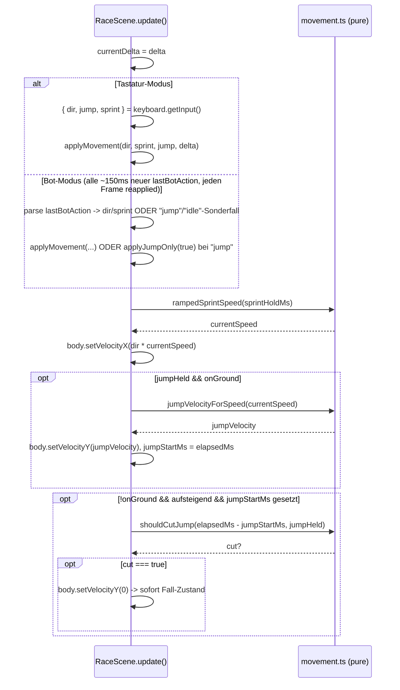

# Design: Movement-Sprint-And-Variable-Jump

Bezug: `.features/movement-sprint-and-variable-jump/requirements.md` (US-1 bis US-6)

## Architektur-Überblick

Gleiches Grundprinzip wie `hazards/behaviors.ts`/`rules/raceRules.ts`: die eigentliche
Physik-Berechnung (Rampen, Skalierung, Cutoff-Entscheidung) lebt als **pure, unit-getestete
Funktionen** in einem neuen Modul `client/src/game/movement/movement.ts`. `RaceScene` bleibt
eine dünne Wiring-Schicht, die diese Funktionen pro Frame aufruft und deren Ergebnis auf den
Arcade-Physics-Body anwendet – keine eigene Skalierungslogik dort.

```
┌────────────────────────────────────────────────────────────────────────┐
│ client/src/game/scenes/RaceScene.ts (Phaser, dünn)                     │
│  applyKeyboardInput() / applyBotAction() ermitteln (dir, sprint, jump)  │
│       │                                                                  │
│       ├─▶ rampedSprintSpeed(sprintHoldMs)      -> aktuelle horiz. Speed  │
│       ├─▶ jumpVelocityForSpeed(currentSpeed)   -> Sprung-Velocity        │
│       └─▶ shouldCutJump(msSinceJumpStart, ...) -> Sprung abschneiden?    │
├────────────────────────────────────────────────────────────────────────┤
│ client/src/game/movement/movement.ts (pure, unit-getestet)             │
└────────────────────────────────────────────────────────────────────────┘
```

`KeyboardController` bleibt für die Rohsignal-Ermittlung zuständig (liest Shift-Taste),
`RaceScene` bleibt für Bot-Actions zuständig (parst `"sprint-left"`/`"sprint-right"`) – beide
liefern am Ende dasselbe normalisierte Tripel `(dir, sprint, jump)` pro Frame, das dieselbe
pure Physik-Pipeline durchläuft (DRY, keine doppelte Sprint-/Sprung-Logik für Tastatur vs. Bot).

## Schnittstellen & Datenmodelle

### `@arena/bot-contract` – `state.ts`

```ts
export type Action = "left" | "right" | "jump" | "idle" | "sprint-left" | "sprint-right";

export const ACTIONS: readonly Action[] = [
  "left",
  "right",
  "jump",
  "idle",
  "sprint-left",
  "sprint-right",
];
```
`BotRunner`s Laufzeit-Validierung (`(ACTIONS as readonly string[]).includes(value)`) braucht
keine Code-Änderung – sie liest bereits generisch aus `ACTIONS` (Open/Closed, war schon vor
diesem Feature so vorbereitet).

### `client/src/game/movement/movement.ts` (neu, pure)

```ts
export const MOVEMENT_TUNING = {
  BASE_MOVE_SPEED: 200,        // unverändert (bisheriges MOVE_SPEED)
  SPRINT_MOVE_SPEED: 320,      // Ziel-Geschwindigkeit bei vollem Sprint
  SPRINT_RAMP_MS: 450,         // Zeit von Basis- bis Sprint-Tempo
  BASE_JUMP_VELOCITY: -560,    // unverändert (bisheriges JUMP_VELOCITY)
  SPRINT_JUMP_VELOCITY: -650,  // Sprungkraft bei voller Sprint-Geschwindigkeit
  MIN_JUMP_HOLD_MS: 180,       // garantierte Mindest-Halte-Zeit (> 150ms Bot-Tick)
} as const;

/**
 * Aktuelle horizontale Geschwindigkeit als Funktion davon, wie lange
 * ununterbrochen in dieselbe Richtung gesprintet wurde (`sprintHoldMs`).
 * `sprintHoldMs=0` -> Basisgeschwindigkeit, `sprintHoldMs>=SPRINT_RAMP_MS`
 * -> volle Sprint-Geschwindigkeit, linear dazwischen. Kein Fall
 * "sprintet nicht" hier - das entscheidet der Aufrufer (setzt
 * `sprintHoldMs=0`, wenn nicht gesprintet wird -> liefert Basiswert).
 */
export function rampedSprintSpeed(
  sprintHoldMs: number,
  tuning: Pick<typeof MOVEMENT_TUNING, "BASE_MOVE_SPEED" | "SPRINT_MOVE_SPEED" | "SPRINT_RAMP_MS"> = MOVEMENT_TUNING
): number {
  const t = Math.max(0, Math.min(1, sprintHoldMs / tuning.SPRINT_RAMP_MS));
  return tuning.BASE_MOVE_SPEED + (tuning.SPRINT_MOVE_SPEED - tuning.BASE_MOVE_SPEED) * t;
}

/**
 * Sprung-Velocity (negativ = nach oben) skaliert stufenlos zwischen
 * `BASE_JUMP_VELOCITY` (bei `BASE_MOVE_SPEED`) und `SPRINT_JUMP_VELOCITY`
 * (bei `SPRINT_MOVE_SPEED`), abhängig von der aktuellen horizontalen
 * Geschwindigkeit zum Absprungzeitpunkt. Werte außerhalb [BASE, SPRINT]
 * werden geklemmt (z.B. `currentSpeed=0` bei einem Sprung ohne
 * Seitwärtsbewegung -> weiterhin BASE_JUMP_VELOCITY, kein Extrapolieren).
 */
export function jumpVelocityForSpeed(
  currentSpeed: number,
  tuning: Pick<
    typeof MOVEMENT_TUNING,
    "BASE_MOVE_SPEED" | "SPRINT_MOVE_SPEED" | "BASE_JUMP_VELOCITY" | "SPRINT_JUMP_VELOCITY"
  > = MOVEMENT_TUNING
): number {
  const range = tuning.SPRINT_MOVE_SPEED - tuning.BASE_MOVE_SPEED;
  const t =
    range <= 0
      ? 0
      : Math.max(0, Math.min(1, (currentSpeed - tuning.BASE_MOVE_SPEED) / range));
  return tuning.BASE_JUMP_VELOCITY + (tuning.SPRINT_JUMP_VELOCITY - tuning.BASE_JUMP_VELOCITY) * t;
}

/**
 * Ob ein laufender Sprung JETZT abgeschnitten werden soll (Racer soll
 * sofort in den Fall-Zustand übergehen). `true` nur, wenn die
 * Mindest-Halte-Zeit bereits verstrichen ist UND die Sprung-Taste/Action
 * aktuell NICHT gehalten wird. Kennt nichts über `vy`/`onGround` - der
 * Aufrufer ruft dies nur auf, während der Racer sich im Aufstieg befindet
 * (siehe RaceScene-Sequenzdiagramm unten), daher keine weiteren Parameter
 * nötig (ISP/KISS).
 */
export function shouldCutJump(
  msSinceJumpStart: number,
  jumpHeld: boolean,
  minHoldMs: number = MOVEMENT_TUNING.MIN_JUMP_HOLD_MS
): boolean {
  if (jumpHeld) return false;
  return msSinceJumpStart >= minHoldMs;
}
```

Bewusst als **freie Funktionen mit optionalem `tuning`-Parameter** (Default =
`MOVEMENT_TUNING`) statt Klassen/Config-Objekt-Instanzen: passt zum bestehenden Muster
(`patrolX`, `isTimedActive`, `pendulumOffset` in `hazards/behaviors.ts` folgen demselben Stil),
erleichtert isolierte Tests mit abweichenden Werten ohne globalen State zu mutieren.

### `control/KeyboardController.ts` – Shift-Taste + `sprint`-Signal

```ts
export interface CursorKeysLike {
  left: KeyState;
  right: KeyState;
  space: KeyState;
  shift: KeyState; // NEU
}

export interface KeyboardInput {
  dir: -1 | 0 | 1;
  jump: boolean;
  sprint: boolean; // NEU: Shift gehalten (nur relevant in Kombination mit dir!==0)
}

export class KeyboardController implements RacerController {
  getNextAction(): Action {
    const dir = this.keys.left.isDown ? -1 : this.keys.right.isDown ? 1 : 0;
    if (dir !== 0 && this.keys.shift.isDown) {
      return dir < 0 ? "sprint-left" : "sprint-right";
    }
    if (dir < 0) return "left";
    if (dir > 0) return "right";
    if (this.keys.space.isDown) return "jump";
    return "idle";
  }

  getInput(): KeyboardInput {
    const dir = this.keys.left.isDown ? -1 : this.keys.right.isDown ? 1 : 0;
    return { dir, jump: this.keys.space.isDown, sprint: this.keys.shift.isDown };
  }
  // dispose() unverändert
}
```
`getNextAction()`s Prioritäts-Reihenfolge ändert sich geringfügig (Sprint-Kombination wird VOR
reinem `"jump"` geprüft, wenn gleichzeitig eine Richtung gedrückt ist) – bestehende Tests für
"nur eine Taste" bleiben unberührt, neue Tests decken die Sprint-Kombination ab.

`RaceScene.createController()` erzeugt den Shift-Key zusätzlich zu den Cursor-Keys:
```ts
const cursorKeys = this.input.keyboard?.createCursorKeys();
const shiftKey = this.input.keyboard?.addKey(Phaser.Input.Keyboard.KeyCodes.SHIFT);
this.keyboardController = new KeyboardController({ ...cursorKeys, shift: shiftKey } as never);
```

### `scenes/RaceScene.ts` – Wiring

Neue Instanzfelder:
```ts
private sprintHoldMs = 0;
private jumpStartMs: number | null = null;
```
Neue Konstanten-Importe aus `movement.ts` ersetzen die bisherigen lokalen
`MOVE_SPEED`/`JUMP_VELOCITY`-Konstanten (Alias-Import, kein Duplikat).

**Normalisierung auf `(dir, sprint, jumpHeld)` – gemeinsame private Methode:**
```ts
private applyMovement(dir: -1 | 0 | 1, sprint: boolean, jumpHeld: boolean, delta: number): void {
  const body = this.player.body as Phaser.Physics.Arcade.Body;

  if (dir !== 0 && sprint) {
    this.sprintHoldMs += delta;
  } else if (dir !== 0) {
    this.sprintHoldMs = 0; // bewegt sich, aber ohne Sprint -> Basisgeschwindigkeit
  }
  // dir === 0 (idle) behandelt der Aufrufer NICHT über diese Methode (siehe unten,
  // "jump" behält dir/sprint vom Vorzustand bei) - dort wird sprintHoldMs separat
  // zurückgesetzt (nur bei "idle", nicht bei "jump").

  const currentSpeed = rampedSprintSpeed(this.sprintHoldMs);
  if (dir !== 0) {
    body.setVelocityX(dir * currentSpeed);
    this.racer = { ...this.racer, facing: dir < 0 ? "left" : "right" };
  }

  const onGround = body.blocked.down || body.touching.down;
  this.racer = { ...this.racer, onGround };

  if (onGround && this.jumpStartMs !== null) {
    this.jumpStartMs = null; // gelandet -> Sprung-Zyklus zurückgesetzt
  }

  if (jumpHeld && onGround) {
    body.setVelocityY(jumpVelocityForSpeed(currentSpeed));
    this.jumpStartMs = this.elapsedMs;
    this.playSfx(AUDIO_KEYS.JUMP);
  } else if (!onGround && this.jumpStartMs !== null && body.velocity.y < 0) {
    const msSinceJumpStart = this.elapsedMs - this.jumpStartMs;
    if (shouldCutJump(msSinceJumpStart, jumpHeld)) {
      body.setVelocityY(0);
    }
  }
}
```

**`applyKeyboardInput` (ersetzt bisherige Implementierung):**
```ts
private applyKeyboardInput(keyboard: KeyboardController): void {
  const { dir, jump, sprint } = keyboard.getInput();
  if (dir === 0) this.sprintHoldMs = 0;
  this.applyMovement(dir, sprint, jump, this.currentDelta);
}
```
(`this.currentDelta` = die in `update(_time, delta)` empfangene Frame-Delta, als Instanzfeld
zwischengespeichert – siehe unten, da `applyKeyboardInput`/`applyBotAction` aktuell kein
`delta`-Argument bekommen.)

**`applyBotAction` (ersetzt bisherige Implementierung):**
```ts
private applyBotAction(action: Action): void {
  if (action === "jump") {
    // Horizontale Bewegung/Sprint-Rampe UNVERÄNDERT lassen (siehe
    // "Begleitender Fix" in requirements.md) - nur der Sprung wird
    // ausgewertet. dir/sprint aus dem letzten Bewegungs-Tick bleiben
    // implizit über den Body erhalten (velocity wird nicht neu gesetzt).
    this.applyJumpOnly(true);
    return;
  }
  if (action === "idle") {
    this.sprintHoldMs = 0;
    (this.player.body as Phaser.Physics.Arcade.Body).setVelocityX(0);
    this.applyJumpOnly(false);
    return;
  }
  const dir: -1 | 0 | 1 =
    action === "left" || action === "sprint-left"
      ? -1
      : action === "right" || action === "sprint-right"
        ? 1
        : 0;
  const sprint = action === "sprint-left" || action === "sprint-right";
  this.applyMovement(dir, sprint, false, this.currentDelta);
}
```
Kleine Ergänzung: `applyMovement` bekommt einen vierten Fall - wird `jumpHeld=false` UND
`dir===0` übergeben (aus `applyBotAction("jump")`-Zweig `applyJumpOnly`), darf es die
horizontale Geschwindigkeit NICHT anfassen. Sauberer gelöst durch Aufteilen in zwei kleine
Methoden statt einer Methode mit Sonderfall-Flag (SRP):

```ts
/** Wendet NUR die Sprung-/Cutoff-Logik an, ohne horizontale Velocity/Sprint-Rampe
 *  zu verändern (Bot-"jump"-Tick UND der reine Sprung-Anteil von
 *  applyKeyboardInput/applyMovement teilen sich diese Logik, DRY). */
private applyJumpOnly(jumpHeld: boolean): void {
  const body = this.player.body as Phaser.Physics.Arcade.Body;
  const onGround = body.blocked.down || body.touching.down;
  this.racer = { ...this.racer, onGround };

  if (onGround && this.jumpStartMs !== null) this.jumpStartMs = null;

  if (jumpHeld && onGround) {
    const currentSpeed = Math.abs(body.velocity.x) || MOVEMENT_TUNING.BASE_MOVE_SPEED;
    body.setVelocityY(jumpVelocityForSpeed(currentSpeed));
    this.jumpStartMs = this.elapsedMs;
    this.playSfx(AUDIO_KEYS.JUMP);
  } else if (!onGround && this.jumpStartMs !== null && body.velocity.y < 0) {
    const msSinceJumpStart = this.elapsedMs - this.jumpStartMs;
    if (shouldCutJump(msSinceJumpStart, jumpHeld)) {
      body.setVelocityY(0);
    }
  }
}
```
`applyMovement` (für Tastatur UND Bot-`left`/`right`/`sprint-*`/`idle`) ruft am Ende
`this.applyJumpOnly(jumpHeld)` auf, statt die Sprung-Logik zu duplizieren:
```ts
private applyMovement(dir: -1 | 0 | 1, sprint: boolean, jumpHeld: boolean, delta: number): void {
  const body = this.player.body as Phaser.Physics.Arcade.Body;
  if (dir !== 0 && sprint) this.sprintHoldMs += delta;
  else if (dir !== 0) this.sprintHoldMs = 0;

  if (dir !== 0) {
    body.setVelocityX(dir * rampedSprintSpeed(this.sprintHoldMs));
    this.racer = { ...this.racer, facing: dir < 0 ? "left" : "right" };
  } else {
    body.setVelocityX(0);
  }

  this.applyJumpOnly(jumpHeld);
}
```
`applyBotAction("jump")` ruft nur `this.applyJumpOnly(true)` auf (kein `applyMovement`, siehe
oben) – erfüllt US-3 letztes Akzeptanzkriterium (horizontale Geschwindigkeit bleibt exakt wie
vom vorigen Tick gesetzt, `sprintHoldMs` wird während dieses Ticks weder erhöht noch
zurückgesetzt).

`this.currentDelta`: neues Instanzfeld, in `update(_time, delta)` als erstes gesetzt
(`this.currentDelta = delta;`), da `applyKeyboardInput`/`applyBotAction` aktuell keinen
`delta`-Parameter haben und ihn für die Sprint-Rampe brauchen. Alternative (Parameter
durchreichen) wäre ebenso gültig; Instanzfeld vermeidet Signatur-Änderungen an mehreren
bereits bestehenden privaten Methoden (kleinere Diff-Fläche).

## Ablauf / Sequenz



## Fehlerbehandlung & Edge Cases

- **Bot springt exakt an einer Tick-Grenze ab, `jumpHeld` wird im selben Tick sofort wieder
  `false`:** Durch `MIN_JUMP_HOLD_MS=180ms` (> 150ms Bot-Tick) ist gewährleistet, dass
  mindestens der volle nächste Tick lang die volle Sprungkraft wirkt, bevor ein Cutoff
  überhaupt greifen kann – ein Bot, der `"jump"` nur einmal zurückgibt, bekommt weiterhin eine
  brauchbare (wenn auch nicht maximale) Sprunghöhe.
- **Racer landet, während `jumpStartMs` noch gesetzt ist** (z.B. kurzer Sprung): wird beim
  nächsten `onGround === true`-Frame zurückgesetzt (`this.jumpStartMs = null`), verhindert,
  dass ein alter Zeitstempel fälschlich einen späteren Sprung sofort abschneidet.
  Berechnet aus `elapsedMs - jumpStartMs`, "danach" (also `>= minHoldMs`) exakt an
  Ganghöhe unverändert – kein doppeltes Abschneiden (der zweite `setVelocityY(0)`-Aufruf ist
  ein No-op auf einen bereits nicht mehr negativen `vy`, da `!onGround && vy<0`-Bedingung
  danach nicht mehr zutrifft).
- **Sprint bei `dir===0`** (z.B. Bot gibt `"idle"` zurück, obwohl er "sprint" meinte – kann
  laut Contract nicht vorkommen, da `"idle"` kein `sprint`-Flag trägt): nicht relevant, da
  Sprint nur über die kombinierten Actions `"sprint-left"/"sprint-right"` ausgedrückt wird.
- **`currentSpeed` bei einem Sprung ohne jegliche vorherige Bewegung** (Bot springt direkt aus
  dem Stand, `body.velocity.x === 0`): `applyJumpOnly` verwendet in diesem Fall
  `MOVEMENT_TUNING.BASE_MOVE_SPEED` als Fallback (`Math.abs(body.velocity.x) ||
  BASE_MOVE_SPEED`), damit `jumpVelocityForSpeed(0)` nicht fälschlich unterhalb der
  Basis-Sprungkraft skaliert (0 liegt unterhalb `BASE_MOVE_SPEED`, würde ohne Fallback korrekt
  auf `BASE_JUMP_VELOCITY` geklemmt werden – der Fallback ist hier defensiv, aber durch die
  Klemmung in `jumpVelocityForSpeed` bereits redundant abgesichert; wird dennoch beibehalten,
  da es die Absicht "kein Speed = Basissprung" im Code klarer ausdrückt als sich auf die
  Klemmung zu verlassen).

## Test-Strategie

- **Pure Module – vollständig unit-getestet (Vitest):**
  - `movement/movement.test.ts`:
    - `rampedSprintSpeed`: 0ms -> `BASE_MOVE_SPEED`; `>=SPRINT_RAMP_MS` -> `SPRINT_MOVE_SPEED`;
      Zwischenwert (z.B. halbe Rampen-Zeit) -> linear in der Mitte; negative/übergroße Werte
      werden geklemmt.
    - `jumpVelocityForSpeed`: bei `BASE_MOVE_SPEED` -> `BASE_JUMP_VELOCITY`; bei
      `SPRINT_MOVE_SPEED` -> `SPRINT_JUMP_VELOCITY`; Zwischenwert -> linear; Werte unter
      `BASE_MOVE_SPEED`/über `SPRINT_MOVE_SPEED` werden geklemmt (kein Extrapolieren).
    - `shouldCutJump`: `jumpHeld=true` -> immer `false` (nie abschneiden); `jumpHeld=false` UND
      `msSinceJumpStart < minHoldMs` -> `false`; `jumpHeld=false` UND
      `msSinceJumpStart >= minHoldMs` -> `true`.
  - `packages/bot-contract/src/state.test.ts` (erweitert): `ACTIONS` enthält jetzt 6 Werte,
    inkl. `"sprint-left"`/`"sprint-right"`.
  - `control/KeyboardController.test.ts` (erweitert): `getNextAction()` liefert
    `"sprint-left"`/`"sprint-right"` bei Shift+Richtung; `getInput()` liefert `sprint: true/false`
    korrekt.
- **Bewusst nicht unit-getestet (Phaser/Canvas nötig):**
  - `scenes/RaceScene.ts` (`applyMovement`/`applyJumpOnly`/`applyKeyboardInput`/
    `applyBotAction`) – dünne Wiring-Schicht, ruft nur bereits getestete `movement.ts`-Funktionen
    auf.
- **Manueller Verifikationsschritt (Browser):**
  1. `/dev`, Tastatur-Modus: Shift+Richtung halten, Geschwindigkeit steigt spürbar über ca.
     450ms an; Shift/Richtung loslassen -> sofort zurück auf Basistempo.
  2. Während voller Sprint-Geschwindigkeit springen -> spürbar höherer und weiterer Sprung als
     ein Sprung aus dem Stand.
  3. Sprung-Taste kurz antippen (< Mindest-Halte-Zeit) vs. durchgehend halten -> spürbar
     unterschiedliche Sprunghöhen, kurzer Antipp führt zu sofortigem Fallen nach der
     garantierten Mindesthöhe.
  4. Bot-Modus: Beispiel-Bot, der `"sprint-right"` mehrere Ticks hintereinander zurückgibt,
     beschleunigt sichtbar; ein Bot, der direkt danach `"jump"` zurückgibt, springt spürbar
     höher/weiter als ein Bot ohne vorherigen Sprint.

## Auswirkungen auf bestehenden Code

- `packages/bot-contract/src/state.ts` (+`state.test.ts`): `Action`/`ACTIONS` um 2 Werte
  erweitert.
- `docs/02-bot-api.md`, `docs/09-bot-artefakt-und-turnier.md`: Aktualisiert (6 Action-Strings,
  Sprint-/Variable-Sprunghöhe-Erklärung).
- `client/src/game/control/KeyboardController.ts` (+Test): `shift`-Taste, `sprint`-Signal.
- `client/src/game/movement/movement.ts` (neu) + `movement.test.ts` (neu).
- `client/src/game/scenes/RaceScene.ts`: `MOVE_SPEED`/`JUMP_VELOCITY`-Konstanten durch
  `MOVEMENT_TUNING`-Import ersetzt; `applyKeyboardInput`/`applyBotAction` überarbeitet; neue
  private Methoden `applyMovement`/`applyJumpOnly`; neue Instanzfelder `sprintHoldMs`,
  `jumpStartMs`, `currentDelta`.
