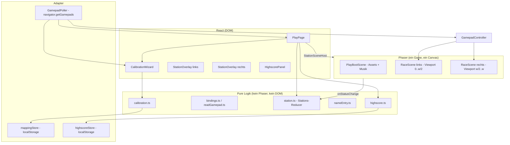
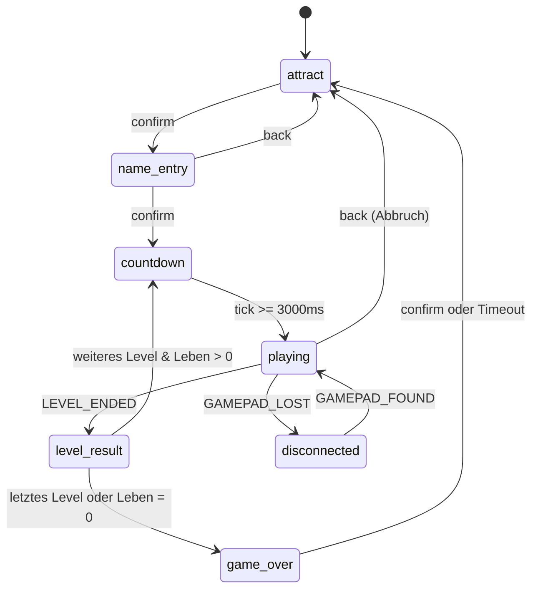
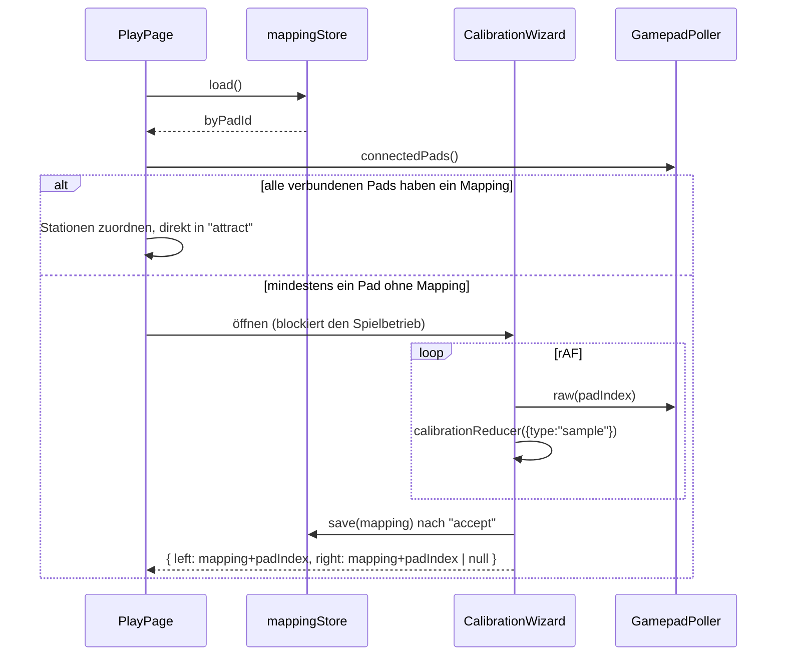
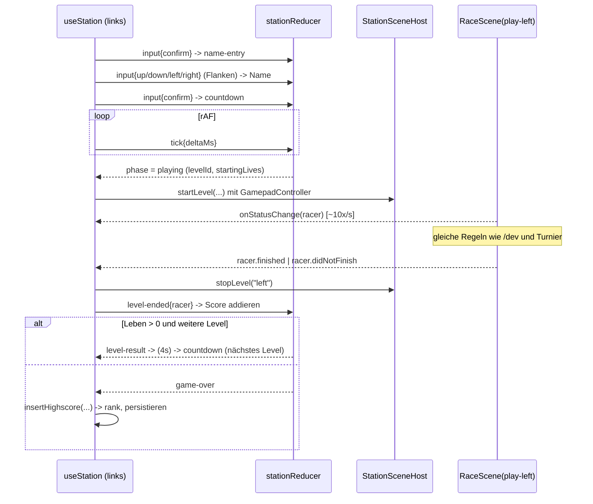

# Design: Selber spielen mit Gamepad (`play-mode`)

Bezug: `.features/play-mode/requirements.md` (US-1 … US-8).

> **Nachtrag (wichtig beim Lesen):** Die hier beschriebene Eingabeschicht über
> `navigator.getGamepads()` (`GamepadPoller`, `GamepadController`,
> `calibration.ts`, `CalibrationWizard`, `mappingStore`) existiert **nicht
> mehr**. Am Stand hat sich gezeigt, dass Chromiums Gamepad-Mapping für die
> verwendeten USB-Adapter unvollständig ist – links/rechts kommen dort gar
> nicht an. Ersetzt durch den Rohzugriff per WebHID, siehe
> `.features/play-mode-webhid/bugfix.md`.
>
> Unverändert gültig bleiben: Stations-Zustandsmaschine, Namenseingabe,
> Highscore, `StationSceneHost`, Audio-Aufteilung und die Anforderungen selbst.
> Die logische Schnittstelle (`InputSnapshot`, `HumanInputSource`) ist ebenfalls
> unverändert – nur die Quelle dahinter ist eine andere.

## Architektur-Überblick

`/play` ist eine neue, rein clientseitige Seite (`docs/03-architektur.md`: Client
ist autark, Server nur für Turnierbetrieb). Sie hängt an keinem WebSocket und
keinem Server-Endpunkt.

Die Seite besteht aus drei Schichten:



Leitprinzipien:

1. **Alle Spiel-, Eingabe- und Persistenzregeln liegen in puren Modulen** ohne
   Phaser-/DOM-/`navigator`-Import (US-8). React und Phaser sind nur Adapter.
   Damit ist die gesamte Logik ohne echte Gamepad-Hardware testbar.
2. **Zwei Stationen = zwei voneinander unabhängige Instanzen desselben
   Reducers** (US-5). Es gibt keinen gemeinsamen Spielzustand, nur eine
   gemeinsame Highscore-Liste und ein gemeinsames Canvas.
3. **Die `RaceScene` bleibt inhaltlich unverändert** (US-8); sie bekommt
   lediglich eine dritte Steuerquelle über die bereits existierende
   `RacerController`-Abstraktion injiziert.

## Schnittstellen & Datenmodelle

### Gamepad-Bindings (`play/input/bindings.ts`)

```ts
export const PLAY_INPUTS = [
  "left", "right", "up", "down", "jump", "sprint", "confirm", "back",
] as const;
export type PlayInput = (typeof PLAY_INPUTS)[number];

export type InputBinding =
  | { kind: "button"; index: number }
  | { kind: "axis"; index: number; direction: -1 | 1 };

export interface GamepadMapping {
  /** `Gamepad.id` der Hardware, für die kalibriert wurde (Speicher-Schlüssel). */
  padId: string;
  bindings: Record<PlayInput, InputBinding>;
}

/** Nur die Felder, die gelesen werden – erlaubt Fakes in Tests. */
export interface GamepadLike {
  id: string;
  index: number;
  connected: boolean;
  buttons: readonly { pressed: boolean; value: number }[];
  axes: readonly number[];
}

export const ACTIVATION_THRESHOLD = 0.5;

export function resolveBinding(pad: GamepadLike, binding: InputBinding): boolean;
export function readGamepad(pad: GamepadLike, mapping: GamepadMapping): GamepadSnapshot;

export type GamepadSnapshot = Record<PlayInput, boolean>;

/** Vorbelegung nach W3C-„standard"-Mapping (US-1, letztes Kriterium). */
export const DEFAULT_MAPPING_BINDINGS: Record<PlayInput, InputBinding>;
```

`resolveBinding` behandelt Buttons (`pressed || value > 0.5`) und Achsen
(`Math.sign(axes[i]) === direction && Math.abs(axes[i]) > 0.5`) gleichwertig –
das ist der Kern für „D-Pad als Buttons **oder** Achsen" (US-1).

### Polling (`play/input/GamepadPoller.ts`)

```ts
export type PadReader = () => readonly (GamepadLike | null)[];

export class GamepadPoller {
  constructor(private readonly read: PadReader) {}
  /** Frischer Ist-Zustand (für den Spiel-Loop, siehe unten). */
  snapshot(padIndex: number, mapping: GamepadMapping): GamepadSnapshot | null;
  /** Rohzugriff für den Kalibrierungs-Assistenten. */
  raw(padIndex: number): GamepadLike | null;
  connectedPads(): GamepadLike[];
}

/** Flankenerkennung für Menüs – pur, ohne Timer. */
export function risingEdges(prev: GamepadSnapshot | null, next: GamepadSnapshot): GamepadSnapshot;
```

**Warum kein zentral zwischengespeicherter Frame-Zustand:** `navigator.getGamepads()`
liefert bei jedem Aufruf einen frischen Snapshot. Würde der Spiel-Loop den
Zustand einer separaten `requestAnimationFrame`-Schleife lesen, hinge das
Eingabe-Lag von der Reihenfolge zweier rAF-Callbacks ab (genau die Klasse von
Fehler aus `.features/arena-feel-and-graphics/bugfix.md`). Deshalb: Der
Spiel-Pfad liest **direkt im Phaser-`update()`** (`snapshot()`), die Menüs nutzen
eine eigene rAF-Schleife mit Flankenerkennung (`useGamepadEdges`).

### Steuerung (`play/input/GamepadController.ts`)

```ts
export class GamepadController implements RacerController, HumanInputSource {
  constructor(
    private readonly poller: GamepadPoller,
    private readonly padIndex: number,
    private readonly mapping: GamepadMapping
  ) {}
  getInput(): DirectionalInput;   // { dir, jump, sprint } – wie KeyboardController
  getNextActions(): Action[];     // Bot-Parität, identisch zu KeyboardController
  dispose(): void;
  /** Für die Disconnect-Erkennung (US-3). */
  isConnected(): boolean;
}
```

Neu in `client/src/game/control/RacerController.ts`:

```ts
export interface DirectionalInput { dir: -1 | 0 | 1; jump: boolean; sprint: boolean }
export interface HumanInputSource extends RacerController { getInput(): DirectionalInput }
```

`KeyboardController` implementiert `HumanInputSource` (nur Typ-Deklaration,
`KeyboardInput` wird zu `DirectionalInput` – kein Verhaltenswechsel, US-8).

### Kalibrierung (`play/input/calibration.ts`)

Reine Zustandsmaschine, getrieben von Pad-Samples:

```ts
export const CALIBRATION_STEPS: readonly PlayInput[] =
  ["left", "right", "up", "down", "jump", "sprint", "confirm", "back"];

export interface CalibrationState {
  phase: "await-pad" | "capture" | "verify" | "done";
  stationId: StationId;
  padIndex: number | null;
  padId: string | null;
  stepIndex: number;
  baseline: PadBaseline | null;
  waitingForRelease: boolean;
  bindings: Partial<Record<PlayInput, InputBinding>>;
  error: "already-bound" | null;
}

export type CalibrationEvent =
  | { type: "sample"; pads: readonly (GamepadLike | null)[] }
  | { type: "restart" }
  | { type: "accept" }    // Testbild bestätigt
  | { type: "skip-pad" }; // zweite Station bleibt unbelegt

export function calibrationReducer(s: CalibrationState, e: CalibrationEvent): CalibrationState;

/** Kern-Erkennung: was hat sich gegenüber der Baseline signifikant verändert? */
export function detectBinding(baseline: PadBaseline, pad: GamepadLike): InputBinding | null;
```

Ablauf je Schritt:

1. `await-pad`: Erstes Pad, an dem **irgendeine** Eingabe erkannt wird, wird
   dieser Station zugeordnet (`padIndex`, `padId`). Bereits einer anderen
   Station zugeordnete Pad-Indizes werden ignoriert.
2. `capture`: Baseline wird beim Betreten des Schritts gespeichert
   (Buttons + Achsen). `detectBinding` meldet die erste signifikante Abweichung.
   Ist sie schon belegt → `error: "already-bound"`, Schritt bleibt stehen.
   Sonst: Binding übernehmen, `waitingForRelease = true`.
3. `waitingForRelease`: erst wenn `resolveBinding` wieder `false` liefert, geht
   es zum nächsten Schritt (Entprellung, US-1).
4. Nach dem letzten Schritt: `verify` (Testbild). `accept` → `done`,
   `restart` → zurück auf Schritt 0.

**Baseline statt Absolut-Schwellwert**, weil viele USB-Adapter Ruhe-Achsen nicht
exakt bei `0` melden (häufig `-1` für ungedrückte Trigger-Achsen).

### Persistenz (`play/input/mappingStore.ts`, `play/highscoreStore.ts`)

Beide nach dem Muster von `client/src/game/audio/audioSettings.ts`: Factory mit
injizierbarem `StorageLike`, defensiv gegen fehlendes/blockiertes `localStorage`,
versioniertes JSON.

```ts
// coin-quest-arena:gamepad-mappings
{ version: 1, byPadId: { [padId: string]: GamepadMapping } }

// coin-quest-arena:play-highscores
{ version: 1, entries: HighscoreEntry[] }   // max. 50 gespeichert, 10 angezeigt
```

Schlüssel ist **`Gamepad.id`**, nicht der Index → ein baugleiches zweites Pad
meldet dieselbe `id` und übernimmt das Mapping automatisch (US-1, bestätigte
Entscheidung). Bei unlesbarem/kaputtem JSON wird stillschweigend auf den
Default zurückgefallen (nie Absturz der Seite).

### Highscore (`play/highscore.ts`)

```ts
export interface HighscoreEntry {
  id: string; name: string; score: number; levelsCompleted: number; createdAt: number;
}
export const HIGHSCORE_DISPLAY_SIZE = 10;

export function sortHighscores(entries: readonly HighscoreEntry[]): HighscoreEntry[];
export function insertHighscore(
  entries: readonly HighscoreEntry[], entry: HighscoreEntry
): { entries: HighscoreEntry[]; rank: number | null };  // rank = 1-basiert, null wenn außerhalb Top 10
```

Sortierung: Score absteigend, bei Gleichstand `createdAt` aufsteigend (älterer
Eintrag oben, US-6).

### Namenseingabe (`play/nameEntry.ts`)

```ts
export const NAME_LENGTH = 8;
export const NAME_CHARSET = "ABCDEFGHIJKLMNOPQRSTUVWXYZ0123456789 "; // umlaufend
export const DEFAULT_PLAYER_NAME = "GAST";

export interface NameEntryState { chars: string[]; cursor: number }
export type NameEntryEvent = { type: "up" | "down" | "left" | "right" };

export function nameEntryReducer(s: NameEntryState, e: NameEntryEvent): NameEntryState;
export function finalizeName(s: NameEntryState): string; // trimmt, leer -> DEFAULT_PLAYER_NAME
```

Kein Auto-Repeat: Der Reducer wird ausschließlich von Flanken
(`risingEdges`) gefüttert – „einmal pro Tastendruck" (US-2) ist damit
strukturell garantiert, nicht über Timer.

### Stations-Zustandsmaschine (`play/station.ts`)

Das Herzstück für US-2/US-4/US-5.



```ts
export const PLAY_LIVES = 5;
export const PLAY_LEVEL_IDS = ["level-one", …, "level-six"] as const; // ohne toolkit-test
export const COUNTDOWN_MS = 3_000;
export const LEVEL_RESULT_MS = 4_000;
export const GAME_OVER_TIMEOUT_MS = 45_000;

export interface LevelResult {
  levelId: string; score: number; reachedGoal: boolean;
  fruitScore: number; deaths: number; timeElapsedMs: number; livesRemaining: number;
}

export interface StationState {
  phase: "attract" | "name-entry" | "countdown" | "playing" | "disconnected"
       | "level-result" | "game-over";
  name: string;
  nameEntry: NameEntryState;
  levelIndex: number;
  livesRemaining: number;
  totalScore: number;
  results: LevelResult[];
  phaseElapsedMs: number;
  /** Nur in `game-over`: Platzierung, falls Top 10 (US-6). */
  rank: number | null;
}

export type StationEvent =
  | { type: "tick"; deltaMs: number }
  | { type: "input"; edges: GamepadSnapshot }
  | { type: "level-ended"; racer: RacerRuntimeState }
  | { type: "gamepad-lost" } | { type: "gamepad-found" };

export function stationReducer(s: StationState, e: StationEvent): StationState;
```

Regeln im Reducer (decken US-4 ab):

- `countdown → playing`: `startingLives = state.livesRemaining` (kein Auffrischen).
- `level-ended`: `score = computeScore({ fruitScore, timeElapsedMs, deaths, reachedGoal: racer.finished })`
  (bestehende Formel, unverändert), `totalScore += score`,
  `livesRemaining = racer.livesRemaining`.
- `livesRemaining <= 0` → `game-over`, unabhängig vom Levelindex.
- `racer.didNotFinish` bei `livesRemaining > 0` (= Zeitlimit) → nächstes Level,
  Leben unverändert.
- `levelIndex + 1 >= PLAY_LEVEL_IDS.length` → `game-over`.
- Der Reducer ist **rein und zeitlos**: Jede Wartezeit läuft über
  `{type:"tick", deltaMs}`. Keine `setTimeout`/`Date.now`-Aufrufe → Tests ohne
  Fake-Timer.
- `rank` wird beim Übergang nach `game-over` **nicht** im Reducer berechnet
  (Seiteneffekt Persistenz), sondern von `PlayPage` über `insertHighscore`
  ermittelt und per separatem Feld nachgereicht — siehe „Ablauf".

### Phaser-Host (`play/StationSceneHost.ts`)

Analog zu `client/src/match/MatchRunner.ts`, aber pro Station statt pro Match:

```ts
export class StationSceneHost {
  constructor(private readonly game: Phaser.Game) {}
  startLevel(opts: {
    stationId: StationId; levelId: string; startingLives: number;
    humanInput: HumanInputSource;
    onStatusChange: (status: { racer: RacerRuntimeState }) => void;
  }): void;
  stopLevel(stationId: StationId): void;
  pause(stationId: StationId): void;   // Gamepad-Verlust (US-3)
  resume(stationId: StationId): void;
  destroy(): void;
}
```

- Szenenschlüssel: `play-<stationId>` (stabil, eine Szene je Station zur Zeit).
- Viewport: `computeGridViewports(2, canvasWidth, canvasHeight)[0|1]` – exakt die
  bestehende Funktion (US-5).
- Level-/Runwechsel = `scene.shutdown()` + `game.scene.remove(key)` +
  `game.scene.add(key, new RaceScene(key), true, initData)` – dasselbe Muster wie
  `MatchRunner.stop()/startRacerScenes()`. Die Szene der anderen Station wird
  dabei nicht angefasst (US-5).
- Pause/Resume über `game.scene.pause(key)` / `resume(key)`.
- Szenen werden **erst nach dem Countdown** gestartet (US-7: „bevor die
  Steuerung freigegeben wird"). Damit braucht es keinen Pause-Zustand im
  laufenden Level und die Level-Zeit beginnt exakt mit der Spielfreigabe.

### Änderungen an `RaceScene`

Minimal und additiv (US-8):

```ts
export interface RaceSceneInitData {
  controllerMode: "keyboard" | "bot" | "gamepad";
  /** Nur bei `controllerMode: "gamepad"` – injizierte Steuerquelle (DIP). */
  humanInput?: HumanInputSource;
  audio?: boolean | { music: boolean; sfx: boolean };
  …  // unverändert
}
```

1. Feld `keyboardController: KeyboardController | null` → `humanInput:
   HumanInputSource | null`; `applyKeyboardInput()` → `applyHumanInput()`
   (gleiche Implementierung, breiterer Typ). Der bestehende Multi-Input-Pfad
   gilt damit unverändert für Tastatur **und** Gamepad (US-3: identische
   Sprint-Rampe und variable Sprunghöhe, ohne eine Zeile Physik zu duplizieren).
2. `createController()`: bei `"gamepad"` wird `initData.humanInput` verwendet
   (Fail-Fast mit klarer Meldung, wenn es fehlt – Muster `getLevelById`).
3. `audio` wird in `init()` zu `{ music, sfx }` normalisiert; `audioEnabled` wird
   zu zwei Flags. `/play` übergibt `{ music: false, sfx: true }` → beide
   Stationen haben Soundeffekte, die Musik läuft genau einmal (US-5).
   Rückwärtskompatibel: `true`/`undefined` ⇒ `{music:true,sfx:true}`,
   `false` ⇒ `{music:false,sfx:false}` (heutiges Verhalten von `/dev` und
   Turnier).

Nicht angefasst: Regeln, Scoring, Bot-Pfad, `BotRunner`, Telemetrie.

### Musik & Assets (`play/PlayBootScene.ts`)

Nach dem Muster von `MatchBootScene` + `TournamentMusicScene`: lädt einmalig
alle Arena-Assets (`preloadArenaAssets`), startet eine einzelne, dauerhaft
laufende Hintergrundspur (`AUDIO_KEYS.THEME`, `loop`) und respektiert
`audioSettings` (Lautstärke/Mute, `Phaser.Sound.Events.UNLOCKED`-Behandlung wie
dort). Die Racer-Szenen laufen mit `assetsPreloaded: true` und
`audio: {music:false, sfx:true}`.

### Seite & UI

| Datei | Rolle |
|---|---|
| `client/src/pages/PlayPage.tsx` | Route-Einstieg: Kalibrierungs-Gate, zwei Stationen, Highscore-Panel |
| `client/src/play/PlayArena.tsx` | Phaser-Host (Canvas + `StationSceneHost` + `ResizeObserver`, Muster `MatchView`) |
| `client/src/play/StationOverlay.tsx` | HUD + Phasen-Overlays einer Station |
| `client/src/play/HighscorePanel.tsx` | Bestenliste, hebt neuen Eintrag hervor |
| `client/src/play/input/CalibrationWizard.tsx` | Assistent inkl. Testbild |
| `client/src/play/useGamepadEdges.ts` | rAF-Schleife → Flanken für Menüs/Reducer |
| `client/src/play/useStation.ts` | Hält `stationState`, verdrahtet Ticks/Edges/Szenen-Callbacks |
| `client/src/styles/play-arcade.css` | Stil, angelehnt an `present-broadcast.css` |

HUD je Station (US-7): Name, ❤️×`livesRemaining`, „Level n/6" + Levelname,
Punkte des laufenden Levels, Gesamtscore, Restzeit-Balken (aus
`RUN_TIME_LIMIT_MS - racer.timeElapsedMs`), kompakte Tastenlegende.
Overlays: Attract („Taste drücken"), Namenseingabe, Countdown, Level-Ergebnis
(wiederverwendet `components/ScoreBreakdown.tsx`), Game Over, „Controller
getrennt".

Die Overlays liegen als absolut positionierte Hälften über dem Canvas – exakt
das Muster von `match-view__overlays` / `RacerTileOverlay`.

## Ablauf / Sequenz

### Kalibrierung beim ersten Öffnen (US-1)



### Ein Run (US-2/US-4)



## Fehlerbehandlung & Edge Cases

| Fall | Verhalten |
|---|---|
| Kein Gamepad erkannt | Hinweis „Bitte eine Taste am Gamepad drücken" (Browser gibt Pads erst nach erster Eingabe frei, US-1) |
| Nur ein Gamepad | Zweite Station dauerhaft im Wartezustand; Spielbetrieb links unbeeinträchtigt (US-5) |
| Drittes Gamepad | Ignoriert, solange beide Stationen belegt sind (Annahme aus requirements) |
| Gamepad-Verlust im Run | `StationSceneHost.pause()`, Phase `disconnected` mit Overlay; bei Wiederverbindung derselben `padId` `resume()` – andere Station unberührt (US-3) |
| Doppelbelegung in der Kalibrierung | Schritt bleibt stehen, Fehlerhinweis (US-1) |
| Kaputtes/blockiertes `localStorage` | Defaults; Modus bleibt spielbar, Highscores dann nur bis zum Reload (Muster `audioSettings`) |
| Name leer / nur Leerzeichen | `DEFAULT_PLAYER_NAME` (US-2) |
| Score negativ (viele Tode + DNF) | Wird unverändert übernommen – bestehende Formel bleibt unangetastet (US-8) |
| `game-over` bleibt unbeachtet stehen | Nach `GAME_OVER_TIMEOUT_MS` zurück zu `attract` (Messestand) |
| Audio-Unlock | Browser entsperren AudioContext **nicht** durch Gamepad-Eingaben. `useAudioUnlockHint` bleibt sichtbar, bis einmal per Maus/Tastatur interagiert wurde; der Kalibrierungs-Assistent wird mit einem echten Button (Maus/Touch) gestartet und erledigt das nebenbei. |
| Wechsel/Unmount der Seite | `StationSceneHost.destroy()` → alle Szenen `shutdown()` + `remove()`, `game.destroy(true)`, rAF abgemeldet |

## Test-Strategie

Vitest (`client`, jsdom). Strikt TDD, jeder Task beginnt mit einem roten Test.

**Unit, pur (Hauptlast der Abdeckung — ohne Hardware, ohne Phaser, ohne Timer):**

- `bindings.test.ts`: Buttons, Achsen beider Richtungen, Schwellwerte, Default-Mapping.
- `readGamepad.test.ts`: vollständiger Snapshot aus Fake-Pads.
- `calibration.test.ts`: Schrittfolge, Achsen- vs. Button-Erkennung, Baseline
  mit Ruhewert ≠ 0, Entprellung, Doppelbelegung, Neustart, Pad-Zuordnung,
  „zweite Station überspringen".
- `station.test.ts`: alle Phasenübergänge, Leben-Übertrag zwischen Leveln,
  Score-Kumulation, Timeout-Level ohne Lebensverlust, Game Over bei 0 Leben,
  Game Over nach letztem Level, Abbruch per ZURÜCK, Disconnect/Reconnect.
- `nameEntry.test.ts`: Carousel umlaufend, Cursorbewegung, Finalisierung,
  Leername.
- `highscore.test.ts`: Sortierung, Gleichstand-Regel, Top-10-Grenze, Rang.
- `mappingStore.test.ts` / `highscoreStore.test.ts`: Fake-`StorageLike`, Runde
  schreiben/lesen, kaputtes JSON, fehlendes Storage, Wiederverwendung über
  `padId`.
- `GamepadController.test.ts`: Fake-Poller → `getInput()`/`getNextActions()`
  identisch zu `KeyboardController` (Bot-Parität).

**Komponenten (React Testing Library, mit Fake-Poller/Fake-Stores):**

- `CalibrationWizard.test.tsx`: Schritt-Anzeige, Fehlermeldung, Testbild,
  Speichern.
- `StationOverlay.test.tsx`: HUD-Werte, Overlays je Phase.
- `HighscorePanel.test.tsx`: Sortierung, Hervorhebung, Leerzustand.
- `PlayPage.test.tsx`: Kalibrierungs-Gate (mit/ohne gespeichertes Mapping),
  zwei unabhängige Stationen.

**Host (Fake-`Phaser.Game`, Muster `MatchRunner.test.ts`):**

- `StationSceneHost.test.ts`: Szenenschlüssel, Viewport-Zuweisung, Init-Daten
  (`startingLives`, `audio`, `assetsPreloaded`), Szenen-Austausch beim
  Levelwechsel, Unabhängigkeit der zweiten Station, Pause/Resume, Cleanup.

**Regression (bestehende Suites, müssen grün bleiben):**
`KeyboardController.test.ts`, `MatchRunner.test.ts`, `racerOutcome`,
`rankMatchResults`, `RaceScene`-nahe Tests, `DevPage`/`PresentPage`.

Manuell am Stand (nicht automatisierbar): echte SNES-USB-Adapter kalibrieren,
Eingabe-Latenz im Spiel, Lesbarkeit des HUD aus Zuschauerentfernung.

## Auswirkungen auf bestehenden Code

Geändert:

- `client/src/game/control/RacerController.ts` – `DirectionalInput`,
  `HumanInputSource` ergänzt.
- `client/src/game/control/KeyboardController.ts` – implementiert
  `HumanInputSource` (Typ-Ebene).
- `client/src/game/scenes/RaceScene.ts` – `controllerMode: "gamepad"`,
  `humanInput`, `audio`-Normalisierung, Feld-/Methodenumbenennung
  (`keyboardController`→`humanInput`, `applyKeyboardInput`→`applyHumanInput`).
- `client/src/App.tsx` – Route `/play`.

Neu: alles unter `client/src/play/**`, `client/src/pages/PlayPage.tsx`,
`client/src/styles/play-arcade.css`.

Unverändert: `packages/bot-contract`, `packages/shared`, `server/**`,
`client/src/game/rules/**`, `client/src/game/scoring.ts`,
`client/src/sandbox/**`, `client/src/match/**` (wird nur gelesen/wiederverwendet),
`client/src/tournament/**`.

## Abdeckung der Akzeptanzkriterien

| Story | Umgesetzt durch |
|---|---|
| US-1 Kalibrierung | `bindings.ts`, `calibration.ts`, `mappingStore.ts`, `CalibrationWizard.tsx`, Gate in `PlayPage` |
| US-2 Start & Name | `nameEntry.ts`, `station.ts` (Phasen `attract`/`name-entry`), `useGamepadEdges` |
| US-3 Steuerung | `GamepadController`, `HumanInputSource`, unveränderter `applyHumanInput`-Pfad in `RaceScene` |
| US-4 Kampagne | `station.ts` (`PLAY_LIVES`, `PLAY_LEVEL_IDS`, Score-Kumulation), `StationSceneHost` |
| US-5 Unabhängigkeit | Zwei Reducer-Instanzen, `computeGridViewports(2,…)`, Szenen je Station, `PlayBootScene` für die einzelne Musikspur |
| US-6 Highscore | `highscore.ts`, `highscoreStore.ts`, `HighscorePanel.tsx` |
| US-7 Aufmachung | `StationOverlay.tsx`, `play-arcade.css`, Countdown im Reducer |
| US-8 NFR | Additive `RaceScene`-Erweiterung, pure Module, keine Server-Abhängigkeit, TDD-Teststrategie oben |
