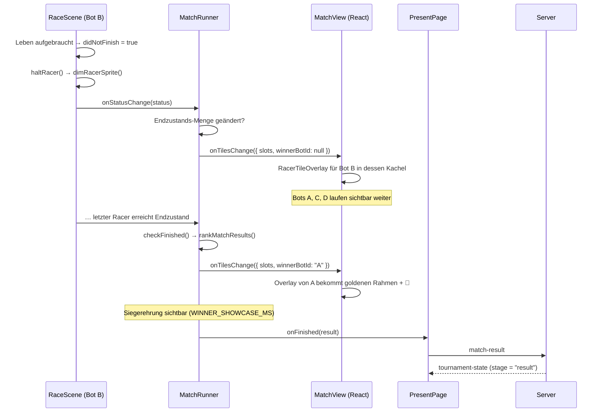

# Design: present-racer-tile-overlay

## Architektur-Überblick

Bezug: `docs/09-bot-artefakt-und-turnier.md` (Multi-Racer-Architektur: eine
`RaceScene`-Instanz je Bot, Kamera-Viewports im gemeinsamen Canvas),
`docs/03-architektur.md` (`/present` als Publikumsansicht).

Freigegeben: **React-Overlay** über der Phaser-Canvas, nicht Phaser-GameObjects.
Begründung: Das gesamte Pixel-Look-Styling (`pixel-overlay`,
`pixel-overlay__card`, `__title`, `__score`, `__rows`, `__row`) existiert bereits
in `client/src/theme.css` und wird von `/dev` genutzt. Ein React-Overlay erbt es
1:1 (DRY), während eine Phaser-Umsetzung Rahmen, Scanlines und Typografie
manuell nachbauen müsste.

Heutiger Datenfluss und die Erweiterung:

```
MatchView (React)
  ├─ Phaser.Game  ──►  MatchRunner  ──►  N × RaceScene (je eigener Viewport)
  │                        │  onStatusChange(status)  ◄──────┘
  │                        │
  │                        ├─ onProgress  (alle 500 ms) ──► Server
  │                        ├─ onFinished  (einmalig)    ──► Server
  │                        └─ onTilesChange (NEU)       ──► MatchView-State
  │
  └─ <div class="match-view__overlays">        (NEU, absolut über der Canvas)
        └─ N × <RacerTileOverlay …/>           (NEU, positioniert per Viewport)
```

Die Overlays leben also in React **neben** der Canvas im selben
Positionierungs-Container und werden anhand der Viewport-Rechtecke aus
`computeGridViewports` absolut positioniert – dieselben Rechtecke, die auch die
Phaser-Kameras nutzen. Damit stimmen Kachel und Fenster per Konstruktion
überein (US-2).

## Schnittstellen & Datenmodelle

### Neu: `client/src/match/racerOutcome.ts` (pure)

Der Grund für ein DNF ist heute nirgends im `RacerRuntimeState` gespeichert –
`raceRules.ts` setzt bei „keine Leben mehr" (`loseLifeAndRespawn`) und bei
Zeitlimit (`applyTimeLimitReached`) beide Male nur `didNotFinish = true`.
Statt den State zu erweitern (Eingriff in getestete Turnier-Regeln) wird der
Grund **abgeleitet** – ausreichend und eindeutig, weil die beiden Ursachen sich
über `livesRemaining` unterscheiden lassen:

```ts
export type RacerOutcomeKind = "goal" | "out-of-lives" | "time-limit" | "disabled";

export interface RacerOutcome {
  kind: RacerOutcomeKind;
  reachedGoal: boolean;
}

/** `null`, solange der Racer noch läuft. */
export function deriveRacerOutcome(
  racer: RacerRuntimeState,
  pausedReasonKind: BotRunnerPauseReasonKind | null
): RacerOutcome | null;
```

Ableitungsregeln (Reihenfolge zählt):
1. `racer.finished` → `"goal"` (Ziel schlägt alles; `applyTimeLimitReached`
   respektiert `finished` bereits).
2. `pausedReasonKind !== null` → `"disabled"` (US-1: Bot wegen
   Fehlern/Timeouts pausiert).
3. `racer.didNotFinish && racer.livesRemaining <= 0` → `"out-of-lives"`.
4. `racer.didNotFinish` → `"time-limit"`.
5. sonst → `null`.

### Neu: `client/src/match/tileOverlays.ts` (pure)

```ts
export interface TileOverlayDescriptor {
  botId: string;
  name: string;
  viewport: ViewportRect;
  outcome: RacerOutcome;
  racer: RacerRuntimeState;
  isWinner: boolean;
}

export function computeTileOverlays(input: {
  slots: readonly {
    botId: string;
    name: string;
    viewport: ViewportRect;
    racer: RacerRuntimeState | null;
    pausedReasonKind: BotRunnerPauseReasonKind | null;
  }[];
  winnerBotId: string | null;   // null, solange das Match läuft
}): TileOverlayDescriptor[];
```

Liefert nur Einträge für Racer mit einem Endzustand (`deriveRacerOutcome !== null`).
`isWinner` ist genau dann `true`, wenn `winnerBotId === botId` – dadurch ist
US-3 („keine goldene Umrandung, solange nicht alle fertig sind") automatisch
erfüllt, solange `winnerBotId` vor Match-Ende `null` bleibt.

### Neu: `client/src/components/ScoreBreakdown.tsx` (DRY)

Die Zeilen der Score-Aufschlüsselung (Früchte, Zeit-Multiplikator, Flat-Bonus,
DNF-Strafe, Tode, Zeit) existieren heute als fest verdrahtetes JSX in
`FinishOverlay.tsx`. Würde `RacerTileOverlay` sie erneut ausformulieren, gäbe
es **zwei** Stellen, die bei jeder Scoring-Änderung mitgepflegt werden müssten –
und genau daraus entstünden widersprüchliche Zahlen auf der Leinwand, die US-4
verhindern soll.

Deshalb wird der Block einmalig extrahiert:

```tsx
export function ScoreBreakdown({ racer }: { racer: RacerRuntimeState }): JSX.Element;
```

`FinishOverlay` (für `/dev`) und `RacerTileOverlay` (für `/present`) nutzen
beide diese Komponente. Die Darstellung in `/dev` bleibt dabei unverändert –
es ist ein reines Refactoring ohne Verhaltensänderung (siehe
`requirements.md`, Nicht-Ziele).

### Neu: `client/src/components/RacerTileOverlay.tsx`

```tsx
export function RacerTileOverlay({ descriptor }: { descriptor: TileOverlayDescriptor }): JSX.Element;
```

Rendert die Karte im vorhandenen Pixel-Look. Inhalte je nach `outcome.kind`:

| `kind` | Titel | Score-Zeilen |
|---|---|---|
| `goal` | `★ ZIEL ERREICHT ★` (`is-win`) | Früchte, Zeit-Multiplikator, Flat-Bonus, ggf. Tode, Zeit |
| `out-of-lives` | `✖ LEBEN VERBRAUCHT ✖` (`is-fail`) | Früchte, DNF-Strafe, ggf. Tode, Zeit |
| `time-limit` | `✖ ZEIT ABGELAUFEN ✖` (`is-fail`) | Früchte, DNF-Strafe, ggf. Tode, Zeit |
| `disabled` | `⏸ BOT PAUSIERT ⏸` (`is-fail`) | Früchte, DNF-Strafe, ggf. Tode, Zeit |

Zusätzlich immer: Bot-Name als Kopfzeile und die Endpunktzahl aus
`computeScore` (US-4 – exakt dieselbe Funktion, die `rankMatchResults` für das
gemeldete `MatchResult` nutzt). Die Detailzeilen liefert `ScoreBreakdown`
(vollständig, siehe entschiedene Frage in `requirements.md`). Kein
„Neu starten"-Button (Nicht-Ziel).

Bei `isWinner`: zusätzliche Klasse `pixel-overlay__card--winner` (goldener
Rahmen) und eine Sieger-Zeile `👑 SIEGER` über dem Titel.

### Geändert: `client/src/match/MatchRunner.ts`

- `RacerSlot` bekommt zusätzlich `name: string` und `viewport: ViewportRect`
  (beides liegt in `startRacerScenes` bereits vor: `participant.name` bzw.
  `viewports[index]`).
- Neuer optionaler Konstruktor-Parameter `onTilesChange?: (tiles: MatchTiles) => void`
  mit

  ```ts
  export interface MatchTiles {
    slots: TileSlotSnapshot[];
    winnerBotId: string | null;
  }
  ```

- **Emissions-Drosselung:** `onStatusChange` feuert je Racer alle 100 ms
  (`STATUS_EMIT_INTERVAL_MS`). Ein React-Re-Render bei jedem dieser Events wäre
  verschwenderisch (bei 4 Racern ~40 Re-Renders/s während des gesamten
  Rennens). `MatchRunner` vergleicht daher im `onStatusChange`-Handler nur, ob
  sich der Endzustands-Status **dieses einen Slots** geändert hat, und emittiert
  `onTilesChange` nur dann – also typischerweise 2–5 Mal pro Match. Bewusst
  kein Mengen-Diffing: ein Boolean-Vergleich pro Slot genügt (KISS).
- In `checkFinished()` wird der bereits berechnete `ranked`-Array genutzt, um
  `winnerBotId = ranked.find(e => e.rank === 1)?.botId ?? null` zu setzen und
  ein letztes `onTilesChange` zu emittieren (US-4: identisch zum gemeldeten
  `MatchResult`).

### Geändert: `client/src/match/MatchView.tsx`

- `useState<MatchTiles>` für die Overlay-Daten, gefüllt über den neuen
  `onTilesChange`-Callback.
- Der Container-`div` bekommt `position: relative`; darin liegen Canvas
  (von Phaser eingehängt) und ein Overlay-Layer.
- Positionierung je Overlay: `left/top/width/height` direkt aus dem Viewport in
  Pixeln. **Kein Skalierungsfaktor**: Phaser wird mit `container.clientWidth`
  erzeugt und per `ResizeObserver` über `game.scale.resize` mitskaliert, die
  Canvas-Pixelgröße entspricht also stets der CSS-Größe (Scale-Mode `NONE`).
  Ein vorsorglicher Faktor `clientWidth / canvas.width` wäre konstant 1 und
  damit spekulative Komplexität (YAGNI).
- Die Viewport-Rechtecke werden **nicht** bei Resize neu berechnet – sie müssen
  identisch zu denen bleiben, die die Phaser-Kameras in `RaceScene.create()`
  einmalig gesetzt haben (siehe US-2-Hinweis in `requirements.md`). Eine
  eigenständige Neuberechnung würde Fenster und Kachel auseinanderlaufen
  lassen.

### Geändert: `client/src/game/scenes/RaceScene.ts`

- `markRacerAsOut()` behält die **Sprite-Abdunklung** (`setTint`, `setAlpha`,
  `anims.stop()`) – ausdrücklicher Regressions-Schutz aus US-1.
- Das `"AUS"`-**Textlabel entfällt** (US-1: kein zusätzliches Label neben dem
  Fenster). Die Methode wird zu `dimRacerSprite()` umbenannt, weil sie danach
  nur noch das leistet.

### Ergänzt: `client/src/theme.css`

- `.pixel-overlay--tile`: `position: absolute` mit vom Inline-Style gesetzten
  Koordinaten statt `inset: 6px`.
- `.pixel-overlay--tile .pixel-overlay__card`: kompaktere Maße
  (`width: min(300px, 88%)`, kleinere Paddings/Schriftgrade), damit die Karte
  auch in einer Viertel-Kachel passt.
- `.pixel-overlay__card--winner`: goldener Rahmen über `box-shadow`-Ringe
  (dieselbe Technik wie die bestehende Karte, nur in Gold) plus dezenter
  Glow.
- `.pixel-overlay__winner-badge`: Sieger-Zeile.

## Ablauf / Sequenz



### Wichtiger Punkt: Sichtbarkeitsdauer der Siegerehrung

`PresentPage` rendert `MatchView` **nur** bei `stage.kind === "running"`. Sobald
`onFinished` gemeldet wird, antwortet der Server mit einem neuen
`tournament-state`, `selectMatchStage` liefert `"result"` und **`MatchView`
wird unmountet**. Ohne Gegenmaßnahme wäre die goldene Umrandung nur für den
Bruchteil einer Sekunde sichtbar – US-3 wäre faktisch wirkungslos.

Lösung: `MatchRunner` meldet das Ergebnis erst nach einer kurzen
Siegerehrungs-Phase:

```ts
/** Wie lange das Grid mit Ergebnis-Fenstern und goldener Sieger-Umrandung
 *  stehen bleibt, bevor das Match-Ergebnis gemeldet wird und `/present` zur
 *  Ergebnisliste weiterschaltet. */
const WINNER_SHOWCASE_MS = 10_000;
```

Ablauf in `checkFinished()`: Ranking berechnen → `onTilesChange` mit
`winnerBotId` → `setTimeout(WINNER_SHOWCASE_MS)` → `onFinished(result)`.
`stop()` löscht diesen Timer mit (sonst würde ein Ergebnis nach dem Unmount
gemeldet).

Dass die Meldung verzögert wird, ist **keine neue Verantwortung** von
`MatchRunner`: Die Klasse entscheidet über den Meldezeitpunkt bereits heute
(`reportedFinished`-Flag plus ein `requestAnimationFrame`, um dem Renderer
einen letzten Frame zu geben). Der Timer ersetzt lediglich diese sehr kurze
Verzögerung durch eine bewusst gewählte. Deshalb bleibt die Konstante ein
schlichtes Modul-Konstantenfeld und wird **nicht** als Konstruktor-Parameter
injiziert – es gibt genau einen Aufrufer und keinen zweiten Wert (YAGNI).

Alternativen, die verworfen wurden:
- *`MatchView` auch im `"result"`-Stage gemountet lassen*: `MatchRunner.stop()`
  hat die Szenen dann bereits entfernt; der Zustand müsste künstlich am Leben
  gehalten werden – deutlich invasiver.
- *Goldener Rahmen nur in `MatchResultView`*: widerspricht der Anforderung
  („Fenster in der Kachel golden umranden").

## Fehlerbehandlung & Edge Cases

| Fall | Verhalten |
|---|---|
| Racer erreicht Ziel **und** hätte 0 Leben | `finished` gewinnt → `"goal"` (Regel 1 vor Regel 3) |
| Bot pausiert **und** hat das Ziel erreicht | `"goal"` – ein erreichtes Ziel wird nicht nachträglich entwertet |
| Bot pausiert, ohne DNF/Finish | `"disabled"`; Overlay erscheint, damit keine Kachel ohne Fenster stehen bleibt |
| Score-Gleichstand an der Spitze | `rankMatchResults` entscheidet über die kürzere Zeit; genau ein Rang 1 → genau ein goldener Rahmen |
| `slot.status === null` (Szene noch nicht gestartet) | Kein Overlay (`deriveRacerOutcome` bekommt keinen State) |
| Freilos-Match (1 Teilnehmer) | Erreicht `/present` gar nicht – `selectMatchStage.isContested` filtert es heraus; keine Sonderbehandlung nötig |
| Sehr kleine Kachel (4er-Grid, kleiner Screen) | Karte skaliert über `width: min(300px, 88%)` und kompaktere Schriftgrade mit; die Aufschlüsselung bleibt vollständig (entschieden) |
| Unmount während der Siegerehrung (z. B. Turnier-Reset) | `stop()` löscht den Timer; kein `onFinished` nach dem Unmount |

## Test-Strategie

TDD, Vitest (+ Testing Library für Komponenten). Jeweils zuerst der rote Test.

**Vorbemerkung zur Testbarkeit.** Für `RaceScene` und `MatchRunner` existieren
in diesem Projekt heute **keine** Unit-Tests – Phaser-Szenen und der
Game-Lifecycle werden nicht im Test hochgefahren. `client/src/match/` testet
konsequent nur die reinen Module (`rankMatchResults`, `matchProgress`,
`gridViewports`). Diese Konvention ist im Projekt dokumentiert (vgl. den
Kommentar in `server/src/http/createDevServer.ts`: *"Bewusst nicht
unit-getestet … manuell verifiziert … siehe AGENTS.md Test-Strategie-Konvention
für reine Wiring-/Infrastruktur-Module"*).

Konsequenz für den Entwurf: **Die gesamte Entscheidungslogik wandert in reine
Module**, damit sie testgetrieben entstehen kann; in `MatchRunner`/`MatchView`
bleibt nur noch Verdrahtung, die manuell verifiziert wird. Das ist der Grund,
warum `deriveRacerOutcome` und `computeTileOverlays` überhaupt eigene Module
sind und nicht inline im Runner leben.

**Pure Units (Kern der Logik, ohne Phaser/React):**
- `deriveRacerOutcome`: alle fünf Regeln inkl. der Vorrang-Fälle
  (Ziel schlägt pausiert, Ziel schlägt 0 Leben; `livesRemaining <= 0` →
  `"out-of-lives"`; DNF mit Restleben → `"time-limit"`; laufender Racer →
  `null`).
- `computeTileOverlays`: liefert nur Einträge für Racer mit Endzustand;
  `isWinner` nur für `winnerBotId`; bei `winnerBotId === null` ist kein Eintrag
  Sieger (US-3); Viewport und Name werden korrekt durchgereicht.

**Komponenten (Testing Library):**
- `ScoreBreakdown`: zeigt bei erreichtem Ziel Zeit-Multiplikator und
  Flat-Bonus, bei DNF stattdessen die DNF-Strafe; Tode-Zeile nur bei
  `deaths > 0`; Zeit wird formatiert ausgegeben. *(Deckt nach der Extraktion
  auch die bisher ungetestete Darstellung in `/dev` mit ab.)*
- `RacerTileOverlay`: Erfolgstitel mit `is-win` bei `"goal"`, Fehlertitel mit
  `is-fail` bei den drei übrigen Arten; zeigt Bot-Name und Endpunktzahl;
  setzt bei `isWinner` die Klasse `pixel-overlay__card--winner` und die
  Sieger-Kennzeichnung, ohne `isWinner` nicht; enthält **keinen**
  „Neu starten"-Button (Abgrenzung zu `/dev`).
- `FinishOverlay`: unverändertes Rendering nach der `ScoreBreakdown`-Extraktion
  (Regressions-Schutz für `/dev`, inkl. weiterhin vorhandenem
  „Neu starten"-Button).

**Manuell am Stand / im Browser (Wiring, nicht unit-testbar):**
- Match mit 4 Bots: Erster Ausfall zeigt das Fenster nur in dessen Kachel, die
  übrigen drei laufen ungestört weiter (US-2).
- Es erscheint kein „AUS"-Text mehr; das ausgeschiedene Sprite ist weiterhin
  abgedunkelt (US-1, Regressions-Schutz).
- Ein Bot mit fehlerhaftem `decide` wird pausiert → Fenster „BOT PAUSIERT".
- Nach Match-Ende ist die goldene Umrandung ~10 s sichtbar, bevor `/present`
  zur Ergebnisliste wechselt; der golden markierte Bot ist derselbe, der in
  `MatchResultView` als Sieger steht (US-3, US-4).
- Match mit 2 Bots (siehe `.features/admin-match-group-size/`): Fenster sitzen
  korrekt in den beiden nebeneinanderliegenden Kacheln.
- Turnier-Reset während der Siegerehrung → keine Fehler in der Konsole, kein
  nachträglich gemeldetes Ergebnis.

## Auswirkungen auf bestehenden Code

| Datei | Änderung |
|---|---|
| `client/src/match/racerOutcome.ts` | **neu** – Ableitung des Endzustands-Grunds |
| `client/src/match/tileOverlays.ts` | **neu** – Overlay-Deskriptoren |
| `client/src/components/ScoreBreakdown.tsx` | **neu** – aus `FinishOverlay` extrahierte Score-Zeilen (DRY) |
| `client/src/components/RacerTileOverlay.tsx` | **neu** – Ergebnis-Fenster pro Kachel |
| `client/src/components/FinishOverlay.tsx` | nutzt `ScoreBreakdown` (reines Refactoring, keine Verhaltensänderung) |
| `client/src/match/MatchRunner.ts` | `name`/`viewport` im Slot, `onTilesChange`, Siegerehrungs-Timer, Timer-Cleanup in `stop()` |
| `client/src/match/MatchView.tsx` | Overlay-Layer + Positionierung |
| `client/src/game/scenes/RaceScene.ts` | `markRacerAsOut()` → `dimRacerSprite()`; „AUS"-Label entfällt |
| `client/src/theme.css` | `--tile`-Variante, Winner-Rahmen, Sieger-Badge |

Nicht betroffen: `MatchResultView.tsx` (bleibt bestehen), `rankMatchResults`,
`computeScore`, `computeGridViewports`, `selectMatchStage`, Server und
Bot-Registry.

## Review: SOLID / YAGNI / KISS

- **SRP:** `deriveRacerOutcome` klassifiziert, `computeTileOverlays` stellt
  Anzeigedaten zusammen, `RacerTileOverlay`/`ScoreBreakdown` stellen dar,
  `MatchRunner` verdrahtet. Der Siegerehrungs-Timer ist ausdrücklich **keine**
  neue Verantwortung: `MatchRunner` bestimmt den Meldezeitpunkt bereits heute
  (`reportedFinished` + `requestAnimationFrame`).
- **OCP:** Ein weiterer Endzustand (z. B. „disqualifiziert") erfordert einen
  neuen `RacerOutcomeKind` plus eine Zeile in der Titel-Tabelle – kein Eingriff
  in `MatchRunner` oder `MatchView`.
- **DRY:** Der wichtigste Fund des Reviews. Ohne die `ScoreBreakdown`-Extraktion
  hätte es die Score-Aufschlüsselung zweimal gegeben (`/dev` und `/present`) –
  ausgerechnet in einem Feature, dessen US-4 widerspruchsfreie Zahlen fordert.
  Ebenso werden die Viewport-Rechtecke aus `MatchRunner` durchgereicht statt in
  `MatchView` erneut über `computeGridViewports` berechnet, damit Fenster und
  Kamera nicht divergieren können.
- **YAGNI:** Verworfen wurden ein Skalierungsfaktor für die
  Overlay-Positionierung (wäre konstant 1), das Injizieren von
  `WINNER_SHOWCASE_MS` als Parameter (genau ein Aufrufer), ein neues Feld für
  den DNF-Grund im `RacerRuntimeState` (ableitbar) und ein Mengen-Diffing für
  die Emissions-Drosselung (ein Boolean pro Slot genügt).
- **KISS:** Der DNF-Grund wird abgeleitet statt gespeichert – damit bleiben die
  getesteten Regeln in `raceRules.ts` unangetastet.
- **Bewusst akzeptiert:** `MatchRunner` und `MatchView` erhalten Code ohne
  eigene Unit-Tests. Das ist konsistent mit dem Projektstand (beide haben heute
  keine Tests) und wird dadurch abgefedert, dass jede Entscheidung in reine,
  getestete Module ausgelagert ist. Rein visuelle Aspekte – die goldene
  Umrandung als solche und die Lesbarkeit im 4er-Grid – sind ohnehin nur am
  Stand beurteilbar.
- **Bewusst akzeptiert:** Der Resize-Fall bleibt so unvollkommen wie heute
  (Kamera-Viewports werden nicht neu berechnet). Das Feature sorgt lediglich
  dafür, dass Fenster und Kachel gemeinsam falsch liegen statt getrennt – ein
  echtes Kamera-Reflow ist ein eigenes Thema.

## Entschiedene Fragen

- `WINNER_SHOWCASE_MS = 10_000` (10 Sekunden). *(entschieden)*
- Score-Aufschlüsselung immer vollständig, nur kompakter gesetzt. *(entschieden)*
