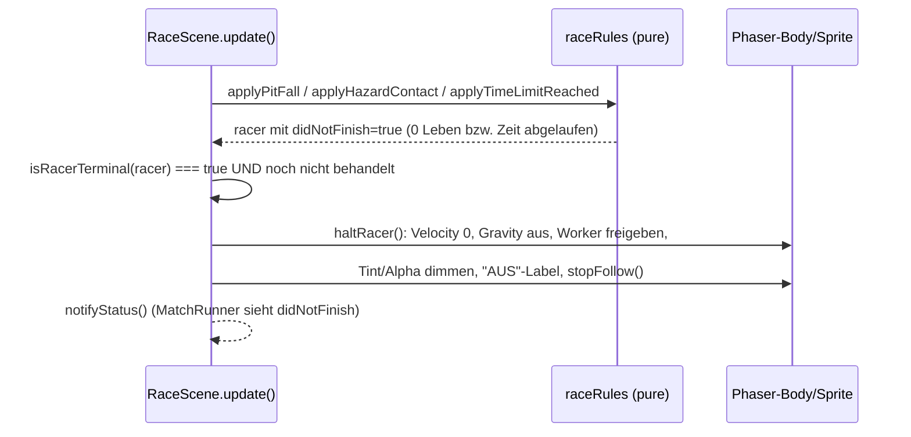

# Design: Einstellbare Leben & Ausscheiden bei 0 Leben (`tournament-lives`)

Bezug: `.features/tournament-lives/requirements.md` (US-1 bis US-3).

## Architektur-Überblick

Zwei getrennte Wirkungsketten, die sich nur den Wert `livesPerRun` teilen:

```
US-1 (Konfiguration)
/admin TournamentSetup ──livesPerRun──▶ tournament-configure
                                            │
                                   TournamentService.configure
                                   (validiert, Default-Fallback)
                                            │
                                   TournamentState.livesPerRun
                                            │
                          ◀── tournament-state (an ALLE) ──▶
                                                        MatchRunner
                                                 startingLives ▼
                                                        RaceScene

US-2 (Ausscheiden)
RaceScene.update() ─▶ isRacerTerminal(racer) ─▶ haltRacer()
                          (pure, testbar)       (Phaser-Effekt)
```

Der Wertebereich (1–99) und der Default (3) sind **Contract-Wissen** und leben
deshalb in `@arena/shared` – Client-UI, Server-Validierung und Szene lesen
denselben Wert. Ohne das gäbe es drei Orte mit einer „3" und zwei mit „99".

## Schnittstellen & Datenmodelle

### `packages/shared/src/tournament.ts` (erweitert)

```ts
export const DEFAULT_LIVES_PER_RUN = 3;
export const MIN_LIVES_PER_RUN = 1;
export const MAX_LIVES_PER_RUN = 99;

/** Ganzzahlig und innerhalb [MIN, MAX]. Einzige Quelle der Wahrheit für die
 *  Validierung – genutzt von /admin (Hinweis) und Server (Ablehnung). */
export function isValidLivesPerRun(value: unknown): value is number;

export interface TournamentState {
  // ... unverändert ...
  /** Leben pro Racer in jedem Match dieses Turniers. */
  livesPerRun: number;
}
```

### `packages/shared/src/messages.ts` (additiv)

```ts
export interface TournamentConfigureMessage {
  type: "tournament-configure";
  mode: TournamentMode;
  levelId: string;
  botIds: string[];
  /** Optional – fehlt der Wert, nutzt der Server DEFAULT_LIVES_PER_RUN
   *  (Rückwärtskompatibilität, US-3). */
  livesPerRun?: number;
}
```

Der Typguard akzeptiert `livesPerRun` als `undefined` **oder** `number`; die
fachliche Bereichsprüfung passiert bewusst **nicht** im Typguard, sondern im
`TournamentService`. Grund: Ein invalider Wert soll wie „< 2 Teilnehmer"
behandelt werden (Ablehnung mit Log), statt die Nachricht in
`parseInboundMessage` still zu verschlucken – das wäre am Stand nicht
diagnostizierbar.

### `client/src/game/rules/racerState.ts` (erweitert)

```ts
// Bisher: export const LIVES_PER_RUN = 3;
// Neu: Re-Export des Shared-Defaults, damit es genau EINEN Wert gibt.
export const LIVES_PER_RUN = DEFAULT_LIVES_PER_RUN;

/** Endzustand erreicht: Ziel erreicht ODER ausgeschieden (keine Leben /
 *  Zeitlimit). Pure Ableitung, damit die Stopp-Bedingung testbar ist,
 *  ohne Phaser zu starten (US-2). */
export function isRacerTerminal(state: RacerRuntimeState): boolean {
  return state.finished || state.didNotFinish;
}
```

### `client/src/match/MatchRunner.ts` (geänderte Signatur)

```ts
export interface MatchStartOptions {
  match: MatchDef;
  levelId: string;
  livesPerRun: number;
  sourceById: ReadonlyMap<string, string>;
}

start(options: MatchStartOptions): void;
```

Options-Objekt statt vierter Positions-Parameter: Die Aufrufstelle bleibt
lesbar, und weitere Turnier-Einstellungen (z.B. später ein konfigurierbares
Zeitlimit) lassen sich ergänzen, ohne jede Signatur erneut anzufassen.

`MatchRunner` reicht `livesPerRun` als `startingLives` in die
`RaceSceneInitData` durch – das Feld existiert bereits und wird heute nur von
`/dev` (mit `Infinity`) genutzt.

## Ablauf / Sequenz

### US-2: Ausscheiden eines Racers



`haltRacer()` läuft genau einmal pro Szene (`terminalHandled`-Flag). Der
bestehende Früh-Ausstieg `if (isRacerTerminal(this.racer)) return;` am Anfang
von `update()` bleibt – neu ist nur, dass davor einmalig gestoppt wird.

**Bewusst auch für `finished`:** Heute driftet auch ein Racer, der das Ziel
erreicht hat, mit seiner Restgeschwindigkeit weiter, weil `update()` aussteigt,
die Arcade-Physik aber weiterläuft. `haltRacer()` behandelt beide Endzustände;
nur die visuelle Abdunklung/Markierung ist dem Ausscheiden vorbehalten (US-2),
der Zieleinlauf bleibt optisch unverändert.

## Fehlerbehandlung & Edge Cases

- **`livesPerRun` fehlt** (alter Client): Server setzt `DEFAULT_LIVES_PER_RUN`.
- **`livesPerRun` ungültig** (0, 100, 2.5, NaN, String): `configure` gibt `null`
  zurück, loggt eine Warnung, Turnierzustand bleibt unverändert, kein Broadcast
  (identisch zum bestehenden „< 2 Teilnehmer"-Pfad).
- **`/admin`-Eingabefeld leer**: Start-Button ist deaktiviert, Hinweistext
  erscheint – es wird keine Nachricht gesendet.
- **`/dev`**: übergibt weiterhin `Infinity`; `isRacerTerminal` wird dort nie
  durch „keine Leben" wahr, weil `Infinity - 1 === Infinity`. Verhalten
  unverändert.
- **Racer scheidet in der Luft aus**: Gravitation wird abgeschaltet, das Sprite
  bleibt an der Stelle stehen, statt aus dem Level zu fallen.
- **Racer scheidet aus, während der Bot-Worker gerade tickt**: Die noch
  laufende `getNextActions`-Promise schreibt in `lastBotActions`, wird aber nie
  mehr angewendet (Früh-Ausstieg in `update()`). `controller.dispose()` beendet
  den Worker.
- **Alle Racer scheiden aus**: Match endet regulär über die bestehende
  `MatchRunner`-Abbruchbedingung; Ranking über die DNF-Scores.

## Test-Strategie

Strikt Rot-Grün-Refactor.

- **Shared (Vitest):**
  - `isValidLivesPerRun`: 1 und 99 gültig; 0, 100, 2.5, `NaN`, `Infinity`,
    `"3"`, `null`, `undefined` ungültig.
  - `isTournamentConfigureMessage`: akzeptiert mit und ohne `livesPerRun`,
    lehnt nicht-numerische Werte ab.
- **Server (Vitest):**
  - `TournamentService.configure`: übernimmt gültigen Wert in den State;
    fällt ohne Angabe auf `DEFAULT_LIVES_PER_RUN` zurück; lehnt ungültige
    Werte ab (State bleibt `null`).
  - `parseInboundMessage`: `tournament-configure` mit/ohne `livesPerRun`.
- **Client (Vitest):**
  - `isRacerTerminal`: `false` im Normalzustand, `true` bei `finished`,
    `true` bei `didNotFinish`.
  - Bestehende `raceRules`-Tests (0 Leben → `didNotFinish`) bleiben unverändert
    grün – sie decken die Regel bereits ab.
- **Bewusst ohne Unit-Test** (bestehende Konvention, Phaser/Präsentation):
  `RaceScene.haltRacer()`, `MatchRunner`, `TournamentSetup.tsx`.
- **Manuelle Verifikation:**
  1. `/admin`: Leben auf 1 stellen, Turnier mit 2 Bots starten → Bots scheiden
     nach dem ersten Tod aus, Match endet zügig.
  2. Ungültige Eingaben (0, 100, leer) → Start-Button deaktiviert + Hinweis.
  3. Ausgeschiedener Racer bleibt abgedunkelt an Ort und Stelle stehen, fällt
     nicht weiter, sein Bot tickt nicht mehr; die übrigen laufen weiter.
  4. Racer im Ziel driftet nicht mehr weiter.
  5. `/dev` in beiden Modi unverändert (Leben `∞`, kein vorzeitiges DNF).

## Auswirkungen auf bestehenden Code

| Datei | Änderung |
|---|---|
| `packages/shared/src/tournament.ts` | Konstanten, `isValidLivesPerRun`, `TournamentState.livesPerRun` |
| `packages/shared/src/messages.ts` | `TournamentConfigureMessage.livesPerRun?`, Typguard erweitert |
| `packages/shared/src/index.ts` | Re-Exports |
| `server/src/tournament/TournamentService.ts` | Validierung + Default, Wert in den State |
| `server/src/tournament/SingleEliminationStrategy.ts` | unverändert (kennt Leben nicht) |
| `client/src/game/rules/racerState.ts` | `LIVES_PER_RUN` aus Shared, neu `isRacerTerminal` |
| `client/src/game/scenes/RaceScene.ts` | `haltRacer()` + einmaliger Aufruf, `isRacerTerminal` statt Inline-Bedingung |
| `client/src/match/MatchRunner.ts` | `MatchStartOptions`, `startingLives` durchreichen |
| `client/src/match/MatchView.tsx` | `livesPerRun` als Prop durchreichen |
| `client/src/pages/PresentPage.tsx` | `livesPerRun` aus dem Turnierzustand an `MatchView` |
| `client/src/components/TournamentSetup.tsx` | Eingabefeld + Validierung |
| `client/src/pages/AdminPage.tsx` | `livesPerRun` an `tournament-configure` |
| `docs/05-scoring-und-heats.md` | Leben pro Lauf als konfigurierbar dokumentieren |
