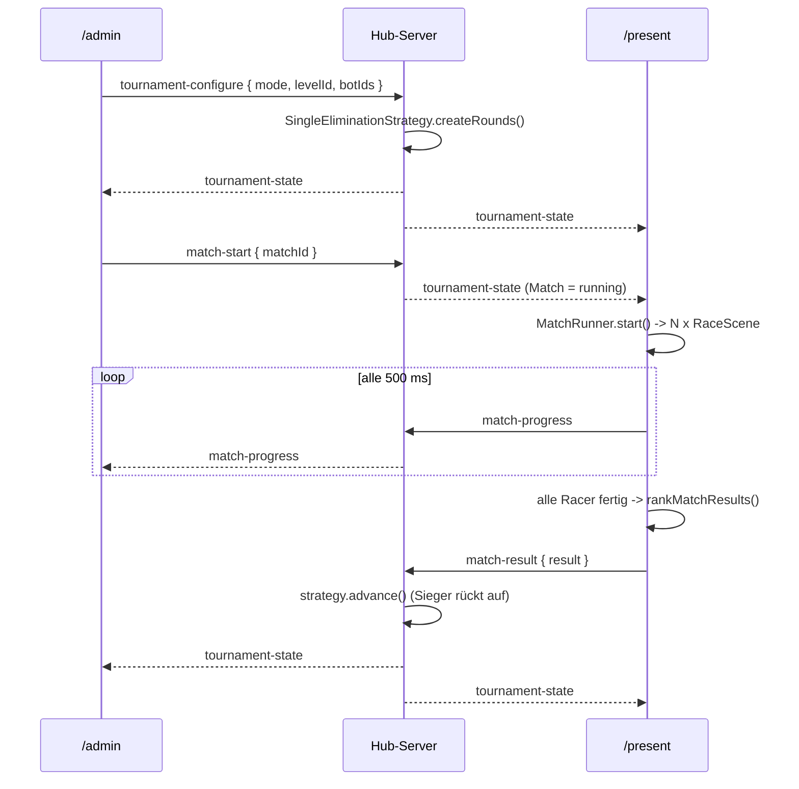

# Design: Turnier & Match-Ausführung (`tournament-runner`)

Bezug: `.features/tournament-runner/requirements.md` (US-1 bis US-8).

## Architektur-Überblick

Drei klar getrennte Zuständigkeiten:

| Ebene | Ort | Verantwortung |
|---|---|---|
| **Turnierzustand** | Hub-Server (In-Memory) | Bracket erzeugen/fortschreiben, autoritative Quelle für `/admin` + `/present` |
| **Steuerung** | `/admin` | Turnier konfigurieren, Matches starten, Live-Stand ansehen, zurücksetzen |
| **Simulation** | `/present` | Phaser-Match ausspielen, Score/Ranking berechnen, Ergebnis melden |

```
/admin                        Hub-Server                        /present
──────                        ──────────                        ────────
tournament-configure ──▶ TournamentService
                          └ SingleEliminationStrategy
                            (Bracket erzeugen)
                                  │
                     ◀── tournament-state (an ALLE) ──▶
                                                        Bracket-Anzeige
match-start ─────────▶ (Match als "running" markieren)
                     ◀── tournament-state ────────────▶ MatchRunner startet
                                                          N × RaceScene
                                                          (eigene Viewports)
                     ◀── match-progress (gedrosselt) ◀── Live-Stand
   Live-Rangliste
                                                          Match zu Ende
                       TournamentService.advance()   ◀── match-result
                     ◀── tournament-state (an ALLE) ──▶ Ergebnis/Champion
tournament-reset ────▶ Zustand verwerfen
```

Der Server bleibt frei von Spiellogik: Er kennt Bracket-Struktur und
Match-Ergebnisse, aber weder Physik noch Scoring – das Scoring liegt dort, wo
die Simulation läuft (`/present`), und nutzt die bestehende
`client/src/game/scoring.ts` unverändert.

**Keine Persistenz** (Nicht-Ziel): Der Turnierzustand ist kurzlebig; ein
Serverneustart verwirft ihn, die Bot-Registry bleibt davon unberührt.

## Das zentrale Problem: geteilte Welt vs. mehrere Racer

`RaceScene` verwaltet heute genau einen Racer. Der naive Weg – ein Level, N
Sprites, N Kameras – hat ein hartes fachliches Problem:

> Sammelt Bot A eine Frucht ein, wird deren Sprite mit `coin.destroy()`
> entfernt. Bot B könnte sie danach nicht mehr einsammeln. Dasselbe gilt für
> versteckte Blöcke (einmal aufgelöst), gestompte Gegner (zerstört) und
> Checkpoint-Animationen.

Damit wäre der Wettbewerb unfair und vom Startzeitpunkt abhängig. Geprüfte
Optionen:

| Option | Bewertung |
|---|---|
| Eine Szene, geteilte Welt, Objekte pro Racer nachverfolgen | Erfordert, dass jedes Weltobjekt N-fach existiert und per `camera.ignore()` gefiltert wird – invasiver Umbau von `worldBuilder` **und** aller Kollisions-Handler. Hohe Komplexität. |
| Eine Szene, Welt N-mal räumlich versetzt aufbauen | Erfordert Offset-Parameter in `worldBuilder`/Hazard-Factory und macht alle Level-Koordinaten relativ. Mittlere Komplexität, `RaceScene` betroffen. |
| **N parallele Szenen-Instanzen, je eine komplette Welt** | Phaser unterstützt mehrere gleichzeitig aktive Szenen mit eigenem Kamera-Viewport und **eigener Physik-Welt**. Jede Instanz ist vollständig isoliert – kein Objekt-Sharing, damit das Problem strukturell nicht existiert. Assets liegen im gemeinsamen Cache (einmal geladen). |

**Gewählt: N parallele Szenen-Instanzen.** Das löst zusätzlich US-3
("keine Bot-zu-Bot-Kollision") strukturell statt per Sonderregel – die Bots
sind in getrennten Physik-Welten und können sich gar nicht berühren.

Konsequenz: Als Szene wird die **bestehende `RaceScene` wiederverwendet**, nicht
kopiert. Sie kann bereits alles Nötige (Level laden, Bot-Sandbox, Regeln,
Scoring-Rohdaten via `onStatusChange`) und bekommt nur **additive, optionale**
Erweiterungen, die im `/dev`-Pfad auf das heutige Verhalten defaulten.

### Voraussetzung: eindeutiger Scene-Key pro Instanz (verifiziert)

Phaser erlaubt **nicht**, dieselbe Scene-**Klasse** mehrfach unter
verschiedenen Keys zu registrieren. `SceneManager.createSceneFromFunction`
liest den im Konstruktor gesetzten Key und überschreibt damit den übergebenen:

```js
var configKey = newScene.sys.settings.key;
if (configKey !== '') { key = configKey; }
if (this.keys.hasOwnProperty(key)) {
    throw new Error('Cannot add Scene with duplicate key: ' + key);
}
```

Da `RaceScene` heute `super("RaceScene")` fest verdrahtet, würde die zweite
Instanz eines Matches mit `Cannot add Scene with duplicate key: RaceScene`
werfen. Deshalb wird der Key **parametrisierbar** (einzige Änderung an der
Klassensignatur, Default = heutiges Verhalten):

```ts
export class RaceScene extends Phaser.Scene {
  constructor(key = "RaceScene") {
    super(key);
  }
  // ... unverändert ...
}
```

`MatchRunner` registriert dann **Instanzen** statt der Klasse:
`game.scene.add(key, new RaceScene(key), true, initData)` – dieser Pfad
(`getKey` mit `sceneConfig instanceof Scene`) übernimmt den eindeutigen Key
korrekt.

### Additive Init-Optionen

```ts
export interface RaceSceneInitData {
  // ... unverändert ...
  /** Kamera-Ausschnitt im Canvas. Default: ganzes Canvas (heutiges Verhalten). */
  viewport?: { x: number; y: number; width: number; height: number };
  /** Musik UND Soundeffekte dieser Szene. Default `true` (heutiges Verhalten).
   *  Im Match für ALLE Racer-Szenen `false` – Begründung siehe unten. */
  audio?: boolean;
}
```

**Warum ein einziges `audio`-Flag statt "nur Szene 0 spielt Musik":** Ein
naheliegender erster Entwurf war `playMusic: index === 0`. Der ist fehlerhaft –
`RaceScene.shutdown()` stoppt die Musik, sodass die Musik mitten im Match
verstummt, sobald ausgerechnet Racer 0 als Erster fertig ist. Außerdem würden
die Soundeffekte (Sprung, Einsammeln, Schaden) bei 4 Racern vierfach
übereinanderliegen. Deshalb: **alle** Match-Szenen laufen stumm, und die
Hintergrundmusik verantwortet die Match-UI genau einmal (siehe `MatchView`).

Damit bleibt US-8 gewahrt: `/dev` und `RaceScene` sind **funktional**
unverändert (alle Defaults = heutiges Verhalten), und es entsteht **keine**
700-Zeilen-Kopie, die bei jedem künftigen Bugfix doppelt gepflegt werden müsste.

## Schnittstellen & Datenmodelle

### `packages/shared/src/tournament.ts` (neu) – Typen

```ts
export type TournamentMode = "single-elimination";

export interface MatchParticipant {
  botId: string;
  name: string;
  author: string;
  color: string;
}

export type MatchStatus = "pending" | "running" | "finished";

export interface MatchDef {
  id: string;
  participants: MatchParticipant[];
  status: MatchStatus;
  /** Erst nach Abschluss gesetzt (bzw. sofort bei Freilos). */
  result: MatchResult | null;
}

export interface MatchResultEntry {
  botId: string;
  rank: number;          // 1 = Sieger
  score: number;
  fruitScore: number;
  coinsCollected: number;
  deaths: number;
  timeElapsedMs: number;
  reachedGoal: boolean;
  /** Bot wurde wegen Fehlern/Timeouts pausiert (US-3). */
  disabled: boolean;
}

/** Ergebnis EINES Matches; aufsteigend nach `rank` sortiert. Trägt bewusst
 *  keine `matchId` – es wird ausschließlich unter `MatchDef.result` abgelegt,
 *  die Zuordnung ergibt sich aus dem Ort. Die Transport-Nachricht
 *  (`MatchResultMessage`) führt die `matchId` separat mit. */
export interface MatchResult {
  entries: MatchResultEntry[];
}

export interface TournamentState {
  mode: TournamentMode;
  levelId: string;
  /** Runden -> Matches. `rounds[0]` = erste Runde. Die Rundennummer ist
   *  ausschließlich der Array-Index (kein redundantes `roundIndex`-Feld im
   *  Match – ein Wert, eine Quelle). */
  rounds: MatchDef[][];
  status: "idle" | "running" | "finished";
  championBotId: string | null;
}
```

### Message-Contracts (`packages/shared/src/messages.ts`, additiv)

```ts
// /admin -> Server
export interface TournamentConfigureMessage {
  type: "tournament-configure";
  mode: TournamentMode;
  levelId: string;
  botIds: string[];
}
export interface MatchStartMessage { type: "match-start"; matchId: string; }
export interface TournamentResetMessage { type: "tournament-reset"; }

// /present -> Server
export interface MatchResultMessage {
  type: "match-result";
  matchId: string;
  result: MatchResult;
}
export interface MatchProgressMessage {
  type: "match-progress";
  matchId: string;
  entries: {
    botId: string;
    fruitScore: number;
    livesRemaining: number;
    timeElapsedMs: number;
    progress: number;        // 0..1, Fortschritt Richtung Ziel
    finished: boolean;
    didNotFinish: boolean;
    disabled: boolean;
  }[];
}

// Server -> alle Clients (auch als Snapshot für neu verbundene Clients)
export interface TournamentStateMessage {
  type: "tournament-state";
  state: TournamentState | null;   // null = kein Turnier konfiguriert
}
```

`tournament-state` ist die **einzige** Sync-Nachricht für den Turnierzustand –
sie erfüllt Live-Update und Snapshot (US-6) mit demselben Mechanismus (DRY, wie
schon `bot-registry-snapshot` + `bot-added` beim Vorgänger-Feature, hier sogar
mit nur einem Typ, da der Zustand klein ist).

`match-progress` wird vom Server **unverändert weitergereicht** (reiner Relay,
kein Speichern) – dafür genügt der bestehende `createBroadcastRelayHandler`.

### Server: `server/src/tournament/`

```
server/src/tournament/
  TournamentStrategy.ts          # Interface (Open/Closed, US-8)
  SingleEliminationStrategy.ts
  SingleEliminationStrategy.test.ts
  TournamentService.ts            # hält aktuellen Zustand, delegiert an Strategie
  TournamentService.test.ts
  handlers/
    createTournamentConfigureHandler.ts (+ .test.ts)
    createMatchStartHandler.ts          (+ .test.ts)
    createMatchResultHandler.ts         (+ .test.ts)
    createTournamentResetHandler.ts     (+ .test.ts)
```

```ts
// TournamentStrategy.ts – neue Modi = neue Implementierung, kein Eingriff
// in bestehende (Open/Closed, US-8).
export interface TournamentStrategy {
  readonly mode: TournamentMode;
  createRounds(participants: MatchParticipant[], levelId: string): MatchDef[][];
  /** Baut den Zustand nach einem Match-Ergebnis fort (neue Runde, Champion, …). */
  advance(state: TournamentState, result: MatchResult): TournamentState;
}
```

`SingleEliminationStrategy`:
- Teilnehmer mischen (injizierbare `shuffle`-Funktion → deterministische Tests),
  in Gruppen à **max. 4** aufteilen (US-2).
- Gruppe mit genau 1 Bot → Match wird sofort mit `status: "finished"` und einem
  Ergebnis mit `rank: 1` angelegt (Freilos, US-2) – kein Sonderfall im
  Advance-Pfad nötig.
- `advance`: Ergebnis am Match vermerken; sind alle Matches der aktuellen Runde
  `finished`, aus deren Siegern die nächste Runde erzeugen. Bleibt genau ein
  Sieger übrig → `status: "finished"`, `championBotId` gesetzt.

`TournamentService` hält den aktuellen `TournamentState | null`, wählt anhand
des Modus die Strategie aus einer Registry (`Record<TournamentMode, TournamentStrategy>`)
und ist der einzige Ort, der den Zustand mutiert. Die Handler enthalten keine
Turnierlogik, sondern nur: Nachricht → Service-Aufruf → Zustand broadcasten.

Da **alle vier** Handler nach ihrer Mutation dieselbe Nachricht senden, wird
das Broadcasten einmal gekapselt statt viermal wiederholt (DRY):

```ts
// tournament/broadcastTournamentState.ts
export function createTournamentStateBroadcaster(
  service: TournamentService,
  broadcastAll: (message: OutboundMessage) => void
): () => void {
  return () => broadcastAll({ type: "tournament-state", state: service.getState() });
}
```

Jeder Handler bekommt diese Funktion injiziert und ruft sie nach einer
erfolgreichen Mutation auf. Derselbe Aufruf dient als Snapshot für neu
verbundene Clients (`onClientConnected`).

Teilnehmer-Metadaten (Name/Autor/Farbe) zieht der Configure-Handler aus der
bestehenden `BotRegistry` – der Turnierzustand ist dadurch selbsttragend und
`/present` braucht für die Anzeige keinen Join über zwei Zustände. Das ist eine
bewusste Denormalisierung: Wird ein Bot nach Turnierstart aus der Registry
gelöscht, bleibt die Bracket-Anzeige vollständig (siehe Edge Cases).

### Client: reine Logik (Phaser-frei, voll testbar)

```
client/src/match/
  gridViewports.ts        # Teilnehmerzahl -> Kamera-Rechtecke (1×1/1×2/2×2)
  gridViewports.test.ts
  rankMatchResults.ts     # RacerRuntimeState[] -> MatchResultEntry[] (Score+Rang)
  rankMatchResults.test.ts
  matchProgress.ts        # RacerRuntimeState -> Progress-Eintrag (0..1)
  matchProgress.test.ts
```

```ts
// rankMatchResults.ts – nutzt computeScore aus game/scoring.ts (DRY, US-8)
export function rankMatchResults(
  racers: readonly { botId: string; state: RacerRuntimeState; disabled: boolean }[]
): MatchResultEntry[];
```
Sortierung: Score absteigend, bei Gleichstand `timeElapsedMs` aufsteigend
(US-4). Vergibt fortlaufende `rank`-Werte ab 1.

```ts
// gridViewports.ts
export function computeGridViewports(
  count: number, canvasWidth: number, canvasHeight: number
): { x: number; y: number; width: number; height: number }[];
```
1 Bot → 1×1, 2 → 1×2 (nebeneinander), 3–4 → 2×2. Reine Arithmetik, unit-getestet.

### Client: `MatchRunner` (Phaser-Wiring, dünn)

```ts
// client/src/match/MatchRunner.ts
export class MatchRunner {
  constructor(
    private readonly game: Phaser.Game,
    private readonly onProgress: (entries: MatchProgressEntry[]) => void,
    private readonly onFinished: (result: MatchResult) => void
  ) {}

  start(match: MatchDef, levelId: string, sourceById: Map<string, string>): void;
  stop(): void;
}
```

Verantwortung ausschließlich Orchestrierung:
1. `computeGridViewports(match.participants.length, …)`.
2. Pro Teilnehmer eine `RaceScene`-**Instanz** unter eindeutigem Key
   (`match-<matchId>-<botId>`) via
   `game.scene.add(key, new RaceScene(key), true, initData)` starten – mit
   `controllerMode: "bot"`, dem Quelltext aus der Registry, `viewport`,
   `audio: false`, `levelId`.
3. Den je Szene gemeldeten `onStatusChange`-Status im Runner sammeln.
4. Gedrosselt (siehe unten) `onProgress` mit `matchProgress`-Einträgen feuern.
5. Sobald **alle** Racer `finished || didNotFinish || disabled` sind:
   `rankMatchResults` aufrufen, `onFinished` melden, alle Szenen per
   `game.scene.remove(key)` abräumen.

Drosselung (US-5): fester Intervall von **500 ms** über einen Timer im Runner –
bewusst nicht an den Render-/Tick-Loop gekoppelt, damit die Rate unabhängig von
Framerate und Teilnehmerzahl konstant bleibt.

Ein Bot, dessen `BotRunner` pausiert wurde (`pausedReasonKind !== null`), zählt
als `disabled: true` und gilt für die Abbruchbedingung als fertig – sonst würde
ein einziger kaputter Bot das Match bis zum 90-Sekunden-Zeitlimit blockieren.
Sein Ergebnis wird normal gewertet (typischerweise DNF), was US-3 erfüllt
("Match für die übrigen fortsetzen").

### Client: `MatchView.tsx` (Phaser-Host für `/present`)

`ArenaView` ist auf genau einen Racer und `/dev` zugeschnitten und wird
**nicht** wiederverwendet. `/present` bekommt eine eigene, ebenso dünne
Host-Komponente:

- erzeugt genau **eine** `Phaser.Game`-Instanz (Canvas für das gesamte Grid),
- erzeugt den `MatchRunner` und startet/stoppt ihn passend zum
  `TournamentState`,
- spielt die Hintergrundmusik **einmal** für das ganze Match (die Racer-Szenen
  laufen stumm, siehe `audio`-Flag oben),
- setzt `physics.arcade.debug: **false**`.

> Der Debug-Wert ist explizit erwähnt, weil `ArenaView` heute
> `arcade: { …, debug: true }` gesetzt hat – auf dem Präsentations-Screen
> würden dadurch sämtliche Kollisionsboxen als farbige Rechtecke über dem
> Spiel liegen. Für `/dev` bleibt der Wert unverändert (Debugging-Hilfe).

### Client: UI

```
client/src/tournament/
  useTournamentState.ts       # Zustand aus tournament-state-Nachrichten
  useTournamentState.test.ts
  useMatchProgress.ts         # letzter match-progress je Match
  useMatchProgress.test.ts
components/
  TournamentSetup.tsx          # /admin: Bot-Auswahl, Level, Modus, Start
  BracketView.tsx              # Runden/Matches/Sieger (beide Seiten)
  MatchLiveStandings.tsx       # /admin: Live-Rangliste
  MatchResultView.tsx          # /present: Endergebnis eines Matches
  ChampionView.tsx             # /present: Champion-Screen
pages/
  AdminPage.tsx                # + Setup, Bracket, "Match starten", Reset
  PresentPage.tsx              # + Bracket / laufendes Match / Ergebnis / Champion
```

`/present` rendert genau einen von vier Zuständen (abgeleitet aus
`TournamentState`, keine eigene Zustandsmaschine): kein Turnier → Bot-Liste
(heutiges Verhalten); Turnier läuft, kein Match aktiv → Bracket; Match `running`
→ Phaser-Canvas; Turnier `finished` → Champion-Screen.

## Ablauf / Sequenz



## Fehlerbehandlung & Edge Cases

- **Weniger als 2 Teilnehmer**: `tournament-configure` wird abgelehnt, Server
  loggt, kein Zustandswechsel; `/admin` prüft zusätzlich vorab und zeigt einen
  Hinweis (US-1).
- **Bot mit fehlerhaftem Code**: `BotRunner` pausiert ihn (bestehende Logik);
  Racer gilt als `disabled`, blockiert das Match nicht, wird als DNF gewertet.
- **Alle Bots eines Matches fallen aus**: Match endet regulär, Ranking über
  DNF-Scores; ein Sieger existiert weiterhin (Tie-Breaker Zeit).
- **`match-start` für ein bereits laufendes/beendetes Match**: Service ignoriert
  die Nachricht (no-op), kein Zustandswechsel.
- **`match-result` für ein unbekanntes/nicht laufendes Match**: ignoriert.
  Das ist zugleich der Schutz gegen **zwei geöffnete `/present`-Tabs**: Beide
  würden dasselbe Match simulieren und je ein `match-result` senden; das erste
  setzt den Match-Status auf `finished`, das zweite läuft ins No-op und kann
  das Bracket nicht doppelt fortschreiben. (Zwei gleichzeitig rendernde
  `/present`-Tabs bleiben aus Performance-Sicht trotzdem unerwünscht – das ist
  eine Betriebs-, keine Korrektheitsfrage.)
- **Bot-ID aus dem Turnier nicht mehr in der Registry** (zwischenzeitlich
  gelöscht): `/present` kann den Quelltext nicht laden → Racer startet als
  `disabled` (DNF). Der Turnierzustand hält Name/Autor/Farbe selbst, die
  Anzeige bleibt also vollständig.
- **Neu verbundener Client während eines Matches**: erhält per
  `onClientConnected` den `tournament-state`-Snapshot; ein laufendes Match wird
  auf einem frisch verbundenen `/present` **nicht** rückwirkend gestartet
  (Simulation ist nicht reproduzierbar) – der Standbetreuer startet es neu.
- **Turnier-Reset während eines laufenden Matches**: Server setzt den Zustand
  auf `null` und broadcastet; `/present` ruft `MatchRunner.stop()` und räumt
  alle Szenen ab.
- **Serverneustart**: Turnierzustand weg (Nicht-Ziel Persistenz), Bot-Registry
  bleibt (eigene Datei) – ein neues Turnier kann sofort konfiguriert werden.

## Test-Strategie

Strikt Rot-Grün-Refactor (`AGENTS.md`).

- **Server (Vitest):**
  - `SingleEliminationStrategy.createRounds`: Gruppengröße ≤ 4; 1/2/3/4/5/9/16
    Teilnehmer; Rest-Gruppen kleiner statt aufgefüllt; Freilos-Gruppe erhält
    sofort ein `finished`-Match mit `rank: 1`; injizierte `shuffle` macht die
    Zuordnung deterministisch prüfbar.
  - `SingleEliminationStrategy.advance`: Ergebnis wird am Match vermerkt;
    nächste Runde erst wenn alle Matches der Runde fertig; nur Sieger rücken
    auf; letzter verbliebener Bot → `status: "finished"` + `championBotId`.
  - `TournamentService`: configure mit < 2 Teilnehmern → kein Zustand;
    `match-start` auf laufendem/beendetem Match → no-op; `match-result` für
    unbekanntes Match → no-op; `reset` → Zustand `null`.
  - Handler: korrekte Service-Aufrufe und `routeToAll(tournament-state)` gegen
    Fakes.
  - `parseInboundMessage` + neue Typguards.
- **Client (Vitest):**
  - `computeGridViewports`: 1/2/3/4 Teilnehmer → erwartete Rechtecke, Summe
    überdeckt das Canvas, keine Überlappung.
  - `rankMatchResults`: Sortierung nach Score; Tie-Breaker Zeit; `rank`
    fortlaufend ab 1; DNF-/disabled-Racer korrekt gewertet.
  - `matchProgress`: `progress` zwischen 0 und 1, 1 bei erreichtem Ziel.
  - `useTournamentState` / `useMatchProgress`: Reducer-Verhalten inkl.
    `state: null` (Reset) und Ignorieren fremder Message-Typen.
- **Bewusst ohne Unit-Test** (Phaser-/Präsentations-Wiring, bestehende
  Konvention): `MatchRunner.ts`, `MatchView.tsx`, alle übrigen `.tsx`-
  Komponenten, `server/src/index.ts`.
- **Regressionsschutz `/dev` (US-8):** bestehende `RaceScene`-bezogene Tests
  bleiben unverändert grün; die neuen Optionen sind optional mit Defaults =
  heutigem Verhalten. Zusätzlich ein expliziter Test, dass
  `new RaceScene().sys.settings.key === "RaceScene"` (Default-Key unverändert)
  und `new RaceScene("abc")` den übergebenen Key trägt – das ist die
  Voraussetzung, an der die Multi-Instanz-Architektur sonst still scheitert
  (siehe oben, verifizierter Phaser-Befund). Manuell zusätzlich: `/dev` in
  beiden Modi (Tastatur/Bot) prüfen.
- **Manueller Integrationstest:**
  1. 4 Bots hochladen, Turnier konfigurieren, starten → Bracket in `/admin`
     und `/present` identisch.
  2. Match starten → 4 Ansichten im Grid auf `/present`, alle laufen;
     `/admin` zeigt eine sich aktualisierende Live-Rangliste.
  3. Match zu Ende → Ergebnis auf `/present`, Sieger rückt im Bracket auf.
  4. Turnier bis zum Champion durchspielen → Champion-Screen.
  5. Bot mit `while(true){}` einschleusen → dessen Ansicht pausiert, Match
     läuft für die übrigen weiter.
  6. `/present` während eines Turniers neu laden → Bracket-Stand identisch.
  7. Reset → beide Ansichten zurück im Ausgangszustand, Bot-Registry unverändert.
  8. **Performance:** 4 Bots gleichzeitig auf der Stand-Hardware – flüssige
     Darstellung prüfen (offene Frage aus `requirements.md`).

## Auswirkungen auf bestehenden Code

| Datei | Änderung |
|---|---|
| `packages/shared/src/tournament.ts` | neu (Turnier-Typen) |
| `packages/shared/src/messages.ts` | neue Message-Typen + Typguards |
| `packages/shared/src/index.ts` | Re-Exports |
| `server/src/tournament/**` | neu |
| `server/src/ws/parseMessage.ts` | neue Typguard-Zweige |
| `server/src/index.ts` | Service + Handler verdrahten, `tournament-state` in den Connect-Snapshot aufnehmen |
| `client/src/match/**`, `client/src/tournament/**` | neu |
| `client/src/components/*` (5 neue Komponenten) | neu |
| `client/src/game/scenes/RaceScene.ts` | **additiv**: parametrisierbarer Scene-Key im Konstruktor (Default `"RaceScene"`), optionale `viewport`/`audio`-Optionen (Defaults = heutiges Verhalten) |
| `client/src/match/MatchView.tsx` | neu (Phaser-Host für `/present`, `debug: false`, Musik einmalig) |
| `client/src/pages/AdminPage.tsx`, `PresentPage.tsx` | Turnier-UI ergänzt |
| `docs/09-bot-artefakt-und-turnier.md` | Ablauf-Komponenten an die tatsächliche Umsetzung angleichen |
| `docs/07-offene-punkte.md` | Turnier-Umsetzungsstand ergänzen |
