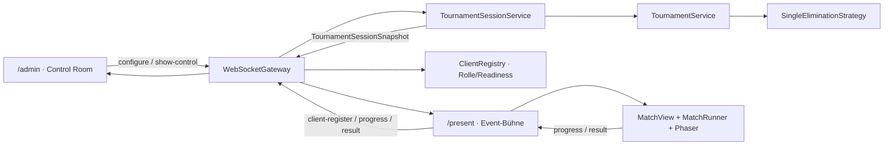
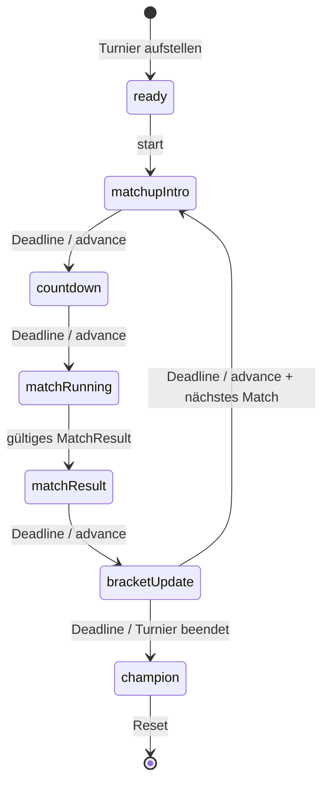

# Design: Tournament Show Flow

Bezug: [`requirements.md`](./requirements.md), freigegeben am 11.08.2026.

## Architektur-Überblick

Das Feature ergänzt die bestehende Turnierarchitektur um eine serverseitige
Show-Orchestrierung. Drei Verantwortungen bleiben bewusst getrennt:

1. `TournamentService` und `SingleEliminationStrategy` bleiben die einzige
   fachliche Quelle für Bracket, Matchstatus, Gewinner und Champion.
2. Ein neuer `TournamentSessionService` ist der schmale Application-Service
   für genau eine laufende Turniersession. Er koordiniert Show-Phasen, Timer,
   Executor-Zuweisung und die Aufrufe des `TournamentService`, enthält aber
   selbst weder Bracket- noch Scoring-Logik.
3. `/present` bleibt der einzige Ort, an dem Phaser und Bot-Code ausgeführt
   werden. Der Server simuliert weder Level noch Racer.



Der bestehende manuelle `match-start`-Pfad wird vollständig entfernt:
Nachrichtentyp, Guard, Parser-Zweig, Handler, Tests und UI-Aufrufer entfallen.
Matchstarts sind danach eine interne Operation der Session-Orchestrierung.
Dadurch existieren nicht zwei konkurrierende Wege, die den Turnierzustand
fortschreiben.

### Warum ein serverseitiger Session-Service?

- Ein Browser-Reload verliert keinen lokalen Timer.
- `/admin` und `/present` sehen dieselbe Phase und dieselbe Deadline.
- Pause, Fortsetzen und „Sofort weiter“ sind zentrale Zustandsübergänge.
- Ein fehlendes `/present` kann vor einem Match zuverlässig erkannt werden.
- Die Matchsimulation bleibt trotzdem clientseitig und verändert die
  bestehende Sicherheits-/Sandbox-Grenze nicht.

## Komponenten und Modulgrenzen

### Shared Contracts (`packages/shared`)

```text
packages/shared/src/
  tournament.ts       # TournamentShowState + Konstanten/Typen
  messages.ts         # Registration, Show-Control, Session-Snapshot
```

### Server

```text
server/src/
  tournament/
    TournamentSessionService.ts
    TournamentSessionService.test.ts
    showPhaseMachine.ts
    showPhaseMachine.test.ts
    selectNextPendingMatch.ts
    selectNextPendingMatch.test.ts
    validateMatchResult.ts
    validateMatchResult.test.ts
    broadcastTournamentSession.ts
    handlers/
      createTournamentShowControlHandler.ts
      createClientRegisterHandler.ts
      createMatchResultHandler.ts              # auf Session-Service umstellen
      createTournamentConfigureHandler.ts      # auf Session-Service umstellen
      createTournamentResetHandler.ts          # auf Session-Service umstellen
  ws/
    ClientRegistry.ts                         # zusätzlich Rolle/Readiness
    ClientRegistry.test.ts
```

`showPhaseMachine.ts` enthält nur pure Übergangslogik. Timer, Uhr,
Broadcasting, Präsenz und Aufrufe des `TournamentService` werden erst im
`TournamentSessionService` verdrahtet. Dadurch lassen sich sowohl die
Zustandsmaschine als auch die Orchestrierung mit Fake Clock/Fake Scheduler
deterministisch testen.

### Client: gemeinsame Turnierlogik

```text
client/src/tournament/
  useTournamentSession.ts
  useShowCountdown.ts
  showSelectors.ts
  bracketGraph.ts
  bracketGraph.test.ts
  liveStandings.ts
  liveStandings.test.ts
```

### Client: gemeinsame UI

```text
client/src/components/tournament/
  EventChrome.tsx
  TournamentBracket.tsx
  MatchupStage.tsx
  LiveScoreboard.tsx
```

`TournamentBracket` und `LiveScoreboard` besitzen Darstellungsvarianten
(`admin`/`present`), aber keine duplizierte Datenlogik. Bestehende
`MatchResultView` und `ChampionView` werden ausgebaut statt parallel durch neue
Komponenten ersetzt. `BracketMatchNode` wird erst extrahiert, wenn
`TournamentBracket.tsx` während der Implementierung eine sinnvolle Dateigrenze
überschreitet.

### Client: Seitenspezifische Komposition

```text
client/src/pages/
  AdminPage.tsx
  PresentPage.tsx

client/src/components/
  ShowControlPanel.tsx
  RosterAttractView.tsx
```

Die Seiten entscheiden nur, welche Stage angezeigt wird und welche Commands
gesendet werden. Reine Layout-Wrapper bleiben zunächst direkt in den Seiten;
eine Komponente wird nur extrahiert, wenn sie eigenes Verhalten, eine klare
semantische Grenze oder Wiederverwendung besitzt.

### Styles

Neue Styles werden aus dem bestehenden `theme.css` herausgehalten:

```text
client/src/styles/
  tournament.css
  admin-control-room.css
  present-broadcast.css
```

Bestehende CSS-Variablen werden wiederverwendet; neue Tokens entstehen nur,
wenn mindestens zwei Komponenten sie benötigen. Alle neuen Selektoren erhalten
einen eindeutigen Präfix (`tournament-*`, `admin-show-*`, `present-show-*`).
Die bestehenden `/dev`-Klassen werden nicht verändert. Damit ist US-10s
Regressionsschutz strukturell unterstützt.

## Schnittstellen und Datenmodelle

### Show-Phasen

```ts
// server/src/tournament/showTiming.ts – Clients brauchen nur die Deadline.
export const SHOW_PHASE_DURATIONS_MS = {
  matchupIntro: 5_000,
  countdown: 3_000,
  matchResult: 6_000,
  bracketUpdate: 10_000,
} as const;

export type TournamentShowPhase =
  | "ready"
  | "matchup-intro"
  | "countdown"
  | "match-running"
  | "match-result"
  | "bracket-update"
  | "champion";

export type ShowHoldReason = "operator" | "present-unavailable";

export interface TournamentShowState {
  phase: TournamentShowPhase;
  activeMatchId: string | null;
  activeRoundIndex: number | null;
  /** Neue ID bei jedem (Neu-)Start einer Matchsimulation. */
  matchAttemptId: string | null;
  /** Genau dieser registrierte Present-Client darf simulieren und melden. */
  executorClientId: string | null;
  /** Epoch-Millisekunden; null bei untimed Phasen oder solange gehalten. */
  phaseEndsAtMs: number | null;
  /** Beim ersten Hold eingefrorene Restzeit einer zeitgesteuerten Phase. */
  heldRemainingMs: number | null;
  /** Set statt einzelner Pause: Present-Reconnect hebt keine Operator-Pause auf. */
  holds: ShowHoldReason[];
  /** Mindestens ein registrierter Present-Client ist ausführungsbereit. */
  presentReady: boolean;
}
```

`phaseEndsAtMs` ist die einzige Zeitquelle für laufende Phasen. Clients zählen
lokal gegen diese absolute Deadline herunter; sie senden keine Timer-Ticks an
den Server. `heldRemainingMs` wird nur beim ersten Hold berechnet. Erst wenn
alle Holds entfernt sind, setzt der Server `phaseEndsAtMs = now +
heldRemainingMs`.

`matchAttemptId` trennt Wiederholungen desselben Bracket-Matches. Progress und
Resultat müssen Match-ID **und** Attempt-ID tragen und vom zugewiesenen
`executorClientId` kommen. Veraltete Nachrichten eines vorherigen Versuchs
sind dadurch idempotente No-ops.

`match-running` besitzt keine Deadline im Session-Service. Das bestehende
Rennzeitlimit bleibt in `RaceScene`/`MatchRunner`. Eine Operator-Pause wird
während eines laufenden Matches deaktiviert, weil das pausieren nur der
React-Uhr bei weiterlaufender Phaser-Physik fachlich falsch wäre.

### Atomarer Session-Snapshot

Der bestehende Nachrichtentyp bleibt erhalten, wird aber um den Show-Zustand
erweitert:

```ts
export interface TournamentStateMessage {
  type: "tournament-state";
  state: TournamentState | null;
  show: TournamentShowState | null;
  /** Serverzeit beim Erzeugen dieses Snapshots, zum Ausgleich von Clock-Skew. */
  serverNowMs: number;
}
```

Turnier- und Show-Zustand werden immer gemeinsam broadcastet. Damit kann kein
Client kurzzeitig einen alten Matchstatus mit einer neuen Show-Phase
kombinieren. Nach Reset sind beide Felder `null`; nach Konfiguration ist
`state` gesetzt und `show.phase === "ready"`.

Der Client berechnet bei jedem Snapshot `clockOffsetMs = serverNowMs -
Date.now()` und verwendet für Countdowns `Date.now() + clockOffsetMs`.
Unterschiedlich gestellte Rechneruhren erzeugen dadurch keine abweichenden
Countdownzahlen. Es gibt weiterhin keine Timer-Tick-Nachrichten.

Der React-Hook wird entsprechend zu `useTournamentSession`:

```ts
export interface TournamentSession {
  tournament: TournamentState | null;
  show: TournamentShowState | null;
  /** Aus serverNowMs des letzten Snapshots abgeleitete lokale Korrektur. */
  clockOffsetMs: number;
}

export function useTournamentSession(
  lastMessage: OutboundMessage | null
): TournamentSession;
```

Die alten Hooks/Selektoren (`useTournamentState`, `selectMatchStage`) werden
nach Migration aller Aufrufer entfernt, damit keine zweite Phasenlogik im
Client verbleibt.

### Client-Rolle und Präsenz

```ts
export type ArenaClientRole = "admin" | "present";

export interface ClientRegisterMessage {
  type: "client-register";
  role: ArenaClientRole;
}

export interface ClientRegisteredMessage {
  type: "client-registered";
  clientId: string;
  role: ArenaClientRole;
}

export interface PresentReadyMessage {
  type: "present-ready";
  ready: boolean;
}
```

`useWebSocketConnection(role)` sendet die Registrierung nach jedem
erfolgreichen Connect erneut. Der Server bestätigt sie mit der verbindungs-
spezifischen `clientId`. `/present` sendet `present-ready: true` erst, wenn die
Seite gemountet ist und der initiale Bot-Registry-Snapshot verarbeitet wurde.
`/dev` öffnet keine Hub-Verbindung und benötigt keine Rolle.

Der Hook speichert `clientId` aus `client-registered` separat von
`lastMessage` und gibt sie neben Status/Send zurück; damit geht sie nicht beim
nächsten Broadcast verloren. `useBotRegistry` erhält zusätzlich ein
`initialized`-Flag, das erst nach `bot-registry-snapshot` wahr wird. Die
Present-Readiness ist damit eine explizite, testbare Bedingung und nicht bloß
„WebSocket ist offen“.

Bei jedem neuen WebSocket-Verbindungszyklus wird `initialized` zunächst wieder
auf `false` gesetzt. Ein reconnecteter Present meldet sich dadurch erst nach
dem **neuen** Bootstrap-Snapshot erneut als ready; Daten aus der alten
Verbindung können keinen Executor-Lease auslösen.

Statt einen zweiten Präsenz-Datenspeicher neben der vorhandenen
`ClientRegistry` einzuführen, wird diese um Rollen-/Readiness-Metadaten
erweitert:

```ts
registerRole(clientId: string, role: ArenaClientRole): void;
setPresentReady(clientId: string, ready: boolean): void;
remove(clientId: string): void;
getReadyPresentClients(): ConnectedClient[];
roleOf(clientId: string): ArenaClientRole | null;
```

`WebSocketGateway` erhält zusätzlich einen `onClientDisconnected(clientId)`-
Callback. Der Composition Root meldet Registration, Readiness und Disconnect
an den `TournamentSessionService`, damit dieser Executor und Holds aktualisiert.
Rollen sind eine Betriebszuordnung im vertrauenswürdigen Messe-LAN und
ausdrücklich keine Authentifizierung oder Security-Grenze.

Für jeden Matchversuch wählt der Session-Service stabil den ersten bereiten
Present-Client und hält ihn bis Resultat, Disconnect oder Reset als Executor.
Nur dieser Client mountet `MatchView`; weitere `/present`-Tabs bleiben
Display-only und zeigen Show-State sowie weitergereichte Live-Daten. Trennt
sich der Executor, wird der Versuch ungültig. Sobald ein bereiter Present-Client
verfügbar ist, erzeugt der Server eine neue `matchAttemptId` und startet
dasselbe Match kontrolliert von vorn. `MatchView` verwendet
`key={matchId + ":" + matchAttemptId}`, damit kein Zustand des alten Versuchs
weiterlebt.

`MatchProgressMessage` und `MatchResultMessage` werden additiv um
`matchAttemptId` erweitert. Beide akzeptiert der Server nur, wenn Sender,
Match-ID, Attempt-ID und `match-running` dem aktuellen Lease entsprechen.
`match-progress` verwendet deshalb keinen blinden Broadcast-Relay mehr, sondern
einen kleinen validierenden Handler.

### Show-Control

```ts
export type TournamentShowAction = "start" | "pause" | "resume" | "advance";

export interface TournamentShowControlMessage {
  type: "tournament-show-control";
  action: TournamentShowAction;
}
```

Ein gemeinsamer Nachrichtentyp hält Parser und Handler klein. Eine zentrale
Command-Policy validiert alle mutierenden Nachrichten an einer Stelle:

- `tournament-configure`, `tournament-reset` und
  `tournament-show-control`: nur registriertes `/admin`;
- `match-progress` und `match-result`: nur aktueller Executor mit aktueller
  Attempt-ID;
- erneutes `tournament-configure` bei bestehender Session: ablehnen, zuerst
  Reset verlangen.

Die Show-Aktionen werden im `TournamentSessionService` phasenabhängig
validiert:

- `start`: nur aus `ready`.
- `pause`: nur in zeitgesteuerten Phasen.
- `resume`: entfernt ausschließlich den Hold `operator`.
- `advance`: nur in zeitgesteuerten Phasen; nie in `match-running`.

Harte Invariante: Weder Timer noch `advance` dürfen von `countdown` nach
`match-running` wechseln, solange kein bereiter Executor geleast ist. Ein
`advance` während `present-unavailable` kann Intro/Ergebnis/Bracket verkürzen,
aber den gehaltenen Countdown nicht in ein Match überführen.

`advance` aus einer Operator-Pause konsumiert die aktuelle Phase und entfernt
den Hold `operator`; für die Zielphase wird `present-unavailable` anhand der
aktuellen Readiness neu bestimmt. Damit bedeutet „Sofort weiter“ tatsächlich
weiter und erzeugt keinen unsichtbar weiterhin pausierten Folgezustand.

Ungültige Aktionen sind No-ops und lösen keinen Broadcast aus.

### Server-Abstraktionen für Tests

```ts
export interface Clock {
  now(): number;
}

export interface ShowScheduler {
  set(delayMs: number, callback: () => void): unknown;
  clear(handle: unknown): void;
}
```

In Produktion kapseln die Adapter `Date.now`, `setTimeout` und
`clearTimeout`. Tests benutzen eine kontrollierte Uhr und einen Fake
Scheduler; es gibt keine echten Wartezeiten in der Testsuite.

### Öffentlicher Vertrag des Session-Service

Der Application-Service besitzt eine kleine, explizite Oberfläche:

```ts
interface TournamentSessionService {
  configure(message: TournamentConfigureMessage): boolean;
  control(action: TournamentShowAction): boolean;
  acceptProgress(senderId: string, message: MatchProgressMessage): boolean;
  acceptResult(senderId: string, message: MatchResultMessage): boolean;
  onPresentAvailabilityChanged(): void;
  reset(): void;
  getSnapshot(): { state: TournamentState | null; show: TournamentShowState | null };
}
```

Er hängt nur von schmalen Ports ab: bestehender `TournamentService`,
`ClientRegistry` als Readiness-/Executor-Quelle, `Clock`, `ShowScheduler` und
`publishSnapshot`. `showPhaseMachine.ts` bleibt bewusst eine Sammlung weniger
purer Operationen (`enterPhase`, `addHold`, `removeHold`, `canAdvance`) statt
eines generischen Event-/Effect-Frameworks. Das hält den Ablauf testbar, ohne
eine zweite Architektur innerhalb der Anwendung zu erfinden.

## Zustandsmaschine und Ablauf

### Gültige Übergänge



In der tatsächlichen Reihenfolge wird nach Eingang des Match-Ergebnisses
zunächst `TournamentService.submitResult(...)` aufgerufen. Dadurch ist bereits
während `match-result` das fortgeschriebene Bracket verfügbar. Auch nach dem
Finale folgt auf die sechssekündige Ergebnisphase immer die zehnsekündige
Bracket-Phase; erst danach verzweigt der Ablauf zum Champion oder zum nächsten
Match.

Konkret:

1. `tournament-configure` erzeugt wie heute das Bracket und setzt Show auf
   `ready`.
2. `start` wählt über `selectNextPendingMatch` das erste echte, ausstehende
   Match. Freilose sind bereits `finished` und werden übersprungen.
3. `matchup-intro` zeigt Runde, Level und zwei bis vier Teilnehmer für 5 s.
4. `countdown` zeigt 3–2–1 für 3 s.
5. Beim Übergang zu `match-running` ruft der Service
   `TournamentService.startMatch(activeMatchId)` auf und broadcastet den
   atomaren Snapshot.
6. `/present` mountet `MatchView` ausschließlich in dieser Phase.
7. `MatchRunner` meldet nach Ende aller Racer das Ergebnis ohne zusätzliche
   zehnsekündige lokale Gewinner-Wartezeit.
8. Der Server validiert Sender, Attempt, Match-ID und Ergebnisinhalt, schreibt
   das Ergebnis über den bestehenden `TournamentService` und wechselt zu
   `match-result` (6 s).
9. Danach folgt immer `bracket-update` (10 s), auch nach dem Finale.
10. Nach Ende der Bracket-Phase folgt entweder der Champion oder das nächste
    pending Match in Runden-/Array-Reihenfolge.

### Entfernung der doppelten Ergebnisverzögerung

`MatchRunner` wartet aktuell über `WINNER_SHOWCASE_MS = 10_000`, bevor er das
Ergebnis meldet. Mit der neuen serverautoritativen `match-result`-Phase wäre
dies eine zweite, nicht synchronisierte Ergebnisphase. Der Timer wird daher
entfernt: `MatchRunner` berechnet und meldet das Resultat unmittelbar, sobald
alle Racer beendet sind. Sieger-Reveal und Score-Aufschlüsselung werden für
die zentral gesteuerten 6 Sekunden in React dargestellt.

Die Racer-Kachel-Overlays bleiben während des noch laufenden Matches sichtbar,
sobald einzelne Bots fertig sind. Nur die zusätzliche Wartezeit nach dem
letzten Racer entfällt.

### Pause und fehlendes `/present`

Für jede zeitgesteuerte Phase gilt derselbe Hold-Mechanismus:

1. Beim ersten Hold wird `max(0, phaseEndsAtMs - now)` in
   `heldRemainingMs` gespeichert, der Timer gelöscht und `phaseEndsAtMs` auf
   `null` gesetzt.
2. Weitere Holds ergänzen nur `holds`.
3. Beim Entfernen eines Holds bleibt die Phase angehalten, solange ein anderer
   Hold existiert.
4. Wird der letzte Hold entfernt, entsteht aus `heldRemainingMs` eine neue
   absolute Deadline.

Wenn kein ausführungsbereites `/present` verfügbar ist, setzt der Service
`present-unavailable` bereits in `matchup-intro` oder `countdown`. Dadurch kann
der Countdown nicht unbemerkt in `match-running` wechseln. Verbindet sich
`/present`, wird dieser Hold automatisch entfernt.

Trennt sich der Executor während `match-running`, gibt es keinen Show-Timer zu
pausieren. `presentReady: false` beziehungsweise der Verlust des Leases wird
sofort an `/admin` übermittelt. Der alte Attempt wird ungültig; sein späteres
Progress/Resultat wird abgelehnt. Sobald ein bereiter Present-Client verfügbar
ist, erzeugt der Server einen neuen Attempt für dasselbe Match. Der Client
mountet `MatchView` mit dem neuen Attempt-Key und startet kontrolliert von vorn.
Der Server erfindet dabei keinen Gewinner. Ein serverseitiger Physik-Snapshot
ist nicht Teil dieses Features.

### Stale Timer und idempotente Ergebnisse

Der Session-Service hält intern eine monotone `scheduleGeneration`. Jede
Planung, jedes Löschen und jedes Ersetzen eines Timers erhöht sie; der Callback
erfasst seine Generation und führt den Übergang nur aus, wenn sie noch aktuell
ist. Phase, Match-ID und erwartete Deadline werden zusätzlich geprüft. Pause,
Hold, Resume, Reset oder ein vorheriger `advance` machen alte Callbacks damit
wirkungslos, selbst wenn die Laufzeitumgebung einen bereits fälligen Callback
nach `clearTimeout` noch zustellt.

Wie bisher akzeptiert der Server ein Match-Ergebnis nur für ein aktuell
`running` Match und den aktuellen Attempt. Doppelte Ergebnisse durch mehrere
Nachrichten sind No-ops.

### Domainvalidierung des Match-Ergebnisses

Der bisherige Message-Guard prüft nur die JSON-Form, nicht die fachliche
Gültigkeit. Vor jeder Zustandsmutation validiert deshalb
`validateMatchResult(match, result)`:

- Ergebnis enthält exakt die Teilnehmermenge des Matches;
- jede Bot-ID kommt genau einmal vor;
- Ränge sind die lückenlose Permutation `1..n`, damit existiert genau ein
  Sieger;
- Score, Früchte, Coins, Tode und Zeit sind endlich; Zählwerte sind
  nichtnegative Ganzzahlen;
- Boolean-Felder bleiben typisiert.

Ungültige Ergebnisse werden geloggt und als No-op behandelt. Die Strategie
darf dadurch nicht mehr aufgrund fehlender Gewinnerdaten den Serverprozess
werfen.

Zusätzlich wird die Strategieschnittstelle präzisiert:

```ts
advance(state: TournamentState, matchId: string, result: MatchResult): TournamentState;
```

`SingleEliminationStrategy.advance` sucht damit nicht mehr irgendein laufendes
Match, sondern exakt das zuvor validierte Zielmatch. Das erhält OCP und die
bestehende Strategiegrenze, beseitigt aber die implizite globale Annahme „es
gibt höchstens ein running Match“ aus der Domainmethode.

## Bracket-Visualisierung

### Datenmodell

Das bestehende `TournamentState.rounds` bleibt unverändert. Die UI erzeugt
daraus einen reinen Darstellungsgraphen:

```ts
export interface BracketNode {
  id: string;
  roundIndex: number;
  matchIndex: number;
  /** null = zukünftiger, noch nicht vom Server materialisierter Slot. */
  match: MatchDef | null;
}

export interface BracketEdge {
  sourceNodeId: string;
  targetNodeId: string;
  advancedBotId: string | null;
  highlighted: boolean;
}

export function buildBracketGraph(
  rounds: readonly MatchDef[][],
  groupSize: number
): { nodes: BracketNode[]; edges: BracketEdge[] };
```

Der Darstellungsgraph erzeugt alle erwarteten Rundenslots von Beginn an. Aus
der Zahl der Erstrunden-Matches folgt für jede weitere Runde
`ceil(previousMatchCount / groupSize)`, bis genau ein Finalslot verbleibt.
Noch nicht im Domain-State vorhandene Matches werden als Platzhalterknoten mit
stabiler ID `round-<r>-slot-<i>` dargestellt. Das verändert den
`TournamentState` nicht und zieht keine Turnierlogik in den Client.

Da die Strategie Gewinner in stabiler Match-Reihenfolge sammelt und danach
mit `groupSize` chunkt, führt Knoten `i` einer Runde zu Knoten
`Math.floor(i / groupSize)` der Folgerunde. Diese Kante existiert auch dann,
wenn das Zielmatch fachlich noch nicht materialisiert ist. `highlighted` ist
wahr, sobald das Quellmatch einen Gewinner besitzt; dessen Bot-ID wird als
`advancedBotId` bis zum Zielslot transportiert. So wird der neue Siegerpfad
nach **jedem** Match sichtbar, nicht erst nach Abschluss der gesamten Runde.

Diese Zuordnung wird unit-getestet für Gruppengröße 2 und 4, ungerade
Teilnehmerzahlen/Freilose und insbesondere für ein abgeschlossenes Match bei
noch nicht abgeschlossener Runde.

### Rendering

`TournamentBracket` rendert:

- Runden als horizontale Spalten;
- Match-Knoten als semantische Artikel mit Teilnehmerliste und Status;
- eine absolut positionierte, `aria-hidden` SVG-Ebene für Verbindungslinien;
- Siegerpfade in Cyan, nächstes/laufendes Match in Gelb, ausgeschiedene Bots
  reduziert;
- Levelname und Rundenzustand im Spaltenkopf.

Ein kleiner `ResizeObserver` misst die Mittelpunkte der gerenderten Knoten und
aktualisiert die SVG-Pfade nach Resize oder Inhaltswechsel. Die fachliche
Kantenberechnung bleibt davon getrennt und testbar.

Varianten:

- `variant="admin"`: alle erwarteten Runden inklusive Platzhaltern,
  horizontal navigierbar,
  kompaktere Knoten und Detailinformationen.
- `variant="present"`: maximal drei relevante Rundenspalten um
  `activeRoundIndex`; größere Typografie und Fokus auf aktiven/Siegerpfad.

In `/present` gibt es kein manuelles horizontales Scrollen. Bei sehr großen
Turnieren reduziert der Rundenausschnitt die Informationsdichte, ohne aus dem
Bracket eine bloße Fortschrittsliste zu machen.

## Live-Standings und Score

Die heute voneinander abweichenden Sortierungen in `PresentHudBar` (Score) und
`MatchLiveStandings` (Fortschritt) werden durch eine gemeinsame pure Funktion
ersetzt:

```ts
export interface LiveStanding {
  botId: string;
  name: string;
  color: string;
  rank: number;
  score: number;
  progress: number;
  livesRemaining: number;
  timeElapsedMs: number;
  status: "racing" | "finished" | "dnf" | "disabled";
}

export function buildLiveStandings(
  match: MatchDef,
  entries: MatchProgressMessage["entries"],
  livesPerRun: number
): LiveStanding[];
```

Der Live-Score nutzt unverändert `computeScore`. Sortierung:

1. Score absteigend;
2. Fortschritt absteigend;
3. verstrichene Zeit aufsteigend;
4. Bot-ID als stabiler letzter Tie-Breaker.

Das finale Ranking bleibt vollständig in `rankMatchResults`; Live-Anzeige und
Endergebnis teilen nur die Scoring-Funktion, nicht ihre unterschiedlichen
fachlichen Zustände.

`LiveScoreboard` zeigt in beiden Varianten Rang, Farbkennung, Name, Score,
Fortschrittsbalken, Leben, Restzeit und Status. `/present` erhält größere
Zahlen und eine kurze CSS-Transition bei Rangwechseln; `/admin` ist dichter.
Fehlen direkt nach Matchstart noch Progress-Einträge, werden Teilnehmer mit
neutralen Platzhaltern statt einer leeren Liste gezeigt.

## UX- und Visual-Design

### Gemeinsame Design-Sprache: Pixel Arena Broadcast

- Bestehende Neon-Palette und Pixeltypografie werden als Ausgangspunkt
  beibehalten.
- Event-Flächen verwenden harte Kanten, Raster/Scanline-Texturen und klare
  Farbcodierung statt generischer weißer Formulare.
- Gelb: nächster/aktiver Show-Moment; Cyan: bestätigter Siegerpfad;
  Pink: Wettbewerb/Matchup; Rot: Fehler/destruktive Aktion; Grün:
  betriebsbereit/verbunden.
- Bewegung dient Phasenwechseln, Countdown, Siegerpfad und Führungswechsel;
  die laufende Phaser-Ansicht wird nicht durch Daueranimationen verdeckt.

### `/present`-Stages

`PresentPage` zeigt in allen Turnierphasen über `EventChrome` Logo, Runde,
Match, Level, verbleibende Bots und Verbindungsstatus. Darunter rendert die
Seite genau eine Stage:

| Zustand | Stage | Inhalt |
|---|---|---|
| kein Turnier | `RosterAttractView` | animierte Botkarten/Roster, Anzahl eingereichter Bots |
| `ready` | `TournamentBracket` | vollständiger Ausgangsstand + „Turnier wird vorbereitet“ |
| `matchup-intro` | `MatchupStage` | 2–4 gleichwertige Teilnehmerkarten, Autor, Farbe, Runde/Level |
| `countdown` | `MatchupStage` | Teilnehmer bleiben sichtbar, dominante Zahl 3–2–1 |
| `match-running` | Seitenkomposition | `LiveScoreboard` über/bei Phaser-Grid |
| `match-result` | erweiterte `MatchResultView` | Sieger-Reveal, Rangfolge, kompakte Score-Aufschlüsselung |
| `bracket-update` | `TournamentBracket` | adaptives Bracket, Siegerpfad, Turnierstatistik, nächstes Match |
| `champion` | erweiterte `ChampionView` | Vollbild-Champion mit Name, Autor und Turnierbilanz |

`RosterAttractView` ersetzt ausschließlich auf `/present` die rohe
`BotRegistryList`. Upload und Verwaltung bleiben in `/admin`.

### `/admin`-Control-Room

`AdminPage` erhält zwei Hauptzustände:

1. Vorbereitung: Bot-Sammelstelle und `TournamentSetup` in einer klaren,
   responsiven Zwei-Spalten-Komposition.
2. Laufendes Turnier: oben `ShowControlPanel`, darunter/nebeneinander
   vollständiges Bracket und Live-/letzter Zwischenstand.

`ShowControlPanel` zeigt Phase, Restzeit, Match, Present-Verbindung und genau
die aktuell gültigen Aktionen. „Turnier zurücksetzen“ liegt visuell getrennt
in einer Danger-Zone und verlangt zunächst bewusst nur eine native
`window.confirm`-Bestätigung. Ein eigenes Dialogsystem wäre für diesen einen
Fall unnötige Komplexität.

Direkte „Starten“-Buttons an einzelnen Bracket-Matches entfallen. Das nächste
Match wird automatisch bestimmt; dadurch kann der Operator den Show-Flow
nicht versehentlich in eine fachlich inkonsistente Reihenfolge bringen.

### Responsive Verhalten

- Primärziel `/present`: 16:9 bei 1920×1080.
- Größen werden mit `clamp()` statt nur festen Pixelwerten definiert.
- Unter ca. 1200 px Breite reduziert die Event-Chrome sekundäre Labels, ohne
  Runde/Match/Level/Status zu entfernen.
- Matchups mit 3–4 Teilnehmern wechseln bei geringerer Breite von einer Reihe
  in ein 2×2-Raster.
- Live-Standings dürfen neben das Phaser-Grid wechseln, sofern genug Breite
  vorhanden ist; sonst liegen sie als kompakte Leiste darüber.
- `/admin` stapelt Control, Bracket und Standings unterhalb des Desktop-
  Breakpoints. Nur dort ist horizontales Bracket-Scrolling zulässig.
- `@media (prefers-reduced-motion: reduce)` deaktiviert Pfad-Zeichnung,
  Karten-Einflug, Konfetti und Rangwechselbewegung; Zustandsfarben bleiben.

### Audio-Cues

Es werden zunächst bestehende Audio-Assets wiederverwendet, um keine neue
Asset-Pipeline zu eröffnen:

- Intro: kurzer `boingo`-Cue einmalig beim Eintritt.
- Countdown: `boingo` je Zahl mit gedrosselter Lautstärke.
- Match-Sieger: `complete` einmalig.
- Champion: `complete` plus rein visuelle, längere Celebration.

Ein kleiner `useShowAudioCue`-Hook reagiert nur auf einen tatsächlichen
Phasenwechsel, nicht auf Re-Renders oder Snapshot-Wiederholungen. Er liest
`audioSettings.getEffectiveVolume()` und respektiert damit Mute und Master-
Lautstärke. Falls vorhandene Browser-Autoplay-Regeln Audio verhindern, bleibt
die Show vollständig visuell verständlich; es entsteht kein blockierender
Fehler.

Damit ein neu verbundener `/present`-Tab nicht mit veralteten lokalen
Audioeinstellungen startet, speichert der Server die zuletzt empfangene
`audio-settings`-Nachricht in Memory und sendet sie beim Connection-Bootstrap
zusammen mit Registry- und Tournament-Snapshot. Dafür genügt ein kleiner
zustandsbehafteter Audio-Handler; eine persistente Audio-Datenbank ist nicht
erforderlich.

## Fehlerbehandlung und Edge Cases

### Server

- Ungültige oder nicht registrierte Show-Control-Sender: ignorieren und
  protokollieren.
- Configure/Reset von Nicht-Admins und Progress/Resultat von Nicht-Executors:
  über die gemeinsame Command-Policy ablehnen.
- Reconfigure bei bestehender Session: No-op mit Hinweis „zuerst
  zurücksetzen“; vorhandene Timer und Zustände bleiben unverändert.
- Show-Control in falscher Phase: No-op ohne Broadcast.
- `start`, obwohl kein pending Match existiert: bei vorhandenem Champion zu
  `champion`, sonst Warnung und `ready` unverändert lassen.
- Doppelte/stale Progress- und Match-Ergebnisse: über Executor, Match-ID,
  Attempt-ID und `running`-Status ablehnen.
- Fachlich ungültige Resultate: vollständig über `validateMatchResult`
  ablehnen; bestehender Zustand bleibt unverändert und es wird keine Exception
  aus der Strategie nach außen getragen.
- Reset: aktiven Show-Timer löschen, Show-State und Tournament-State leeren,
  Bot-Registry nicht anfassen.
- Present-Verbindungswechsel während Operator-Pause: beide Holds unabhängig
  verwalten.
- Timer-Callback nach Reset/Pause/Advance: Phasen-/Match-Guard macht ihn zum
  No-op.

### Client

- Show-State fehlt bei vorhandenem Turnier-State: sichere Fehlerkarte in
  `/admin`/`present`, kein automatischer lokaler Fallback-Flow.
- Aktives Match nicht im Bracket: Fehlerkarte und kein `MatchView`-Mount.
- Bot-Quelltext fehlt: bestehender Sandbox-/Disabled-Pfad; Match läuft für die
  übrigen Bots weiter.
- Noch keine Live-Daten: neutrale Teilnehmerzeilen statt springender/leerer UI.
- Unbekannte Level-ID: bestehender ID-Fallback als Text, kein Render-Crash.
- Audio nicht entsperrt: Cue auslassen; keine wiederholten Play-Versuche pro
  Render.
- Sehr lange Bot-/Autorennamen: Ellipsis im Knoten/HUD, vollständiger Text über
  `title`/zugänglichen Namen.
- Ein-Bot-Freilos: erscheint als bereits abgeschlossen, bekommt kein Intro und
  wird von `selectNextPendingMatch` übersprungen.

### Mehrere Präsentations-Tabs

Mehrere `/present`-Tabs dürfen denselben Show-State anzeigen. Der serverseitige
Executor-Lease stellt jedoch sicher, dass pro `matchAttemptId` genau einer
simuliert und Progress/Resultat liefert. Display-only-Tabs zeigen während des
Matches Event-Chrome und weitergereichte Live-Standings; sie starten keine
zweite Phaser-Simulation. Fällt der Executor aus, wird der alte Attempt
ungültig und derselbe Bracket-Match erhält auf einem bereiten Client einen
neuen Versuch.

## Test-Strategie

Die Implementierung folgt pro Task strikt Rot–Grün–Refactor.

### Shared-Contract-Tests

- gültige/ungültige `client-register`-Nachrichten;
- Registration-ACK und `present-ready`;
- gültige/ungültige `tournament-show-control`-Actions;
- `tournament-state` nur gültig, wenn Tournament- und Show-State konsistent
  typisiert sind und `serverNowMs` endlich ist;
- Progress/Resultat verlangen eine `matchAttemptId`;
- der alte `match-start`-Contract ist vollständig entfernt.

### Pure Server-Logik

`showPhaseMachine.test.ts`:

- alle gültigen Übergänge und alle ungültigen No-ops;
- exakte Phasendauern;
- Hold hinzufügen/entfernen, inklusive Operator + Present gleichzeitig;
- Restzeit bleibt über Pause/Fortsetzen erhalten;
- Champion-Abzweig;
- stale Transition wird abgelehnt.

`selectNextPendingMatch.test.ts`:

- Match-Reihenfolge über mehrere Runden;
- finished/running/Freilos werden übersprungen;
- kein Match liefert `null`.

`validateMatchResult.test.ts`:

- exakte Teilnehmermenge und eindeutige Bot-IDs;
- vollständige Rangpermutation mit genau einem Sieger;
- leere, doppelte, unvollständige und nicht endliche Werte werden abgelehnt;
- ungültige Ergebnisse mutieren den Turnierzustand nicht.

`TournamentSessionService.test.ts` mit Fake Clock/Scheduler:

- einmaliger Start plant genau einen Timer;
- automatische Kette bis zum Matchstart;
- Countdown kann ohne bereiten Executor weder per Timer noch per Advance in
  `match-running` wechseln;
- genau ein bereiter Present erhält Executor-Lease und Attempt-ID;
- nur Executor + aktuelle Attempt-ID dürfen Progress/Resultat liefern;
- Executor-Disconnect invalidiert den Attempt und ein Reconnect erzeugt einen
  neuen Versuch desselben Matches;
- Matchresultat schreibt zuerst Bracket fort und startet Ergebnisphase;
- Resultat → Bracket → nächstes Intro beziehungsweise Champion, auch im Finale;
- Reset räumt Timer und beide Zustände auf;
- fehlendes Present hält Intro/Countdown;
- Reconnect setzt Restzeit korrekt fort;
- Disconnect im Match erfindet kein Ergebnis;
- doppelte Ergebnisse/Controls verursachen keine Doppeltransition;
- alter Timer-Callback nach Hold + Resume bleibt trotz gleicher Phase/Match-ID
  durch abweichende `scheduleGeneration` wirkungslos;
- jeder erfolgreiche Übergang erzeugt genau einen atomaren Broadcast.

`ClientRegistry.test.ts` (Erweiterung):

- Rollenregistrierung, Re-Registrierung und Disconnect;
- Readiness und stabile Reihenfolge bereiter Present-Clients;
- Admin-Verbindungen zählen nicht als Present.

Wiring-Integrationstest:

- Parser → Dispatcher → Rollen-/Command-Policy → Session-Service → atomarer
  Broadcast für Start und Resultat;
- stale Progress-/Resultat-Nachrichten werden nicht weitergereicht.

### Client-Logik

- `bracketGraph.test.ts`: reale und synthetische Knoten/Kanten, Siegerpfade,
  Gruppengröße 2/4, Freilose, ungerade Gruppen und Gewinnerpfad vor Ende einer
  Runde.
- `showSelectors.test.ts`: aktives Match/Runde, Teilnehmerzahl, verbleibende
  Bots, abgeschlossene Matches, Present-Rundenausschnitt.
- `liveStandings.test.ts`: gemeinsame Scoring-Funktion, Sortierung,
  Statusableitung und Platzhalter.
- `useShowCountdown.test.ts`: absolute Deadline, Server-Clock-Offset, Hold und
  Null-Deadline.
- `useTournamentSession.test.ts`: atomare Snapshots und Reset.

### React-Komponententests

- `MatchupStage`: Pflichtdaten für 2, 3 und 4 Teilnehmer sowie Countdown-Zahl
  aus Restzeit ohne negative Anzeige.
- `TournamentBracket`: Round/Level/Status, Gewinner, nächstes Match und beide
  Varianten; SVG ist dekorativ und beeinflusst Semantik nicht.
- `LiveScoreboard`: alle Pflichtwerte und verständliche Statuslabels.
- `ShowControlPanel`: nur phasengültige Aktionen, Present-Warnung und
  Reset-Bestätigung.
- `PresentPage`: genau eine Stage pro Show-Phase; `MatchView` nur in
  `match-running` **und** nur wenn lokale `clientId === executorClientId`;
  Display-only-Presents mounten keine Phaser-Simulation.
- `AdminPage`: Setup- und Control-Room-Zustand.

### MatchRunner-Regression

- Resultat wird nach Ende aller Racer genau einmal und ohne
  `WINNER_SHOWCASE_MS`-Verzögerung gemeldet.
- Einzelne Racer-Kachel-Outcomes bleiben bis zum Matchende sichtbar.
- Progress bleibt auf 500 ms gedrosselt.

### Manuelle visuelle Verifikation

1. `/present` bei 1920×1080, 1366×768 und 1024×768 prüfen.
2. Matchups mit 2, 3 und 4 Bots prüfen.
3. Turnier mit Gruppengröße 2 und 4 inklusive Freilos durchspielen.
4. Auto-Flow mit realen Timings beobachten; kein doppelter Ergebnis-Screen.
5. Während Intro pausieren, Present trennen, verbinden und danach fortsetzen.
6. `/present` während `match-running` neu laden; kein erfundener Sieger und
   kontrollierter Neustart desselben Matches.
7. Bracket mit vielen Teilnehmern: Admin-Navigation und Present-Fokus prüfen.
8. Audio Mute/Lautstärke und Browser-Autoplay-Verhalten prüfen.
9. `prefers-reduced-motion` aktivieren und alle Phasen prüfen.
10. `/dev` in Tastatur- und Bot-Modus unverändert prüfen.

Abschlusskommandos:

```bash
npm test
npm run build
npm run check
```

## Auswirkungen auf bestehenden Code

### Zu ändern

- `packages/shared/src/tournament.ts`
- `packages/shared/src/messages.ts` und Tests
- `server/src/index.ts`
- `server/src/ws/WebSocketGateway.ts` und Tests
- `server/src/ws/ClientRegistry.ts` und Tests
- `server/src/tournament/TournamentService.ts`
- `server/src/tournament/TournamentStrategy.ts`
- `server/src/tournament/SingleEliminationStrategy.ts` und Tests
- bestehende Tournament-Handler und Broadcaster
- bestehender Audio-Relay-Handler für In-Memory-Snapshot
- `client/src/ws/useWebSocketConnection.ts`
- `client/src/botRegistry/useBotRegistry.ts`
- `client/src/pages/AdminPage.tsx`
- `client/src/pages/PresentPage.tsx`
- `client/src/match/MatchRunner.ts` und betroffene Tests
- bestehende Turnier-Komponenten/-Hooks werden migriert oder ersetzt

### Neu

- Session-Service, pure Phasenmaschine und Result-Validator auf dem Server
- gemeinsame Session-/Bracket-/Standings-Selektoren im Client
- fokussierte gemeinsame Admin-/Present-Komponenten
- drei getrennte Tournament-Stylesheets

### Bewusst unverändert

- `client/src/pages/DevPage.tsx`
- Bot-API und Sandbox
- `RaceScene`-Spielregeln und Physik
- Scoring-Formel
- fachliches Verhalten der `SingleEliminationStrategy` und Gruppierungsregeln
- Stage-Level-Auflösung
- Bot-Registry und Persistenz

## Requirements-Abdeckung

| Requirement | Design-Abdeckung |
|---|---|
| US-1 | serverseitige Zustandsmaschine, absolute Deadlines, automatische Matchauswahl |
| US-2 | Show-Control-Contract, phasenabhängige Commands, Reset/Danger-Zone |
| US-3 | Client-Präsenz, atomarer Snapshot, Holds, Reconnect-/Resultat-Regeln |
| US-4 | Bracket-Graph, SVG-Verbindungen, Admin-/Present-Varianten |
| US-5 | `MatchupStage` mit Intro/Countdown, responsive 2–4 Teilnehmer |
| US-6 | gemeinsame `buildLiveStandings`-Logik und `LiveScoreboard` |
| US-7 | Result-/Bracket-Phasen, Siegerpfad, Turnierstatistik, nächstes Match |
| US-8 | Present-Stage-System, Pixel Arena Broadcast, Audio, Motion, Responsive |
| US-9 | Admin-Control-Room, klare Aktionshierarchie und Fehlerzustände |
| US-10 | bestehende Tournament-/Scoring-Logik, pure Module, TDD, `/dev` unverändert |

## Nicht gewählte Alternativen

### Lokale Timer in `/present`

Verworfen, weil Reloads und mehrere Präsentations-Tabs den Ablauf
desynchronisieren können und `/admin` keine autoritative Restzeit hätte.

### Lokale Timer in `/admin`

Verworfen, weil das gesamte Turnier vom Fortbestehen eines Bedien-Tabs
abhängen würde.

### Identischer Bracket-Viewport in `/admin` und `/present`

Verworfen, weil eine vollständige große Baumansicht auf einem entfernten
Publikumsdisplay bei vielen Teilnehmern unlesbar wird. Daten und Komponente
sind gemeinsam; Dichte und Rundenausschnitt unterscheiden sich bewusst.

### Neue Bracket-/Diagramm-Abhängigkeit

Nicht erforderlich. Das vorhandene Datenmodell ist klein und deterministisch;
ein eigener Graph-Selektor plus SVG-Verbindungen verhindert zusätzliches
Bundle-Gewicht und Styling-Konflikte.
