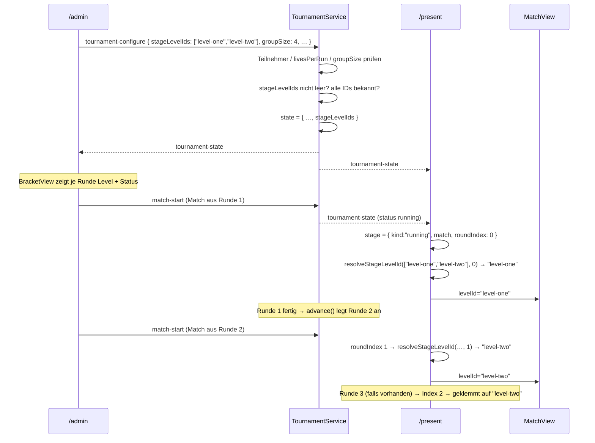

# Design: tournament-stage-levels

## Architektur-Überblick

Bezug: `docs/03-architektur.md` (Hub-Server als Single Source of Truth für den
Turnierzustand), `docs/09-bot-artefakt-und-turnier.md` (Single-Elimination),
`.features/admin-match-group-size/` (bereits umgesetzt – dieses Design baut auf
`groupSize` im `TournamentState` auf).

Kernentscheidung: `TournamentState.levelId: string` wird durch
`TournamentState.stageLevelIds: string[]` ersetzt. Das Level einer Runde wird
**aus dem Rundenindex abgeleitet**, nicht pro Match gespeichert:

```
resolveStageLevelId(stageLevelIds, roundIndex)
  = stageLevelIds[min(roundIndex, stageLevelIds.length - 1)]
```

Warum ableiten statt speichern? Ein `levelId` je `MatchDef` wäre redundante
Datenhaltung: Alle Matches einer Runde teilen zwingend dasselbe Level, und der
Rundenindex ist bereits die Position im `rounds`-Array. Speichern hieße, die
Konsistenz "alle Matches einer Runde haben dasselbe Level" zur Laufzeit
absichern zu müssen (DRY, KISS). Die Ableitung ist eine reine Funktion und
damit trivial testbar.

Der Clamp auf den letzten Eintrag erfüllt US-3 („mehr Runden als Stages") ohne
Sonderfall-Code an der Aufrufstelle.

```
/admin TournamentSetup
   │  tournament-configure { …, stageLevelIds: ["level-one","level-two"] }
   ▼
Server TournamentService.configure()   ← validiert: nicht leer, alle IDs bekannt
   │  TournamentState { …, stageLevelIds }
   ▼
tournament-state Broadcast
   ├─► /admin  BracketView      → Level + Status je Runde (US-4)
   └─► /present PresentPage     → resolveStageLevelId(…, roundIndex) → MatchView
```

## Schnittstellen & Datenmodelle

### Neu: `packages/shared/src/levels.ts`

Problem: `TournamentService` (Server) soll unbekannte Level-IDs ablehnen
(US-6), die Level-Registrierung liegt aber in
`client/src/game/level/levelRegistry.ts` und ist für den Server nicht
importierbar (sie zieht Phaser-nahe Level-Definitionen mit).

Lösung – bewusst minimal: Nur die **IDs** wandern nach `@arena/shared`, die
Level-Definitionen und Anzeigenamen bleiben im Client.

```ts
/** Alle gültigen Level-IDs. Einzige serverseitig verfügbare Quelle der
 *  Wahrheit; die zugehörigen `LevelDef`s liegen weiterhin im Client
 *  (`client/src/game/level/levelRegistry.ts`) und werden über diese IDs
 *  referenziert. Ein Test im Client stellt sicher, dass beide Listen nicht
 *  auseinanderlaufen. */
export const LEVEL_IDS = [
  "level-one",
  "level-two",
  "level-three",
  "level-four",
  "toolkit-test",
] as const;

export function isValidLevelId(value: unknown): value is string {
  return typeof value === "string" && (LEVEL_IDS as readonly string[]).includes(value);
}
```

Der Preis ist eine zweite Stelle, die beim Hinzufügen eines Levels gepflegt
werden muss. Dieser Preis wird durch einen **Konsistenztest** im Client
abgesichert (siehe Test-Strategie) – ohne ihn wäre die Duplikation ein echter
Wartungsfallstrick. Die Alternative (komplette Registry-Metadaten nach `shared`
verschieben) wäre ein deutlich größerer Umbau am bestehenden Level-Feature und
gehört nicht in dieses Ticket.

### Geändert: `packages/shared/src/tournament.ts`

```ts
export interface TournamentState {
  mode: TournamentMode;
  /** Level je Runde. `stageLevelIds[0]` = Runde 1. Enthält mindestens einen
   *  Eintrag. Runden jenseits der Liste nutzen den letzten Eintrag
   *  (siehe `resolveStageLevelId`). */
  stageLevelIds: string[];        // ← ersetzt `levelId: string`
  livesPerRun: number;
  groupSize: number;
  rounds: MatchDef[][];
  status: "idle" | "running" | "finished";
  championBotId: string | null;
}

/** Level der Runde `roundIndex` (0-basiert). Runden ohne eigene Stage nutzen
 *  die zuletzt konfigurierte Stage (US-3). */
export function resolveStageLevelId(stageLevelIds: readonly string[], roundIndex: number): string;

/** Erwartete Rundenzahl eines Single-Elimination-Turniers (US-5). */
export function estimateRoundCount(participantCount: number, groupSize: number): number;
```

`estimateRoundCount` bildet die Gruppenbildung nach: Solange mehr als ein
Teilnehmer übrig ist, wird `ceil(n / groupSize)` zur nächsten Rundengröße; jede
Iteration zählt eine Runde. Damit stimmt die Vorschau auch bei Freilosen mit
dem tatsächlichen Bracket überein.

> **Bewusste Logik-Duplikation.** `estimateRoundCount` bildet nach, was
> `SingleEliminationStrategy` beim Bracket-Aufbau tatsächlich tut. Die
> Alternative – den Server die Rundenzahl vorab ausrechnen und mitschicken zu
> lassen – wäre eine Rundreise für eine reine Anzeigehilfe, die schon *vor*
> dem Aufstellen des Turniers gebraucht wird (also bevor es überhaupt einen
> `TournamentState` gibt). Der Preis ist Divergenzgefahr, falls die
> Gruppenbildung je geändert wird. Abgesichert wird das durch einen
> **Kreuztest** auf Serverseite: Für mehrere Kombinationen aus Teilnehmerzahl
> und Gruppengröße wird ein echtes Bracket erzeugt und dessen Rundenzahl mit
> `estimateRoundCount` verglichen (siehe Test-Strategie). Ohne diesen Test wäre
> die Duplikation nicht vertretbar.

### Geändert: `packages/shared/src/messages.ts`

```ts
export interface TournamentConfigureMessage {
  type: "tournament-configure";
  mode: TournamentMode;
  /** Level je Runde, mindestens eines. Ersetzt das frühere `levelId`. */
  stageLevelIds: string[];        // ← ersetzt `levelId: string`
  botIds: string[];
  livesPerRun?: number;
  groupSize?: number;
}
```

Typguards – wie bei `livesPerRun`/`groupSize` **nur Struktur, keine
Wertebereiche** (Ablehnung samt Log gehört in den Service):

- `isTournamentConfigureMessage`: `Array.isArray(value.stageLevelIds) &&
  value.stageLevelIds.every(id => typeof id === "string")`.
- `isTournamentState`: dieselbe Strukturprüfung für `stageLevelIds`.

### Geändert: `server/src/tournament/TournamentService.ts`

`configure()` erhält eine vierte Prüfung, **nach** Teilnehmerzahl,
`livesPerRun` und `groupSize` (Reihenfolge bewusst additiv, damit bestehende
Ablehnungs-Tests unverändert gültig bleiben):

```ts
const stageLevelIds = message.stageLevelIds;
if (stageLevelIds.length === 0) { console.warn(…); return null; }
const unknown = stageLevelIds.filter((id) => !isValidLevelId(id));
if (unknown.length > 0) { console.warn(`… unbekannte Level: ${unknown.join(", ")}`); return null; }
```

### Geändert: `server/src/tournament/TournamentStrategy.ts`

`CreateRoundsOptions` (aus `.features/admin-match-group-size/`) enthält heute
`levelId`, das von `SingleEliminationStrategy` nachweislich nicht genutzt wird.
Mit diesem Feature ergibt ein einzelnes `levelId` beim Bracket-Aufbau
endgültig keinen Sinn mehr – das Level ist keine Turnier-, sondern eine
Rundeneigenschaft. Daher entfällt das Feld:

```ts
export interface CreateRoundsOptions {
  groupSize: number;
}
```

Das räumt zugleich den `_levelId`-Smell auf, der im Review von
`admin-match-group-size` festgehalten wurde.

### Geändert: `client/src/tournament/selectMatchStage.ts`

`/present` muss wissen, **zu welcher Runde** das laufende Match gehört, um das
Level aufzulösen. Der Rundenindex ist beim Suchen des Matches bereits bekannt
und wird mit ausgegeben, statt ihn an der Aufrufstelle erneut zu suchen:

```ts
export type MatchStage =
  | { kind: "no-tournament" }
  | { kind: "champion" }
  | { kind: "running"; match: MatchDef; roundIndex: number }   // ← roundIndex neu
  | { kind: "result"; match: MatchDef; roundIndex: number }    // ← roundIndex neu
  | { kind: "bracket" };
```

**Umsetzungsfalle:** Die heutige Implementierung arbeitet auf
`state.rounds.flat()` – dabei geht der Rundenindex verloren, insbesondere beim
`"result"`-Zweig (`.filter(…).at(-1)`). Die Suche muss daher auf
`rounds.entries()` bzw. einer index-erhaltenden Variante umgestellt werden,
statt den Index nachträglich über `findIndex` zu rekonstruieren.

### Neu: `client/src/tournament/roundStatus.ts` (pure)

```ts
export type RoundStatus = "pending" | "running" | "finished";

export function computeRoundStatus(round: readonly MatchDef[]): RoundStatus;
```

Regeln (US-4), in dieser Reihenfolge:
1. mindestens ein `running` → `"running"`
2. alle `finished` → `"finished"`
3. mindestens ein `finished` (aber nicht alle) → `"running"`
4. sonst → `"pending"` (auch bei leerer Runde, defensiv)

Regel 3 ist bewusst so gewählt: Eine Runde, in der bereits Matches gespielt
wurden und die nächsten noch anstehen, ist *angefangen*. Sie als "ausstehend"
zu zeigen, würde die Frage "wo steht das Turnier gerade?" falsch beantworten –
genau den Zweck, den US-4 erfüllen soll. Zwischen zwei Matches läuft nämlich
regulär **kein** Match (der Betreiber startet jedes einzeln), sodass Regel 1
allein die meiste Zeit nicht greifen würde.

### Neu: `client/src/components/StageLevelEditor.tsx`

Eigenständige Komponente statt weiterer Inline-Logik in `TournamentSetup`
(dort liegen bereits Level, Leben, Gruppengröße und Teilnehmerauswahl – SRP).

```tsx
export function StageLevelEditor({
  stageLevelIds,
  onChange,
  expectedRoundCount,
}: {
  stageLevelIds: string[];
  onChange: (next: string[]) => void;
  expectedRoundCount: number;
}): JSX.Element;
```

Reine Präsentation plus Listenoperationen; kein eigener State (Controlled
Component), damit `TournamentSetup` die einzige Wahrheitsquelle bleibt.

### Neu: `client/src/tournament/stageLevelList.ts` (pure)

Die Listenoperationen als reine Funktionen, damit sie ohne React getestet
werden können und die Komponente frei von Kanten-Logik bleibt:

```ts
export function addStage(ids: readonly string[]): string[];        // hängt letztes Level erneut an
export function removeStage(ids: readonly string[], index: number): string[];  // no-op bei Länge 1
export function moveStage(ids: readonly string[], index: number, direction: -1 | 1): string[];  // no-op an den Rändern
export function setStage(ids: readonly string[], index: number, levelId: string): string[];
```

`addStage` dupliziert bewusst das zuletzt gewählte Level als Vorbelegung – der
häufigste Fall ist "wie vorher, aber gleich anpassen", und ein leerer/zufälliger
Default wäre schlechtere UX.

## UX-Entscheidung: Umsortieren ohne Drag&Drop

Freigegeben war "gerne mit guter UX". Umgesetzt wird das mit **Hoch/Runter-
Schaltflächen** je Stage, nicht mit Drag&Drop. Begründung:

- Das Projekt hat **keine** Drag&Drop-Abhängigkeit; eine einzuführen (oder die
  HTML5-DnD-API von Hand zu verdrahten) wäre für typischerweise 2–4 Listenzeilen
  unverhältnismäßig (YAGNI/KISS).
- Hoch/Runter ist **tastaturbedienbar und mit Testing Library prüfbar**;
  Drag&Drop ist beides nur mit erheblichem Aufwand.
- Am Messestand wird die Konfiguration einmal pro Turnier gesetzt – der
  Komfortgewinn von DnD wäre marginal.

Das Layout je Zeile: `Runde N` · Level-Auswahl · `↑` · `↓` · `✕`.
`↑` ist in der ersten, `↓` in der letzten Zeile deaktiviert; `✕` ist deaktiviert,
solange nur eine Stage existiert (US-1/US-2).

Darunter der Hinweistext aus US-5, abhängig vom Vergleich
`stageLevelIds.length` ↔ `expectedRoundCount`.

## Ablauf / Sequenz



## Fehlerbehandlung & Edge Cases

| Fall | Verhalten | Bezug |
|---|---|---|
| `stageLevelIds` leer | Konfiguration abgelehnt, `console.warn`, State unverändert | US-6 |
| Unbekannte Level-ID (z. B. `"level-nine"`) | Abgelehnt inkl. Nennung der unbekannten IDs im Log | US-6 |
| `stageLevelIds` ist kein Array / enthält Nicht-Strings | Vom Typguard abgelehnt, wird gar nicht dispatched | US-6 |
| Mehr Runden als Stages | `resolveStageLevelId` klemmt auf den letzten Eintrag | US-3 |
| Mehr Stages als Runden | Überzählige Stages werden nie gespielt; `/admin` weist vorab darauf hin | US-5 |
| Genau eine Stage | Alle Runden nutzen dieses Level – identisch zum heutigen Verhalten | US-3 |
| Dasselbe Level in mehreren Stages | Zulässig, keine Sonderbehandlung | US-1 |
| Entfernen der letzten verbleibenden Stage | `removeStage` ist ein No-op; Schaltfläche zusätzlich deaktiviert | US-1 |
| Verschieben über den Listenrand hinaus | `moveStage` ist ein No-op; Schaltfläche zusätzlich deaktiviert | US-2 |
| Runde mit gemischten Match-Zuständen (einige finished, keiner running) | `"pending"` – die Runde ist noch nicht durch | US-4 |
| Level wird aus der Registry entfernt, während ein Turnier läuft | Nicht abgedeckt: Turniere leben nur im Speicher und werden pro Event neu aufgestellt (Nicht-Ziel) | – |

## Test-Strategie

TDD, Vitest (+ Testing Library für Komponenten). Jeder Punkt zuerst rot.

**`packages/shared` (Unit):**
- `resolveStageLevelId`: Index 0 → erste Stage; Index 1 → zweite Stage;
  Index jenseits der Länge → letzte Stage; Ein-Element-Liste → immer dasselbe
  Level.
- `estimateRoundCount`: 4 Bots/Größe 4 → 1; 8 Bots/Größe 4 → 2;
  16 Bots/Größe 4 → 2 … (nach Formel); 4 Bots/Größe 2 → 2; 3 Bots/Größe 2 → 2
  (Freilos); 2 Bots → 1.
- `isValidLevelId`: akzeptiert jede ID aus `LEVEL_IDS`; lehnt Unbekanntes,
  Leerstring, Nicht-Strings ab.
- Typguards: `isTournamentConfigureMessage` akzeptiert `stageLevelIds: ["level-one"]`,
  lehnt fehlendes Feld und `[1, 2]` ab; `isTournamentState` lehnt State ohne
  `stageLevelIds` ab.

**`client` – Registry-Konsistenz (schützt die bewusste Duplikation):**
- Jede ID aus `LEVEL_IDS` ist über `getLevelById` auflösbar.
- Jede ID aus `LEVEL_REGISTRY` ist in `LEVEL_IDS` enthalten.
  *(Dieser Test ist die Gegenleistung für die zweite Wahrheitsquelle – ohne ihn
  wäre `levels.ts` ein Wartungsfallstrick.)*

**`server` (Unit):**
- `TournamentService.configure`: mit zwei Stages → `state.stageLevelIds` wie
  übergeben; mit leerer Liste → `null`, State unverändert; mit unbekannter ID →
  `null`; bestehende Ablehnungsgründe (Teilnehmer, Leben, Gruppengröße) bleiben
  unverändert wirksam.
- `SingleEliminationStrategy`: bestehende Tests auf `CreateRoundsOptions` ohne
  `levelId` anpassen – reine Signaturbereinigung, Verhalten unverändert.
- **Kreuztest `estimateRoundCount` ↔ echtes Bracket:** Für mehrere Kombinationen
  (4/4, 8/4, 16/4, 4/2, 3/2, 2/4, 5/4) ein echtes Turnier über
  `TournamentService` durchspielen und die entstandene Rundenzahl mit
  `estimateRoundCount` vergleichen. Dieser Test ist die Gegenleistung für die
  bewusste Logik-Duplikation – nicht überspringen.

**`client` (Unit, pure):**
- `computeRoundStatus`: ein laufendes Match → `"running"`; alle beendet →
  `"finished"`; einige beendet, keiner laufend → `"running"` (angefangene
  Runde); kein Match begonnen → `"pending"`; leere Runde → `"pending"`.
- `stageLevelList`: `addStage` hängt das letzte Level erneut an; `removeStage`
  entfernt an Position und ist No-op bei Länge 1; `moveStage` tauscht nur mit
  dem Nachbarn und ist No-op an den Rändern; `setStage` ändert nur den
  adressierten Index.
- `selectMatchStage`: liefert für `"running"` und `"result"` den korrekten
  `roundIndex` (inkl. eines Matches aus der zweiten Runde).

**`client` (Komponenten):**
- `StageLevelEditor`: rendert eine Zeile je Stage; `↑` in der ersten und `↓` in
  der letzten Zeile deaktiviert; `✕` deaktiviert bei genau einer Stage;
  Klick auf `↑`/`↓`/`✕`/Level-Auswahl ruft `onChange` mit der erwarteten Liste
  auf; Hinweistext bei zu wenigen und bei zu vielen Stages (US-5).
- `TournamentSetup`: übergibt `stageLevelIds` an `onStart`; zeigt die erwartete
  Rundenzahl passend zu Teilnehmerauswahl und Gruppengröße.
- `BracketView`: zeigt je Runde den Levelnamen und die Statuskennzeichnung;
  eine Runde jenseits der konfigurierten Stages zeigt den Namen des
  wiederverwendeten Levels (US-4).

**Manuell am Stand:**
- Turnier mit 8 Bots, Gruppengröße 4, zwei Stages (Level 1, Level 2):
  Runde 1 läuft sichtbar auf Level 1, Runde 2 auf Level 2.
- Dasselbe mit nur einer Stage → alle Runden auf demselben Level
  (Regressions-Schutz gegen das bisherige Verhalten).
- Turnier mit drei Runden, aber nur zwei Stages → Runde 3 läuft auf dem Level
  der zweiten Stage, Bracket zeigt dessen Namen ohne Fehler.

## Auswirkungen auf bestehenden Code

| Datei | Änderung |
|---|---|
| `packages/shared/src/levels.ts` | **neu** – `LEVEL_IDS`, `isValidLevelId` |
| `packages/shared/src/tournament.ts` | `levelId` → `stageLevelIds`; `resolveStageLevelId`, `estimateRoundCount` |
| `packages/shared/src/messages.ts` | `TournamentConfigureMessage.stageLevelIds`; beide Typguards |
| `packages/shared/src/index.ts` | Neue Exporte |
| `server/src/tournament/TournamentService.ts` | Validierung + `stageLevelIds` im State |
| `server/src/tournament/TournamentStrategy.ts` | `levelId` aus `CreateRoundsOptions` entfernt |
| `server/src/tournament/SingleEliminationStrategy.ts` | Aufruf-/Signaturanpassung |
| `client/src/tournament/stageLevelList.ts` | **neu** – Listenoperationen |
| `client/src/tournament/roundStatus.ts` | **neu** – Rundenstatus |
| `client/src/tournament/selectMatchStage.ts` | `roundIndex` in `running`/`result` |
| `client/src/components/StageLevelEditor.tsx` | **neu** – Stage-Konfiguration |
| `client/src/components/TournamentSetup.tsx` | Stage-Editor statt Einzel-Level; Rundenvorschau; `onStart`-Signatur |
| `client/src/components/BracketView.tsx` | Level + Status je Runde |
| `client/src/pages/AdminPage.tsx` | `stageLevelIds` in der Konfigurationsnachricht |
| `client/src/pages/PresentPage.tsx` | Level je Runde auflösen statt `tournament.levelId` |
| `client/src/game/level/levelRegistry.test.ts` | Konsistenztest gegen `LEVEL_IDS` |
| `client/src/theme.css` | Stilklassen für Stage-Zeilen und Rundenstatus |

**Bewusste Brüche (kein Migrationspfad, siehe Nicht-Ziele):**
- `TournamentState.levelId` und `TournamentConfigureMessage.levelId` entfallen
  ersatzlos – jede Stelle, die sie liest (u. a. `PresentPage`), und jedes
  Test-Fixture mit einem `TournamentState`-Literal muss angepasst werden.
- `CreateRoundsOptions.levelId` entfällt.

## Review: SOLID / YAGNI / KISS

- **SRP:** `resolveStageLevelId` (Zuordnung), `computeRoundStatus` (Status),
  `stageLevelList` (Listenoperationen), `StageLevelEditor` (Darstellung),
  `TournamentService` (Validierung/Zustand) sind sauber getrennt.
  `StageLevelEditor` wird als eigene Komponente ausgelagert, weil
  `TournamentSetup` sonst fünf Belange gleichzeitig trüge.
- **OCP:** Ein neues Level erfordert einen Eintrag in `LEVEL_IDS` und in der
  Client-Registry – keinerlei Änderung an Turnierlogik, Bracket oder UI.
- **DRY:** Das Rundenlevel existiert genau einmal (abgeleitet aus dem
  Rundenindex) statt redundant je Match. Der Rundenindex kommt aus
  `selectMatchStage`, statt ihn in `PresentPage` erneut zu suchen. Die bewusst
  in Kauf genommene Duplikation der Level-IDs ist durch einen Konsistenztest
  abgesichert.
- **YAGNI:** Verworfen wurden: `levelId` je `MatchDef`, ein Drag&Drop-Paket,
  ein Migrationspfad für das alte `levelId`-Feld, eine Obergrenze für Stages
  und eine automatische Level-Empfehlung.
- **KISS:** Der Clamp in `resolveStageLevelId` erledigt den gesamten
  „mehr Runden als Stages"-Fall an einer Stelle – ohne Sonderfälle in
  `PresentPage` oder `BracketView`.
- **Bewusst akzeptiert – die schwächste Stelle des Entwurfs:** die zweite
  Quelle der Level-IDs in `@arena/shared`. Sie existiert allein, damit der
  Server US-6 erfüllen kann, ohne Level-Definitionen zu importieren. Wer das
  vermeiden will, müsste die Registry-Metadaten insgesamt nach `shared`
  verschieben – ein Umbau am Level-Feature, der nicht in dieses Ticket gehört.
  Der Konsistenztest hält den Preis beherrschbar.
- **Bewusst akzeptiert:** `estimateRoundCount` dupliziert die Gruppenbildungs-
  Logik der `SingleEliminationStrategy`, weil die Vorschau bereits *vor* dem
  Aufstellen des Turniers gebraucht wird – zu einem Zeitpunkt, an dem es noch
  keinen `TournamentState` gibt, den der Server berechnen könnte. Der
  Kreuztest gegen ein echtes Bracket hält die beiden Implementierungen
  zusammen.
- **Bewusst akzeptiert:** `stageLevelList` bündelt vier sehr kleine
  Listenoperationen in einem eigenen Modul. Das wirkt für ~20 Zeilen viel,
  trägt aber echte Domänenregeln (mindestens eine Stage, No-op an den
  Listenrändern) und macht sie ohne React testbar – genau die Regeln, die
  sonst als schwer prüfbare Randbedingungen im JSX verschwinden würden.
- **Bewusst akzeptiert:** Das Entfernen von `levelId` bricht mehrere
  bestehende Fixtures. Der Aufwand ist mechanisch und einem parallelen
  Kompatibilitätsfeld (`levelId` *und* `stageLevelIds`) klar vorzuziehen, das
  dauerhaft zwei Wahrheiten pflegen müsste.
